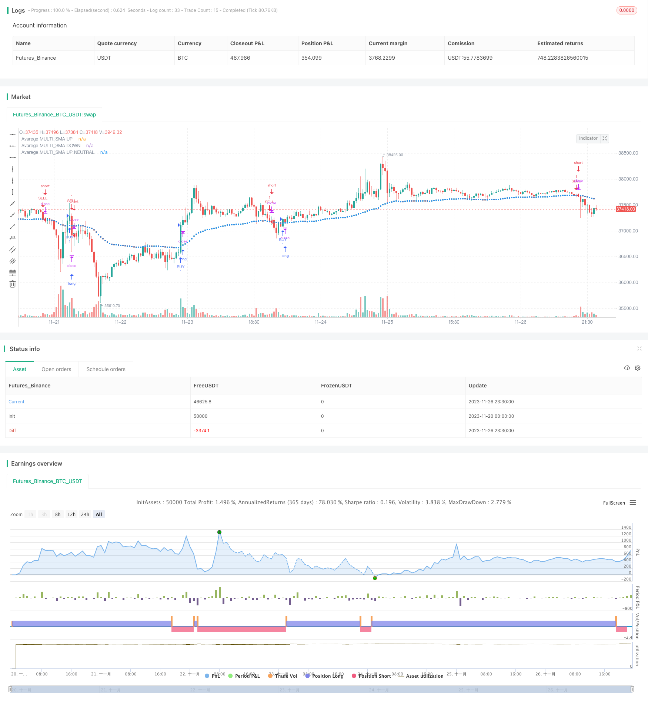

> Name

Multi-SMA Moving Average Crossover StrategyMulti-SMA-Moving-Average-Crossover-Strategy
> Author

ChaoZhang

> Strategy Description



[trans]


## Overview
This strategy calculates the SMA moving average of multiple time periods and takes the average to construct the moving average indicator. When the price rises and breaks through the moving average, a buy signal is generated, and when the price falls and breaks through the moving average, a sell signal is generated, which is a typical moving average crossover strategy.
## Strategy Principle
1. Calculate the SMA moving average of 5 different periods (8-day, 21-day, 50-day, 100-day, 200-day)
2. Average the five moving average values to get the final moving average indicator.
3. When the closing price rises and breaks through the moving average, a buy signal is generated
4. When the closing price falls and breaks through the moving average, a sell signal is generated
This strategy can effectively smooth the curve and filter out false breakthroughs by averaging multi-time SMAs. Compared with a single moving average, it has higher stability.
## Advantage Analysis
1. Using multi-time moving averages can effectively filter out market noise and identify trends.
2. Smooth the curve to avoid generating a large number of false signals
3. The strategy logic is simple and clear, easy to understand and implement, and suitable for novices to learn.
4. Customizable moving average cycle combinations to optimize indicator effects
## Risk Analysis
1. The moving average system lags behind as a whole and cannot track price changes in a timely manner.
2. When the breakthrough fails, the stop loss point is far away and the risk of loss is high.
3. During the oscillating trend, the stop loss line is frequently triggered
These risks can be reduced by appropriately shortening some moving average periods and adding other indicators for confirmation.
## Optimization direction
1. Optimize the moving average period combination and find the best parameters
2. Add indicators such as trading volume to confirm breakthrough signals
3. Combine with trend indicators to avoid false signals that shake the market
4. Develop an automatic parameter optimization program to dynamically find optimal parameters
## Summary
The overall idea of this strategy is clear. Through the integration of multi-time moving averages, it can effectively identify trends and is a stable and practical strategy. But we also need to be aware of its lag and the risk of false positives. By further optimizing parameter settings and adding confirmation indicators, the strategy can be continuously improved to make it a powerful quantitative trading tool.
||

## Overview
This strategy calculates the SMA moving averages of multiple timeframes and takes the average value to construct the moving average indicator. It generates buy signals when prices rise above the moving average and sell signals when prices fall below the moving average. This is a typical moving average crossover strategy.  

## Strategy Principle  
1. Calculate 5 SMA moving averages of different periods (8-day, 21-day, 50-day, 100-day, 200-day)
2. Take the average of the 5 moving averages to get the final moving average indicator
3. Generate buy signals when closing prices rise above the moving average 
4. Generate sell signals when closing prices fall below the moving average

By averaging the SMAs of multiple timeframes, this strategy can effectively smooth the curve and filter out false breakouts. Compared with a single moving average, it has higher stability.

## Advantage Analysis
1. Using multiple timeframe moving averages can effectively filter market noise and identify trends  
2. Smooth curve, avoid generating too many false signals
3. The strategy logic is simple and clear, easy to understand and implement, suitable for beginners to learn
4. Customizable moving average period combination to optimize indicator effect

## Risk Analysis 
1. The moving average system lags as a whole and cannot keep up with price changes in time
2. When breakout failure occurs, the stop loss point is far away, with greater risk of loss
3. Stop loss lines are frequently triggered in oscillating trends

These risks can be reduced by appropriately shortening some moving average periods and adding other indicators for confirmation.

## Optimization Directions
1. Optimize the combinations of moving average periods to find the best parameters
2. Add indicators like trading volume to confirm breakout signals 
3. Incorporate trend indicators to avoid false signals in oscillating markets
4. Develop automatic parameter optimization programs to dynamically find the optimal parameters  

## Summary 
The overall idea of this strategy is clear. By integrating the moving averages of multiple timeframes, it can effectively identify trends and is a stable and practical strategy. However, we also need to pay attention to its lag and false signal risks. Through further optimizing parameter settings, adding confirmation indicators, etc., we can continuously improve this strategy to make it a powerful quantitative trading tool.

[/trans]

> Strategy Arguments


|Argument|Default|Description|
|----|----|----|
|v_input_1|8|SMA 1|
|v_input_2|21|SMA 2|
|v_input_3|50|SMA 3|
|v_input_4|100|SMA 4|
|v_input_5|200|SMA 5|


> Source (PineScript)

``` pinescript
/*backtest
start: 2023-11-20 00:00:00
end: 2023-11-27 00:00:00
period: 30m
basePeriod: 15m
exchanges: [{"eid":"Futures_Binance","currency":"BTC_USDT"}]
*/

//@version=3
strategy("STRATEGY AVERAGE MULTI_SMA", overlay=true)


sma1 = sma(close,input(title="SMA 1", defval=8))

sma2 = sma(close,input(title="SMA 2", defval=21))

sma3 = sma(close,input(title="SMA 3", defval=50))

sma4 = sma(close,input(title="SMA 4", defval=100))

sma5 = sma(close,input(title="SMA 5", defval=200))


mediaSMA= (sma1+sma2+sma3+sma4+sma5)/5

//color mediaSMA

MediaUP = mediaSMA>mediaSMA[1]
colorUP = (MediaUP ? #3CFF35 : na)

MediaDOWN = mediaSMA<mediaSMA[1]
colorDOWN =(MediaDOWN ? #FF0F03 : na)

colorN =(not MediaUP and not MediaDOWN and mediaSMA==mediaSMA[1] ? white : na )

plot(mediaSMA,title="Avarege MULTI_SMA UP", color=colorUP, style=circles, linewidth=2, transp=0)
plot(mediaSMA,title="Avarege MULTI_SMA DOWN", color=colorDOWN, style=circles, linewidth=2, transp=0)
plot(mediaSMA,title="Avarege MULTI_SMA UP NEUTRAL", color=colorN, style=circles, linewidth=2, transp=0)


//plot(sma1,color=blue,linewidth=1, style=line,transp=0,title="SMA 1")
//plot(sma2,color=yellow,linewidth=1, style=line,transp=0,title="SMA 2")
//plot(sma3,color=green,linewidth=1, style=line,transp=0,title="SMA 3")
//plot(sma4,color=purple,linewidth=1, style=line,transp=0,title="SMA 4")
//plot(sma5,color=red,linewidth=1, style=line,transp=0,title="SMA 5")


// Strategy

//BUY
comprar=close>mediaSMA and mediaSMA>mediaSMA[1] 
fechar=close<mediaSMA and mediaSMA<mediaSMA[1]
 
strategy.entry("BUY",strategy.long,when=comprar)
strategy.entry("SELL",strategy.short, when=fechar)

//SELL
vender=close<mediaSMA and mediaSMA<mediaSMA[1] 
fechar2=close>mediaSMA and mediaSMA>mediaSMA[1]

strategy.entry("SELL",strategy.short, when=vender)
strategy.entry("BUY", strategy.long,when=fechar2)


```

> Detail

https://www.fmz.com/strategy/433560

> Last Modified

2023-11-28 15:08:37
