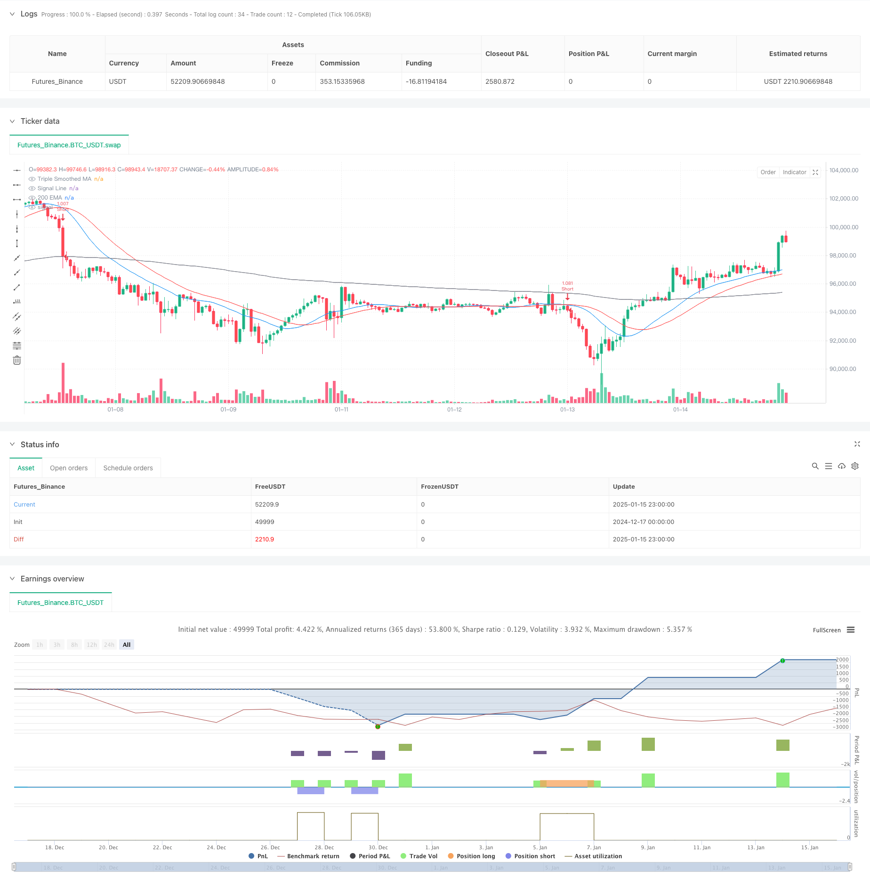

> Name

Multi-Smoothed-Moving-Average-Dynamic-Crossover-Trend-Following-Strategy-with-Multiple-Confirmations
> Author

ChaoZhang

> Strategy Description



[trans]
#### Overview
This strategy is a trend following system based on multiple smoothed moving averages, which uses triple smoothing to filter market noise, while combining the RSI momentum indicator, ATR volatility indicator and the 200-period EMA trend filter to confirm trading signals. The strategy adopts a 1-hour time frame, which can effectively balance trading frequency and trend reliability, while matching institutional trading behavior.
#### Strategy Principle
The core of the strategy is to construct a main trend line by smoothing the price three times, and use a shorter period signal line to cross it to generate a trading signal. Trading signals need to meet the following conditions at the same time before they can be executed:
1. The relationship between price position and 200EMA confirms the main trend direction
2. RSI indicator position confirms momentum
3. ATR indicator confirms sufficient volatility
4. The intersection of the signal line and the triple smoothing moving average confirms the specific entry point
The stop loss adopts a dynamic stop loss based on ATR, and the stop profit adopts a 2 times ATR setting to ensure a good risk-return ratio.
#### Strategic Advantages
1. Triple smoothing processing significantly reduces false signals and improves the reliability of trend judgment.
2. Multiple confirmation mechanism ensures that the trading direction is consistent with the main trend
3. Dynamic stop loss and take profit settings adapt to different market fluctuation environments
4. The strategy operates on a 1-hour period, which can effectively avoid shocks in lower time periods.
5. The no-redraw feature ensures the reliability of backtest results
#### Strategy Risk
1. Continuous small losses may occur in sideways markets
2. The multiple confirmation mechanism may lead to missing some trading opportunities
3. Signal lag may affect the degree of optimization of entry points
4. Sufficient volatility is needed to generate valid signals
5. Dynamic stop loss may not be timely enough in extreme market conditions
#### Strategy optimization direction
1. You can add trading volume indicators as auxiliary confirmation
2. Consider introducing an adaptive parameter optimization mechanism
3. Can increase quantitative judgment of trend strength
4. Optimize the multiple setting of stop loss and take profit
5. Consider adding oscillators to optimize sideways market performance
#### Summary
This is a trend following strategy with complete structure and strict logic. Through multiple smoothing processing and multiple confirmation mechanisms, the reliability of trading signals is effectively improved. The dynamic risk management mechanism makes it adaptable. Although there is a certain lag, the strategy still has room for improvement through parameter optimization and adding auxiliary indicators. ||
#### Overview
This strategy is a trend-following system based on multiple smoothed moving averages, using triple smoothing to filter market noise while combining RSI momentum indicator, ATR volatility indicator, and 200-period EMA trend filter to confirm trading signals. The strategy operates on a 1-hour timeframe, which effectively balances trading frequency and trend reliability while aligning with institutional trading behavior.

#### Strategy Principles
The core of the strategy is to construct a main trend line through triple smoothing of prices and generate trading signals through crossovers with a shorter-period signal line. Trade signals must simultaneously meet the following conditions:
1. Price position relative to 200EMA confirms main trend direction
2. RSI indicator position confirms momentum
3. ATR indicator confirms sufficient volatility
4. Signal line crossover with triple-smoothed MA confirms specific entry points
Stop-loss uses ATR-based dynamic stops, while take-profit is set at 2x ATR to ensure favorable risk-reward ratios.

#### Strategy Advantages
1. Triple smoothing significantly reduces false signals and improves trend judgment reliability
2. Multiple confirmation mechanisms ensure trade direction aligns with major trends
3. Dynamic stop-loss and take-profit settings adapt to different market volatility environments
4. Strategy operation on 1-hour timeframe effectively avoids lower timeframe oscillations
5. Non-repainting feature guarantees backtest result reliability

#### Strategy Risks
1. May produce consecutive small losses in ranging markets
2. Multiple confirmation mechanisms might cause missed trading opportunities
3. Signal lag may affect entry point optimization
4. Requires sufficient volatility to generate effective signals
5. Dynamic stops may not be timely enough in extreme market conditions

#### Strategy Optimization Directions
1. Can add volume indicators as auxiliary confirmation
2. Consider introducing adaptive parameter optimization mechanisms
3. Can add quantitative trend strength assessment
4. Optimize stop-loss and take-profit multiplier settings
5. Consider adding oscillator indicators to improve ranging market performance

#### Summary
This is a trend-following strategy with complete structure and rigorous logic. Through multiple smoothing processing and multiple confirmation mechanisms, it effectively improves the reliability of trading signals. The dynamic risk management mechanism provides good adaptability. Although there is some lag, the strategy still has significant room for improvement through parameter optimization and additional auxiliary indicators.[/trans]


> Source (PineScript)

``` pinescript
/*backtest
start: 2024-12-17 00:00:00
end: 2025-01-16 00:00:00
period: 1h
basePeriod: 1h
exchanges: [{"eid":"Futures_Binance","currency":"BTC_USDT","balance":49999}]
*/

//@version=6
strategy("Optimized Triple Smoothed MA Crossover Strategy", overlay=true, default_qty_type=strategy.percent_of_equity, default_qty_value=200)

// === Input Settings ===
slength = input.int(7, "Main Smoothing Length", group="Moving Average Settings")
siglen = input.int(12, "Signal Length", group="Moving Average Settings")
src = input.source(close, "Data Source", group="Moving Average Settings")
mat = input.string("EMA", "Triple Smoothed MA Type", ["EMA", "SMA", "RMA", "WMA"], group="Moving Average Settings")
mat1 = input.string("EMA", "Signal Type", ["EMA", "SMA", "RMA", "WMA"], group="Moving Average Settings")

// === Trend Confirmation (Higher Timeframe Filter) ===
useTrendFilter = input.bool(true, "Enable Trend Filter (200 EMA)", group="Trend Confirmation")
trendMA = ta.ema(close, 200)

// === Momentum Filter (RSI Confirmation) ===
useRSIFilter = input.bool(true, "Enable RSI Confirmation", group="Momentum Confirmation")
rsi = ta.rsi(close, 14)
rsiThreshold = input.int(50, "RSI Threshold", group="Momentum Confirmation")

// === Volatility Filter (ATR) ===
useATRFilter = input.bool(true, "Enable ATR Filter", group="Volatility Filtering")
atr = ta.atr(14)
atrMa = ta.sma(atr, 14)

// === Risk Management (ATR-Based Stop Loss) ===
useAdaptiveSL = input.bool(true, "Use ATR-Based Stop Loss", group="Risk Management")
atrMultiplier = input.float(1.5, "ATR Multiplier for SL", minval=0.5, maxval=5, group="Risk Management")
takeProfitMultiplier = input.float(2, "Take Profit Multiplier", group="Risk Management")

// === Moving Average Function ===
ma(source, length, MAtype) =>
    switch MAtype
        "SMA" => ta.sma(source, length)
        "EMA" => ta.ema(source, length)
        "RMA" => ta.rma(source, length)
        "WMA" => ta.wma(source, length)

// === Triple Smoothed Calculation ===
tripleSmoothedMA = ma(ma(ma(src, slength, mat), slength, mat), slength, mat)
signalLine = ma(tripleSmoothedMA, siglen, mat1)

// === Crossovers (Entry Signals) ===
bullishCrossover = ta.crossunder(signalLine, tripleSmoothedMA)
bearishCrossover = ta.crossover(signalLine, tripleSmoothedMA)

// === Additional Confirmation Conditions ===
trendLongCondition = not useTrendFilter or (close > trendMA)  // Only long if price is above 200 EMA
trendShortCondition = not useTrendFilter or (close < trendMA) // Only short if price is below 200 EMA

rsiLongCondition = not useRSIFilter or (rsi > rsiThreshold)  // RSI above 50 for longs
rsiShortCondition = not useRSIFilter or (rsi < rsiThreshold) // RSI below 50 for shorts

atrCondition = not useATRFilter or (atr > atrMa)  // ATR must be above its MA for volatility confirmation

// === Final Trade Entry Conditions ===
longCondition = bullishCrossover and trendLongCondition and rsiLongCondition and atrCondition
shortCondition = bearishCrossover and trendShortCondition and rsiShortCondition and atrCondition

// === ATR-Based Stop Loss & Take Profit ===
longSL = close - (atr * atrMultiplier)
longTP = close + (atr * takeProfitMultiplier)

shortSL = close + (atr * atrMultiplier)
shortTP = close - (atr * takeProfitMultiplier)

// === Strategy Execution ===
if longCondition
    strategy.entry("Long", strategy.long)
    strategy.exit("Long Exit", from_entry="Long", stop=longSL, limit=longTP)

if shortCondition
    strategy.entry("Short", strategy.short)
    strategy.exit("Short Exit", from_entry="Short", stop=shortSL, limit=shortTP)

// === Plots ===
plot(tripleSmoothedMA, title="Triple Smoothed MA", color=color.blue)
plot(signalLine, title="Signal Line", color=color.red)
plot(trendMA, title="200 EMA", color=color.gray)

// === Alerts ===
alertcondition(longCondition, title="Bullish Signal", message="Triple Smoothed MA Bullish Crossover Confirmed")
alertcondition(shortCondition, title="Bearish Signal", message="Triple Smoothed MA Bearish Crossover Confirmed")

```

> Detail

https://www.fmz.com/strategy/478720

> Last Modified

2025-01-17 15:53:16
