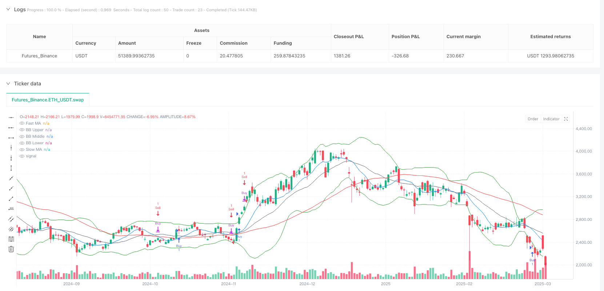
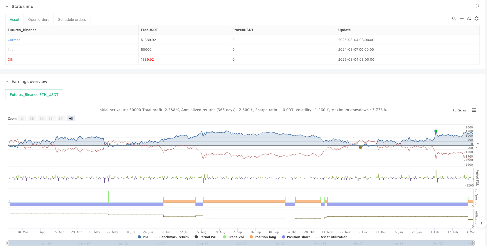

> Name

Multi-Strategy-Adaptive-Market-Condition-Trading-System
> Author

ianzeng123

> Strategy Description




[trans]## Overview
The multi-strategy adaptive market conditions trading system is a quantitative trading system that combines a variety of technical analysis strategies. It can automatically switch trading strategies according to different market conditions. The system integrates three core strategies: a trend following strategy (using the intersection of fast and slow moving averages), a momentum strategy (using the relative strength index RSI to detect overbought and oversold conditions), and a volatility strategy (using Bollinger Bands to buy near the lower band and sell near the upper band). The system will dynamically adjust according to the market environment and select the strategy most suitable for the current market conditions to execute trading signals, thereby improving the adaptability and robustness of the trading system.
## Strategy Principle
This trading system is based on three main trading principles:
1. **Trend Tracking Principle**: The system uses the 10-period fast moving average (FastMA) and the 50-period slow moving average (SlowMA) to identify market trends. When the fast line crosses the slow line, the system identifies an upward trend and generates a buy signal; when the fast line crosses below the slow line, the system identifies a downward trend and generates a sell signal. This method is based on the assumption that the trend will continue and is suitable for market environments with obvious trends.
2. **Momentum Strategy Principle**: The system uses the 14-period relative strength index (RSI) to measure market momentum and overbought and oversold conditions. When the RSI is below 30, the market is considered oversold and has the potential to rise; when the RSI is above 70, the market is considered overbought and has the risk of falling. The system uses these signals to enhance trading decisions.
3. **Volatility and mean reversion principle**: The system uses 20-period Bollinger Bands, including the middle track (SMA20) and the upper and lower tracks (middle track ±2 standard deviations). When the price touches the lower track, the system believes that the price may be undervalued and considers buying; when the price touches the upper track, the system believes that the price may be overvalued and considers selling. This strategy is based on the assumption that prices will eventually return to the mean and is suitable for volatile markets.
The core strength of the system is its adaptability: it does not rely solely on a single strategy, but uses a combination of these strategies according to different market conditions. Specifically:
- Buy signals are triggered by two conditions: trend following conditions (fast line crosses slow line) or mean reversion conditions (price is below Bollinger Band and RSI is oversold)
- Sell signals are also triggered by two conditions: trend following conditions (fast line crosses below slow line) or mean reversion conditions (price is above upper Bollinger Band and RSI is overbought)
- The system has also designed a "strong buy" signal, which is triggered when the three conditions of an upward trend, RSI oversold, and the fast line crossing the slow line are met at the same time, indicating that there may be a particularly strong opportunity for the market to rise.
## Strategic Advantages
1. **Adaptability of multi-strategy integration**: The biggest advantage of this system is that it can automatically switch between different trading strategies according to different market conditions. In trending markets, the system will tend to use trend following strategies; in oscillating markets, the system will tend to use mean reversion strategies based on Bollinger Bands and RSI. This adaptability enables the system to maintain relatively stable performance in different market environments.
2. **Signal confirmation mechanism**: The system uses multiple indicators to confirm signals, reducing the possibility of false signals. For example, a strong buy signal needs to meet the three conditions of an upward trend, RSI oversold and moving average crossover at the same time. This multiple confirmation mechanism can effectively reduce the risk of false breakthroughs.
3. **Comprehensive market multi-dimensional information**: This system considers trend information (moving average), momentum information (RSI) and volatility information (Bollinger Bands) at the same time, analyzing the market from multiple dimensions to make decision-making more comprehensive and accurate.
4. **Automated early warning function**: The system has three built-in early warning conditions (buy, sell and strong buy). Users can receive real-time signal reminders without the need to continuously monitor the market, improving transaction efficiency.
5. **Visual Marking System**: When a strong buy signal is detected, the system will add obvious visual markers to the chart, allowing traders to intuitively identify important trading opportunities.
## Strategy Risk
1. **Parameter sensitivity risk**: The system uses fixed parameters (such as the 10 and 50 periods of MA, the 14 periods of RSI, the 20 periods of Bollinger Bands, etc.), and the optimal values ​​of these parameters may be different in different market environments or trading varieties. Fixed parameters may cause the system to perform poorly in certain market environments. Solution: You can optimize parameter settings for a specific market by backtesting different parameter combinations, or implement an adaptive adjustment mechanism for parameters.
2. **Strategy conflict risk**: Under certain market conditions, different strategies may produce conflicting signals. For example, a trend following strategy may indicate a buy, while a volatility strategy indicates a sell. This conflict can lead to vacillating system decisions. Solution: You can add a strategy priority mechanism, or determine which strategy should be prioritized based on pattern recognition of market conditions.
3. **Excessive trading risk**: Since the system combines multiple strategies, it may generate too many trading signals, leading to frequent entry and exit of the market and increased transaction costs. Solution: You can add a signal filtering mechanism, such as time filtering or intensity filtering, to only execute signals that meet specific conditions.
4. **Market transition period risk**: When the market changes from trend to shock, or from shock to trend, the system may go through an adaptation period, during which erroneous signals may be generated. Solution: You can add a market type identification mechanism to identify changes in market status in advance and adjust the strategy weight accordingly.
5. **Risk of missing stop loss**: The current strategy does not have a clear stop loss mechanism, which may lead to larger losses under extreme market conditions. Solution: You can add a stop loss strategy based on technical indicators or fixed percentages to protect the safety of funds.
## Strategy optimization direction
1. **Market status recognition mechanism**: Although the current system can adapt to different market conditions, there is no clear market status recognition mechanism. The optimization direction is to increase the explicit identification of market environment types, such as using ADX (average direction index) to determine whether the market is trending or oscillating, and then dynamically adjust the weights of different strategies according to the market status. This allows for more precise selection of strategies suitable for the current market environment and reduces false signals.
2. **Adaptive parameter adjustment**: It can realize the adaptive adjustment mechanism of parameters and automatically optimize the moving average cycle, RSI threshold and Bollinger Band parameters based on the market performance in the recent period. This can make the system better adapt to market changes and improve the robustness of the system.
3. **Fund Management Optimization**: The current strategy lacks a detailed fund management mechanism. Position management functions can be added to adjust the capital ratio for each transaction based on signal strength, market volatility or system historical performance. For example, use a larger percentage of your capital on a "strong buy" signal and a smaller percentage on a normal signal.
4. **Add time filter**: You can add a trading time filter mechanism to avoid trading at the market opening, closing or specific low liquidity periods. This helps avoid unfavorable transactions when the market is volatile or has insufficient liquidity.
5. **Signal Strength Grading**: Trading signals can be graded for strength instead of simple binary (buy/sell) signals. For example, the signal can be divided into three levels: strong, medium, and weak according to the degree of deviation of each indicator, and then the trading position can be adjusted according to the signal strength.
6. **Backtest framework optimization**: Add more comprehensive backtest statistical indicators, such as Sharpe ratio, maximum retracement, winning rate, etc., in order to more comprehensively evaluate strategy performance and conduct continuous optimization.
## Summarize
The multi-strategy adaptive market conditions trading system is a comprehensive quantitative trading solution that combines trend following, momentum and volatility analysis. Its core value lies in its ability to automatically select the most suitable trading strategy based on different market conditions, thereby improving the adaptability and robustness of the trading system. The system creates a multi-dimensional market analysis framework by integrating multiple technical indicators such as moving average crossovers, RSI overbought and oversold signals, and Bollinger Band breakouts.
Although the system has strong adaptability and signal confirmation mechanism, there are still risks such as parameter sensitivity, strategy conflicts and lack of perfect stop-loss mechanism. Future optimization directions should focus on establishing a more accurate market status recognition mechanism, achieving adaptive parameter adjustment, improving fund management strategies, and adding a signal strength grading system. Through these optimizations, the system is expected to further improve its performance stability and profitability under various market environments.
Ultimately, this multi-strategy adaptive system represents a modern quantitative trading philosophy: one that does not rely on a single technical indicator or trading strategy, but dynamically adjusts a combination of strategies based on the market environment to adapt to changing market conditions. This adaptability and flexibility are key qualities of a successful quantitative trading system. || ## Overview
The Multi-Strategy Adaptive Market Condition Trading System is a quantitative trading system that combines multiple technical analysis strategies and automatically switches trading methods based on different market conditions. This system integrates three core strategies: trend-following strategy (utilizing crossovers between fast and slow moving averages), momentum strategy (using the Relative Strength Index to detect overbought/oversold conditions), and volatility strategy (buying near the lower Bollinger Band and selling near the upper band). The system dynamically adjusts according to market environment, selecting the most appropriate strategy for current market conditions, thereby enhancing the adaptability and robustness of the trading system.

## Strategy Principles

This trading system is based on three main trading principles:

1. **Trend-Following Principle**: The system uses a 10-period Fast Moving Average (FastMA) and a 50-period Slow Moving Average (SlowMA) to identify market trends. When the fast line crosses above the slow line, the system identifies an uptrend and generates a buy signal; when the fast line crosses below the slow line, the system identifies a downtrend and generates a sell signal. This method is based on the assumption of trend continuation and is suitable for markets with clear trends.

2. **Momentum Strategy Principle**: The system uses a 14-period Relative Strength Index (RSI) to measure market momentum and overbought/oversold conditions. When the RSI falls below 30, the market is considered oversold with upside potential; when the RSI rises above 70, the market is considered overbought with downside risk. The system uses these signals to enhance trading decisions.

3. **Volatility and Mean Reversion Principle**: The system employs 20-period Bollinger Bands, including the middle band (SMA20) and upper/lower bands (middle band ±2 standard deviations). When the price touches the lower band, the system considers the price potentially undervalued and considers buying; when the price touches the upper band, the system considers the price potentially overvalued and considers selling. This strategy is based on the assumption that prices eventually revert to the mean and is suitable for range-bound markets.

The core advantage of the system lies in its adaptability: it doesn't rely on a single strategy but combines these strategies based on different market conditions. Specifically:
- Buy signals are triggered by two conditions: trend-following condition (fast line crosses above slow line) or mean reversion condition (price below the lower Bollinger Band and RSI oversold)
- Sell signals are also triggered by two conditions: trend-following condition (fast line crosses below slow line) or mean reversion condition (price above the upper Bollinger Band and RSI overbought)
- The system also designs a "Strong Buy" signal, triggered when three conditions are simultaneously met: uptrend, RSI oversold, and fast line crosses above slow line, indicating a potentially strong bullish opportunity.

## Strategy Advantages

1. **Multi-Strategy Fusion Adaptability**: The greatest advantage of this system is its ability to automatically switch between different trading strategies based on varying market conditions. In trending markets, the system tends to use trend-following strategies; in range-bound markets, the system tends to use mean reversion strategies based on Bollinger Bands and RSI. This adaptability enables the system to maintain relatively stable performance across different market environments.

2. **Signal Confirmation Mechanism**: The system adopts a multi-indicator confirmation approach to reduce the possibility of false signals. For example, the strong buy signal requires three concurrent conditions: uptrend, RSI oversold, and moving average crossover, which effectively reduces the risk of false breakouts.

3. **Comprehensive Market Information**: The system simultaneously considers trend information (moving averages), momentum information (RSI), and volatility information (Bollinger Bands), analyzing the market from multiple dimensions for more comprehensive and accurate decision-making.

4. **Automated Alert Function**: The system has three built-in alert conditions (buy, sell, and strong buy), allowing users to receive real-time signal notifications without continuous market monitoring, improving trading efficiency.

5. **Visual Marking System**: When a strong buy signal is detected, the system adds a prominent visual marker on the chart, allowing traders to intuitively identify important trading opportunities.

## Strategy Risks

1. **Parameter Sensitivity Risk**: The system uses fixed parameters (such as MA periods of 10 and 50, RSI period of 14, Bollinger Band period of 20, etc.), which may have different optimal values in different market environments or trading instruments. Fixed parameters may cause the system to perform poorly in certain market environments. Solution: Parameters can be optimized for specific markets through backtesting different parameter combinations, or by implementing an adaptive parameter adjustment mechanism.

2. **Strategy Conflict Risk**: Under certain market conditions, different strategies may generate contradictory signals. For example, the trend-following strategy might indicate buying while the volatility strategy indicates selling. Such conflicts may cause system decision vacillation. Solution: A strategy priority mechanism can be added, or the determination of which strategy to prioritize can be based on pattern recognition of market conditions.

3. **Overtrading Risk**: As the system combines multiple strategies, it may generate too many trading signals, leading to frequent market entry and exit, increasing transaction costs. Solution: Signal filtering mechanisms can be added, such as time filtering or strength filtering, to execute only signals that meet specific conditions.

4. **Market Transition Period Risk**: When the market transitions from trending to range-bound, or from range-bound to trending, the system may experience an adaptation period during which it may generate erroneous signals. Solution: A market type recognition mechanism can be added to identify market state transitions in advance and adjust strategy weights accordingly.

5. **Stop Loss Absence Risk**: The current strategy lacks a clear stop-loss mechanism, which may lead to significant losses under extreme market conditions. Solution: Stop-loss strategies based on technical indicators or fixed percentages can be added to protect capital.

## Strategy Optimization Directions

1. **Market State Recognition Mechanism**: Although the current system can adapt to different market conditions, it lacks an explicit market state recognition mechanism. The optimization direction is to add explicit identification of market environment types, such as using ADX (Average Directional Index) to determine whether the market is trending or range-bound, and then dynamically adjust the weights of different strategies based on market state. This allows for more precise selection of strategies suitable for the current market environment, reducing erroneous signals.

2. **Adaptive Parameter Adjustment**: An adaptive parameter adjustment mechanism can be implemented to automatically optimize moving average periods, RSI thresholds, and Bollinger Band parameters based on recent market performance. This allows the system to better adapt to market changes and improve system robustness.

3. **Capital Management Optimization**: The current strategy lacks detailed capital management mechanisms. Position management functionality can be added to adjust the proportion of funds for each trade based on signal strength, market volatility, or historical system performance. For example, using a larger proportion of funds when a "strong buy" signal appears, and a smaller proportion for ordinary signals.

4. **Add Time Filters**: Trading time filtering mechanisms can be added to avoid trading during market opening, closing, or specific low-liquidity periods, helping to avoid unfavorable trades during times of high market volatility or insufficient liquidity.

5. **Signal Strength Grading**: Trading signals can be graded by strength rather than simple binary (buy/sell) signals. For example, signals can be classified into strong, medium, and weak based on the degree of indicator deviation, and then trading positions can be adjusted according to signal strength.

6. **Backtesting Framework Optimization**: Add more comprehensive backtesting statistical indicators, such as Sharpe ratio, maximum drawdown, win rate, etc., to more comprehensively evaluate strategy performance and enable continuous optimization.

## Summary

The Multi-Strategy Adaptive Market Condition Trading System is a comprehensive quantitative trading solution that combines trend-following, momentum, and volatility analysis. Its core value lies in its ability to automatically select the most suitable trading strategy based on different market conditions, thereby enhancing the adaptability and robustness of the trading system. The system creates a multi-dimensional market analysis framework by integrating multiple technical indicators such as moving average crossovers, RSI overbought/oversold signals, and Bollinger Band breakouts.

Although the system features strong adaptability and signal confirmation mechanisms, risks such as parameter sensitivity, strategy conflicts, and lack of a comprehensive stop-loss mechanism still exist. Future optimization directions should focus on establishing more precise market state recognition mechanisms, implementing adaptive parameter adjustments, improving capital management strategies, and adding signal strength grading systems. Through these optimizations, the system is expected to further improve its performance stability and profitability across various market environments.

Ultimately, this multi-strategy adaptive system represents a modern quantitative trading philosophy: not relying on a single technical indicator or trading strategy, but dynamically adjusting strategy combinations based on market environment to adapt to ever-changing market conditions. This adaptability and flexibility are the key characteristics of successful quantitative trading systems.[/trans]


> Source (PineScript)

``` pinescript
/*backtest
start: 2024-03-07 00:00:00
end: 2025-03-05 08:00:00
period: 1d
basePeriod: 1d
exchanges: [{"eid":"Futures_Binance","currency":"ETH_USDT"}]
*/

//@version=5
strategy("Adaptive Trading Strategy", overlay=true)

// Inputs
fastMA = ta.sma(close, 10)
slowMA = ta.sma(close, 50)
rsi = ta.rsi(close, 14)
bbBasis = ta.sma(close, 20)
bbDeviation = ta.stdev(close, 20)
bbUpper = bbBasis + 2 * bbDeviation
bbLower = bbBasis - 2 * bbDeviation

// Strategy Conditions
bullishTrend = fastMA > slowMA // Trend-following condition
bearishTrend = fastMA < slowMA
rsiOversold = rsi < 30 // Momentum-based condition
rsiOverbought = rsi > 70
bbBuySignal = close < bbLower // Volatility-based buy signal
bbSellSignal = close > bbUpper

// Strong Buy Pattern Detection
strongBuyPattern = bullishTrend and rsiOversold and ta.crossover(fastMA, slowMA)

// Buy Signal (Trend-following or Mean Reversion)
buySignal = (bullishTrend and ta.crossover(fastMA, slowMA)) or (bbBuySignal and rsiOversold)

// Sell Signal (Trend-following or Mean Reversion)
sellSignal = (bearishTrend and ta.crossunder(fastMA, slowMA)) or (bbSellSignal and rsiOverbought)

// Execute Trades
if buySignal
    strategy.entry("Buy", strategy.long)
if sellSignal
    strategy.close("Buy")
    strategy.entry("Sell", strategy.short)

// Strong Buy Alert
if strongBuyPattern
    label = label.new(bar_index, high, "BUY NOW", color=color.green, textcolor=color.white, size=size.large, style=label.style_label_down)

// Strategy Alerts
alertcondition(buySignal, title="Buy Alert", message="Buy Signal Triggered")
alertcondition(sellSignal, title="Sell Alert", message="Sell Signal Triggered")
alertcondition(strongBuyPattern, title="BUY NOW Alert", message="Strong Buy Pattern Detected")

// Plot indicators
plot(fastMA, color=color.blue, title="Fast MA")
plot(slowMA, color=color.red, title="Slow MA")
plot(bbUpper, color=color.green, title="BB Upper")
plot(bbBasis, color=color.gray, title="BB Middle")
plot(bbLower, color=color.green, title="BB Lower")
```

> Detail

https://www.fmz.com/strategy/485293

> Last Modified

2025-03-07 09:59:47
