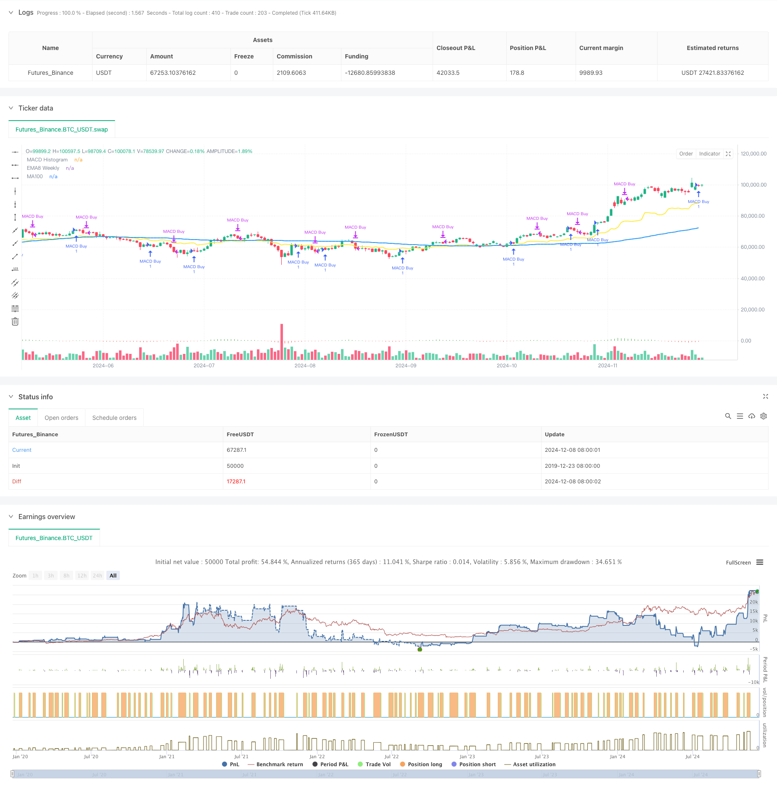

> Name

Multi-strategy combined technical analysis trading system-Multi-Strategy-Technical-Analysis-Trading-System
> Author

ChaoZhang

> Strategy Description



[trans]This article will introduce a trading strategy system that combines multiple technical indicators. The system aims to provide traders with a comprehensive trading solution by integrating multiple technical analysis methods such as MACD, EMA, simple moving average and MA100, combined with risk management and time filters.
#### Strategy Overview
This strategy is a multi-strategy combination technical analysis system, including four independent sub-strategies: MACD strategy, EMA8 strategy, simple MA strategy and MA100 strategy. The system allows traders to flexibly choose different strategy types according to market conditions. Each sub-strategy has its own unique entry and exit logic and is equipped with corresponding risk management mechanisms.
#### Strategy Principle
1. MACD Strategy: Capture market trends by identifying consecutive rising and falling patterns on the MACD histogram. A buy signal is triggered when three consecutive rising histogram bars appear, and a sell signal is triggered when two consecutive falling histogram bars appear.
2. EMA8 strategy: Combined with weekly EMA8 moving average, previous highs and K-line morphological analysis. When the price breaks through the weekly EMA8 and the closing price is higher than the previous high, and a strong K line appears, the system will buy. The strategy comes with a 2% stop loss setting.
3. Simple MA strategy: Use multiple exponential moving averages (10, 15, 25, 35, 40 periods) to build a trend following system. When the shorter period moving average is above the longer period moving average and the price breaks through the shortest period moving average, a buy signal is triggered. A 2% stop loss is also set.
4. MA100 strategy: combines the 100-day moving average, the 8-day moving average and the 25-day moving average, and introduces the stochastic indicator to determine oversold. When the short-term moving average is above the long-term moving average and the price fluctuates around MA100, the system looks for buying opportunities in the oversold area. This strategy uses a 3% stop loss setting.
#### Strategic Advantages
1. Multi-strategy fusion: By combining different technical analysis methods, the adaptability and stability of the system are improved.
2. Improved risk control: Each sub-strategy is equipped with a stop-loss mechanism to effectively control the risk of a single transaction.
3. High flexibility: traders can choose the most suitable strategy type according to the market environment.
4. Multi-dimensional analysis: Market analysis that combines multiple dimensions such as trend, momentum and volatility.
5. Visual support: The system provides complete chart visualization functions to facilitate traders to understand market conditions.
#### Strategy Risk
1. Parameter optimization risk: The parameters of multiple technical indicators need to be optimized regularly. Over-optimization may lead to over-fitting.
2. Market environment dependence: Different sub-strategies perform differently in different market environments and require correct selection.
3. Signal lag: Technical indicators are lagging in nature, which may lead to less than ideal entry or exit timing.
4. False breakthrough risk: More false signals may be generated in sideways markets.
#### Optimization direction
1. Add a market environment identification module: It is recommended to add a market environment judgment function to automatically select the most suitable sub-strategy.
2. Improve the profit-taking mechanism: the profit-taking level can be dynamically adjusted according to different market environments.
3. Add volatility filtering: It is recommended to introduce the ATR indicator for volatility analysis and filter trading signals in a low volatility environment.
4. Optimize parameter adaptation: A dynamic parameter adjustment mechanism can be developed to improve system adaptability.
5. Increase transaction volume analysis: It is recommended to add a transaction volume confirmation mechanism to improve signal reliability.
#### Summary
This multi-strategy combined technical analysis trading system provides traders with a comprehensive trading decision-making framework by integrating multiple mature technical analysis methods. The main advantage of the system is its flexibility and risk control capabilities, but it also requires traders to have a deep understanding of the market to use it correctly. Through continuous optimization and improvement, the system is expected to become a more complete trading tool. ||
This article introduces a trading strategy system that combines multiple technical indicators. The system integrates various technical analysis methods including MACD, EMA, Simple Moving Averages, and MA100, coupled with risk management and time filters, aimed at providing traders with a comprehensive trading solution.

#### Strategy Overview
This strategy is a multi-strategy technical analysis system comprising four independent sub-strategies: MACD strategy, EMA8 strategy, Simple MA strategy, and MA100 strategy. The system allows traders to flexibly choose different strategy types based on market conditions, with each sub-strategy having its unique entry and exit logic, supported by corresponding risk management mechanisms.

#### Strategy Principles
1. MACD Strategy: Captures market trends by identifying consecutive rising and falling patterns in the MACD histogram. Buy signals are triggered by three consecutive rising histogram bars, while sell signals are triggered by two consecutive falling bars.

2. EMA8 Strategy: Combines weekly EMA8, previous highs, and candlestick pattern analysis. The system enters long positions when price breaks above the weekly EMA8, closes above previous highs, and shows strong candlestick patterns. This strategy includes a 2% stop-loss setting.

3. Simple MA Strategy: Utilizes multiple exponential moving averages (10,15,25,35,40 periods) to build a trend-following system. Buy signals are triggered when shorter-period MAs are above longer-period MAs and price breaks above the shortest-period MA. A 2% stop-loss is implemented.

4. MA100 Strategy: Combines 100-day MA, 8-day MA, and 25-day MA, incorporating stochastic oscillator for oversold conditions. The system looks for buying opportunities in oversold areas when short-term MAs are above long-term MAs and price fluctuates near MA100. This strategy employs a 3% stop-loss setting.

#### Strategy Advantages
1. Multi-strategy Integration: Enhances system adaptability and stability through the combination of different technical analysis methods.
2. Comprehensive Risk Control: Each sub-strategy is equipped with stop-loss mechanisms, effectively controlling single-trade risk.
3. High Flexibility: Traders can select the most suitable strategy type based on market conditions.
4. Multi-dimensional Analysis: Incorporates market analysis across multiple dimensions including trend, momentum, and volatility.
5. Visualization Support: The system provides complete chart visualization functionality for better market understanding.

#### Strategy Risks
1. Parameter Optimization Risk: Multiple technical indicators' parameters require periodic optimization, risking overfitting.
2. Market Environment Dependency: Different sub-strategies perform differently under various market conditions, requiring correct selection.
3. Signal Lag: Technical indicators inherently have lag, potentially leading to suboptimal entry or exit timing.
4. False Breakout Risk: May generate numerous false signals in ranging markets.

#### Optimization Directions
1. Add Market Environment Recognition Module: Recommend adding market condition judgment functionality for automatic sub-strategy selection.
2. Improve Profit-Taking Mechanism: Dynamically adjust profit-taking levels based on different market conditions.
3. Incorporate Volatility Filtering: Suggest introducing ATR indicator for volatility analysis to filter trading signals in low-volatility environments.
4. Optimize Parameter Adaptation: Develop dynamic parameter adjustment mechanisms to improve system adaptability.
5. Add Volume Analysis: Recommend incorporating volume confirmation mechanisms to enhance signal reliability.

#### Summary
This multi-strategy technical analysis trading system provides traders with a comprehensive trading decision framework by integrating multiple mature technical analysis methods. The system's main advantages lie in its flexibility and risk control capabilities, though it requires traders to have a deep understanding of markets for correct implementation. Through continuous optimization and improvement, this system has the potential to become an increasingly refined trading tool.[/trans]


> Source (PineScript)

``` pinescript
/*backtest
start: 2019-12-23 08:00:00
end: 2024-12-09 08:00:00
period: 1d
basePeriod: 1d
exchanges: [{"eid":"Futures_Binance","currency":"BTC_USDT"}]
*/

// This Pine Script™ v5 code implements multiple trading strategies
//@version=5
strategy("Multi-Strategy Trading System", overlay=true)

// Input parameters for customization
strategy_type = input.string("MACD", "Strategy Type", options=["MACD", "EMA8", "SimpleMA", "MA100"])
show_macd = input.bool(true, "Show MACD Signals")
show_ema = input.bool(true, "Show EMA Signals")
show_ma = input.bool(true, "Show MA Signals")

// MACD Strategy Components
[macdLine, signalLine, histLine] = ta.macd(close, 12, 26, 9)

// Function to detect three consecutive ascending histogram bars
isThreeAscendingBars(hist) =>
    not na(hist[3]) and hist[3] < hist[2] and hist[2] < hist[1] and hist[1] < hist[0]

// Function to detect two consecutive descending histogram bars
isTwoDescendingBars(hist) =>
    not na(hist[2]) and hist[2] > hist[1] and hist[1] > hist[0]

// EMA Strategy Components
ema8_weekly = request.security(syminfo.tickerid, "W", ta.ema(close, 8))
weeklyHigh = request.security(syminfo.tickerid, "W", high)
previousWeekHigh = weeklyHigh[1]
isStrongCandleWeekly = request.security(syminfo.tickerid, "W", close > open and (close - open) > (high - low) * 0.6)

// Simple MA Strategy Components
ema10 = ta.ema(close, 10)
ema15 = ta.ema(close, 15)
ema25 = ta.ema(close, 25)
ema35 = ta.ema(close, 35)
ema40 = ta.ema(close, 40)

// MA100 Strategy Components
ma100 = ta.sma(close, 100)
ma8 = ta.sma(close, 8)
ma25 = ta.sma(close, 25)

// Corrected Stochastic Oscillator Calculation
stochK = ta.stoch(high, low, close, 14)
stochD = ta.sma(stochK, 3)
isOversold = stochK < 20 and stochD < 20

// MACD Strategy Logic
if strategy_type == "MACD"
    // Buy condition: Three ascending histogram bars after lowest
    if isThreeAscendingBars(histLine)
        strategy.entry("MACD Buy", strategy.long)
    
    // Sell condition: Two descending histogram bars after highest
    if isTwoDescendingBars(histLine)
        strategy.close("MACD Buy")

// EMA8 Strategy Logic
if strategy_type == "EMA8"
    if close > ema8_weekly and close > previousWeekHigh and isStrongCandleWeekly
        strategy.entry("EMA8 Buy", strategy.long)
        strategy.exit("EMA8 Exit", "EMA8 Buy", stop=low - (low * 0.02))

// Simple MA Strategy Logic
if strategy_type == "SimpleMA"
    isUptrend = ema10 > ema15 and ema15 > ema25 and ema25 > ema35 and ema35 > ema40
    
    if isUptrend and close > ema10 and close[1] <= ema10[1]
        strategy.entry("MA Buy", strategy.long)
        strategy.exit("MA Exit", "MA Buy", stop=low - (low * 0.02))

// MA100 Strategy Logic
if strategy_type == "MA100"
    isUptrend = ma8 > ma100 and ma25 > ma100
    isPriceNearMA100 = math.abs(close - ma100) / ma100 * 100 < 1
    
    if isUptrend and isPriceNearMA100 and isOversold
        strategy.entry("MA100 Buy", strategy.long)
        strategy.exit("MA100 Exit", "MA100 Buy", stop=low - (low * 0.03))

// Plotting components for visualization
plot(ma100, "MA100", color=color.blue, linewidth=2)
plot(ema8_weekly, "EMA8 Weekly", color=color.yellow, linewidth=2)
plot(series=histLine, title="MACD Histogram", style=plot.style_histogram, color=histLine > 0 ? color.green : color.red)

```

> Detail

https://www.fmz.com/strategy/474632

> Last Modified

2024-12-11 11:06:33
