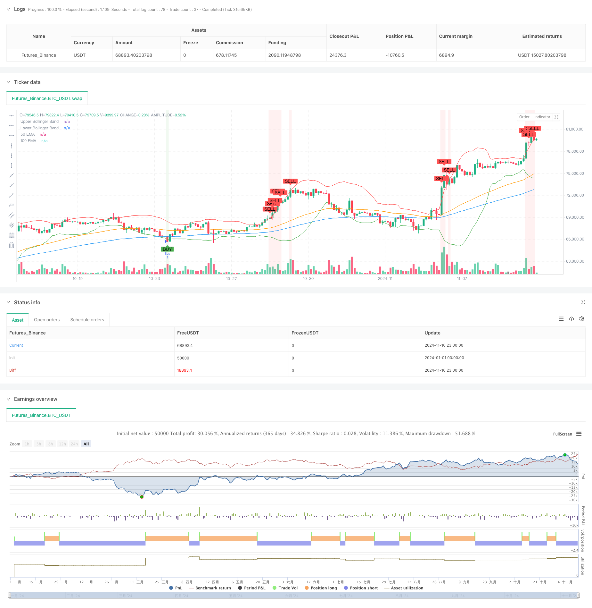

> Name

Mean Reversion Trend Following Strategy Based on Multiple Technical Indicators-Multi-Technical-Indicator-Based-Mean-Reversion-and-Trend-Following-Strategy
> Author

ChaoZhang

> Strategy Description



[trans]
#### Overview
This strategy is a hybrid strategy system that combines mean reversion and trend following. It mainly captures overbought and oversold opportunities in the market through the combination of RSI, Bollinger Bands and multiple EMA indicators. On the basis of traditional technical analysis indicators, the strategy adds trend confirmation and range shock judgment, effectively improving the accuracy of the strategy.
#### Strategy Principle
The strategy uses a triple verification mechanism to confirm trading signals. First, the overbought and oversold areas are identified through the RSI indicator, and the initial signal is triggered when the RSI is below 30 or above 70. Secondly, use Bollinger Bands (BB) as a reference for the price fluctuation range, and further confirm the signal when the price breaks through the upper or lower rails. Finally, the market trend is judged through the relative position and volatility of the 100/50-day EMA, and transactions are executed only when the trend direction is consistent with the first two signals. The strategy also adds the volatility judgment of EMA to identify consolidating markets.
#### Strategic Advantages
1. Cross-validation of multiple technical indicators to significantly reduce false signals
2. Combine overbought, oversold and trend following to improve strategy adaptability
3. Introduce moving average volatility judgment to effectively identify consolidating markets
4. The visualization effect is clear, which facilitates strategy monitoring and optimization.
5. The parameters are highly adjustable and adaptable to different market environments.
#### Strategy Risk
1. Multiple indicators may cause signal lag
2. You may miss trading opportunities in highly volatile markets
3. Excessive parameter optimization may lead to overfitting
4. EMA trend judgment may produce confusing signals in sideways markets
It is recommended to verify the stability of the strategy by backtesting data in different time periods and set appropriate stop losses to control risks.
#### Strategy optimization direction
1. Add trading volume indicator as auxiliary confirmation
2. Introduce an adaptive parameter adjustment mechanism
3. Added stop-profit and stop-loss management module
4. Develop a trend strength scoring system
5. Optimize the EMA volatility calculation method
6. Add market volatility filter
#### Summary
This strategy uses the synergy of multiple technical indicators to ensure robustness while taking into account the flexibility of the strategy. The strategy logic is clear, the implementation method is simple, and it has good practical value. Through reasonable parameter optimization and risk management, the strategy is expected to maintain stable performance in different market environments. ||
#### Overview
This strategy is a hybrid system combining mean reversion and trend following approaches, utilizing RSI, Bollinger Bands, and multiple EMA indicators to capture market overbought and oversold opportunities. The strategy enhances traditional technical analysis by incorporating trend confirmation and range-bound market identification, significantly improving accuracy.

#### Strategy Principles
The strategy employs a triple verification mechanism for trade signals. Initially, it identifies overbought/oversold conditions using RSI (below 30 or above 70). Secondly, it confirms signals using Bollinger Bands breakouts. Finally, it validates market trends using 100/50-day EMA relative positions and volatility. Trades are only executed when all three conditions align. The strategy also incorporates EMA volatility assessment for range-bound market identification.

#### Strategy Advantages
1. Multiple indicator cross-validation reduces false signals
2. Combines oversold/overbought and trend following for enhanced adaptability
3. Incorporates EMA volatility for effective range-bound market identification
4. Clear visualization for strategy monitoring and optimization
5. Highly adjustable parameters for different market conditions

#### Strategy Risks
1. Multiple indicators may lead to delayed signals
2. Potential missed opportunities in highly volatile markets
3. Risk of overfitting through parameter optimization
4. EMA trend identification may generate confusing signals in sideways markets
Recommend backtesting across different timeframes and implementing appropriate stop-loss mechanisms.

#### Optimization Directions
1. Incorporate volume indicators for signal confirmation
2. Implement adaptive parameter adjustment mechanisms
3. Add profit/loss management module
4. Develop trend strength scoring system
5. Optimize EMA volatility calculation method
6. Add market volatility filters

#### Summary
The strategy achieves a balance between robustness and flexibility through the synergy of multiple technical indicators. With clear logic and concise implementation, it demonstrates practical value. Through proper parameter optimization and risk management, the strategy shows potential for consistent performance across various market conditions.[/trans]


> Source (PineScript)

``` pinescript
/*backtest
start: 2024-01-01 00:00:00
end: 2024-11-11 00:00:00
period: 3h
basePeriod: 3h
exchanges: [{"eid":"Futures_Binance","currency":"BTC_USDT"}]
*/

//@version=5
strategy("BTC Dominance Analysis Strategy (Improved)", overlay=true)

// Input Parameters
rsi_period = input(14, title="RSI Period")
bb_period = input(20, title="Bollinger Band Period")
bb_std_dev = input(2.0, title="Bollinger Std Dev")
ema_period = input(100, title="100 EMA Period")
ema_30_period = input(30, title="30 EMA Period")
ema_50_period = input(50, title="50 EMA Period")

// RSI Calculation
rsi_value = ta.rsi(close, rsi_period)

// Bollinger Bands Calculation
basis = ta.sma(close, bb_period)
dev = bb_std_dev * ta.stdev(close, bb_period)
upper_bb = basis + dev
lower_bb = basis - dev

// EMA Calculation
ema_100 = ta.ema(close, ema_period)
ema_30 = ta.ema(close, ema_30_period)
ema_50 = ta.ema(close, ema_50_period)

// Determine EMA trends
range_bound_ema = math.abs(ema_100 - ta.sma(ema_100, 10)) < ta.stdev(ema_100, 10)
uptrend_ema = ema_100 > ema_50
downtrend_ema = ema_100 < ema_50

// Long Condition: All 3 conditions must be met
// 1. RSI < 30
// 2. BTC Dominance < lower Bollinger Band
// 3. 100 EMA must be range-bound or in an uptrend (but NOT in a downtrend)
long_condition = (rsi_value < 30) and (close < lower_bb) and (range_bound_ema or uptrend_ema)

// Short Condition: All 3 conditions must be met
// 1. RSI > 70
// 2. BTC Dominance > upper Bollinger Band
// 3. 100 EMA must be range-bound or in a downtrend (but NOT in an uptrend)
short_condition = (rsi_value > 70) and (close > upper_bb) and (range_bound_ema or downtrend_ema)

// Plot Buy and Sell Signals for Debugging
plotshape(long_condition, title="Buy Signal", location=location.belowbar, color=color.green, style=shape.labelup, text="BUY")
plotshape(short_condition, title="Sell Signal", location=location.abovebar, color=color.red, style=shape.labeldown, text="SELL")

// Execute Buy Trade
if (long_condition)
    strategy.entry("Buy", strategy.long)

// Execute Sell Trade
if (short_condition)
    strategy.entry("Sell", strategy.short)

// Plot Bollinger Bands and EMA
plot(upper_bb, color=color.red, title="Upper Bollinger Band")
plot(lower_bb, color=color.green, title="Lower Bollinger Band")
plot(ema_100, color=color.blue, title="100 EMA")
plot(ema_50, color=color.orange, title="50 EMA")
// plot(rsi_value, "RSI", color=color.purple)

// Display background color for Buy and Sell signals
bgcolor(long_condition ? color.new(color.green, 90) : na, title="Buy Background")
bgcolor(short_condition ? color.new(color.red, 90) : na, title="Sell Background")

```

> Detail

https://www.fmz.com/strategy/471659

> Last Modified

2024-11-12 10:44:26
