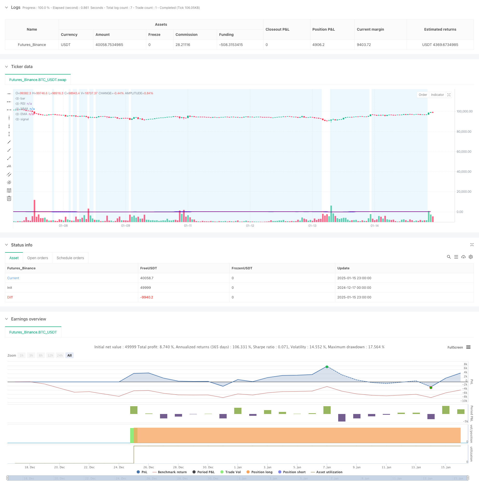

> Name

Multi-Technical-Indicator-Crossover-Momentum-Trend-Following-Strategy
> Author

ChaoZhang

> Strategy Description



[trans]
#### Overview
This strategy is a trend following trading system that combines the Relative Strength Index (RSI), Weighted Moving Average (WMA), and Exponential Moving Average (EMA). The strategy uses multiple technical indicators to capture changes in market momentum at trend turning points, thereby generating trading signals. The system uses the intersection of WMA and EMA to confirm the trend direction, and combines it with the RSI indicator to filter the market status to improve the accuracy of trading.
#### Strategy Principle
The core logic of the strategy is based on the following key elements:
1. The RSI indicator is calculated using a 14-period period, which is used to measure the overbought and oversold state of the market.
2. The intersection of the 45-period WMA and the 89-period EMA is used to confirm the trend transition
3. Admission conditions:
   - Long signal: WMA crosses EMA and RSI <50
   - Short signal: WMA crosses below EMA and RSI>50
4. The system visualizes the market status through the color change of RSI. It displays green when RSI>70 and red when <30.
5. Set a blue background within the RSI 30-70 range to help identify the neutral area
#### Strategic Advantages
1. The combination of multiple technical indicators improves the reliability of trading signals
2. WMA is more responsive to recent price changes, while EMA maintains tracking of long-term trends.
3. RSI acts as a filter to effectively avoid false signals in excessively volatile markets.
4. The visual interface design helps traders intuitively judge the market status.
5. Contains a complete alert system that can promptly notify traders of potential trading opportunities.
#### Strategy Risk
1. Frequent false breakthrough signals may occur in sideways markets
2. The lag of the moving average may lead to a slight delay in entry timing
3. Fixed settings for RSI thresholds may not be suitable for all market environments
4. Failure to consider volatility factors may increase risks during periods of high volatility.
5. Lack of stop-loss and stop-profit mechanisms, which may affect the effectiveness of fund management
#### Strategy optimization direction
1. Introduce adaptive RSI threshold and dynamically adjust it according to market fluctuations
2. Add ATR indicator to control position size and set dynamic stop loss
3. Optimize the cycle settings of WMA and EMA, and consider adjusting them according to different time frames.
4. Add volume indicator as an auxiliary confirmation signal
5. Implement a more complex position management system, such as pyramid-type position addition and reduction
#### Summary
This is a trend following strategy based on multiple technical indicators. Through the combined use of RSI, WMA and EMA, it strives to capture the market trend transition point while ensuring transaction stability. Although there is a certain risk of hysteresis and false signals, through reasonable optimization and risk management measures, this strategy has good practical value and room for expansion. ||
#### Overview
This strategy is a trend following trading system that combines the Relative Strength Index (RSI), Weighted Moving Average (WMA), and Exponential Moving Average (EMA). By utilizing multiple technical indicators, the strategy captures market momentum changes at trend reversal points to generate trading signals. The system uses WMA and EMA crossovers to confirm trend direction while incorporating RSI to filter market conditions for improved trading accuracy.

#### Strategy Principles
The core logic of the strategy is based on the following key elements:
1. RSI calculation uses a 14-period setting to measure market overbought/oversold conditions
2. 45-period WMA and 89-period EMA crossovers confirm trend transitions
3. Entry conditions:
   - Long signal: WMA crosses above EMA and RSI<50
   - Short signal: WMA crosses below EMA and RSI>50
4. The system visualizes market conditions through RSI color changes, showing green when RSI>70 and red when RSI<30
5. Blue background is set in the RSI 30-70 range to help identify neutral zones

#### Strategy Advantages
1. The combination of multiple technical indicators enhances trading signal reliability
2. WMA is more sensitive to recent price changes while EMA maintains long-term trend tracking
3. RSI as a filter effectively prevents false signals in overly volatile markets
4. Visual interface design helps traders intuitively judge market conditions
5. Includes a complete alert system to notify traders of potential trading opportunities

#### Strategy Risks
1. May generate frequent false breakout signals in sideways markets
2. Moving averages' lag nature might cause slightly delayed entries
3. Fixed RSI thresholds may not be suitable for all market environments
4. Lack of volatility consideration may increase risk during high volatility periods
5. Absence of stop-loss and take-profit mechanisms may affect money management effectiveness

#### Strategy Optimization Directions
1. Introduce adaptive RSI thresholds that dynamically adjust based on market volatility
2. Add ATR indicator for position sizing and dynamic stop-loss settings
3. Optimize WMA and EMA periods, considering adjustments for different timeframes
4. Add volume indicators as confirmation signals
5. Implement more sophisticated position management systems, such as pyramid-style scaling

#### Summary
This is a trend following strategy based on multiple technical indicators, combining RSI, WMA, and EMA to capture market trend reversal points while maintaining trading stability. Although it has certain lag and false signal risks, through appropriate optimization and risk management measures, the strategy has good practical value and room for expansion.[/trans]


> Source (PineScript)

``` pinescript
/*backtest
start: 2024-12-17 00:00:00
end: 2025-01-16 00:00:00
period: 1h
basePeriod: 1h
exchanges: [{"eid":"Futures_Binance","currency":"BTC_USDT","balance":49999}]
*/

//@version=5
strategy(title="RSI + WMA + EMA Strategy", shorttitle="RSI Strategy", overlay=true)

// RSI Settings
rsiLengthInput = input.int(14, minval=1, title="RSI Length", group="RSI Settings")
rsiSourceInput = input.source(close, "Source", group="RSI Settings")

// WMA and EMA Settings
wmaLengthInput = input.int(45, minval=1, title="WMA Length", group="WMA Settings")
wmaColorInput = input.color(color.blue, title="WMA Color", group="WMA Settings")
emaLengthInput = input.int(89, minval=1, title="EMA Length", group="EMA Settings")
emaColorInput = input.color(color.purple, title="EMA Color", group="EMA Settings")

// RSI Calculation
change = ta.change(rsiSourceInput)
up = ta.rma(math.max(change, 0), rsiLengthInput)
down = ta.rma(-math.min(change, 0), rsiLengthInput)
rsi = down == 0 ? 100 : up == 0 ? 0 : 100 - (100 / (1 + up / down))

// WMA and EMA Calculation
wma = ta.wma(rsi, wmaLengthInput)
ema = ta.ema(rsi, emaLengthInput)

// RSI Color Logic
rsiColor = rsi > 70 ? color.new(color.green, 100 - math.round(rsi)) : rsi < 30 ? color.new(color.red, math.round(rsi)) : color.new(color.blue, 50)

// Plot RSI, WMA, and EMA
plot(rsi, "RSI", color=rsiColor)
plot(wma, title="WMA", color=wmaColorInput, linewidth=2)
plot(ema, title="EMA", color=emaColorInput, linewidth=2)

// Highlight RSI Area between 30 and 70
bgcolor(rsi >= 30 and rsi <= 70 ? color.new(color.blue, 90) : na)

// Entry and Exit Conditions
longCondition = ta.crossover(wma, ema) and rsi < 50
shortCondition = ta.crossunder(wma, ema) and rsi > 50

if (longCondition)
    strategy.entry("Long", strategy.long)
    alert("Buy Signal: WMA crossed above EMA, RSI < 50", alert.freq_once_per_bar)

if (shortCondition)
    strategy.entry("Short", strategy.short)
    alert("Sell Signal: WMA crossed below EMA, RSI > 50", alert.freq_once_per_bar)

// Optional: Plot Buy/Sell Signals on Chart
plotshape(series=longCondition, style=shape.labelup, location=location.belowbar, color=color.green, size=size.small, title="Buy Signal")
plotshape(series=shortCondition, style=shape.labeldown, location=location.abovebar, color=color.red, size=size.small, title="Sell Signal")

```

> Detail

https://www.fmz.com/strategy/478741

> Last Modified

2025-01-17 16:26:13
