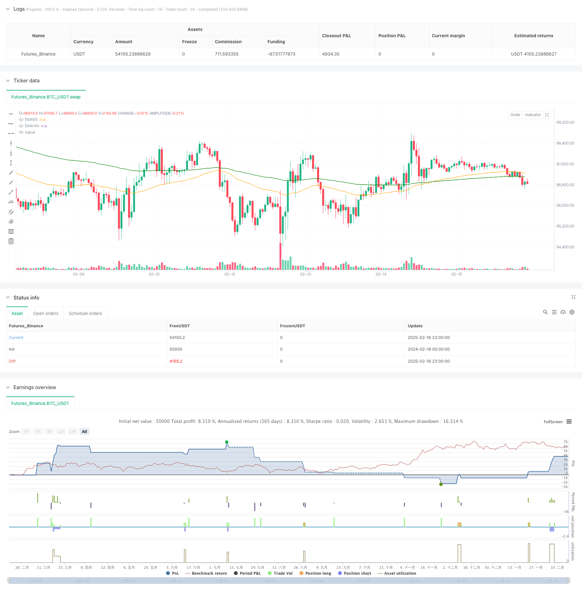

> Name

Multi-Technical-Indicator-Dynamic-Wave-Trading-Strategy
> Author

ChaoZhang

> Strategy Description



[trans]
#### Overview
This is a dynamic swing trading strategy based on multiple technical indicators, which mainly combines the characteristics of trend following and swing operations. The strategy uses the synergy of multiple technical indicators such as EMA, ADX, RSI and MACD to find trading opportunities with high probability of winning in the market. The system uses dynamic stop loss and batch take profit to manage risks and profits.
#### Strategy Principle
The core logic of the strategy is based on the following key elements:
1. Trend judgment: Use the cross relationship between EMA55 and EMA144 to determine the market trend direction, and combine the ADX indicator strength (threshold 30) for trend confirmation.
2. Entry timing: Use the RSI indicator to identify overbought and oversold areas (oversold 45, overbought 55), which is used to determine callback buying and rebound short selling opportunities.
3. Stop loss mechanism: Adopt dynamic stop loss based on ATR, the stop loss distance is 1.5 times ATR, and can be adaptively adjusted according to market fluctuations.
4. Profit strategy: Use the 50-period highest/lowest price as the profit-taking target, and adopt the method of taking profit in batches for 50% of the position.
#### Strategic Advantages
1. Multiple indicator verification: The reliability of trading signals is improved through the combined use of multiple indicators such as EMA, ADX, and RSI.
2. Dynamic risk management: Dynamic stop loss based on ATR can adapt to different market environments and provide better risk control.
3. Progressive profit-making: Using the method of taking profits in batches can lock in part of the profits without exiting the strong market prematurely.
4. Trend confirmation: Add ADX indicator filter to avoid frequent trading in sideways and volatile markets.
#### Strategy Risk
1. Risk of false breakthrough: Misjudgment may occur when market volatility intensifies. It is recommended to increase trading volume for confirmation.
2. Slippage loss: When the market fluctuates rapidly, dynamic stop loss may face larger slippage.
3. Sideways losses: Although there is ADX filtering, continuous small losses may still occur in volatile markets.
4. Signal lag: The combination of multiple indicators may cause the entry signal to lag behind, missing the best opportunity to open a position.
#### Strategy optimization direction
1. Optimization of indicator parameters: It is recommended to optimize historical backtesting for parameters such as EMA cycle and RSI threshold.
2. Stop loss optimization: Consider adding a trailing stop loss to better protect profits.
3. Position management: It is recommended to introduce a volatility adaptive position management system.
4. Market adaptability: Market environment classification can be added and different parameter combinations can be used under different market conditions.
#### Summary
This strategy builds a complete trading system through the coordination of multiple technical indicators. The strategy focuses on both trend control and risk control, and balances risks and returns through dynamic stop loss and batch stop profit. Although there is some room for optimization, overall it is a logically rigorous and practical trading strategy. ||
#### Overview
This is a dynamic wave trading strategy based on multiple technical indicators, combining trend following and wave operation characteristics. The strategy seeks high-probability trading opportunities through the coordination of multiple technical indicators including EMA, ADX, RSI, and MACD. The system manages risk and profit through dynamic stop-loss and batch profit-taking methods.

#### Strategy Principle
The core logic of the strategy is based on the following key elements:
1. Trend Judgment: Uses EMA55 and EMA144 crossover relationships to determine market trend direction, combined with ADX indicator strength (threshold 30) for trend confirmation.
2. Entry Timing: Identifies oversold and overbought areas through RSI indicator (oversold 45, overbought 55) to judge pullback buying and rebound shorting opportunities.
3. Stop-Loss Mechanism: Adopts ATR-based dynamic stop-loss, with a stop-loss distance of 1.5 times ATR, which can adaptively adjust according to market volatility.
4. Profit Strategy: Uses 50-period high/low prices as profit targets, adopting a 50% position batch profit-taking approach.

#### Strategy Advantages
1. Multiple Indicator Verification: Improves trading signal reliability through the combined use of multiple indicators including EMA, ADX, and RSI.
2. Dynamic Risk Management: ATR-based dynamic stop-loss can adapt to different market environments, providing better risk control.
3. Progressive Profit-Taking: The batch profit-taking approach allows both securing partial profits and maintaining positions in strong trends.
4. Trend Confirmation: Inclusion of ADX indicator filtering helps avoid frequent trading in sideways markets.

#### Strategy Risks
1. False Breakout Risk: Misjudgments may occur during increased market volatility, suggesting the addition of volume confirmation.
2. Slippage Loss: Dynamic stop-loss may face significant slippage during rapid market movements.
3. Sideways Market Losses: Despite ADX filtering, consecutive small losses may still occur in oscillating markets.
4. Signal Lag: Multiple indicator combinations may lead to delayed entry signals, missing optimal position-building opportunities.

#### Strategy Optimization Directions
1. Indicator Parameter Optimization: Recommend historical backtesting optimization for parameters like EMA periods and RSI thresholds.
2. Stop-Loss Optimization: Consider adding trailing stop-loss for better profit protection.
3. Position Management: Suggest introducing a volatility-adaptive position management system.
4. Market Adaptability: Can add market environment classification to use different parameter combinations under different market conditions.

#### Summary
The strategy constructs a complete trading system through the coordination of multiple technical indicators. It emphasizes both trend capture and risk control, balancing risk and return through dynamic stop-loss and batch profit-taking methods. While there is room for optimization, it is overall a logically rigorous and practical trading strategy.[/trans]


> Source (PineScript)

``` pinescript
/*backtest
start: 2024-02-18 00:00:00
end: 2025-02-17 00:00:00
period: 1h
basePeriod: 1h
exchanges: [{"eid":"Futures_Binance","currency":"BTC_USDT"}]
*/

//@version=6
strategy("专业级交易系统", overlay=true, max_labels_count=500)
// ===== 参数设置 =====
x1 = input.float(1.5,"atr倍数",step=0.1)
x2 = input.int(50,"k线数量",step=1)
// EMA参数
ema55_len = input.int(55, "EMA55长度")
ema144_len = input.int(144, "EMA144长度")
// ADX参数
adx_len = input.int(14, "ADX长度")
adx_threshold = input.float(30.0, "ADX趋势过滤")
// RSI参数
rsi_len = input.int(14, "RSI长度")
rsi_oversold = input.float(45.0, "RSI超卖阈值")
rsi_overbuy = input.float(55.0, "RSI超买阈值")
// MACD参数
macd_fast = input.int(12, "MACD快线")
macd_slow = input.int(26, "MACD慢线")
macd_signal = input.int(9, "MACD信号线")
// ===== 指标计算 =====
// EMA计算
ema55 = ta.ema(close, ema55_len)
ema144 = ta.ema(close, ema144_len)
// ADX计算（使用标准函数）
[di_plus, di_minus, adx] = ta.dmi(adx_len, adx_len)
// RSI计算
rsi = ta.rsi(close, rsi_len)
// MACD计算（修正参数顺序）
[macdLine, signalLine, histLine] = ta.macd(close, macd_fast, macd_slow, macd_signal)
// ===== 信号逻辑 =====
// 趋势条件：EMA55 > EMA144 且 ADX > 30
trendCondition = ema55 > ema144 and adx > adx_threshold
trendConditions = ema55 < ema144 and adx > adx_threshold
// 回调条件：RSI < 45 且 MACD柱状线 > -0.002
pullbackCondition = rsi < rsi_oversold 
pullbackConditions = rsi > rsi_overbuy 
// 综合信号
entrySignal = trendCondition and pullbackCondition
entrySignals = trendConditions and pullbackConditions

// ===== 可视化 =====
// 绘制EMA
plot(ema55, "EMA55", color=color.new(#FFA500, 0))
plot(ema144, "EMA144", color=color.new(#008000, 0))
//plotshape(series=entrySignal,title="买入信号",location=location.belowbar,color=color.new(color.green, 0),style=shape.labelup,text="BUY",textcolor=color.new(color.white, 0))
s = strategy.position_avg_price ,s1 = strategy.position_size
le = false
le := low < ema144 and low[1] > ema144 and ema55 > ema144 ? true : s1 > 0 ? false : le[1] 
se = false
se := high > ema144 and high[1] < ema144 and ema55 < ema144 ? true : s1 < 0 ? false : se[1]
if entrySignal and low < ema144 and close > ema144
    strategy.entry("l",strategy.long)
strategy.exit("止盈一半","l",limit= ta.highest(x2),qty_percent = 50)
if s1 > 0 and low < (close - x1*ta.atr(12))[1]
    strategy.close_all("动态止损")

if entrySignals and high > ema144 and close < ema144
    strategy.entry("s",strategy.short)   
strategy.exit("止盈一半","s",limit = ta.lowest(x2),qty_percent = 50)
if s1 < 0 and high > (close + x1*ta.atr(12))[1]
    strategy.close_all("动态止损")

//plotshape(series=entrySignal,title="买入信号",location=location.belowbar,color=color.new(color.green, 0),style=shape.labelup,text="BUY",textcolor=color.new(color.white, 0))
//plot(close+x1*ta.atr(12))
//plot(close-x1*ta.atr(12))
//bgcolor(le ? color.red:na)
```

> Detail

https://www.fmz.com/strategy/482499

> Last Modified

2025-02-18 17:13:58
