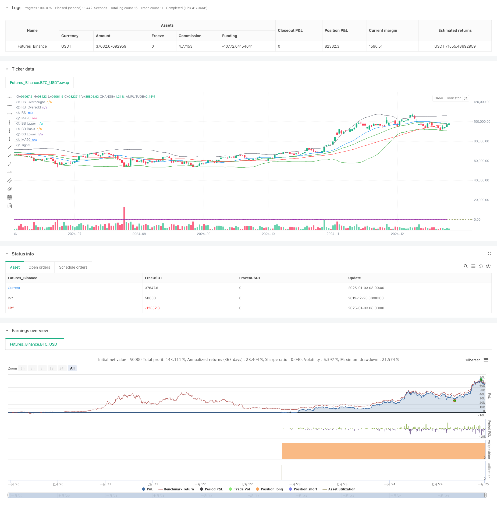

> Name

Multi-Technical-Indicator-Fusion-Trend-Following-Quantitative-Trading-Strategy
> Author

ChaoZhang

> Strategy Description



[trans]
#### Overview
This strategy is a quantitative trading system that integrates three major technical indicators: Relative Strength Index (RSI), Moving Average (MA) and Bollinger Bands (BB). This strategy comprehensively analyzes the signals of multiple technical indicators to find the best trading opportunities in market trends and fluctuations. The strategy uses the golden cross of MA20 and MA50 to determine the mid-term trend, and combines the RSI overbought and oversold signals with the breakout and return of the upper and lower Bollinger Bands to build a complete trading decision-making system.
#### Strategy Principle
The core logic of the strategy is based on the following three dimensions:
1. Trend judgment: Use the cross relationship between MA20 and MA50 to determine the mid-term market trend. If MA20 crosses MA50 above, it is considered an upward trend, and vice versa is a downward trend.
2. Momentum judgment: Use the RSI indicator to determine the overbought and oversold state of the market. An RSI below 25 enters the oversold area, and an RSI above 80 enters the overbought area.
3. Fluctuation judgment: Use the upper and lower tracks of Bollinger Bands (BB30) to describe the price fluctuation range. Breaking through the lower track is regarded as oversold, and breaking through the upper track is regarded as oversold.
The long conditions must be met at the same time: RSI<25 (oversold) + MA20>MA50 (uptrend) + price < Bollinger Band lower track (oversold)
The conditions for short selling must be met at the same time: RSI>80 (overbought) + MA20 <MA50 (downtrend) + price> upper Bollinger Band (overbought)
#### Strategic Advantages
1. Multi-indicator cross-validation: By integrating indicators from the three dimensions of trend, momentum and volatility, the reliability of trading signals is improved.
2. Perfect risk control: RSI overbought and oversold thresholds are set reasonably and can effectively filter out false signals.
3. Strong adaptability: Bollinger Bands can adaptively adjust according to market volatility, improving the performance of the strategy in different market environments.
4. Strong parameter adjustability: Key indicator parameters can be optimized and adjusted according to different market characteristics.
#### Strategy Risk
1. Lagging risk: The moving average has a certain lag, which may cause a delay in entry timing.
2. Risk of market shock: In a volatile market, frequent false signals may occur.
3. Trend reversal risk: When a strong trend suddenly reverses, the strategic response may not be timely enough.
4. Parameter sensitivity: Over-optimizing parameters may lead to over-fitting problems.
#### Strategy optimization direction
1. Introducing trading volume indicators: It is recommended to add trading volume analysis dimensions to improve the accuracy of trend judgment.
2. Optimize the stop loss mechanism: A dynamic stop loss based on ATR can be designed to improve risk control capabilities.
3. Add market environment filtering: add market volatility judgment and adjust strategy parameters in a high-volatility environment.
4. Improve position management: design a dynamic position control system based on signal strength.
#### Summary
This strategy builds a relatively complete trading system through the coordination of multiple technical indicators. Strategies perform well in markets with clear trends, but they need to pay attention to changes in the market environment and make corresponding adjustments. Through continuous optimization and improvement, this strategy is expected to achieve stable returns in real trading.
|| 

#### Overview
This strategy is a quantitative trading system that integrates three major technical indicators: Relative Strength Index (RSI), Moving Average (MA), and Bollinger Bands (BB). The strategy seeks optimal trading opportunities in market trends and volatility by comprehensively analyzing signals from multiple technical indicators. It uses MA20 and MA50 crossovers to judge medium-term trends, combined with RSI overbought/oversold signals and Bollinger Bands breakout/regression to build a complete trading decision system.

#### Strategy Principles
The core logic is based on three dimensions:
1. Trend Judgment: Uses MA20 and MA50 crossover relationships to determine market medium-term trends, with MA20 crossing above MA50 indicating an uptrend, and vice versa.
2. Momentum Judgment: Uses RSI indicator to judge market overbought/oversold conditions, with RSI below 25 entering oversold territory and above 80 entering overbought territory.
3. Volatility Judgment: Uses Bollinger Bands (BB30) channels to map price volatility ranges, with lower band breakout indicating oversold conditions and upper band breakout indicating overbought conditions.

Long conditions must simultaneously satisfy: RSI<25(oversold)+MA20>MA50(uptrend)+price<BB lower band(oversold)
Short conditions must simultaneously satisfy: RSI>80(overbought)+MA20<MA50(downtrend)+price>BB upper band(overbought)

#### Strategy Advantages
1. Multi-indicator Cross-validation: Improves trading signal reliability by integrating indicators from trend, momentum, and volatility dimensions.
2. Comprehensive Risk Control: Reasonable RSI overbought/oversold thresholds effectively filter false signals.
3. Strong Adaptability: Bollinger Bands self-adjust based on market volatility, improving strategy performance in different market environments.
4. Strong Parameter Adjustability: Key indicator parameters can be optimized for different market characteristics.

#### Strategy Risks
1. Lag Risk: Moving averages have inherent lag, potentially causing delayed entry timing.
2. Oscillation Risk: May generate frequent false signals in sideways markets.
3. Trend Reversal Risk: Strategy may not respond quickly enough to sudden trend reversals.
4. Parameter Sensitivity: Over-optimization of parameters may lead to overfitting issues.

#### Strategy Optimization Directions
1. Incorporate Volume Indicators: Recommend adding volume analysis dimension to improve trend judgment accuracy.
2. Optimize Stop-loss Mechanism: Design dynamic stop-loss based on ATR to enhance risk control capability.
3. Add Market Environment Filters: Include market volatility judgment to adjust strategy parameters in high volatility environments.
4. Improve Position Management: Design dynamic position control system based on signal strength.

#### Summary
The strategy constructs a relatively complete trading system through the synergistic combination of multiple technical indicators. It performs excellently in markets with clear trends but requires attention to market environment changes and corresponding adjustments. Through continuous optimization and improvement, the strategy has the potential to achieve stable returns in live trading.
[/trans]


> Source (PineScript)

``` pinescript
/*backtest
start: 2019-12-23 08:00:00
end: 2025-01-04 08:00:00
period: 1d
basePeriod: 1d
exchanges: [{"eid":"Futures_Binance","currency":"BTC_USDT"}]
*/

//@version=5
strategy("RSI + MA + BB30 Strategy", overlay=true)

// === Cài đặt RSI ===
rsiLength = input(14, title="RSI Length")
rsiOverbought = input(80, title="RSI Overbought Level")
rsiOversold = input(25, title="RSI Oversold Level")
rsi = ta.rsi(close, rsiLength)

// === Cài đặt MA ===
maLength20 = input(20, title="MA20 Length")
maLength50 = input(50, title="MA50 Length")
ma20 = ta.sma(close, maLength20)
ma50 = ta.sma(close, maLength50)

// === Cài đặt Bollinger Bands (BB30) ===
bbLength = input(30, title="Bollinger Bands Length")
bbStdDev = input(2, title="BB Standard Deviation")
[bbUpper, bbBasis, bbLower] = ta.bb(close, bbLength, bbStdDev)

// === Điều kiện giao dịch ===
// Điều kiện Long
longCondition = (rsi < rsiOversold) and (ma20 > ma50) and (close < bbLower)

// Điều kiện Short
shortCondition = (rsi > rsiOverbought) and (ma20 < ma50) and (close > bbUpper)

// === Mở lệnh giao dịch ===
if (longCondition)
    strategy.entry("Long", strategy.long)

if (shortCondition)
    strategy.entry("Short", strategy.short)

// === Hiển thị chỉ báo trên biểu đồ ===
// Hiển thị MA
plot(ma20, color=color.blue, title="MA20")
plot(ma50, color=color.red, title="MA50")

// Hiển thị Bollinger Bands
plot(bbUpper, color=color.green, title="BB Upper")
plot(bbBasis, color=color.gray, title="BB Basis")
plot(bbLower, color=color.green, title="BB Lower")

// Hiển thị RSI và mức quan trọng
hline(rsiOverbought, "RSI Overbought", color=color.red, linestyle=hline.style_dashed)
hline(rsiOversold, "RSI Oversold", color=color.green, linestyle=hline.style_dashed)
plot(rsi, color=color.purple, title="RSI")
```

> Detail

https://www.fmz.com/strategy/477613

> Last Modified

2025-01-06 16:57:57
