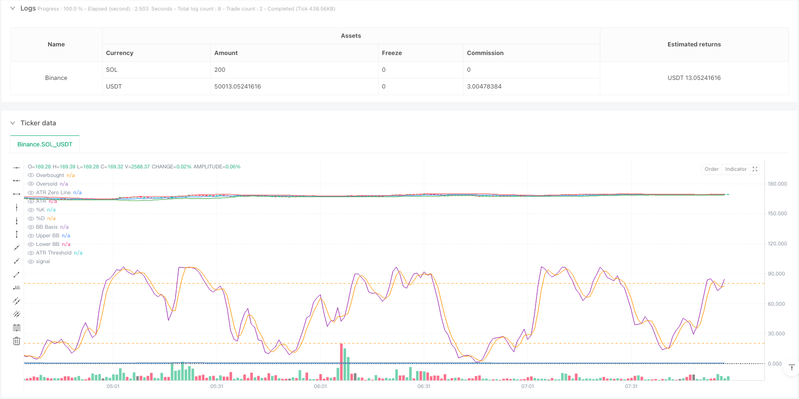
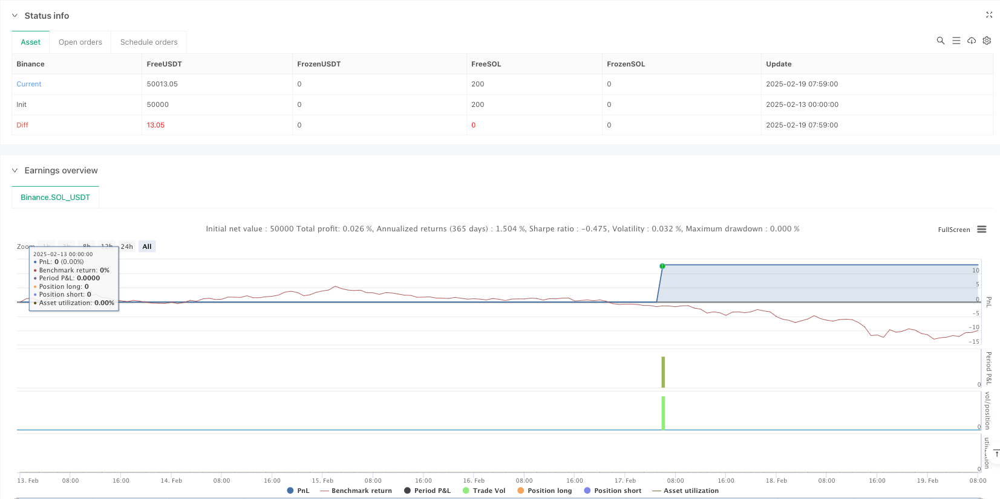

> Name

Multi-Technical-Indicator-Smart-Volatility-Breakout-Strategy
> Author

ianzeng123

> Strategy Description





[trans]
#### Overview
This strategy is an intelligent trading system based on multiple technical indicators. It combines three major technical indicators: Bollinger Bands, Stochastic Oscillator and Average True Range (ATR). It identifies potential trading opportunities through a comprehensive analysis of market volatility, momentum and trends. This strategy uses dynamic stop loss and profit target settings, and can adaptively adjust trading parameters according to market fluctuations.
#### Strategy Principle
The core logic of the strategy is based on the triple verification mechanism:
1. Use Bollinger Bands to define the price fluctuation range. When the price breaks through the lower band of Bollinger Bands, identify oversold opportunities and identify overbought opportunities when it breaks through the upper band.
2. Use the stochastic indicator to confirm momentum in the overbought zone (>80) and oversold zone (<20). The intersection of the %K line and the %D line serves as an entry signal.
3. Introduce the ATR indicator as a volatility filter to ensure that trading is supported by sufficient market volatility
The following conditions need to be met for the generation of trading signals:
Buying conditions:
- Price closed below the lower Bollinger Bands
- The stochastic indicator %K line crosses the %D line upwards in the oversold area
- ATR value is higher than the set threshold, confirming sufficient market volatility
Selling conditions:
- Price closed above the upper Bollinger Band
- The stochastic %K line crosses the %D line downwards in the overbought area
- The ATR value remains above the threshold to confirm the validity of the transaction
#### Strategic Advantages
1. Cross-validation of multiple technical indicators significantly improves the reliability of trading signals
2. Dynamic stop loss and profit target settings, automatically adjusting risk management parameters according to market volatility
3. The volatility filtering mechanism effectively avoids false signals during periods of low volatility.
4. The indicator parameters can be flexibly adjusted according to different market conditions and have good adaptability.
5. The strategy logic is clear, easy to understand and implement, and is suitable for traders of all levels.
#### Strategy Risk
1. Slippage may occur when the market fluctuates violently, affecting the actual execution price.
2. The use of multiple indicators may cause signal lag and miss the best entry opportunity.
3. Excessive parameter optimization may lead to overfitting and affect the performance of the strategy in the real market.
4. False signals may appear at trend turning points, and other analysis tools need to be used
5. Transaction costs and commissions may affect the overall return performance of the strategy
#### Strategy optimization direction
1. Introduce trend filters such as moving average crossover systems to enhance trend confirmation
2. Optimize the dynamic adjustment mechanism of ATR threshold to better adapt to different market environments
3. Increase the verification of trading volume indicators and improve the reliability of trading signals
4. Implement adaptive parameter optimization and automatically adjust indicator parameters according to market conditions.
5. Add a time filter to avoid trading during the opening and closing periods when the market is volatile
#### Summary
This strategy builds a complete trading system through the combined application of Bollinger Bands, stochastic indicators and ATR. The advantage of the strategy lies in the cross-validation of multiple indicators and dynamic risk management, but it also requires attention to parameter optimization and market environment adaptability. Through continuous optimization and improvement, this strategy is expected to achieve stable return performance in actual transactions. ||
#### Overview
This strategy is an intelligent trading system based on multiple technical indicators, combining Bollinger Bands, Stochastic Oscillator, and Average True Range (ATR) to identify potential trading opportunities through comprehensive analysis of market volatility, momentum, and trends. The strategy employs dynamic stop-loss and profit targets that adapt to market volatility conditions.

#### Strategy Principles
The core logic is based on a triple verification mechanism:
1. Using Bollinger Bands to define price volatility ranges, identifying oversold opportunities when price breaks below the lower band and overbought opportunities when it breaks above the upper band
2. Momentum confirmation through Stochastic Oscillator in overbought (>80) and oversold (<20) regions, with %K and %D line crossovers as entry signals
3. Incorporating ATR as a volatility filter to ensure trades are executed under sufficient market volatility

Trade signals require the following conditions:
Buy conditions:
- Price closes below the lower Bollinger Band
- Stochastic %K line crosses above %D line in the oversold region
- ATR value exceeds the set threshold, confirming adequate market volatility

Sell conditions:
- Price closes above the upper Bollinger Band
- Stochastic %K line crosses below %D line in the overbought region
- ATR value maintains above threshold, confirming trade validity

#### Strategy Advantages
1. Multiple technical indicator cross-validation significantly improves trading signal reliability
2. Dynamic stop-loss and profit targets that automatically adjust risk management parameters based on market volatility
3. Volatility filtering mechanism effectively avoids false signals during low volatility periods
4. Indicator parameters can be flexibly adjusted for different market conditions, providing good adaptability
5. Clear strategy logic that is easy to understand and implement, suitable for traders of all levels

#### Strategy Risks
1. Potential slippage during intense market volatility affecting actual execution prices
2. Multiple indicators may lead to signal lag, missing optimal entry points
3. Over-optimization of parameters may result in overfitting, impacting strategy performance in live trading
4. False signals may occur at trend turning points, requiring complementary analysis tools
5. Trading costs and commissions may affect overall strategy returns

#### Strategy Optimization Directions
1. Introduce trend filters, such as moving average crossover systems, to enhance trend confirmation
2. Optimize the dynamic adjustment mechanism of ATR threshold for better adaptation to different market environments
3. Add volume indicator verification to improve trading signal reliability
4. Implement adaptive parameter optimization that automatically adjusts indicator parameters based on market conditions
5. Add time filters to avoid trading during highly volatile market opening and closing periods

#### Summary
The strategy constructs a complete trading system through the combined application of Bollinger Bands, Stochastic Oscillator, and ATR. Its strengths lie in multiple indicator cross-validation and dynamic risk management, while attention must be paid to parameter optimization and market environment adaptability. Through continuous optimization and refinement, the strategy shows promise for achieving stable returns in actual trading.[/trans]


> Source (PineScript)

``` pinescript
/*backtest
start: 2025-02-13 00:00:00
end: 2025-02-19 08:00:00
period: 1m
basePeriod: 1m
exchanges: [{"eid":"Binance","currency":"SOL_USDT"}]
*/

//@version=5
strategy("Bollinger Bands + Stochastic Oscillator + ATR Strategy", overlay=true, default_qty_type=strategy.percent_of_equity, default_qty_value=10)

// Bollinger Bands Parameters
bb_length = 20
bb_mult = 2.0
basis = ta.sma(close, bb_length)
dev = bb_mult * ta.stdev(close, bb_length)
upper_bb = basis + dev
lower_bb = basis - dev

// Stochastic Oscillator Parameters
stoch_length = 14
k_smooth = 3
d_smooth = 3
stoch_k = ta.sma(ta.stoch(close, high, low, stoch_length), k_smooth)
stoch_d = ta.sma(stoch_k, d_smooth)

// ATR Parameters
atr_length = 14
atr_mult = 1.5
atr = ta.atr(atr_length)

// ATR Threshold based on ATR Moving Average
atr_ma = ta.sma(atr, atr_length)
atr_threshold = atr_ma * atr_mult

// Plot Bollinger Bands
plot(basis, color=color.blue, title="BB Basis")
p1 = plot(upper_bb, color=color.red, title="Upper BB")
p2 = plot(lower_bb, color=color.green, title="Lower BB")
fill(p1, p2, color=color.rgb(173, 216, 230, 90), title="BB Fill")

// Plot Stochastic Oscillator
hline(80, "Overbought", color=color.orange)
hline(20, "Oversold", color=color.orange)
plot(stoch_k, color=color.purple, title="%K")
plot(stoch_d, color=color.orange, title="%D")

// Plot ATR and ATR Threshold for Visualization
hline(0, "ATR Zero Line", color=color.gray, linestyle=hline.style_dotted)
plot(atr, title="ATR", color=color.blue)
plot(atr_threshold, title="ATR Threshold", color=color.gray, style=plot.style_stepline)

// Buy Condition:
// - Price closes below the lower Bollinger Band
// - Stochastic %K crosses above %D in oversold region
// - ATR is above the ATR threshold
buyCondition = close < lower_bb and ta.crossover(stoch_k, stoch_d) and stoch_k < 20 and atr > atr_threshold

// Sell Condition:
// - Price closes above the upper Bollinger Band
// - Stochastic %K crosses below %D in overbought region
// - ATR is above the ATR threshold
sellCondition = close > upper_bb and ta.crossunder(stoch_k, stoch_d) and stoch_k > 80 and atr > atr_threshold

// Plot Buy/Sell Signals
plotshape(series=buyCondition, title="Buy Signal", location=location.belowbar, color=color.green, style=shape.labelup, text="BUY")
plotshape(series=sellCondition, title="Sell Signal", location=location.abovebar, color=color.red, style=shape.labeldown, text="SELL")

// Execute Trades
if (buyCondition)
    strategy.entry("Long", strategy.long)

if (sellCondition)
    strategy.close("Long")

// Optional: Add Stop Loss and Take Profit
// Stop Loss at ATR-based distance
stop_level = close - atr_mult * atr
take_level = close + atr_mult * atr

if (buyCondition)
    strategy.exit("Take Profit/Stop Loss", from_entry="Long", stop=stop_level, limit=take_level)

```

> Detail

https://www.fmz.com/strategy/483103

> Last Modified

2025-02-21 13:42:44
