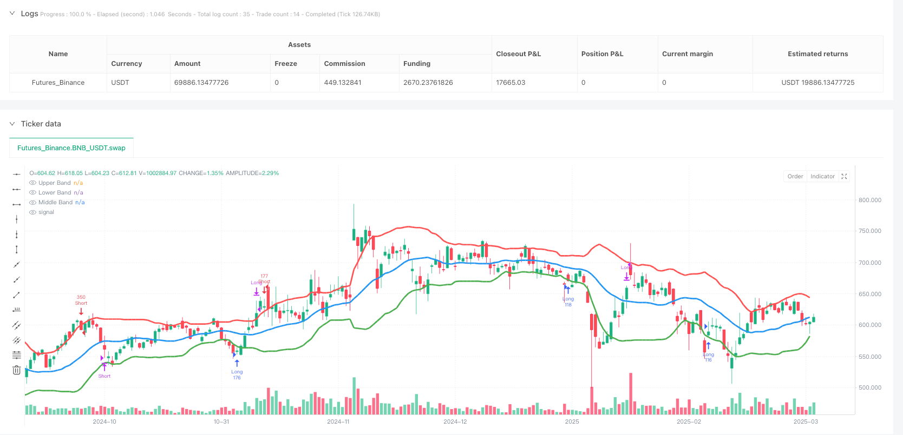
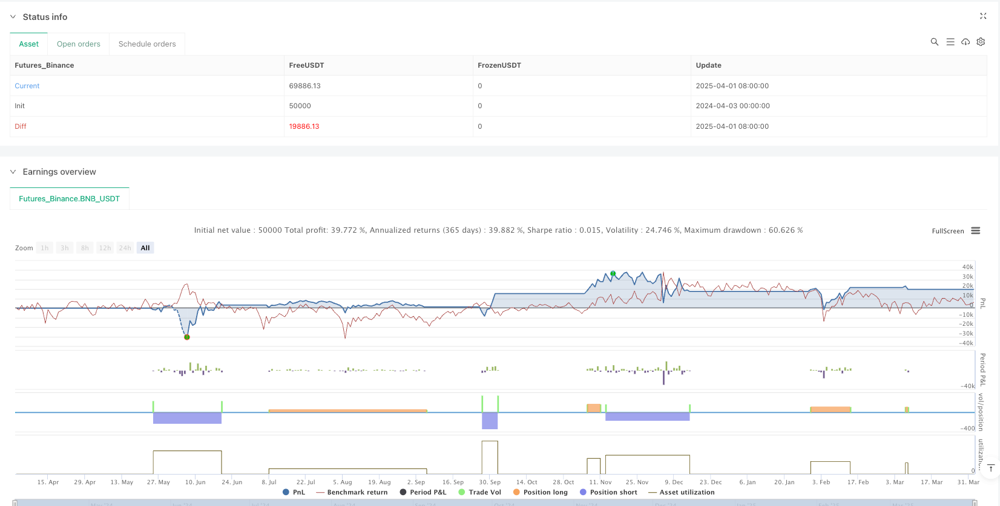

> Name

Multi-Timeframe Bollinger Band Breakout Reversion Trading Strategy-Multi-Timeframe-Bollinger-Band-Breakout-Reversion-Strategy
> Author

ianzeng123

> Strategy Description





[trans]

#### Overview
The multi-period Bollinger Band Breakout Return trading strategy is a mean reversion trading system based on price volatility, focusing on capturing callback opportunities after market overexpansion. This strategy utilizes the Bollinger Bands indicator (consisting of a 20-period simple moving average and 1.5x standard deviation) to identify extreme market behavior and execute trades when specific conditions are triggered. When the price completely breaks through the upper track and then falls back, or breaks through the lower track and then rebounds, the system will generate a short or long signal respectively. At the same time, combined with a precise risk management mechanism, it ensures that the risk of each transaction is controlled and pursues a 3:1 return ratio.
#### Strategy Principle
The core principle of this strategy is based on the mean reversion theory, which holds that prices tend to return after deviating significantly from the mean in the short term. The specific implementation logic is as follows:
1. **Signal recognition mechanism**:
   - Short selling conditions: When a certain K line is completely formed above the upper rail (the opening price, closing price and lowest price are all higher than the upper rail), and within the subsequent four K lines, the price falls below the lowest point of the signal K line, triggering a short selling signal.
   - Long conditions: When a certain K line is completely formed below the lower rail (the opening price, closing price and highest price are all lower than the lower rail), and within the subsequent four K lines, the price breaks through the highest point of the signal K line, triggering a long signal.
2. **Dynamic stop loss setting**:
   - Short trading: Set the stop loss point at the highest point of the K-line that breaks through the upper rail signal.
   - Long trade: Set the stop loss point at the lowest point of the K-line that breaks through the lower rail signal.
3. **Accurate position calculation**:
   - The system dynamically determines the amount of each trade based on a fixed risk limit per trade (INR 4000) and a stop-loss distance calculated in real time, ensuring that the risk limit remains consistent regardless of market volatility.
4. **Progressive Stop Loss Management**:
   - When the transaction profit reaches 2 times the risk amount, the stop loss position is moved to the entry price (guaranteed position) to lock in part of the profit.
   - When the profit reaches 3 times the risk amount, the system automatically closes the position and completes the transaction.
5. **Validity time window**:
   - After the signal K-line appears, the system only considers the breakthrough behavior within 4 K-lines. If it exceeds this window, the signal will be invalid to avoid lagging transactions.
#### Strategic Advantages
1. **Accurate risk control**: By dynamically calculating the number of transactions, ensuring that the maximum risk of each transaction is fixed at 4,000 Indian rupees, precise risk management is achieved.
2. **Adaptive market volatility**: Bollinger Bands are based on standard deviation calculations and can automatically adjust as market volatility changes, allowing the strategy to maintain adaptability in different market environments.
3. **Clear trading rules**: Entry, stop loss and profit conditions are clearly defined to reduce subjective judgment and improve trading discipline.
4. **Progressive Risk Management**: When the transaction develops in a favorable direction, "zero-risk" transactions can be achieved by moving the stop loss to the entry price and optimizing the risk-return structure.
5. **Mean Reversion Capture**: Effectively utilize the regression trend after over-expansion of the market and focus on high-probability trading opportunities.
6. **Time limit filter**: Through the validity limit of 4 K lines, it avoids the execution of outdated signals and improves the timeliness of transactions.
7. **Visual feedback system**: Through the bold Bollinger Bands curve, it provides an intuitive reference for market status and assists in trading decisions.
#### Strategy Risk
1. **Rapid trend change risk**: In strong trending markets, prices may not follow mean reversion logic, causing consecutive stop loss triggers. The solution is to add a trend filter to pause reverse trades in strong trending environments.
2. **Low liquidity environment risk**: In a market with insufficient trading volume, it may be difficult to execute a large number of orders at the ideal price, affecting the actual risk control effect. It is recommended to add a liquidity detection mechanism and reduce transaction size in a low liquidity environment.
3. **Excessive risk of parameter optimization**: Fixed Bollinger Band parameters (20-period SMA and 1.5 times standard deviation) may perform differently in different markets or periods. It is recommended to implement an adaptive parameter system to dynamically adjust according to market conditions.
4. **Extreme Market Risk**: During market gaps or violent fluctuations, the actual stop loss may far exceed the preset level. It is recommended to introduce more complex stop loss strategies, such as dynamic stop loss based on ATR or price dispersion stop loss.
5. **Frequent trading risk**: In a high-volatility environment, the strategy may generate too many signals and increase transaction costs. Consider adding a signal quality filter to execute only the highest quality trading opportunities.
6. **Money Management Risk**: Fixed risk amounts may not be suitable for all account sizes. Risk management should be implemented based on a percentage of the account rather than a fixed amount.
#### Strategy optimization direction
1. **Multi-period confirmation system**: Introducing multi-time frame analysis, requiring trading signals to be confirmed in higher time frames to increase the success rate of transactions. For example, hourly trading signals are executed only when the daily chart also exhibits a mean reversion trend.
2. **Dynamic Bollinger Band Parameters**: Realize adaptive adjustment of Bollinger Band parameters, and dynamically select the optimal period and standard deviation multiple based on market volatility or trading product characteristics.
3. **Market environment filtering**: Add a market type recognition algorithm to implement a complete strategy in a volatile market, and selectively implement trend signals in a trending market to improve strategy adaptability.
4. **Volume and price combined analysis**: Confirm the validity of breakthrough signals by combining trading volume indicators. For example, it is required that a breakthrough is accompanied by a significant increase in trading volume to filter out false breakthroughs.
5. **Step-by-step profit strategy**: Optimize the fixed 3 times risk profit model and change it to a batch profit system. For example, close 50% of the position when the risk is 2 times and the remaining part when the risk is 3 times to improve capital efficiency.
6. **Machine learning optimization**: Introduce machine learning models to classify historical signals, identify the characteristics of high winning rate and low winning rate signals, and establish a more refined signal filtering mechanism.
7. **Correlation Analysis Integration**: When considering multi-variety transactions in an investment portfolio, correlation analysis is added to avoid simultaneous execution of highly correlated transactions in the same direction and reduce systemic risks.
8. **Fund Management Upgrade**: Convert fixed amount risk into dynamic risk allocation based on account size, such as 0.5%-2% of the total account size, to achieve a dynamic balance between risk and account size.
#### Summary
The multi-period Bollinger Bands breakout and return trading strategy is a highly structured, well-defined technical analysis trading system that captures return opportunities after excessive market behavior through the Bollinger Bands indicator. Its core advantages lie in precise risk control, clear trading rules and progressive stop loss management, allowing traders to pursue substantial returns while controlling risks.
However, this strategy also faces challenges such as poor adaptability to trending markets, excessive parameter optimization, and extreme market risks. By introducing optimization measures such as multi-cycle confirmation, dynamic parameter adjustment, market environment filtering, and fund management upgrades, the robustness and adaptability of the strategy can be significantly improved.
For investors looking for mean reversion trading opportunities, this strategy provides a systematic approach that maintains execution discipline while leaving enough room for optimization to adapt to different market environments. Ultimately, successful implementation of this strategy requires a deep understanding of market dynamics, ongoing system optimization, and rigorous risk management disciplines. ||


#### Overview
The Multi-Timeframe Bollinger Band Breakout Reversion Strategy is a mean-reversion trading system based on price volatility, focused on capturing market corrections after excessive expansion. This strategy utilizes the Bollinger Bands indicator (composed of a 20-period Simple Moving Average and 1.5 standard deviations) to identify extreme market behavior and executes trades when specific conditions are triggered. When price completely breaks above the upper band and then retraces, or breaks below the lower band and then rebounds, the system generates short or long signals respectively, combined with precise risk management mechanisms to ensure controlled risk for each trade while targeting a 3:1 reward ratio.

#### Strategy Principles
The core principle of this strategy is based on mean reversion theory, which suggests that prices tend to revert to their mean after significant short-term deviations. The specific implementation logic is as follows:

1. **Signal Identification Mechanism**:
   - Short Condition: When a candle forms completely above the upper band (open, close, and low all higher than the upper band), and within the next four candles, the price breaks below the signal candle's lowest point, triggering a short signal.
   - Long Condition: When a candle forms completely below the lower band (open, close, and high all lower than the lower band), and within the next four candles, the price breaks above the signal candle's highest point, triggering a long signal.

2. **Dynamic Stop Loss Setting**:
   - Short Trade: Set the stop loss at the highest point of the signal candle that broke above the upper band.
   - Long Trade: Set the stop loss at the lowest point of the signal candle that broke below the lower band.

3. **Precise Position Calculation**:
   - The system dynamically determines the quantity for each trade based on a fixed risk amount (4000 Indian Rupees) and the real-time calculated stop loss distance, ensuring consistent risk exposure regardless of market volatility.

4. **Progressive Stop Loss Management**:
   - When a trade profits reach twice the risk amount, the stop loss moves to the entry price (breakeven), securing partial profits.
   - When profits reach three times the risk amount, the system automatically closes the position, completing the trade.

5. **Effectiveness Time Window**:
   - After a signal candle appears, the system only considers breakouts within the next 4 candles; beyond this window, the signal becomes invalid, avoiding delayed trades.

#### Strategy Advantages
1. **Precise Risk Control**: By dynamically calculating trading quantity, the maximum risk for each trade is fixed at 4000 Indian Rupees, achieving precise risk management.

2. **Adaptive to Market Volatility**: Bollinger Bands, calculated based on standard deviation, automatically adjust with market volatility changes, maintaining strategy adaptability across different market environments.

3. **Clear Trading Rules**: Entry, stop loss, and profit targets are clearly defined, reducing subjective judgment and improving trading discipline.

4. **Progressive Risk Management**: When trades move favorably, moving stops to breakeven creates "zero-risk" trades, optimizing the risk-reward structure.

5. **Mean Reversion Capture**: Effectively utilizes the reversion tendency after market overextension, focusing on high-probability trading opportunities.

6. **Time Limit Filtering**: The 4-candle validity period prevents executing outdated signals, improving trading timeliness.

7. **Visual Feedback System**: Thickened Bollinger Band curves provide intuitive market state references, assisting trading decisions.

#### Strategy Risks
1. **Rapid Trend Reversal Risk**: In strong trending markets, prices may not follow mean reversion logic, leading to consecutive stop losses. The solution is to add trend filters to pause counter-trend trades in strong trend environments.

2. **Low Liquidity Environment Risk**: In markets with insufficient volume, it may be difficult to execute large orders at ideal prices, affecting actual risk control. Consider adding liquidity detection mechanisms to reduce trading size in low liquidity environments.

3. **Parameter Optimization Overfit Risk**: Fixed Bollinger Band parameters (20-period SMA and 1.5 standard deviations) may perform inconsistently across different markets or periods. Implementing adaptive parameter systems that dynamically adjust based on market conditions is recommended.

4. **Extreme Market Risk**: During market gaps or violent fluctuations, actual stop losses may far exceed preset levels. Consider introducing more complex stop loss strategies, such as ATR-based dynamic stops or distributed price-based stops.

5. **Frequent Trading Risk**: In highly volatile environments, the strategy may generate too many signals, increasing transaction costs. Consider adding signal quality filters to execute only the highest quality trading opportunities.

6. **Capital Management Risk**: Fixed risk amounts may not be suitable for all account sizes. Implement percentage-based risk management rather than fixed amounts.

#### Strategy Optimization Directions
1. **Multi-Timeframe Confirmation System**: Introduce multi-timeframe analysis, requiring trade signals to be confirmed on higher timeframes to improve success rates. For example, only execute hourly-level trade signals when the daily chart also shows mean reversion tendencies.

2. **Dynamic Bollinger Band Parameters**: Implement adaptive adjustment of Bollinger Band parameters based on market volatility or instrument characteristics, dynamically selecting optimal periods and standard deviation multipliers.

3. **Market Environment Filtering**: Add market type recognition algorithms to execute the complete strategy in oscillating markets while selectively executing trend-following signals in trending markets, improving strategy adaptability.

4. **Volume-Price Combined Analysis**: Incorporate volume indicators to confirm breakout signal validity, for example, requiring noticeable volume increases with breakouts to filter false breakouts.

5. **Stepped Profit Strategy**: Optimize the fixed 3x risk profit model to a partial profit-taking system, such as closing 50% at 2x risk and the remainder at 3x risk, improving capital efficiency.

6. **Machine Learning Optimization**: Introduce machine learning models to classify historical signals, identifying features of high and low win-rate signals to establish more refined signal filtering mechanisms.

7. **Correlation Analysis Integration**: When trading multiple instruments in a portfolio, add correlation analysis to avoid simultaneous directional trades in highly correlated instruments, reducing systemic risk.

8. **Capital Management Upgrade**: Convert fixed amount risk to dynamic risk allocation based on account size, such as 0.5%-2% of total account value, achieving dynamic balance between risk and account size.

#### Summary
The Multi-Timeframe Bollinger Band Breakout Reversion Strategy is a highly structured, rule-based technical analysis trading system that captures mean reversion opportunities after excessive market behavior using the Bollinger Bands indicator. Its core advantages lie in precise risk control, clear trading rules, and progressive stop loss management, allowing traders to pursue substantial returns while controlling risk.

However, this strategy also faces challenges such as poor adaptability in trending markets, parameter optimization overfit, and extreme market risks. By introducing multi-timeframe confirmation, dynamic parameter adjustment, market environment filtering, and capital management upgrades, the strategy's robustness and adaptability can be significantly enhanced.

For investors seeking mean reversion trading opportunities, this strategy provides a systematic approach that maintains execution discipline while leaving sufficient optimization space for adapting to different market environments. Ultimately, successful implementation of this strategy requires deep understanding of market dynamics, continuous system optimization, and strict risk management standards.[/trans]


> Source (PineScript)

``` pinescript
/*backtest
start: 2024-04-03 00:00:00
end: 2025-04-02 00:00:00
period: 1d
basePeriod: 1d
exchanges: [{"eid":"Futures_Binance","currency":"BNB_USDT"}]
*/

//@version=5
strategy("Bollinger Band Long & Short Strategy", overlay=true)

// Bollinger Bands settings
length = 20
src = close
mult = 1.5
basis = ta.sma(src, length)
deviation = ta.stdev(src, length)
upperBand = basis + (mult * deviation)
lowerBand = basis - (mult * deviation)

// Detecting a candle fully outside the upper Bollinger Band
prevCandleOutsideUpper = (close[1] > upperBand[1]) and (open[1] > upperBand[1]) and (low[1] > upperBand[1])

// Detecting a candle fully outside the lower Bollinger Band
prevCandleOutsideLower = (close[1] < lowerBand[1]) and (open[1] < lowerBand[1]) and (high[1] < lowerBand[1])

// Entry condition - Only within the next 4 candles break the low of the previous candle (Short)
breaksLow = ta.lowest(low, 4) < low[1] and ta.barssince(prevCandleOutsideUpper) <= 4

// Entry condition - Only within the next 4 candles break the high of the previous candle (Long)
breaksPrevHigh = ta.highest(high, 4) > high[1] and ta.barssince(prevCandleOutsideLower) <= 4

var float entryPrice = na
var float stopLoss = na
var float takeProfit = na
var float breakevenLevel = na
var float quantity = na
maxLoss = 4000.0 // Max loss set to INR 4000 per trade

// Short Trade
if prevCandleOutsideUpper and breaksLow
    entryPrice := low[1]
    stopLoss := high[1] // Stop-loss set to the high of the candle outside the upper BB
    risk = stopLoss - entryPrice
    quantity := risk > 0 ? math.floor(maxLoss / risk) : na // Ensuring risk is exactly 4000 per trade
    takeProfit := entryPrice - (risk * 3) // Adjusted for 1:3 risk-reward
    breakevenLevel := entryPrice - (risk * 2) // 1:2 level where stop loss moves to breakeven
    if not na(quantity) and quantity > 0
        strategy.entry("Short", strategy.short, qty=quantity)

// Move SL to breakeven if 1:2 is reached for Short
if strategy.position_size < 0 and close <= breakevenLevel
    strategy.exit("Move SL to breakeven", from_entry="Short", stop=entryPrice)

// Close trade at 1:3 for Short
if strategy.position_size < 0 and close <= takeProfit
    strategy.close("Short")

// Long Trade
if prevCandleOutsideLower and breaksPrevHigh
    entryPrice := high[1]
    stopLoss := low[1] // Stop-loss set to the low of the candle outside the lower BB
    risk = entryPrice - stopLoss
    quantity := risk > 0 ? math.floor(maxLoss / risk) : na // Ensuring risk is exactly 4000 per trade
    takeProfit := entryPrice + (risk * 3) // Adjusted for 1:3 risk-reward
    breakevenLevel := entryPrice + (risk * 2) // 1:2 level where stop loss moves to breakeven
    if not na(quantity) and quantity > 0
        strategy.entry("Long", strategy.long, qty=quantity)

// Move SL to breakeven if 1:2 is reached for Long
if strategy.position_size > 0 and close >= breakevenLevel
    strategy.exit("Move SL to breakeven", from_entry="Long", stop=entryPrice)

// Close trade at 1:3 for Long
if strategy.position_size > 0 and close >= takeProfit
    strategy.close("Long")

// Plot Bollinger Bands with increased visibility
plot(upperBand, color=color.red, linewidth=3, title="Upper Band")
plot(lowerBand, color=color.green, linewidth=3, title="Lower Band")
plot(basis, color=color.blue, linewidth=3, title="Middle Band")


```

> Detail

https://www.fmz.com/strategy/489281

> Last Modified

2025-04-03 10:26:06
