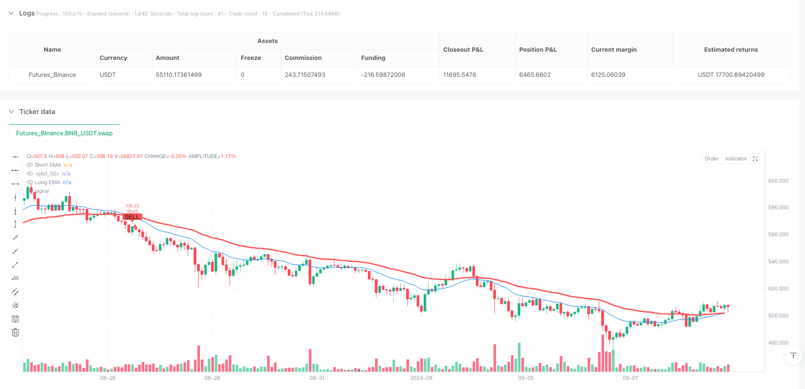
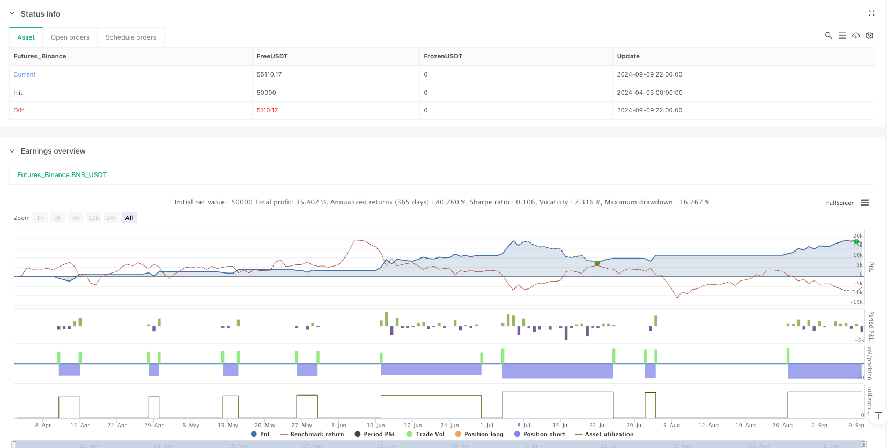

> Name

Multi-period exponential moving average cloud trend following short strategy-Multi-Timeframe-EMA-Cloud-Trend-Following-Short-Strategy
> Author

ianzeng123

> Strategy Description





[trans]

## Overview
The multi-period exponential moving average cloud trend following short selling strategy is a quantitative trading system focused on capturing downward trends. The core of this strategy is to use exponential moving averages (EMA) of different periods to build dynamic clouds to provide traders with clear shorting signals. When the short-term EMA crosses the long-term EMA downward, a bearish cloud forms and the system triggers a short signal. This strategy is particularly suitable for trend following traders, especially those who focus on downside market opportunities. The strategy has a built-in flexible multi-period analysis framework, allowing traders to confirm the trend direction on different time frames, while providing a complete risk management mechanism through percentage stop loss and take profit settings.
## Strategy Principle
The core principle of this strategy is based on the relative position of two exponential moving averages (EMA) with different periods:
1. Dual EMA cloud layer construction: The strategy uses short-period EMA (default period 21) and long-period EMA (default period 50) to create dynamic cloud layers. When the short-term EMA is below the long-term EMA, the clouds are bearish; when the short-term EMA is above the long-term EMA, the clouds are bullish.
2. Multi-period analysis: Implement cross-time period analysis through the `request.security` function, allowing traders to calculate EMA clouds on the current chart time period or other selected time periods. This provides a more comprehensive view of trends and helps filter out short-term fluctuations.
3. Short signal generation: When the short-term EMA crosses the long-term EMA downward (detected by the `ta.crossunder` function), the system identifies it as a potential trend change and triggers a short entry signal.
4. Risk management mechanism: The strategy integrates percentage-based stop loss and take profit calculations:
   - Short stop price = entry price * (1 + stop loss percentage)
   - Short take profit price = Entry price * (1 - Take profit percentage)
5. Visual assistance: The strategy draws EMA clouds on the chart and marks short signals with red labels to provide traders with an intuitive visual reference.
6. Alert function: Set short signal alert through the `alertcondition` function to ensure that traders will not miss trading opportunities.
The strategy execution process is clear: first calculate the EMA values ​​of different periods, then build dynamic clouds, detect changes in cloud status to generate short signals, and finally execute transactions and set corresponding stop loss and take profit levels.
## Strategic Advantages
1. Trend following efficiency: This strategy focuses on capturing downward trends, providing clear trend change signals through EMA crossovers, avoiding frequent trading in consolidating markets, and improving capital utilization efficiency.
2. Advantages of multi-period analysis: The strategy allows the calculation of EMA clouds on different time periods. This cross-period analysis method helps confirm the strength and persistence of the trend and reduces the risk of false signals.
3. Visual intuitiveness: EMA clouds and short signal markers provide clear visual reference, allowing traders to quickly identify market status and potential entry points, simplifying the decision-making process.
4. Perfect risk management: The built-in percentage stop loss and take profit mechanism ensures the risk consistency of each transaction and is not affected by market volatility or differences in trading varieties, which is helpful for long-term fund management.
5. Flexible and adjustable parameters: The strategy provides multiple adjustable parameters (EMA length, time period, stop loss and take profit percentage, etc.), allowing traders to optimize strategy performance based on personal risk preferences and market conditions.
6. Automated alert system: The built-in alert function ensures that traders are informed of potential trading opportunities in a timely manner, eliminating the need to continuously monitor the market and improving trading efficiency.
7. Intelligent fund management: The strategy uses the percentage of funds to calculate the position size (default_qty_type=strategy.percent_of_equity), ensuring that the position size is automatically adjusted as the account size changes to achieve compound growth.
## Strategy Risk
1. Trend reversal risk: As a trend following strategy, it may face significant retracement in a sharply reversing market. Solution: Momentum indicators or volatility filters can be introduced to reduce or avoid trading when the trend is unclear.
2. Lagging problem: EMA is essentially a lagging indicator, which may lead to unsatisfactory entry points, especially in rapidly changing markets. Solution: You can try to reduce the length of the EMA period or combine it with other leading indicators to optimize the entry timing.
3. False signal risk: Short-term market noise may cause EMA crossover false signals. Solution: Add a confirmation mechanism, such as requiring price confirmation below the EMA or adding volume conditions.
4. Risk of too narrow stop loss: Fixed percentage stop loss may not adapt to all market conditions and is easily triggered in a high-volatility environment. Solution: Consider dynamic stop loss based on ATR (average true range) to adapt to different market volatility.
5. Single Market Dependence: Focusing on short-selling strategies limits profit opportunities in rising markets. Solution: Consider developing a paired strategy or balancing long-short strategies in a combination of strategies.
6. Parameter optimization trap: Over-optimizing parameters may lead to curve fitting and reduce the performance of the strategy in the future market. Solution: Use a long enough backtest period to conduct robustness testing and step optimization.
7. Execution risk: Slippage and commissions in actual transactions may significantly affect strategy performance. Solution: Include realistic slippage and commission assumptions in your backtests to ensure the strategy still works under actual trading conditions.
## Strategy optimization direction
1. Multi-indicator fusion: Combine EMA cloud with other technical indicators, such as RSI (relative strength index) or MACD (moving average convergence divergence index) to build a more comprehensive entry confirmation system. This reduces false signals and improves strategy accuracy, since multi-indicator resonance usually represents stronger market signals.
2. Dynamic stop loss mechanism: Use ATR (average true range) to replace the fixed percentage stop loss, so that the stop loss level can be automatically adjusted according to market volatility. This method can better adapt to different market conditions and avoid being stopped prematurely during periods of high volatility.
3. Time filter: Introduce trading time filter to avoid high-volatility periods such as the release of major economic data or market opening and closing. This can reduce false signals caused by temporary abnormal market movements.
4. Trend strength assessment: Add trend strength indicators (such as ADX - Average Directional Index) to only execute trades when the trend is strong enough. This helps avoid invalid transactions in consolidating markets and improves the strategy's winning rate.
5. Partial profit locking: Implement stepped profit taking and lock in part of the profit when the price reaches certain target levels. This approach can reduce the risk of retracements while maintaining the potential to capture larger trends.
6. Fund management optimization: Implement volatility-based position sizing adjustments to reduce risk exposure when volatility increases. This approach helps maintain risk consistency and avoid over-risking during periods of high volatility.
7. Backtest robustness: Conduct cross-market and cross-period strategy testing to ensure that the strategy maintains stable performance under different conditions. This is crucial to verify the adaptability of the strategy and reduce the risk of overfitting.
## Summarize
The Multi-Period Exponential Moving Average Cloud Trend Following Short Strategy provides traders with a systematic approach to identifying and capturing downtrends. By utilizing the EMA cloud as a visual guide, combined with multi-period analysis and rigorous risk management, this strategy effectively filters out market noise and identifies meaningful trend shifts.
The strategy's main advantages are its simplicity and adaptability, providing clear short signals while remaining flexible enough to adapt to different market environments. Built-in risk management mechanisms ensure that every trade has predefined risk parameters, helping to protect your funds over the long term.
However, it is also important to be aware of the limitations inherent in such trend following strategies. By implementing recommended optimizations such as multi-indicator confirmations, dynamic stops, and trend strength filtering, traders can further enhance the robustness and performance of their strategies.
Ultimately, successfully applying this strategy requires patience and discipline, understanding the importance of market conditions, and adjusting parameters to suit different market conditions. For traders focused on capturing downside market opportunities, this strategy provides a systematic and repeatable approach to trading. ||
## Overview

The Multi-Timeframe EMA Cloud Trend-Following Short Strategy is a quantitative trading system focused on capturing downward trends. The core of this strategy lies in utilizing Exponential Moving Averages (EMAs) across different timeframes to construct a dynamic cloud, providing clear short signals to traders. When the short-term EMA crosses below the long-term EMA, forming a bearish cloud, the system triggers a short entry signal. This strategy is particularly suitable for trend-following traders, especially those focusing on bearish market opportunities. The strategy incorporates a flexible multi-timeframe analysis framework, allowing traders to confirm trend direction across different time horizons, while providing comprehensive risk management through percentage-based stop loss and take profit settings.

## Strategy Principles

The core principle of this strategy is based on the relative positioning of two Exponential Moving Averages (EMAs) of different periods:

1. Dual EMA Cloud Construction: The strategy uses a short-period EMA (default 21 periods) and a long-period EMA (default 50 periods) to create a dynamic cloud. When the short-term EMA is below the long-term EMA, the cloud indicates a bearish state; when the short-term EMA is above the long-term EMA, the cloud indicates a bullish state.

2. Multi-Timeframe Analysis: Through the `request.security` function, cross-timeframe analysis is implemented, allowing traders to calculate the EMA cloud on either the current chart timeframe or another selected timeframe. This provides a more comprehensive trend perspective, helping to filter out short-term fluctuations.

3. Short Signal Generation: When the short-term EMA crosses below the long-term EMA (detected via the `ta.crossunder` function), the system identifies a potential trend change and triggers a short entry signal.

4. Risk Management Mechanism: The strategy integrates percentage-based stop loss and take profit calculations:
   - Short stop loss price = Entry price * (1 + Stop loss percentage)
   - Short take profit price = Entry price * (1 - Take profit percentage)

5. Visual Assistance: The strategy plots the EMA cloud on the chart and marks short signals with red labels, providing traders with intuitive visual references.

6. Alert Functionality: Short signals are set up with alerts through the `alertcondition` function, ensuring traders don't miss trading opportunities.

The strategy execution flow is clear: first calculating EMAs across different timeframes, then constructing the dynamic cloud, detecting cloud state changes to generate short signals, and finally executing trades with corresponding stop loss and take profit levels.

## Strategy Advantages

1. Trend-Following Efficiency: The strategy focuses on capturing downward trends, providing clear trend reversal signals through EMA crossovers, avoiding frequent trading in ranging markets, and improving capital utilization efficiency.

2. Multi-Timeframe Analysis Benefits: The strategy allows for EMA cloud calculation across different timeframes. This cross-period analysis helps confirm trend strength and persistence, reducing false signal risk.

3. Visual Intuitiveness: The EMA cloud and short signal markers provide clear visual references, enabling traders to quickly identify market conditions and potential entry points, simplifying the decision-making process.

4. Comprehensive Risk Management: Built-in percentage-based stop loss and take profit mechanisms ensure consistency in risk per trade, unaffected by market volatility or instrument differences, aiding long-term capital management.

5. Flexible Parameters: The strategy offers multiple adjustable parameters (EMA lengths, timeframes, stop loss/take profit percentages, etc.), allowing traders to optimize strategy performance based on personal risk preferences and market conditions.

6. Automated Alert System: The built-in alert functionality ensures traders are promptly notified of potential trading opportunities without constant market monitoring, improving trading efficiency.

7. Intelligent Capital Management: The strategy uses a percentage of equity for position sizing (default_qty_type=strategy.percent_of_equity), ensuring automatic adjustment of position size as account equity changes, enabling compound growth.

## Strategy Risks

1. Trend Reversal Risk: As a trend-following strategy, it may face significant drawdowns in rapidly reversing markets. Solution: Introduce momentum indicators or volatility filters to reduce or avoid trading when trends are unclear.

2. Lag Issues: EMAs are inherently lagging indicators, potentially leading to suboptimal entry points, especially in rapidly changing markets. Solution: Try reducing EMA period lengths or combining with other leading indicators to optimize entry timing.

3. False Signal Risk: Short-term market noise can lead to false EMA crossover signals. Solution: Add confirmation mechanisms, such as requiring price confirmation below the EMA or adding volume conditions.

4. Narrow Stop Loss Risk: Fixed percentage stops may not adapt to all market conditions and can be easily triggered in high-volatility environments. Solution: Consider ATR (Average True Range) based dynamic stops to adapt to varying market volatility.

5. Single Market Dependency: Focusing exclusively on short strategies limits profit opportunities in bullish markets. Solution: Consider developing paired strategies or balancing long and short strategies in a portfolio.

6. Parameter Optimization Trap: Excessive parameter optimization may lead to curve-fitting, reducing strategy performance in future markets. Solution: Use sufficiently long backtesting periods, conduct robustness tests, and implement walk-forward optimization.

7. Execution Risk: Slippage and commissions in actual trading can significantly impact strategy performance. Solution: Include realistic slippage and commission assumptions in backtesting to ensure strategy viability under actual trading conditions.

## Strategy Optimization Directions

1. Multi-Indicator Fusion: Combine the EMA cloud with other technical indicators such as RSI (Relative Strength Index) or MACD (Moving Average Convergence Divergence) to build a more comprehensive entry confirmation system. This can reduce false signals and improve strategy precision, as multi-indicator convergence typically represents stronger market signals.

2. Dynamic Stop Loss Mechanism: Replace fixed percentage stops with ATR (Average True Range) based stops, allowing the stop level to automatically adjust according to market volatility. This approach better adapts to different market conditions, avoiding premature stops during high volatility periods.

3. Time Filters: Introduce trading time filters to avoid high volatility periods such as major economic data releases or market opening/closing times. This can reduce false signals caused by temporary market abnormalities.

4. Trend Strength Assessment: Add trend strength indicators (such as ADX - Average Directional Index), executing trades only when the trend is sufficiently strong. This helps avoid ineffective trades in ranging markets, improving the strategy's win rate.

5. Partial Profit Locking: Implement stepped take profits, locking in partial profits when price reaches certain target levels. This approach can reduce drawdown risk while maintaining the potential to capture major trends.

6. Position Sizing Optimization: Implement volatility-based position sizing, reducing exposure when volatility increases. This approach helps maintain risk consistency, avoiding excessive risk during high volatility periods.

7. Backtesting Robustness: Conduct cross-market, cross-period strategy testing to ensure strategy maintains stable performance under different conditions. This is crucial for verifying strategy adaptability and reducing overfitting risk.

## Conclusion

The Multi-Timeframe EMA Cloud Trend-Following Short Strategy provides traders with a systematic approach to identifying and capturing downward trends. By utilizing the EMA cloud as a visual guide, combined with multi-timeframe analysis and strict risk management, the strategy can effectively filter market noise and identify meaningful trend reversals.

The strategy's main advantages lie in its simplicity and adaptability, providing clear short signals while maintaining sufficient flexibility to adapt to different market environments. The built-in risk management mechanisms ensure each trade has predefined risk parameters, contributing to long-term capital preservation.

However, it's also important to be aware of the inherent limitations of such trend-following strategies. By implementing the suggested optimizations such as multi-indicator confirmation, dynamic stops, and trend strength filters, traders can further enhance the strategy's robustness and performance.

Ultimately, successful application of this strategy requires patience and discipline, understanding the importance of market context, and adjusting parameters to suit different market conditions. For traders focused on capturing bearish market opportunities, this strategy provides a systematic and repeatable trading approach.[/trans]


> Source (PineScript)

``` pinescript
/*backtest
start: 2024-04-03 00:00:00
end: 2024-09-10 00:00:00
period: 2h
basePeriod: 2h
exchanges: [{"eid":"Futures_Binance","currency":"BNB_USDT"}]
*/

//@version=6
strategy(title="Short-Only MTF EMA Cloud Strategy", overlay=true, default_qty_type=strategy.percent_of_equity, default_qty_value=100, currency=currency.USD)

// Inputs for EMA Cloud
ma_len1 = input.int(21, title="Short EMA Length", group="EMA Cloud Settings")
ma_len2 = input.int(50, title="Long EMA Length", group="EMA Cloud Settings")
res = input.timeframe("", title="EMA Cloud Resolution (Leave blank for chart timeframe)", group="EMA Cloud Settings")

// Source and Offset
src = input(close, title="Source", group="General Settings")
ma_offset = input.int(0, title="Offset", group="General Settings")

// Stop Loss and Take Profit Inputs
sl_percent = input.float(1.0, title="Stop Loss (%)", minval=0.1, step=0.1, group="Risk Management") / 100
tp_percent = input.float(2.0, title="Take Profit (%)", minval=0.1, step=0.1, group="Risk Management") / 100

// Adjust resolution dynamically if left blank
dynamic_res = (res == "") ? timeframe.period : res

// --- Calculate EMA Cloud ---
htf_ma1 = ta.ema(src, ma_len1)
htf_ma2 = ta.ema(src, ma_len2)
out1 = request.security(syminfo.tickerid, dynamic_res, htf_ma1, gaps=barmerge.gaps_off, lookahead=barmerge.lookahead_off)
out2 = request.security(syminfo.tickerid, dynamic_res, htf_ma2, gaps=barmerge.gaps_off, lookahead=barmerge.lookahead_off)
mashort = out1
malong = out2
cloudcolour = mashort >= malong ? color.new(color.green, 54) : color.new(color.yellow, 54)

// Plot EMA Cloud
plot(mashort, color=color.blue, linewidth=1, offset=ma_offset, title="Short EMA")
plot(malong, color=color.red, linewidth=3, offset=ma_offset, title="Long EMA")
fill(plot(mashort), plot(malong), color=cloudcolour, title="EMA Cloud")

// --- Strategy Logic ---
// Entry Condition: EMA cloud turns bearish
short_entry = ta.crossunder(mashort, malong)

// Calculate stop loss and take profit levels
short_stop_price = strategy.position_avg_price * (1 + sl_percent)
short_take_profit = strategy.position_avg_price * (1 - tp_percent)

// Strategy Execution
if (short_entry)
    strategy.entry("Short", strategy.short)
    strategy.exit("Take Profit/Stop Loss", from_entry="Short", stop=short_stop_price, limit=short_take_profit)

// Plot Sell Signal
plotshape(series=short_entry, title="Sell Signal", location=location.abovebar, color=color.red, style=shape.labeldown, text="SELL")

// Alerts
alertcondition(short_entry, title="Short Alert", message="Short Entry Signal")
```

> Detail

https://www.fmz.com/strategy/489289

> Last Modified

2025-04-03 10:55:11
