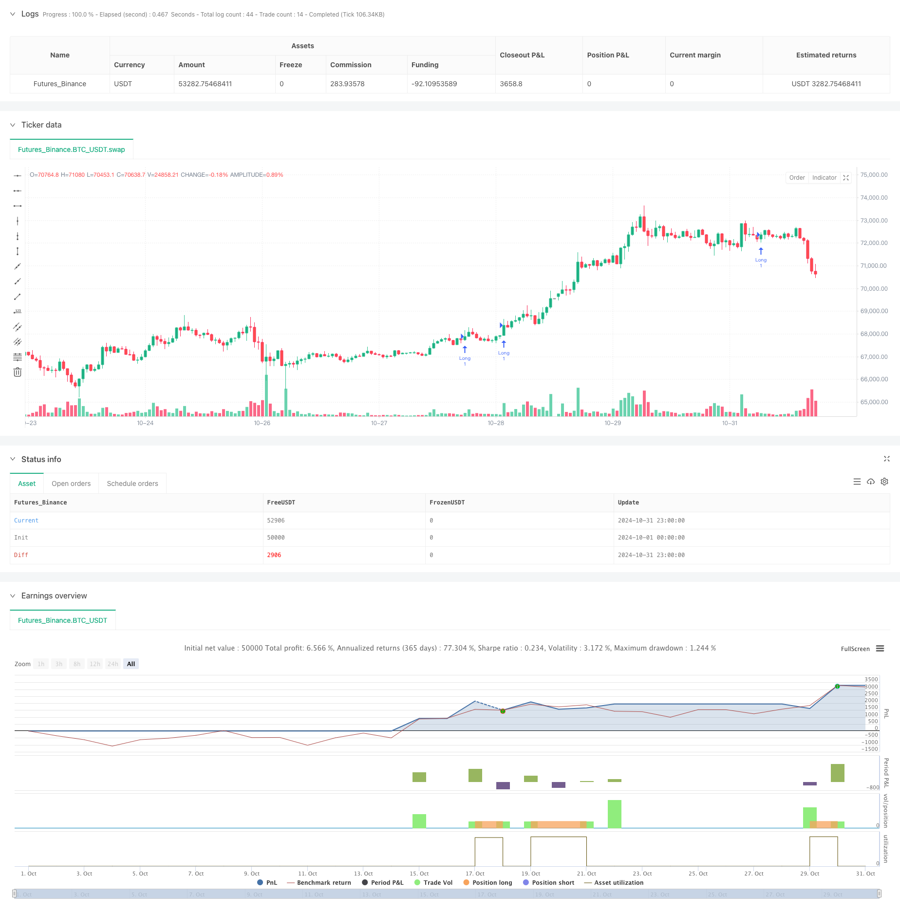

> Name

Multi-Period Moving Average Trend Momentum Tracking Trading Strategy-Multi-Timeframe-EMA-Trend-Momentum-Trading-Strategy
> Author

ChaoZhang

> Strategy Description



[trans]
#### Overview
This is a quantitative trading strategy that combines multi-period moving average trend following and momentum analysis. The strategy mainly trades by analyzing the combination of 20, 50, 100 and 200-day exponential moving averages (EMA), combined with daily and weekly momentum indicators. The strategy adopts the ATR stop-loss method, entering the market when the EMA is aligned and the momentum conditions are met, and manages risks by setting stop-loss and profit targets of ATR multiples.
#### Strategy Principle
The core logic of the strategy includes the following key parts:
1. EMA alignment system: It is required that the 20-day EMA is above the 50-day EMA, the 50-day EMA is above the 100-day EMA, and the 100-day EMA is above the 200-day EMA, forming a perfect long arrangement.
2. Momentum confirmation system: Calculate custom momentum indicators based on linear regression on daily and weekly time periods. This momentum indicator is measured by performing a linear regression on the deviation of price from the central axis of the Keltner channel.
3. Callback entry system: The price needs to fall back within the specified percentage range of the 20-day EMA before entry is allowed to avoid chasing higher.
4. Risk management system: Use multiples of ATR to set stop loss and profit targets. The default stop loss is 1.5 times ATR and the profit target is 3 times ATR.
#### Strategic Advantages
1. Multiple confirmation mechanism: Reduce false signals through multiple condition confirmations such as moving average arrangement, multi-period momentum and price correction.
2. Scientific risk management: Use ATR to dynamically adjust stop loss and profit targets to adapt to changes in market volatility.
3. Combining trend following and momentum: You can not only seize the general trend, but also grasp the better entry opportunities in the trend.
4. Highly customizable: Each parameter of the strategy can be optimized and adjusted according to different market characteristics.
5. Multi-period analysis: Improve the reliability of signals through the cooperation of daily and weekly lines.
#### Strategy Risk
1. Moving average lag: EMA as a lagging indicator may lead to late entry timing. It is recommended to combine with other leading indicators.
2. Not applicable to volatile markets: The strategy may frequently generate false signals in sideways volatile markets. It is recommended to add the market environment filter.
3. Retracement risk: Although there is an ATR stop loss, you may still face a large retracement in extreme market conditions. Consider setting a maximum drawdown limit.
4. Parameter sensitivity: The strategy effect is more sensitive to parameter settings. Adequate parameter optimization testing is recommended.
#### Strategy optimization direction
1. Market environment identification: Add volatility indicators or trend strength indicators, and use different parameter combinations in different market environments.
2. Entry optimization: You can add oscillators such as RSI to find more accurate entry points in the callback area.
3. Dynamic parameter adjustment: Automatically adjust ATR multiples and callback ranges based on market volatility.
4. Add trading volume analysis: Confirm trend strength through trading volume and improve signal reliability.
5. Introduce machine learning: Use machine learning algorithms to dynamically optimize parameters and improve strategy adaptability.
#### Summary
This is a well-designed and logical trend following strategy. Through the combined use of multiple technical indicators, it not only ensures the robustness of the strategy, but also provides a good risk management mechanism. The strategy is highly customizable and can be optimized according to different market characteristics. Although there are some inherent risks, the performance of the strategy can be further improved through the suggested optimization directions. Overall, this is a quantitative trading strategy worth trying and studying in depth.
|| 

#### Overview
This is a quantitative trading strategy that combines multi-timeframe EMA trend following with momentum analysis. The strategy primarily analyzes the alignment of 20, 50, 100, and 200-day exponential moving averages (EMA) combined with momentum indicators on both daily and weekly timeframes. It employs ATR-based stop losses and enters trades when EMAs are aligned and momentum conditions are met, managing risk through ATR-multiple stop-loss and profit targets.

#### Strategy Principles
The core logic includes several key components:
1. EMA Alignment System: Requires 20-day EMA above 50-day EMA, which is above 100-day EMA, which is above 200-day EMA, forming a perfect bullish alignment.
2. Momentum Confirmation System: Calculates custom momentum indicators based on linear regression on both daily and weekly timeframes. This momentum is measured through linear regression of price deviation from the Keltner Channel midline.
3. Pullback Entry System: Price must pull back within a specified percentage range of the 20-day EMA for entry, avoiding chase-buying.
4. Risk Management System: Uses ATR multiples to set stop-loss and profit targets, defaulting to 1.5x ATR for stop-loss and 3x ATR for profit target.

#### Strategy Advantages
1. Multiple Confirmation Mechanism: Reduces false signals through multiple conditions including EMA alignment, multi-timeframe momentum, and price pullback.
2. Scientific Risk Management: Uses ATR to dynamically adjust stop-loss and profit targets, adapting to market volatility changes.
3. Trend Following with Momentum: Captures major trends while optimizing entry timing within trends.
4. High Customizability: All strategy parameters can be optimized for different market characteristics.
5. Multi-timeframe Analysis: Improves signal reliability through daily and weekly timeframe coordination.

#### Strategy Risks
1. EMA Lag: EMAs as lagging indicators may result in delayed entries. Consider incorporating leading indicators.
2. Poor Performance in Ranging Markets: Strategy may generate frequent false signals in sideways markets. Consider adding market environment filters.
3. Drawdown Risk: Despite ATR stops, significant drawdowns possible in extreme conditions. Consider implementing maximum drawdown limits.
4. Parameter Sensitivity: Strategy performance is sensitive to parameter settings. Thorough parameter optimization testing recommended.

#### Optimization Directions
1. Market Environment Recognition: Add volatility or trend strength indicators to use different parameter sets in different market conditions.
2. Entry Optimization: Add oscillators like RSI for more precise entry points within pullback zones.
3. Dynamic Parameter Adjustment: Automatically adjust ATR multiples and pullback ranges based on market volatility.
4. Volume Analysis Integration: Confirm trend strength through volume analysis to improve signal reliability.
5. Machine Learning Implementation: Use machine learning algorithms to dynamically optimize parameters and improve strategy adaptability.

#### Summary
This is a well-designed, logically rigorous trend-following strategy. Through the combination of multiple technical indicators, it ensures both strategy robustness and effective risk management. The strategy's high customizability allows optimization for different market characteristics. While inherent risks exist, the suggested optimization directions can further enhance strategy performance. Overall, this is a quantitative trading strategy worth experimenting with and studying in depth.
[/trans]


> Source (PineScript)

``` pinescript
/*backtest
start: 2024-10-01 00:00:00
end: 2024-10-31 23:59:59
period: 1h
basePeriod: 1h
exchanges: [{"eid":"Futures_Binance","currency":"BTC_USDT"}]
*/

//@version=5
strategy("Swing Trading with EMA Alignment and Custom Momentum", overlay=true)

// User inputs for customization
atrLength = input.int(14, title="ATR Length", minval=1)
atrMultiplierSL = input.float(1.5, title="Stop-Loss Multiplier (ATR)", minval=0.1)   // Stop-loss at 1.5x ATR
atrMultiplierTP = input.float(3.0, title="Take-Profit Multiplier (ATR)", minval=0.1)   // Take-profit at 3x ATR
pullbackRangePercent = input.float(1.0, title="Pullback Range (%)", minval=0.1) // 1% range for pullback around 20 EMA
lengthKC = input.int(20, title="Length for Keltner Channels (Momentum Calculation)", minval=1)

// EMA settings
ema20 = ta.ema(close, 20)
ema50 = ta.ema(close, 50)
ema100 = ta.ema(close, 100)
ema200 = ta.ema(close, 200)

// ATR calculation
atrValue = ta.atr(atrLength)

// Custom Momentum Calculation based on Linear Regression for Daily Timeframe
highestHighKC = ta.highest(high, lengthKC)
lowestLowKC = ta.lowest(low, lengthKC)
smaCloseKC = ta.sma(close, lengthKC)

// Manually calculate the average of highest high and lowest low
averageKC = (highestHighKC + lowestLowKC) / 2

// Calculate daily momentum using linear regression
dailyMomentum = ta.linreg(close - (averageKC + smaCloseKC) / 2, lengthKC, 0) // Custom daily momentum calculation

// Fetch weekly data for momentum calculation using request.security()
[weeklyHigh, weeklyLow, weeklyClose] = request.security(syminfo.tickerid, "W", [high, low, close])

// Calculate weekly momentum using linear regression on weekly timeframe
weeklyHighestHighKC = ta.highest(weeklyHigh, lengthKC)
weeklyLowestLowKC = ta.lowest(weeklyLow, lengthKC)
weeklySmaCloseKC = ta.sma(weeklyClose, lengthKC)
weeklyAverageKC = (weeklyHighestHighKC + weeklyLowestLowKC) / 2

weeklyMomentum = ta.linreg(weeklyClose - (weeklyAverageKC + weeklySmaCloseKC) / 2, lengthKC, 0) // Custom weekly momentum calculation

// EMA alignment condition (20 EMA > 50 EMA > 100 EMA > 200 EMA)
emaAligned = ema20 > ema50 and ema50 > ema100 and ema100 > ema200

// Momentum increasing condition (daily and weekly momentum is positive and increasing)
dailyMomentumIncreasing = dailyMomentum > 0 and dailyMomentum > dailyMomentum[1] //and dailyMomentum[1] > dailyMomentum[2]
weeklyMomentumIncreasing = weeklyMomentum > 0 and weeklyMomentum > weeklyMomentum[1] //and weeklyMomentum[1] > weeklyMomentum[2]

// Redefine Pullback condition: price within 1% range of the 20 EMA
upperPullbackRange = ema20 * (1 + pullbackRangePercent / 100)
lowerPullbackRange = ema20 * (1 - pullbackRangePercent / 100)
pullbackToEma20 = (close <= upperPullbackRange) and (close >= lowerPullbackRange)

// Entry condition: EMA alignment and momentum increasing on both daily and weekly timeframes
longCondition = emaAligned and dailyMomentumIncreasing and weeklyMomentumIncreasing and pullbackToEma20

// Initialize stop loss and take profit levels as float variables
var float longStopLevel = na
var float longTakeProfitLevel = na

// Calculate stop loss and take profit levels based on ATR
if (longCondition)
    longStopLevel := close - (atrMultiplierSL * atrValue)  // Stop loss at 1.5x ATR below the entry price
    longTakeProfitLevel := close + (atrMultiplierTP * atrValue) // Take profit at 3x ATR above the entry price

// Strategy execution
if (longCondition)
    strategy.entry("Long", strategy.long)

// Exit conditions: Stop-loss at 1.5x ATR and take-profit at 3x ATR
if (strategy.position_size > 0)
    strategy.exit("Take Profit/Stop Loss", "Long", stop=longStopLevel, limit=longTakeProfitLevel)

```

> Detail

https://www.fmz.com/strategy/471719

> Last Modified

2024-11-12 16:35:41
