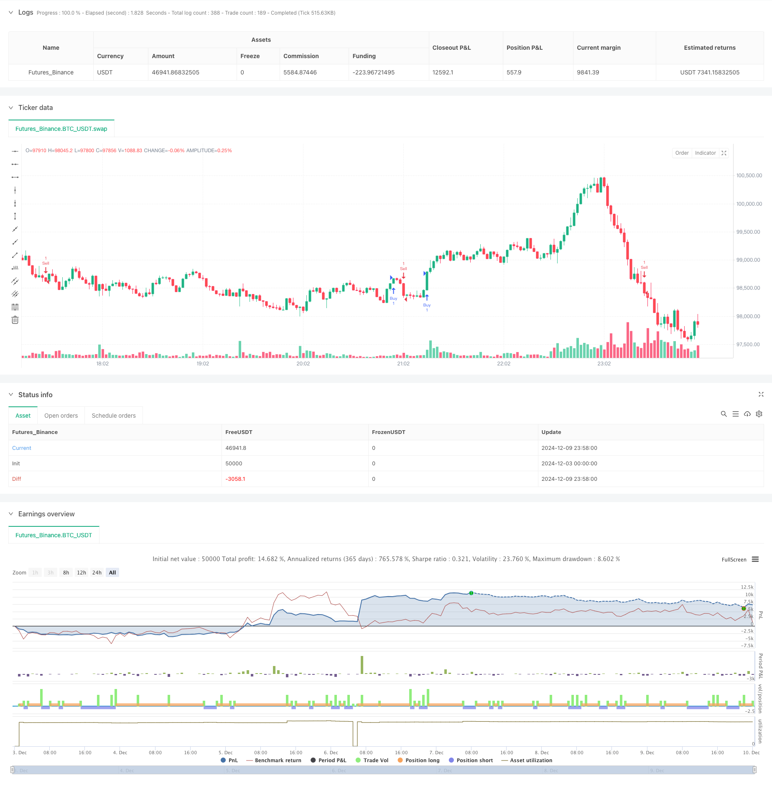

> Name

Multi-Timeframe-Fibonacci-Retracement-with-Trend-Breakout-Trading-Strategy
> Author

ChaoZhang

> Strategy Description



[trans]
#### Overview
This strategy is a trend trading system based on Fibonacci retracement levels and K-line patterns. It operates on multiple timeframes and combines technical analysis and risk management principles. The strategy focuses on finding potential trading opportunities by identifying key Fibonacci retracement levels (0.618 and 0.786), while utilizing stop-loss and take-profit targets to manage risk.
#### Strategy Principle
The core logic of the strategy is based on the following key elements:
1. Time period selection: The strategy allows operation on multiple time periods such as 4 hours, daily, weekly and monthly to adapt to different trading styles.
2. Fibonacci level calculation: Use the highest and lowest prices of 50 periods to calculate the two key retracement levels of 0.618 and 0.786.
3. Entry signal generation: When the closing price breaks through the Fibonacci level under certain conditions, the system will generate a long or short signal. A long signal requires the closing price to be higher than the opening price and above the 0.618 level; a short signal requires a closing price below the opening price and below the 0.786 level.
4. Risk management: The strategy adopts a fixed percentage stop loss and determines the profit target through a preset risk-return ratio.
#### Strategic Advantages
1. Multi-period adaptability: By running on different time periods, the strategy can adapt to different market environments and trading styles.
2. Systematic risk management: Ensure that each transaction has clear risk control through preset stop loss and profit targets.
3. Technical indicator integration: combines Fibonacci retracement and K-line pattern analysis to provide more reliable trading signals.
4. Highly customizable: Key parameters such as Fibonacci levels, risk-reward ratio and stop-loss percentage can be adjusted according to personal preferences.
#### Strategy Risk
1. Market fluctuation risk: During periods of high volatility, the price may quickly break through the stop loss level, resulting in losses.
2. False breakthrough risk: The market may have false Fibonacci level breakthrough signals.
3. Parameter optimization risk: Over-optimizing parameters may lead to poor performance of the strategy in real trading.
4. Liquidity risk: Under certain time periods or market conditions, you may face insufficient liquidity.
#### Strategy optimization direction
1. Add market trend filter: Moving averages or other trend indicators can be added to filter counter-trend signals.
2. Optimize entry timing: Consider adding volume confirmation or momentum indicators to improve the accuracy of entry.
3. Dynamic stop loss management: Implement dynamic stop loss based on volatility to adapt to different market conditions.
4. Add time filtering: Add trading time window restrictions to avoid trading during unfavorable market periods.
5. Multi-dimensional signal confirmation: Integrate other technical indicators to provide additional signal confirmation.
#### Summary
This is a well-structured trend following strategy that provides traders with a systematic approach to trading by combining Fibonacci retracements, K-line patterns and risk management principles. Although there are certain risks, the stability and reliability of the strategy can be further improved through the suggested optimization directions. The multi-period nature and customizable parameters of the strategy make it suitable for use by different types of traders. ||
#### Overview
This strategy is a trend trading system based on Fibonacci retracement levels and candlestick patterns. It operates across multiple timeframes, combining technical analysis and risk management principles. The strategy primarily seeks trading opportunities by identifying key Fibonacci retracement levels (0.618 and 0.786) while utilizing stop-loss and profit targets for risk management.

#### Strategy Principles
The core logic of the strategy is based on several key elements:
1. Timeframe Selection: The strategy can operate on multiple timeframes including 4-hour, daily, weekly, and monthly to accommodate different trading styles.
2. Fibonacci Level Calculation: Uses 50-period high and low prices to calculate two key retracement levels at 0.618 and 0.786.
3. Entry Signal Generation: The system generates long or short signals when the closing price breaks through Fibonacci levels under specific conditions. Long signals require the closing price to be above the opening price and above the 0.618 level; short signals require the closing price to be below the opening price and below the 0.786 level.
4. Risk Management: The strategy employs fixed percentage stop-losses and determines profit targets through preset risk-reward ratios.

#### Strategy Advantages
1. Multi-timeframe Adaptability: By operating across different timeframes, the strategy can adapt to various market environments and trading styles.
2. Systematic Risk Management: Clear risk control through preset stop-loss and profit targets for each trade.
3. Technical Indicator Integration: Combines Fibonacci retracement with candlestick pattern analysis for more reliable trading signals.
4. High Customizability: Key parameters such as Fibonacci levels, risk-reward ratio, and stop-loss percentage can be adjusted according to personal preferences.

#### Strategy Risks
1. Market Volatility Risk: During high volatility periods, prices may quickly break through stop-loss levels causing losses.
2. False Breakout Risk: The market may generate false breakout signals at Fibonacci levels.
3. Parameter Optimization Risk: Over-optimization of parameters may lead to poor strategy performance in live trading.
4. Liquidity Risk: May face insufficient liquidity under certain timeframes or market conditions.

#### Strategy Optimization Directions
1. Add Market Trend Filter: Can add moving averages or other trend indicators to filter counter-trend signals.
2. Optimize Entry Timing: Consider adding volume confirmation or momentum indicators to improve entry accuracy.
3. Dynamic Stop-Loss Management: Implement volatility-based dynamic stop-losses to adapt to different market conditions.
4. Add Time Filtering: Incorporate trading time window restrictions to avoid unfavorable market periods.
5. Multi-dimensional Signal Confirmation: Integrate other technical indicators for additional signal confirmation.

#### Summary
This is a well-structured trend-following strategy that provides traders with a systematic trading approach by combining Fibonacci retracement, candlestick patterns, and risk management principles. While certain risks exist, the strategy's stability and reliability can be further enhanced through the suggested optimization directions. The strategy's multi-timeframe nature and customizable parameters make it suitable for different types of traders.[/trans]


> Source (PineScript)

``` pinescript
/*backtest
start: 2024-12-03 00:00:00
end: 2024-12-10 00:00:00
period: 2m
basePeriod: 2m
exchanges: [{"eid":"Futures_Binance","currency":"BTC_USDT"}]
*/

// This Pine Script™ code is subject to the terms of the Mozilla Public License 2.0 at https://mozilla.org/MPL/2.0/
// © jontucklogic7467

//@version=5
strategy("Fibonacci Swing Trading Bot", overlay=true)

// Input parameters
fiboLevel1 = input.float(0.618, title="Fibonacci Retracement Level 1")
fiboLevel2 = input.float(0.786, title="Fibonacci Retracement Level 2")
riskRewardRatio = input.float(2.0, title="Risk/Reward Ratio")
stopLossPerc = input.float(1.0, title="Stop Loss Percentage") / 100

// Timeframe selection
useTimeframe = input.timeframe("240", title="Timeframe for Analysis", options=["240", "D", "W", "M"])

// Request data from selected timeframe
highTF = request.security(syminfo.tickerid, useTimeframe, high)
lowTF = request.security(syminfo.tickerid, useTimeframe, low)

// Swing high and low calculation over the last 50 bars in the selected timeframe
highestHigh = ta.highest(highTF, 50)
lowestLow = ta.lowest(lowTF, 50)

// Fibonacci retracement levels
fib618 = highestHigh - (highestHigh - lowestLow) * fiboLevel1
fib786 = highestHigh - (highestHigh - lowestLow) * fiboLevel2

// Plot Fibonacci levels
// line.new(bar_index[1], fib618, bar_index, fib618, color=color.red, width=2, style=line.style_dashed)
// line.new(bar_index[1], fib786, bar_index, fib786, color=color.orange, width=2, style=line.style_dashed)

// Entry signals based on candlestick patterns and Fibonacci levels
bullishCandle = close > open and close > fib618 and close < highestHigh
bearishCandle = close < open and close < fib786 and close > lowestLow

// Stop loss and take profit calculation
stopLoss = bullishCandle ? close * (1 - stopLossPerc) : close * (1 + stopLossPerc)
takeProfit = bullishCandle ? close + (close - stopLoss) * riskRewardRatio : close - (stopLoss - close) * riskRewardRatio

// Plot buy and sell signals
if bullishCandle
    strategy.entry("Buy", strategy.long)
    strategy.exit("Take Profit", "Buy", limit=takeProfit, stop=stopLoss)

if bearishCandle
    strategy.entry("Sell", strategy.short)
    strategy.exit("Take Profit", "Sell", limit=takeProfit, stop=stopLoss)

```

> Detail

https://www.fmz.com/strategy/474708

> Last Modified

2024-12-11 17:32:25
