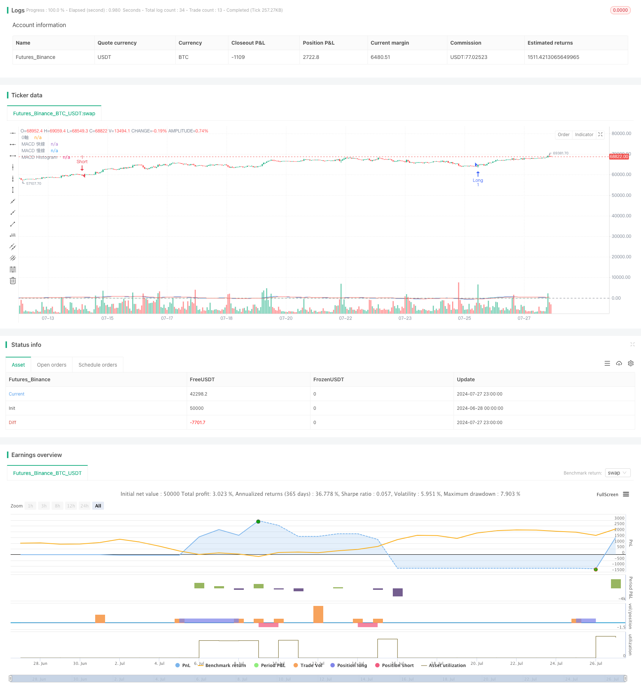

> Name

Multi-Timeframe-Market-Momentum-Crossover-Strategy
> Author

ChaoZhang

> Strategy Description



[trans]
#### Overview
This strategy is a long-short trading system based on the MACD indicator, specially designed for the 15-minute K-line chart. It uses the intersection of the MACD line and the signal line to generate trading signals and limits trading time to specific market opening hours. This strategy uses a fixed proportion risk management method to dynamically adjust the risk exposure of each transaction based on account size.
#### Strategy Principle
1. MACD indicator calculation: Use the standard MACD settings of 12-period fast line, 26-period slow line and 9-period signal line.
2. Trading signal generation:
   - Short signal: When the MACD line crosses the signal line from below and the MACD line is above the 0 axis.
   - Long signal: When the MACD line crosses the signal line from above and the MACD line is below the 0 axis.
3. Trading time restrictions: Transactions can only be executed during the opening hours of the London market (08:00-17:00 GMT) and the New York market (13:30-20:00 GMT).
4. Risk Management:
   - Using fixed proportion risk management, the risk of each transaction is 1% of the total account value.
   - Stop loss is set to 10 pips and take profit is set to 15 pips.
   - Dynamically calculate the number of contracts per trade based on the current account size.
5. Trade execution: Use market orders to enter the market, and set stop loss and take profit orders at the same time.
#### Strategic Advantages
1. Market momentum capture: The MACD indicator effectively captures market momentum changes and helps identify potential trend reversal points.
2. Risk control: The fixed proportion risk management method ensures that the risk of each transaction matches the account size, which is conducive to long-term capital growth.
3. Time filtering: Limiting trading time can avoid false signals during low liquidity periods and improve transaction quality.
4. Adaptability: The strategy can automatically adjust the transaction size according to the account size and is suitable for traders with different amounts of funds.
5. Clear entry and exit rules: Clear signal generation logic and fixed stop loss and profit settings reduce the need for human intervention.
#### Strategy Risk
1. Risk of volatile markets: In a volatile market, MACD may produce frequent cross signals, leading to excessive trading and continuous losses.
2. Slippage risk: Using market orders to enter the market may face slippage, especially in fast markets.
3. Fixed stop loss risk: Fixed stop loss may not be flexible enough in periods of high volatility, resulting in premature stop loss.
4. Missing the big market: Strict profit-taking settings may lead to missing most of the profits from major trending market.
5. Time window restrictions: Trading only during specific time periods may miss potential opportunities in other periods.
#### Strategy optimization direction
1. Multi-period confirmation: Introduce trend confirmation with longer time periods (such as 1 hour or 4 hours) to improve the reliability of trading signals.
2. Dynamic stop loss: Consider using the ATR (Average True Range) indicator to set a dynamic stop loss to adapt to changes in market volatility.
3. Introduce other technical indicators: such as RSI (relative strength index) or moving average, as a filter for MACD signals to reduce false signals.
4. Optimize the trading time window: Find the best trading time period through backtest analysis, which may require seasonal adjustments based on different market conditions.
5. Improve the take-profit strategy: Implement a trailing take-profit or partial profit protection mechanism to lock in part of the profit while capturing the general trend.
6. Volatility adjustment: Dynamically adjust transaction size and stop loss levels based on market volatility to reduce risk exposure during periods of high volatility.
7. Add fundamental filtering: consider the impact of the release of important economic data on the market, and suspend trading before and after the release of key data.
#### Summarize
The multi-period market momentum crossover strategy is an adaptive trading system based on the MACD indicator that improves trading quality by limiting trading time and strict risk management. The main advantages of this strategy are its clear signal generation logic and dynamic risk management approach, making it suitable for trading accounts of different sizes. However, the strategy also faces risks such as excessive trading in volatile markets and missing major trends.
By introducing multi-period confirmations, dynamic stops and additional technical indicators, the strategy has the potential to further improve its performance and stability. In particular, adding volatility adjustments and improved take-profit strategies can help the strategy better adapt to different market conditions. At the same time, considering fundamental factors can increase the comprehensiveness of the strategy.
Overall, this strategy provides traders with a robust framework from which to individually adjust and optimize to meet specific risk appetite and trading objectives. Continuous backtesting and live validation will be key to ensuring the long-term effectiveness of the strategy.
|| 

#### Overview

This strategy is a long-short trading system based on the MACD indicator, specifically designed for 15-minute charts. It generates trading signals using MACD line and signal line crossovers, restricting trading to specific market open hours. The strategy employs a fixed proportion risk management method, dynamically adjusting the risk exposure for each trade based on account size.

#### Strategy Principles

1. MACD Indicator Calculation: Uses standard MACD settings with 12-period fast line, 26-period slow line, and 9-period signal line.

2. Trade Signal Generation:
   - Short Signal: When the MACD line crosses above the signal line and the MACD line is above the zero line.
   - Long Signal: When the MACD line crosses below the signal line and the MACD line is below the zero line.

3. Trading Time Restriction: Executes trades only during London market (08:00-17:00 GMT) and New York market (13:30-20:00 GMT) open hours.

4. Risk Management:
   - Uses fixed proportion risk management, risking 1% of the total account value per trade.
   - Sets stop loss at 10 points and take profit at 15 points.
   - Dynamically calculates the number of contracts for each trade based on current account size.

5. Trade Execution: Enters trades with market orders, simultaneously setting stop loss and take profit orders.

#### Strategy Advantages

1. Market Momentum Capture: MACD indicator effectively captures market momentum changes, helping identify potential trend reversal points.

2. Risk Control: Fixed proportion risk management ensures that each trade's risk matches the account size, promoting long-term capital growth.

3. Time Filtering: Restricting trading hours helps avoid false signals during low liquidity periods, improving trade quality.

4. Adaptability: The strategy automatically adjusts trade size based on account size, suitable for traders with different capital amounts.

5. Clear Entry and Exit Rules: Clear signal generation logic and fixed stop loss and take profit settings reduce the need for manual intervention.

#### Strategy Risks

1. Sideways Market Risk: In range-bound markets, MACD may generate frequent crossover signals, leading to overtrading and consecutive losses.

2. Slippage Risk: Using market orders for entry may face slippage, especially in fast-moving markets.

3. Fixed Stop Loss Risk: Fixed point stop losses may not be flexible enough during high volatility periods, potentially leading to premature stopouts.

4. Missing Big Moves: Strict take profit settings may cause the strategy to miss out on the majority of profits from significant trend moves.

5. Time Window Limitation: Trading only during specific time periods may miss potential opportunities in other sessions.

#### Strategy Optimization Directions

1. Multi-Timeframe Confirmation: Introduce trend confirmation from longer timeframes (e.g., 1-hour or 4-hour) to improve trade signal reliability.

2. Dynamic Stop Loss: Consider using the ATR (Average True Range) indicator to set dynamic stop losses, adapting to changes in market volatility.

3. Incorporate Additional Technical Indicators: Such as RSI (Relative Strength Index) or moving averages as filters for MACD signals to reduce false signals.

4. Optimize Trading Time Windows: Through backtesting analysis, identify optimal trading periods, potentially adjusting seasonally based on different market conditions.

5. Improve Take Profit Strategy: Implement trailing stops or partial profit protection mechanisms to capture larger trends while securing partial profits.

6. Volatility Adjustment: Dynamically adjust trade size and stop loss levels based on market volatility, reducing risk exposure during high volatility periods.

7. Add Fundamental Filters: Consider the impact of important economic data releases on the market, pausing trading before and after key data announcements.

#### Conclusion

The Multi-Timeframe Market Momentum Crossover Strategy is an adaptive trading system based on the MACD indicator, enhancing trade quality through time-restricted trading and strict risk management. The strategy's main advantages lie in its clear signal generation logic and dynamic risk management method, making it suitable for trading accounts of various sizes. However, the strategy also faces risks such as overtrading in sideways markets and missing out on big trends.

By introducing multi-timeframe confirmation, dynamic stop losses, and additional technical indicators, the strategy has the potential to further improve its performance and stability. Particularly, adding volatility adjustments and improved take profit strategies can help the strategy better adapt to different market conditions. Additionally, considering fundamental factors can increase the strategy's comprehensiveness.

Overall, this strategy provides traders with a robust framework that can be personalized and optimized to meet specific risk preferences and trading objectives. Continuous backtesting and live trading validation will be key to ensuring the strategy's long-term effectiveness.

[/trans]


> Source (PineScript)

``` pinescript
/*backtest
start: 2024-06-28 00:00:00
end: 2024-07-28 00:00:00
period: 1h
basePeriod: 15m
exchanges: [{"eid":"Futures_Binance","currency":"BTC_USDT"}]
*/

//@version=5
strategy("交易霸傑15掏金策略", overlay=true)

// 設置參數
fastLength = input.int(12, title="MACD 快線長度")
slowLength = input.int(26, title="MACD 慢線長度")
signalSmoothing = input.int(9, title="MACD 信號線平滑")
riskPercentage = input.float(2, title="每筆交易的風險比例 (%)")
stopLossPoints = 10
takeProfitPoints = 15

// 設置倫敦和紐約市場的開盤時間
londonOpen = timestamp("GMT+0", year, month, dayofmonth, 8, 0)
londonClose = timestamp("GMT+0", year, month, dayofmonth, 17, 0)
nyOpen = timestamp("GMT+0", year, month, dayofmonth, 13, 30)
nyClose = timestamp("GMT+0", year, month, dayofmonth, 20, 0)

// 計算MACD
[macdLine, signalLine, _] = ta.macd(close, fastLength, slowLength, signalSmoothing)
macdHist = macdLine - signalLine

// 畫出MACD線
hline(0, "0軸", color=color.gray)
plot(macdLine, color=color.blue, title="MACD 快線")
plot(signalLine, color=color.red, title="MACD 慢線")
plot(macdHist, color=color.green, style=plot.style_histogram, title="MACD Histogram")

// 動態計算每筆交易的風險和止損、止盈點數
capital = strategy.equity
riskAmount = capital * (riskPercentage / 100)
contracts = 1
stopLossValue = stopLossPoints * syminfo.mintick
takeProfitValue = takeProfitPoints * syminfo.mintick

// 確定是否在交易時段內
isLondonOpen = (time >= londonOpen and time <= londonClose)
isNyOpen = (time >= nyOpen and time <= nyClose)

// 偏空進場條件
shortCondition = ta.crossover(signalLine, macdLine) and macdLine > 0 and (isLondonOpen or isNyOpen)
if (shortCondition)
    strategy.entry("Short", strategy.short, qty=contracts)
    strategy.exit("Take Profit/Stop Loss", "Short", limit=close - takeProfitValue, stop=close + stopLossValue)

// 偏多進場條件
longCondition = ta.crossunder(signalLine, macdLine) and macdLine < 0 and (isLondonOpen or isNyOpen)
if (longCondition)
    strategy.entry("Long", strategy.long, qty=contracts)
    strategy.exit("Take Profit/Stop Loss", "Long", limit=close + takeProfitValue, stop=close - stopLossValue)


```

> Detail

https://www.fmz.com/strategy/458076

> Last Modified

2024-07-29 17:10:05
