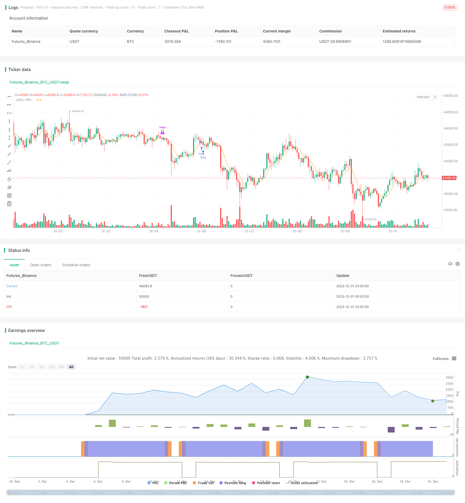

> Name

Multi-Timeframe-Moving-Average-Combined-with-Trading-Hours-Quantitative-Trading-Strategy
> Author

ChaoZhang

> Strategy Description


[trans]

## Overview
This strategy uses a variety of moving average indicators and selects the timing of entry and exit based on trading time to achieve quantitative trading.
## Strategy Principle
This strategy uses 9 moving averages including SMA, EMA, WMA, etc. According to the user's choice, when entering a long position, the closing price crosses the selected moving average and the closing price of the previous K line is below the moving average; when going short, the closing price crosses the selected moving average and the closing price of the previous K line is above the moving average. All trades are issued only when the market opens on Monday. The conditions for closing the position are fixed stop-profit and stop-loss or closing the position before the close on Sunday.
## Advantage Analysis
This strategy combines the essence of multiple moving averages, and users can choose different parameters to adapt to different market environments. Only enter the market when the trend is confirmed to avoid the occurrence of "% invalid transactions". At the same time, this strategy only opens positions on Mondays, and stops profits and losses or closes positions before Sunday, which limits the maximum number of positions opened in a single week and effectively controls transaction risks.
## Risk Analysis
This strategy mainly relies on moving average indicators to judge the trend. When the trend turns, there is a risk that some transactions will be trapped. In addition, positions can only be opened on Mondays. If a better trading opportunity occurs after Monday, you will not be able to enter, and you may miss some profits.
In order to control these risks, it is recommended to use dynamic moving average parameters. When the market enters shock, shorten the parameters appropriately; at the same time, the opening time can also be increased, and new positions are still allowed to be opened on Wednesday or Thursday.
## Optimization direction
This strategy can be optimized from the following aspects:
1. Add the take-profit and stop-loss Algerism algorithm and dynamically adjust the take-profit and stop-loss points;
2. Add machine learning models to determine trend years and avoid entering the market in volatile markets;
3. Optimize the logic of opening and closing positions, allowing more opening opportunities to appear.
## Summarize
This strategy integrates a variety of moving average indicators to determine the trend direction, and effectively controls the maximum number of transactions in a single week by opening positions on Monday and closing positions on Sunday. At the same time, strict stop-profit and stop-loss rules also limit the maximum loss in a single transaction. Taken together, this strategy is optimized and designed from the two dimensions of trend judgment and risk control, and is a relatively robust quantitative trading strategy.
||

## Overview

This strategy utilizes multiple moving average indicators and combines entry and exit timing based on trading hours to implement quantitative trading.  

## Strategy Logic

This strategy incorporates 9 types of moving averages including SMA, EMA, WMA etc. For long entry, the close price crosses above the selected moving average while the previous close was below the moving average. For short entry, the close price crosses below the moving average while the previous close was above. All trades are entered on Monday open only. Exit rules are either fixed take profit/stop loss or close all positions before Sunday close.

## Advantage Analysis  

This strategy combines the essence of multiple moving averages and users can pick different parameters based on varying market conditions. It only enters when a trend is confirmed, avoiding whipsaws. Also, it limits entries to Monday only and exits on Sunday close with stop loss/take profit, capping maximum trades per week and controlling trading risk.

## Risk Analysis

The strategy relies mainly on moving averages to determine trend, thus faces the risk of being caught in reversals. Also, limiting entries to Monday only means missed profitable opportunities if a good setup appears later in the week. 

To address these risks, dynamic average parameters could be used to shorten length during ranging periods. Also additional entry days could be allowed, like on Wednesday or Thursday.

## Optimization Directions

The strategy can be improved in the following ways:

1. Add adaptive stop loss/take profit algorithms to dynamically adjust levels.

2. Incorporate machine learning models to better gauge trend in choppy markets.  

3. Refine entry and exit logic to capture more trading opportunities.

## Summary  

This strategy combines multiple moving average indicators to determine trend direction and caps maximum weekly trades with Monday entry and Sunday exit rules. Strict stop loss/take profit further limits maximum loss per trade. In summary, it provides robust enhancements in both trend determination and risk control dimensions for quantitative trading.
[/trans]

> Strategy Arguments


|Argument|Default|Description|
|----|----|----|
|v_input_bool_1|true|(?Type of Entries)longEntry|
|v_input_bool_2|false|shortEntry|
|v_input_source_1_close|0|(?Parameters)Source: close|high|low|open|hl2|hlc3|hlcc4|ohlc4|
|v_input_int_1|17|Moving Averages|
|v_input_string_1|0|MA Type: ALMA|EMA|WMA|SMA|SMMA|LSMA|VWMA|DEMA|HULL|KAMA|FRAMA|VIDYA|JMA|TEMA|ZLEMA|T3|TRIM|
|v_input_float_1|10|(?Fixed Risk Management)LONG Stop Loss % |
|v_input_float_2|30|LONG Take Profit %|
|v_input_float_3|5|SHORT Stop Loss % |
|v_input_float_4|10|SHORT Take Profit %|


> Source (PineScript)

``` pinescript
/*backtest
start: 2023-12-01 00:00:00
end: 2023-12-31 23:59:59
period: 1h
basePeriod: 15m
exchanges: [{"eid":"Futures_Binance","currency":"BTC_USDT"}]
*/

// This source code is subject to the terms of the Mozilla Public License 2.0 at https://mozilla.org/MPL/2.0/
// © exlux99

//@version=5
strategy('Time MA strategy ', overlay=true)

longEntry = input.bool(true, group="Type of Entries")
shortEntry = input.bool(false, group="Type of Entries")


//==========DEMA
getDEMA(src, len) =>
    dema = 2 * ta.ema(src, len) - ta.ema(ta.ema(src, len), len)
    dema
//==========HMA
getHULLMA(src, len) =>
    hullma = ta.wma(2 * ta.wma(src, len / 2) - ta.wma(src, len), math.round(math.sqrt(len)))
    hullma
//==========KAMA
getKAMA(src, len, k1, k2) =>
    change = math.abs(ta.change(src, len))
    volatility = math.sum(math.abs(ta.change(src)), len)
    efficiency_ratio = volatility != 0 ? change / volatility : 0
    kama = 0.0
    fast = 2 / (k1 + 1)
    slow = 2 / (k2 + 1)
    smooth_const = math.pow(efficiency_ratio * (fast - slow) + slow, 2)
    kama := nz(kama[1]) + smooth_const * (src - nz(kama[1]))
    kama
//==========TEMA
getTEMA(src, len) =>
    e = ta.ema(src, len)
    tema = 3 * (e - ta.ema(e, len)) + ta.ema(ta.ema(e, len), len)
    tema
//==========ZLEMA
getZLEMA(src, len) =>
    zlemalag_1 = (len - 1) / 2
    zlemadata_1 = src + src - src[zlemalag_1]
    zlema = ta.ema(zlemadata_1, len)
    zlema
//==========FRAMA
getFRAMA(src, len) =>
    Price = src
    N = len
    if N % 2 != 0
        N := N + 1
        N
    N1 = 0.0
    N2 = 0.0
    N3 = 0.0
    HH = 0.0
    LL = 0.0
    Dimen = 0.0
    alpha = 0.0
    Filt = 0.0
    N3 := (ta.highest(N) - ta.lowest(N)) / N
    HH := ta.highest(N / 2 - 1)
    LL := ta.lowest(N / 2 - 1)
    N1 := (HH - LL) / (N / 2)
    HH := high[N / 2]
    LL := low[N / 2]
    for i = N / 2 to N - 1 by 1
        if high[i] > HH
            HH := high[i]
            HH
        if low[i] < LL
            LL := low[i]
            LL
    N2 := (HH - LL) / (N / 2)
    if N1 > 0 and N2 > 0 and N3 > 0
        Dimen := (math.log(N1 + N2) - math.log(N3)) / math.log(2)
        Dimen
    alpha := math.exp(-4.6 * (Dimen - 1))
    if alpha < .01
        alpha := .01
        alpha
    if alpha > 1
        alpha := 1
        alpha
    Filt := alpha * Price + (1 - alpha) * nz(Filt[1], 1)
    if bar_index < N + 1
        Filt := Price
        Filt
    Filt
//==========VIDYA
getVIDYA(src, len) =>
    mom = ta.change(src)
    upSum = math.sum(math.max(mom, 0), len)
    downSum = math.sum(-math.min(mom, 0), len)
    out = (upSum - downSum) / (upSum + downSum)
    cmo = math.abs(out)
    alpha = 2 / (len + 1)
    vidya = 0.0
    vidya := src * alpha * cmo + nz(vidya[1]) * (1 - alpha * cmo)
    vidya
//==========JMA
getJMA(src, len, power, phase) =>
    phase_ratio = phase < -100 ? 0.5 : phase > 100 ? 2.5 : phase / 100 + 1.5
    beta = 0.45 * (len - 1) / (0.45 * (len - 1) + 2)
    alpha = math.pow(beta, power)
    MA1 = 0.0
    Det0 = 0.0
    MA2 = 0.0
    Det1 = 0.0
    JMA = 0.0
    MA1 := (1 - alpha) * src + alpha * nz(MA1[1])
    Det0 := (src - MA1) * (1 - beta) + beta * nz(Det0[1])
    MA2 := MA1 + phase_ratio * Det0
    Det1 := (MA2 - nz(JMA[1])) * math.pow(1 - alpha, 2) + math.pow(alpha, 2) * nz(Det1[1])
    JMA := nz(JMA[1]) + Det1
    JMA
//==========T3
getT3(src, len, vFactor) =>
    ema1 = ta.ema(src, len)
    ema2 = ta.ema(ema1, len)
    ema3 = ta.ema(ema2, len)
    ema4 = ta.ema(ema3, len)
    ema5 = ta.ema(ema4, len)
    ema6 = ta.ema(ema5, len)
    c1 = -1 * math.pow(vFactor, 3)
    c2 = 3 * math.pow(vFactor, 2) + 3 * math.pow(vFactor, 3)
    c3 = -6 * math.pow(vFactor, 2) - 3 * vFactor - 3 * math.pow(vFactor, 3)
    c4 = 1 + 3 * vFactor + math.pow(vFactor, 3) + 3 * math.pow(vFactor, 2)
    T3 = c1 * ema6 + c2 * ema5 + c3 * ema4 + c4 * ema3
    T3
//==========TRIMA
getTRIMA(src, len) =>
    N = len + 1
    Nm = math.round(N / 2)
    TRIMA = ta.sma(ta.sma(src, Nm), Nm)
    TRIMA


src = input.source(close, title='Source', group='Parameters')
len = input.int(17, minval=1, title='Moving Averages', group='Parameters')
out_ma_source = input.string(title='MA Type', defval='ALMA', options=['SMA', 'EMA', 'WMA', 'ALMA', 'SMMA', 'LSMA', 'VWMA', 'DEMA', 'HULL', 'KAMA', 'FRAMA', 'VIDYA', 'JMA', 'TEMA', 'ZLEMA', 'T3', 'TRIM'], group='Parameters')
out_ma = out_ma_source == 'SMA' ? ta.sma(src, len) : out_ma_source == 'EMA' ? ta.ema(src, len) : out_ma_source == 'WMA' ? ta.wma(src, len) : out_ma_source == 'ALMA' ? ta.alma(src, len, 0.85, 6) : out_ma_source == 'SMMA' ? ta.rma(src, len) : out_ma_source == 'LSMA' ? ta.linreg(src, len, 0) : out_ma_source == 'VWMA' ? ta.vwma(src, len) : out_ma_source == 'DEMA' ? getDEMA(src, len) : out_ma_source == 'HULL' ? ta.hma(src, len) : out_ma_source == 'KAMA' ? getKAMA(src, len, 2, 30) : out_ma_source == 'FRAMA' ? getFRAMA(src, len) : out_ma_source == 'VIDYA' ? getVIDYA(src, len) : out_ma_source == 'JMA' ? getJMA(src, len, 2, 50) : out_ma_source == 'TEMA' ? getTEMA(src, len) : out_ma_source == 'ZLEMA' ? getZLEMA(src, len) : out_ma_source == 'T3' ? getT3(src, len, 0.7) : out_ma_source == 'TRIM' ? getTRIMA(src, len) : na


plot(out_ma)

long = close> out_ma and close[1] < out_ma and dayofweek==dayofweek.monday
short = close< out_ma and close[1] > out_ma and dayofweek==dayofweek.monday


stopPer = input.float(10.0, title='LONG Stop Loss % ', group='Fixed Risk Management') / 100
takePer = input.float(30.0, title='LONG Take Profit %', group='Fixed Risk Management') / 100

stopPerShort = input.float(5.0, title='SHORT Stop Loss % ', group='Fixed Risk Management') / 100
takePerShort = input.float(10.0, title='SHORT Take Profit %', group='Fixed Risk Management') / 100


longStop = strategy.position_avg_price * (1 - stopPer)
longTake = strategy.position_avg_price * (1 + takePer)

shortStop = strategy.position_avg_price * (1 + stopPerShort)
shortTake = strategy.position_avg_price * (1 - takePerShort)

// strategy.risk.max_intraday_filled_orders(2) // After 10 orders are filled, no more strategy orders will be placed (except for a market order to exit current open market position, if there is any).

if(longEntry)
    strategy.entry("long",strategy.long,when=long )
    strategy.exit('LONG EXIT', "long", limit=longTake, stop=longStop)
    strategy.close("long",when=dayofweek==dayofweek.sunday)

if(shortEntry)
    strategy.entry("short",strategy.short,when=short )
    strategy.exit('SHORT EXIT', "short", limit=shortTake, stop=shortStop)
    strategy.close("short",when=dayofweek==dayofweek.sunday)


```

> Detail

https://www.fmz.com/strategy/438465

> Last Modified

2024-01-12 11:50:37
