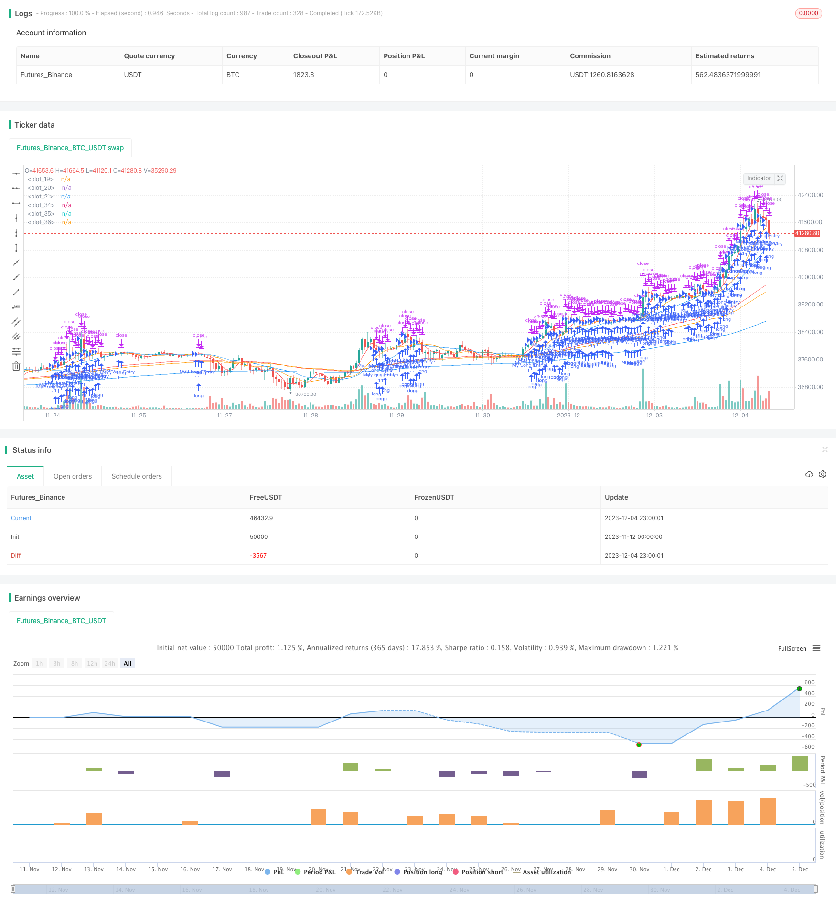

> Name

Multi-Timeframe-Moving-Average-Strategy
> Author

ChaoZhang

> Strategy Description


[trans]

## Overview
This strategy uses moving averages and exponential moving averages on different time axes as buying and selling signals to achieve the purpose of chasing ups and downs. Determine market trends and turning points based on the position and trend of short-term moving averages, and determine the general trend based on long-term moving averages. This strategy uses both the simple moving average (SMA) and the exponential moving average (EMA) as technical indicators, which can effectively filter out market noise and determine price trends.
## Strategy Principle
This strategy uses the 5-day, 13-day, and 21-day SMAs, and the 75-day, 90-day, and 200-day EMAs as buying and selling signals. The specific logic is:
When the short-term SMAs (5-day line, 13-day line, 21-day line) are arranged in order (5-day line is at the top, 13-day line is next, and 21-day line is the bottom), and all short-term SMAs are higher than the long-term EMA (75-day line, 90-day line, 200-day line), go long;
When the short-term SMAs (5-day line, 13-day line, 21-day line) are arranged in order (5-day line is at the bottom, 13-day line is next, and 21-day line is at the top), and all short-term SMAs are lower than the long-term EMA (75-day line, 90-day line, 200-day line), go short.
In this way, by combining the SMA and EMA of different periods, we can effectively judge the short-term and long-term price trends, and implement a short-term and long-term trend strategy.
## Advantage Analysis
This strategy has the following advantages:
1. Using dual moving average indicators can effectively filter market noise and accurately judge price trends.
2. Multiple timeline settings, short periods determine short-term trends, and long periods determine major trends, realizing fast and slow trends.
3. SMA is sensitive to price changes, and EMA is smooth to price changes. The combination of the two has a better effect.
4. The logic of chasing the rise and killing the fall is simple, direct and easy to operate.
## Risk Analysis
This strategy also has certain risks:
1. Multi-timeline settings are complex, and parameter adjustment and optimization are difficult.
2. Short-term and long-term indicators may diverge, sending out wrong signals.
3. Based only on moving average indicators, the effect may not be good during violent market conditions.
4. There is a certain lag and the turning point cannot be captured in time.
## Optimization direction
This strategy can be optimized from the following aspects:
1. Add other technical indicators to filter signals, such as KDJ, MACD, etc., to improve the accuracy of the strategy.
2. Test and optimize the periods and quantities of short-term and long-term moving averages to find the best parameter combination.
3. Add a stop-loss mechanism to control risks and DD.
4. Combine with volume and energy indicators to avoid false breakthroughs when prices rise sharply.
## Summarize
This strategy achieves simple and effective trend tracking by using dual moving averages and multi-time axis analysis. The strategic ideas are clear and easy to understand, and have certain practical value. However, there are also some problems that need to be improved, such as parameter optimization, risk control, etc. Overall, this strategy provides valuable ideas for quantitative trading and is worthy of in-depth study and discussion.
||

## Overview

This strategy uses moving averages and exponential moving averages of different timeframes as trading signals to chase rises and kill drops. It judges the market trend and inflection points according to the location and trend of short-term moving averages and determines the major trend according to long-term moving averages. The strategy combines Simple Moving Average (SMA) and Exponential Moving Average (EMA) as technical indicators to effectively filter market noise and determine price trends.

## Strategy Logic  

The strategy uses 5-day, 13-day, 21-day SMA and 75-day, 90-day, 200-day EMA as trading signals. The specific logic is:

When the short-term SMAs (5-day, 13-day, 21-day) are arranged in order (5-day on the top, 13-day next, 21-day at the bottom) and all short-term SMAs are above the long-term EMAs (75-day, 90-day, 200-day), go long;  

When the short-term SMAs (5-day, 13-day, 21-day) are arranged in order (5-day at the bottom, 13-day next, 21-day at the top) and all short-term SMAs are below the long-term EMAs (75-day, 90-day, 200-day), go short.

By combining SMAs and EMAs of different cycles, it can effectively judge short-term and long-term price trends to implement a trend-following strategy.

## Advantage Analysis

The strategy has the following advantages:

1. Using dual moving average indicators can effectively filter market noise and accurately determine price trends.

2. Multi timeframe settings, with short cycles to determine short-term trends and long cycles to determine major trends, achieving fast with slow.

3. SMA is sensitive to price changes while EMA smoothes price changes, combining the two works better.  

4. The logic of chasing rises and killing drops is simple and direct, easy to operate.

## Risk Analysis   

The strategy also has some risks:  

1. Multi timeframe settings are quite complex with difficulties in parameter tuning and optimization.

2. Divergence may occur between short-term and long-term indicators, giving wrong signals.   

3. Based solely on moving average indicators, may underperform in extreme market conditions.  

4. There is a certain lag, unable to timely capture inflection points.


## Optimization  

The strategy can be optimized in the following aspects:

1. Add other technical indicators for signal filtering such as KDJ, MACD etc. to improve strategy accuracy.  

2. Test and optimize periods and numbers of short-term and long-term moving averages to find optimal parameter combinations.

3. Add stop loss mechanisms to control risk and DD.

4. Combine volume indicators to avoid false breakouts under sharp price surges.


## Conclusion   

The strategy realizes simple and effective trend tracking by using dual moving averages and multi timeframe analysis. The strategy idea is clear and easy to understand with certain practical value. But there is still room for improvement such as parameter optimization, risk control etc. Overall, the strategy provides valuable ideas for quantitative trading, which is worth in-depth research and discussion.

[/trans]


> Source (PineScript)

``` pinescript
/*backtest
start: 2023-11-12 00:00:00
end: 2023-12-05 00:00:00
period: 1h
basePeriod: 15m
exchanges: [{"eid":"Futures_Binance","currency":"BTC_USDT"}]
*/

//@version=4
strategy(title="my_strategy_name", shorttitle="MS1", overlay=true )


source = close


// MAの長さ
len1 = 5
len2 = 13
len3 = 21

// MAの計算
ma1 = sma(source, len1)
ma2 = sma(source, len2)
ma3 = sma(source, len3)

// 計算したMAをプロットする
plot(ma1,color=color.red)
plot(ma2,color=color.orange)
plot(ma3,color=color.blue)

// EMAの長さ
len4 = 75
len5 = 90
len6 = 200

// MAの計算
ema1 = ema(source, len4)
ema2 = ema(source, len5)
ema3 = ema(source, len6)

// 計算したMAをプロットする
plot(ema1,color=color.red)
plot(ema2,color=color.orange)
plot(ema3,color=color.blue)

longCondition = (ma1>ma2 and ma2>ma3 and ma3>ema1 and ema1>ema2 and ema2>ema3)//ロングにエントリーする条件
if (longCondition)
    strategy.entry("My Long Entry", strategy.long, comment="Long")

shortCondition = (ma1<ma2 and ma2<ma3 and ma3<ema1 and ema1<ema2 and ema2<ema3)//ショートにエントリーする条件
if (shortCondition)
    strategy.entry("My Short Entry", strategy.short, comment="Short")
    
    //エグジット条件
strategy.exit("My Long Exit", "My Long Entry", profit=200, loss=100)
strategy.exit("My Short Exit", "My Short Entry", profit=200, loss=100)
    

    
    
```

> Detail

https://www.fmz.com/strategy/435249

> Last Modified

2023-12-13 15:34:09
