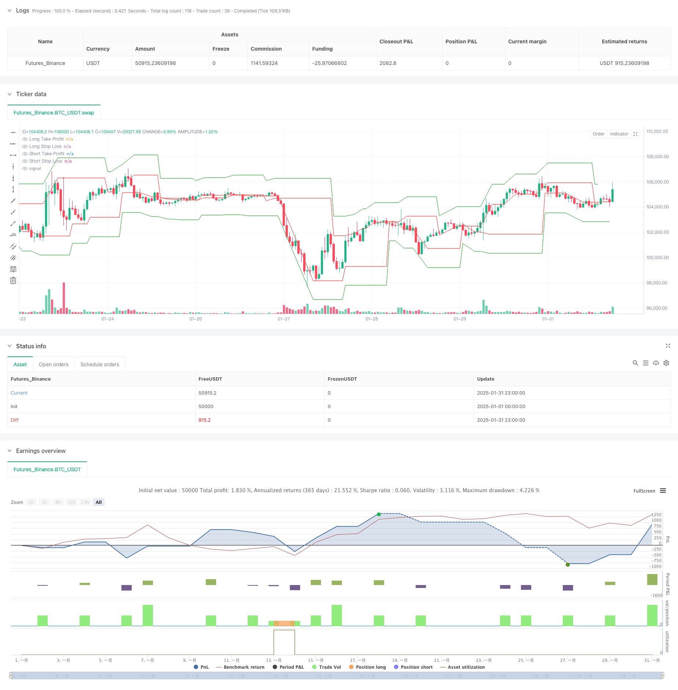

> Name

Multi-Timeframe-Pivot-Reversal-Strategy-with-Dynamic-Percentage-Based-Take-Profit-and-Stop-Loss-System
> Author

ChaoZhang

> Strategy Description



[trans]
#### Overview
This strategy is an advanced trading system based on multi-time period analysis that captures market reversal opportunities by identifying key pivot points on higher time periods. The strategy combines a dynamic percentage take-profit and stop-loss mechanism to effectively control risks while pursuing stable returns. The system also includes transaction interval control and time range testing functions, making it more suitable for real trading environments.
#### Strategy Principle
The core logic of the strategy is based on the following key elements:
1. Use pivot point analysis on a higher time period (default 60 minutes) and define the pivot formation conditions through the leftBars and rightBars parameters.
2. Manage risk and return targets for each trade with dynamically calculated percentage take-profit and stop-loss positions.
3. Multi-time period analysis provides more reliable market structure judgment and reduces false signals.
4. Trading interval control mechanism (default 1440 minutes) to avoid excessive trading and improve signal quality.
5. The time range testing function allows strategy verification within a specific historical interval.
#### Strategic Advantages
1. Multi-time cycle analysis provides a more comprehensive market perspective and reduces false breakthroughs.
2. Dynamic percentage stop-profit and stop-loss adapt to different market environments and improve strategy stability.
3. Transaction interval control effectively prevents excessive trading and reduces transaction costs.
4. The time range testing function facilitates strategy optimization and historical performance analysis.
5. The code structure is clear and easy to maintain and modify.
#### Strategy Risk
1. In highly volatile markets, a fixed percentage stop may not be flexible enough.
2. Longer trading intervals may miss some valid signals.
3. The lag in pivot point identification may lead to less than ideal entry timing.
4. Too many false signals can be generated in sideways markets.
#### Strategy optimization direction
1. Introduce adaptive volatility indicator to dynamically adjust the take-profit and stop-loss percentages.
2. Add market environment filters and adjust strategy parameters under different trend strengths.
3. Integrate volume analysis to improve the reliability of entry signals.
4. Realize dynamic trading interval adjustment based on market fluctuations.
5. Add a trailing stop loss mechanism to protect existing profits.
#### Summary
This strategy provides a complete trading system framework through multi-time period analysis and dynamic risk management. Although there are some areas that need optimization, the overall design concept is reasonable and has good practicality. Through the suggested optimization direction, the strategy is expected to achieve more stable performance in different market environments. ||
#### Overview
This strategy is an advanced trading system based on multi-timeframe analysis that captures market reversal opportunities by identifying key pivot points on higher timeframes. It incorporates dynamic percentage-based take profit and stop loss mechanisms, effectively controlling risk while pursuing stable returns. The system also includes trade interval control and time range testing functionality, making it more suitable for live trading environments.

#### Strategy Principles
The core logic of the strategy is based on several key elements:
1. Pivot point analysis on a higher timeframe (default 60 minutes), defining pivot formation conditions through leftBars and rightBars parameters.
2. Risk and profit targets managed through dynamically calculated percentage-based take profit and stop loss levels.
3. Multi-timeframe analysis provides more reliable market structure judgment, reducing false signals.
4. Trade interval control mechanism (default 1440 minutes) prevents overtrading and improves signal quality.
5. Time range testing functionality allows strategy validation within specific historical periods.

#### Strategy Advantages
1. Multi-timeframe analysis provides a more comprehensive market perspective, reducing false breakouts.
2. Dynamic percentage-based take profit and stop loss adapt to different market conditions, improving strategy stability.
3. Trade interval control effectively prevents overtrading and reduces transaction costs.
4. Time range testing functionality facilitates strategy optimization and historical performance analysis.
5. Clear code structure, easy to maintain and modify.

#### Strategy Risks
1. Fixed percentage stops may not be flexible enough in highly volatile markets.
2. Longer trade intervals might miss some valid signals.
3. Lag in pivot point identification may lead to suboptimal entry timing.
4. May generate excessive false signals in ranging markets.

#### Strategy Optimization Directions
1. Introduce adaptive volatility indicators to dynamically adjust take profit and stop loss percentages.
2. Add market environment filters to adjust strategy parameters under different trend strengths.
3. Integrate volume analysis to improve entry signal reliability.
4. Implement dynamic trade interval adjustments based on market volatility.
5. Add trailing stop mechanism to protect accumulated profits.

#### Summary
The strategy provides a complete trading system framework through multi-timeframe analysis and dynamic risk management. While there are areas for optimization, the overall design concept is sound and practical. Through the suggested optimization directions, the strategy has the potential to achieve more stable performance across different market conditions.[/trans]


> Source (PineScript)

``` pinescript
/*backtest
start: 2025-01-01 00:00:00
end: 2025-01-31 23:59:59
period: 1h
basePeriod: 1h
exchanges: [{"eid":"Futures_Binance","currency":"BTC_USDT"}]
*/

//@version=6
strategy("Pivot Reversal Strategy with MTF TP & SL in Percent and Test Range", overlay=true)

// Входные параметры
higher_tf = input.timeframe("60", title="Higher Timeframe for Breakout Check")  // Таймфрейм для анализа пробоя
leftBars = input(4, title="Left Bars")
rightBars = input(2, title="Right Bars")
TP_percent = input.float(1.0, title="Take Profit (%)", minval=0.1, step=0.1)   // Тейк-профит в процентах
SL_percent = input.float(0.5, title="Stop Loss (%)", minval=0.1, step=0.1)    // Стоп-лосс в процентах
trade_interval = input.int(1440, title="Minimum Time Between Trades (Minutes)") // Интервал между сделками

// Диапазон тестирования (используем UNIX timestamps)
start_date = input(timestamp("2023-01-01 00:00 +0000"), title="Start Date")  // Стартовая дата для тестирования
end_date = input(timestamp("2023-12-31 23:59 +0000"), title="End Date")    // Конечная дата для тестирования

// Проверка, попадает ли текущая свеча в указанный диапазон времени
in_test_range = true

// Определение пивотов на более крупном таймфрейме
higher_tf_high = request.security(syminfo.tickerid, higher_tf, ta.pivothigh(leftBars, rightBars))
higher_tf_low = request.security(syminfo.tickerid, higher_tf, ta.pivotlow(leftBars, rightBars))

// Последнее время открытия сделки
var float last_trade_time = na

// Логика для лонга
swh_cond = not na(higher_tf_high)
hprice = 0.0
hprice := swh_cond ? higher_tf_high : hprice[1]
le = false
le := swh_cond ? true : (le[1] and high > hprice ? false : le[1])

if le and in_test_range and (na(last_trade_time) or (time - last_trade_time >= trade_interval * 60 * 1000))
    tp_price_long = hprice * (1 + TP_percent / 100)  // Тейк-профит в процентах
    sl_price_long = hprice * (1 - SL_percent / 100)  // Стоп-лосс в процентах
    strategy.entry("PivRevLE", strategy.long, stop=hprice + syminfo.mintick)
    strategy.exit("TP_SL_Long", from_entry="PivRevLE", 
                  limit=tp_price_long, 
                  stop=sl_price_long)
    last_trade_time := time

// Логика для шорта
swl_cond = not na(higher_tf_low)
lprice = 0.0
lprice := swl_cond ? higher_tf_low : lprice[1]
se = false
se := swl_cond ? true : (se[1] and low < lprice ? false : se[1])

if se and in_test_range and (na(last_trade_time) or (time - last_trade_time >= trade_interval * 60 * 1000))
    tp_price_short = lprice * (1 - TP_percent / 100)  // Тейк-профит в процентах
    sl_price_short = lprice * (1 + SL_percent / 100)  // Стоп-лосс в процентах
    strategy.entry("PivRevSE", strategy.short, stop=lprice - syminfo.mintick)
    strategy.exit("TP_SL_Short", from_entry="PivRevSE", 
                  limit=tp_price_short, 
                  stop=sl_price_short)
    last_trade_time := time

// Для наглядности отображаем уровни на графике
plot(le and in_test_range ? hprice * (1 + TP_percent / 100) : na, color=color.green, title="Long Take Profit")
plot(le and in_test_range ? hprice * (1 - SL_percent / 100) : na, color=color.red, title="Long Stop Loss")
plot(se and in_test_range ? lprice * (1 - TP_percent / 100) : na, color=color.green, title="Short Take Profit")
plot(se and in_test_range ? lprice * (1 + SL_percent / 100) : na, color=color.red, title="Short Stop Loss")

```

> Detail

https://www.fmz.com/strategy/481099

> Last Modified

2025-02-08 15:04:47
