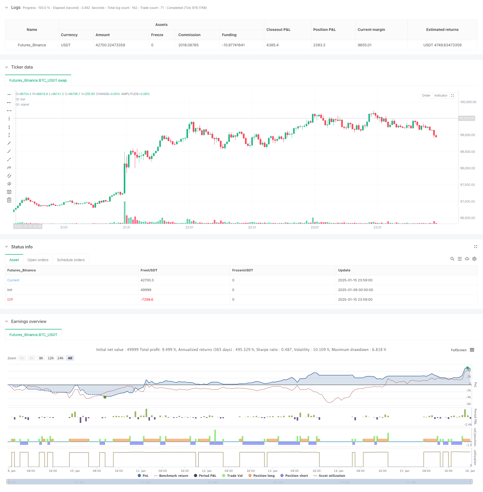

> Name

Multi-timeframe-Trading-Strategy-Combining-Harmonic-Patterns-and-Williams-R
> Author

ChaoZhang

> Strategy Description



[trans]
#### Overview
This strategy is an advanced trading system that combines harmonic patterns and the William indicator (WPR). It identifies trade entry and exit times by identifying harmonic patterns in the market (such as Gartley, Bat, Crab, and Butterfly patterns) combined with the overbought and oversold levels of the William Indicator. The strategy adopts a multiple confirmation mechanism to improve the accuracy and reliability of transactions through the synergy of technical indicators.
#### Strategy Principle
The core logic of the strategy includes the following key parts:
1. Harmonic pattern identification: Use price turning points to identify potential harmonic patterns, and determine the market structure by analyzing the relationship between high points and low points.
2. William indicator calculation: Calculate the William indicator using a custom period, and judge the market status by analyzing the relationship between the highest price, lowest price and closing price.
3. Admission conditions:
   - Long entry: when a bullish harmonic pattern appears and the William indicator is in the oversold zone
   - Short entry: when a bearish harmonic pattern appears and the William indicator is in the overbought zone
4. Risk management: Use dynamic stops based on recent lows/highs, and set take-profit positions based on risk-reward ratios.
#### Strategic Advantages
1. Multi-dimensional analysis: combines morphological analysis and momentum indicators to provide more reliable trading signals.
2. Improved risk control: Use dynamic stop loss and take profit settings based on risk-return ratio to effectively control the risk of each transaction.
3. Strong adaptability: It can adapt to different market environments and trading varieties through parameter optimization.
4. Signal confirmation mechanism: Through the double confirmation of harmonic mode and William indicator, the impact of false signals is reduced.
#### Strategy Risk
1. Pattern recognition risk: Simplified harmonic pattern recognition may lead to misjudgment of certain forms.
2. Parameter sensitivity: The settings of multiple parameters require careful optimization. Improper parameters may affect the strategy performance.
3. Market environment dependence: may perform poorly in violently volatile or sideways markets.
4. Signal lag: Signals based on technical indicators may have a certain lag.
#### Strategy optimization direction
1. Pattern recognition enhancement:
   - Added stricter harmonic ratio validation
   - Introduce price structure analysis to improve pattern recognition accuracy
2. Signal filtering:
   - Add trend filter
   - Consider adding volatility indicators to adapt to different market environments
3. Risk management optimization:
   - Realize dynamic risk-benefit ratio adjustment
   - Add position management based on market fluctuations
#### Summary
This strategy builds a relatively complete trading system by combining harmonic patterns and William indicators. Its advantages lie in multi-dimensional analysis methods and complete risk control mechanisms, but it still needs to pay attention to parameter optimization and market environment adaptability. Through the suggested optimization directions, the stability and reliability of the strategy are expected to be further improved. ||
#### Overview
This strategy is an advanced trading system that combines Harmonic Patterns with the Williams Percent Range (WPR) indicator. It identifies harmonic formations (such as Gartley, Bat, Crab, and Butterfly patterns) in the market and uses WPR's overbought/oversold levels to determine trade entry and exit points. The strategy employs multiple confirmation mechanisms, utilizing the synergy of technical indicators to enhance trading accuracy and reliability.

#### Strategy Principles
The core logic includes several key components:
1. Harmonic Pattern Recognition: Uses price pivot points to identify potential harmonic formations by analyzing the relationships between highs and lows.
2. Williams %R Calculation: Employs a custom period for calculating WPR, analyzing relationships between high, low, and closing prices to determine market conditions.
3. Entry Conditions:
   - Long Entry: When a bullish harmonic pattern appears and WPR is in oversold territory
   - Short Entry: When a bearish harmonic pattern appears and WPR is in overbought territory
4. Risk Management: Implements dynamic stop-loss based on recent lows/highs and sets take-profit levels using risk-reward ratios.

#### Strategy Advantages
1. Multi-dimensional Analysis: Combines pattern analysis with momentum indicators for more reliable trading signals.
2. Robust Risk Control: Uses dynamic stop-loss and risk-reward based take-profit settings to effectively control risk per trade.
3. High Adaptability: Can be adapted to different market environments and instruments through parameter optimization.
4. Signal Confirmation Mechanism: Reduces false signals through dual confirmation using harmonic patterns and WPR.

#### Strategy Risks
1. Pattern Recognition Risk: Simplified harmonic pattern recognition may lead to misidentification of some formations.
2. Parameter Sensitivity: Multiple parameters require careful optimization, as improper settings can affect strategy performance.
3. Market Environment Dependency: May underperform in highly volatile or ranging markets.
4. Signal Lag: Technical indicator-based signals may have inherent lag.

#### Strategy Optimization Directions
1. Enhanced Pattern Recognition:
   - Add stricter harmonic ratio validation
   - Incorporate price structure analysis for improved pattern identification
2. Signal Filtering:
   - Add trend filters
   - Consider volatility indicators for market environment adaptation
3. Risk Management Optimization:
   - Implement dynamic risk-reward ratio adjustments
   - Add volatility-based position sizing

#### Summary
This strategy builds a comprehensive trading system by combining harmonic patterns with the Williams %R indicator. Its strengths lie in its multi-dimensional analysis approach and robust risk control mechanisms, though attention must be paid to parameter optimization and market environment adaptation. Through the suggested optimization directions, the strategy's stability and reliability can be further enhanced.[/trans]


> Source (PineScript)

``` pinescript
/*backtest
start: 2025-01-09 00:00:00
end: 2025-01-16 00:00:00
period: 1m
basePeriod: 1m
exchanges: [{"eid":"Futures_Binance","currency":"BTC_USDT","balance":49999}]
*/

//@version=5
strategy("Harmonic Pattern with WPR Backtest", overlay=true)

// === Inputs ===
patternLength = input.int(5, title="Pattern Length")
wprLength = input.int(14, title="WPR Length")
wprOverbought = input.float(-20, title="WPR Overbought Level")
wprOversold = input.float(-80, title="WPR Oversold Level")
riskRewardMultiplier = input.float(0.618, title="Take-Profit Risk/Reward Multiplier")
stopLossBuffer = input.float(0.005, title="Stop-Loss Buffer (%)")

// === Manual Calculation of William Percent Range (WPR) ===
highestHigh = ta.highest(high, wprLength)
lowestLow = ta.lowest(low, wprLength)
wpr = ((highestHigh - close) / (highestHigh - lowestLow)) * -100

// === Harmonic Pattern Detection (Simplified Approximation) ===
// Calculate price pivots
pivotHigh = ta.pivothigh(high, patternLength, patternLength)
pivotLow = ta.pivotlow(low, patternLength, patternLength)

// Detect Bullish and Bearish Harmonic Patterns
bullishPattern = pivotLow and close > ta.lowest(close, patternLength)  // Simplified detection for bullish patterns
bearishPattern = pivotHigh and close < ta.highest(close, patternLength)  // Simplified detection for bearish patterns

// === Entry Conditions ===
longCondition = bullishPattern and wpr < wprOversold
shortCondition = bearishPattern and wpr > wprOverbought

// === Stop-Loss and Take-Profit Levels ===
longEntryPrice = close
longSL = ta.valuewhen(longCondition, low, 0) * (1 - stopLossBuffer)  // Stop-loss for long trades
longTP = longEntryPrice * (1 + riskRewardMultiplier)  // Take-profit for long trades

shortEntryPrice = close
shortSL = ta.valuewhen(shortCondition, high, 0) * (1 + stopLossBuffer)  // Stop-loss for short trades
shortTP = shortEntryPrice * (1 - riskRewardMultiplier)  // Take-profit for short trades

// === Backtesting Logic ===
// Long Trade
if longCondition
    strategy.entry("Long", strategy.long)
    strategy.exit("Long Exit", "Long", stop=longSL, limit=longTP)

// Short Trade
if shortCondition
    strategy.entry("Short", strategy.short)
    strategy.exit("Short Exit", "Short", stop=shortSL, limit=shortTP)

// === Visualization ===
bgcolor(longCondition ? color.new(color.green, 90) : na, title="Long Entry Signal")
bgcolor(shortCondition ? color.new(color.red, 90) : na, title="Short Entry Signal")

```

> Detail

https://www.fmz.com/strategy/478737

> Last Modified

2025-01-17 16:19:15
