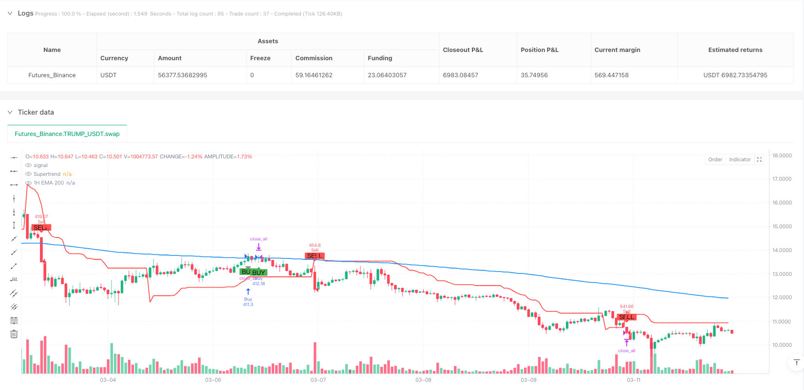
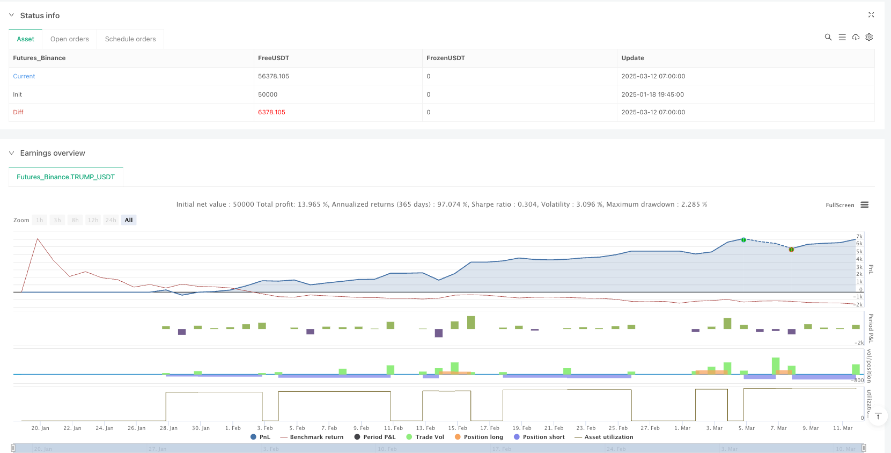

> Name

Multi-Timeframe-Trend-Following-with-Supertrend-Momentum-Optimization-Strategy
> Author

ianzeng123

> Strategy Description





[trans]

#### Overview
This strategy is a multi-time frame trend following trading system that combines the 200 EMA (EMA) on the 1-hour chart as a trend confirmation indicator and the Supertrend indicator on the 15-minute chart as an entry signal. This combination utilizes the trend direction guidance of higher time frames and the precise entry points of lower time frames to form a complete trading system that can both grasp the general trend and optimize the timing of entry. The strategy also includes stop-loss settings based on Super Trend indicator values ​​and profit targets based on risk ratios, providing a clear risk management framework for each trade.
#### Strategy Principle
The core principle of this strategy is to filter trading signals through multi-time frame analysis to ensure that the trading direction is consistent with the main trend. The specific implementation is as follows:
1. **Trend confirmation mechanism (1 hour chart)**:
   - Use the 200-period exponential moving average (EMA 200) to determine overall market trends
   - When price is above EMA 200, an uptrend is confirmed
   - When price is below EMA 200, a downtrend is confirmed
2. **Entry signal (15 minute chart)**:
   - Use Supertrend indicator to generate accurate entry signals
   - When the supertrend is green (upward), a buy signal is generated
   - When the supertrend is red (downward), a sell signal is generated
3. **Risk Management**:
   - Stop loss setting: fixed at the super trend indicator value position at the time of entry
   - Profit target: 1.5 times the distance between the entry price and the stop loss (actually 2 times in the code)
   - Transaction management: When a new signal is generated, the previous transaction will be closed to ensure that only one transaction is active at any time
As can be seen from code analysis, the strategy uses the request.security function to obtain EMA 200 data from the 1-hour time frame and compares it with the current price to determine the trend direction. At the same time, the Supertrend indicator value and its direction are calculated on the current 15-minute chart. A trading signal will only be triggered when the signals from both time frames coincide (e.g. 1 hour uptrend + 15 minute supertrend up).
#### Strategic Advantages
After a deeper analysis of the code, this strategy demonstrates the following significant benefits:
1. **More reliable trend screening**: By combining trend confirmation from both time frames, the possibility of false breakouts and counter-trend trades is significantly reduced. The EMA 200 on the higher time frame (1 hour) provides a more stable trend judgment rather than relying solely on the more volatile short-term time frame.
2. **Accurate entry timing**: The super trend indicator provides precise entry points on the short-term time frame (15 minutes), allowing traders to confirm the trend while optimizing the entry price and improving the cost-effectiveness of transactions.
3. **Risk Management Automation**: The strategy has a built-in dynamic stop loss mechanism based on market volatility. The super trend indicator itself takes into account market volatility (calculated through ATR), so the stop loss position will be automatically adjusted according to market conditions.
4. **Profit target ratio design**: By setting a profit target with a fixed risk-reward ratio (2:1), the strategy ensures the possibility of long-term profitability. Even if the winning rate is not particularly high, the system may achieve positive expected value.
5. **Avoid transaction overlap**: The strategy ensures that existing transactions are closed when a new signal is generated, avoiding the risk of position overlay and simplifying fund management and risk control.
#### Strategy Risk
Although this strategy is well designed, there are still several risks that need to be noted:
1. **Reaction lag at trend turning point**: Due to the use of a long-period (200-period) moving average, the strategy's response at trend turning points will be relatively lagging, which may result in continued trading in the original trend direction at the early stage of market reversal, resulting in certain losses.
2. **Increase of false signals in volatile markets**: In sideways or volatile markets, the price may frequently cross the EMA 200 line, and the super trend indicator will also frequently change direction, generating multiple false signals, leading to continuous stop losses.
3. **Limitations of fixed risk-reward ratio**: Although the strategy sets a fixed risk-reward ratio of 2:1, the optimal risk-return ratio may be different in different markets and different periods, and the fixed setting may not always be the optimal choice.
4. **Parameter sensitivity**: The parameters of the super trend indicator (ATR period and factor) have a significant impact on strategy performance. Different markets may require different parameter combinations, which increases the complexity of strategy optimization.
5. **Liquidity Risk**: In low-liquidity markets or extreme market conditions, actual stop loss may slip, causing actual losses to exceed expectations.
Solutions include: adding trend filter conditions (such as trend strength indicators), adjusting super trend parameters to adapt to different market conditions, setting limits on the maximum number of consecutive losses, and dynamically adjusting the risk-reward ratio based on market volatility.
#### Strategy optimization direction
Through in-depth analysis of the code, the following possible optimization directions can be identified:
1. **Introducing trend strength filtering**: The current strategy only uses the position of price relative to EMA 200 to determine the trend. You can consider adding a trend strength indicator (such as ADX or MACD) and only trade when the trend is strong enough to avoid false signals that shock the market.
2. **Dynamic Risk-Reward Ratio**: Replace the fixed risk-reward ratio with a dynamic calculation method based on market volatility or support and resistance levels. For example, a more conservative risk-to-reward ratio can be used when volatility is high, while more aggressive settings can be used during strong trends.
3. **Add partial profit mechanism**: The current strategy adopts the full position entry and exit method. You can consider a batch profit mechanism. For example, when the risk reward reaches 1:1, you will make a part of the profit, and set a trailing stop loss for the remaining part to follow the trend.
4. **Integrated trading volume confirmation**: Integrate trading volume indicators into entry conditions, requiring signals to be accompanied by a significant increase in trading volume to improve signal reliability.
5. **Time Filter**: Add time filter conditions to avoid known periods of low liquidity or volatile market announcement periods.
6. **Parameter adaptive mechanism**: Realizes adaptive adjustment of super trend parameters and dynamically optimizes parameters according to recent market fluctuations, so that the strategy can better adapt to different market stages.
The key to these optimization directions is to enhance the robustness and adaptability of the strategy while maintaining its core strengths - multi-time frame trend confirmation and precise entry.
#### Summary
The Multi-Time Frame Trend Following and Super Trend Momentum Optimization Strategy is a complete trading system that combines the fundamental principles of technical analysis with practical risk management. By integrating trend confirmation on the 1-hour time frame and precise entry signals on the 15-minute time frame, this strategy provides traders with a methodology that considers the big picture while paying attention to detail.
While this approach does not guarantee a profit on every trade, its design philosophy - following major trends, optimizing entry points, a fixed risk-reward ratio and a clear stop-loss strategy - embodies the key elements of a mature trading system. Through the implementation of the aforementioned optimization directions, this strategy has the potential to further improve its stability and adaptability, allowing it to remain competitive in different market environments.
Most importantly, the strategy's core ideas reflect the fundamental principles of successful trading: trend confirmation, precise entry, risk management, and disciplined execution. These principles apply not only to this strategy, but to almost any successful trading method. ||
#### Overview
This strategy is a multi-timeframe trend following trading system that combines the 200 Exponential Moving Average (EMA) on the 1-hour chart for trend confirmation with the Supertrend indicator on the 15-minute chart for entry signals. This combination leverages the trend direction guidance from the higher timeframe and precise entry points from the lower timeframe, creating a complete trading system that can both capture major trends and optimize entry timing. The strategy also includes stop-loss settings based on the Supertrend indicator values and profit targets based on risk ratios, providing a clear risk management framework for each trade.

#### Strategy Principles
The core principle of this strategy is to filter trading signals through multi-timeframe analysis, ensuring that trading direction aligns with the primary trend. The specific implementation is as follows:

1. **Trend Confirmation Mechanism (1-hour chart)**:
   - Uses the 200-period Exponential Moving Average (EMA 200) to determine overall market trend
   - When price is above EMA 200, confirms an uptrend
   - When price is below EMA 200, confirms a downtrend

2. **Entry Signals (15-minute chart)**:
   - Uses the Supertrend indicator to generate precise entry signals
   - When Supertrend is green (up), generates a buy signal
   - When Supertrend is red (down), generates a sell signal

3. **Risk Management**:
   - Stop-loss setting: Fixed at the Supertrend indicator value at entry
   - Profit target: 1.5 times the distance between entry price and stop-loss (actually 2x in the code)
   - Trade management: When a new signal is generated, the previous trade is closed, ensuring only one active trade at any time

Through code analysis, we can see that the strategy uses the request.security function to obtain EMA 200 data from the 1-hour timeframe and compares it with the current price to determine trend direction. At the same time, it calculates the Supertrend indicator value and its direction on the current 15-minute chart. Only when signals from both timeframes align (e.g., 1-hour uptrend + 15-minute Supertrend up) will a trade signal be triggered.

#### Strategy Advantages
After in-depth code analysis, this strategy demonstrates the following significant advantages:

1. **More Reliable Trend Filtering**: By combining trend confirmation from two timeframes, it significantly reduces the possibility of false breakouts and counter-trend trading. The higher timeframe (1-hour) EMA 200 provides more stable trend judgment, rather than relying solely on the more volatile short-term timeframe.

2. **Precise Entry Timing**: The Supertrend indicator on the short-term timeframe (15-minute) provides precise entry points, allowing traders to optimize entry prices while confirming the trend, improving the cost-effectiveness of trades.

3. **Automated Risk Management**: The strategy incorporates a dynamic stop-loss mechanism based on market volatility; the Supertrend indicator itself considers market volatility (calculated through ATR), so the stop-loss position automatically adjusts according to market conditions.

4. **Proportional Profit Target Design**: By setting a fixed risk-reward ratio (2:1) profit target, the strategy ensures the possibility of long-term profitability; even with a less-than-perfect win rate, the system can potentially achieve a positive expected value.

5. **Avoids Trade Overlap**: The strategy ensures that existing trades are closed when generating new signals, avoiding position stacking risk and simplifying fund management and risk control.

#### Strategy Risks
Despite its reasonable design, the strategy still has the following risks that need attention:

1. **Delayed Reaction at Trend Turning Points**: Due to the use of a long-period (200) moving average, the strategy's reaction at trend turning points will be relatively delayed, potentially leading to continued trading in the original trend direction during the early stages of market reversal, causing certain losses.

2. **Increased False Signals in Ranging Markets**: In sideways or oscillating markets, prices may frequently cross the EMA 200 line, while the Supertrend indicator may also frequently change direction, producing multiple false signals and leading to consecutive stop-losses.

3. **Limitations of Fixed Risk-Reward Ratio**: Although the strategy sets a fixed 2:1 risk-reward ratio, the optimal risk-reward ratio may vary for different markets and different periods, making a fixed setting not always the optimal choice.

4. **Parameter Sensitivity**: The parameters of the Supertrend indicator (ATR period and factor) have a significant impact on strategy performance; different markets may require different parameter combinations, which increases the complexity of strategy optimization.

5. **Liquidity Risk**: In low liquidity markets or extreme market conditions, actual stop-losses may experience slippage, resulting in actual losses exceeding expectations.

Solutions include: adding trend filter conditions (such as trend strength indicators), adjusting Supertrend parameters to adapt to different market conditions, setting maximum consecutive loss limits, and dynamically adjusting risk-reward ratios based on market volatility.

#### Strategy Optimization Directions
Through in-depth code analysis, several potential optimization directions can be identified:

1. **Introduce Trend Strength Filtering**: The current strategy only uses price position relative to EMA 200 to judge trends; consider adding trend strength indicators (such as ADX or MACD), only trading when the trend is strong enough to avoid false signals in oscillating markets.

2. **Dynamic Risk-Reward Ratio**: Replace the fixed risk-reward ratio with a dynamic calculation method based on market volatility or support/resistance levels. For example, set a more conservative risk-reward ratio during high volatility and use more aggressive settings in strong trends.

3. **Add Partial Profit Mechanism**: The current strategy uses a full position entry and exit approach; consider a partial profit mechanism, such as taking profit on a portion at a 1:1 risk-reward ratio, with the remaining portion set to trailing stop-loss to follow the trend.

4. **Integrate Volume Confirmation**: Integrate volume indicators into entry conditions, requiring signals to be accompanied by significant volume increases to improve signal reliability.

5. **Time Filter**: Add time filtering conditions to avoid known low liquidity periods or highly volatile market announcement periods.

6. **Parameter Adaptive Mechanism**: Implement adaptive adjustment of Supertrend parameters based on recent market volatility conditions, dynamically optimizing parameters to better adapt to different market phases.

The key to these optimization directions is to enhance the strategy's robustness and adaptability while maintaining its core advantages—multi-timeframe trend confirmation and precise entry.

#### Summary
The Multi-Timeframe Trend Following with Supertrend Momentum Optimization Strategy is a complete trading system that combines basic principles of technical analysis with practical risk management. By integrating trend confirmation from the 1-hour timeframe and precise entry signals from the 15-minute timeframe, this strategy provides traders with a methodology that considers both the big picture and details.

While this method cannot guarantee profit on every trade, its design philosophy—following the main trend, optimizing entry points, fixed risk-reward ratio, and clear stop-loss strategy—reflects the key elements that a mature trading system should have. Through the implementation of the aforementioned optimization directions, this strategy has the potential to further enhance its stability and adaptability, allowing it to maintain competitiveness in different market environments.

Most importantly, the core ideas of this strategy reflect the basic principles of successful trading: trend confirmation, precise entry, risk management, and disciplined execution. These principles apply not only to this strategy but to almost all successful trading methods.[/trans]


> Source (PineScript)

``` pinescript
/*backtest
start: 2025-01-18 19:45:00
end: 2025-03-12 08:00:00
period: 1h
basePeriod: 1h
exchanges: [{"eid":"Futures_Binance","currency":"TRUMP_USDT"}]
*/

//@version=6
strategy("1H EMA 200 + 15M Supertrend Strategy ", overlay=true, default_qty_type=strategy.percent_of_equity, default_qty_value=10)

// === Inputs ===
atrPeriod = input.int(10, "ATR Length", minval=1)
factor = input.float(3.0, "Factor", minval=0.01, step=0.01)

// === 1-Hour EMA (Trend Confirmation) ===
ema200_1h = request.security(syminfo.tickerid, "60", ta.ema(close, 200), gaps=barmerge.gaps_off, lookahead=barmerge.lookahead_off)
isAboveEMA200 = request.security(syminfo.tickerid, "60", close > ema200_1h, gaps=barmerge.gaps_off, lookahead=barmerge.lookahead_off)
isBelowEMA200 = request.security(syminfo.tickerid, "60", close < ema200_1h, gaps=barmerge.gaps_off, lookahead=barmerge.lookahead_off)

// === 15-Minute Supertrend (Entry Signal) ===
[supertrend, direction] = ta.supertrend(factor, atrPeriod)
isUptrend = direction < 0
isDowntrend = direction > 0

// === Variables to Store SL and TP ===
var float stopLossPrice = na
var float takeProfitPrice = na

// === Buy Signal ===
buySignal = isAboveEMA200 and isUptrend
if (buySignal and not buySignal[1]) // Ensure signal is only shown once
    if (strategy.position_size != 0) // Close previous trade if any
        strategy.close_all()
    stopLossPrice := supertrend // Set SL to Supertrend value at entry
    takeProfitPrice := close + 2 * (close - stopLossPrice) // TP = 2x SL distance
    strategy.entry("Buy", strategy.long)

// === Sell Signal ===
sellSignal = isBelowEMA200 and isDowntrend
if (sellSignal and not sellSignal[1]) // Ensure signal is only shown once
    if (strategy.position_size != 0) // Close previous trade if any
        strategy.close_all()
    stopLossPrice := supertrend // Set SL to Supertrend value at entry
    takeProfitPrice := close - 2 * (stopLossPrice - close) // TP = 2x SL distance
    strategy.entry("Sell", strategy.short)

// === Exit Logic ===
if (strategy.position_size > 0) // For Buy Trades
    strategy.exit("Take Profit/Stop Loss", from_entry="Buy", stop=stopLossPrice, limit=takeProfitPrice)

if (strategy.position_size < 0) // For Sell Trades
    strategy.exit("Take Profit/Stop Loss", from_entry="Sell", stop=stopLossPrice, limit=takeProfitPrice)

// === Plotting ===
plot(ema200_1h, title="1H EMA 200", color=color.blue, linewidth=2)
plot(supertrend, title="Supertrend", color=color.red, linewidth=2)
plotshape(series=buySignal and not buySignal[1], title="Buy Signal", location=location.belowbar, color=color.green, style=shape.labelup, text="BUY")
plotshape(series=sellSignal and not sellSignal[1], title="Sell Signal", location=location.abovebar, color=color.red, style=shape.labeldown, text="SELL")
```

> Detail

https://www.fmz.com/strategy/486561

> Last Modified

2025-03-14 09:17:57
