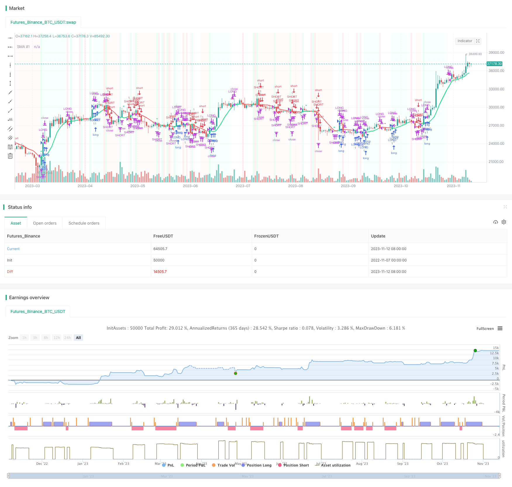

> Name

Multi-Timeframe-Trend-Tracking-Strategy
> Author

ChaoZhang

> Strategy Description


[trans]


## Overview
This strategy uses a combination of moving averages, MACD, RSI and other indicators to identify the trend direction in multiple time frames to achieve trend-following trading on the SPX500 index.
## Strategy Principle
1. Use the 10-day simple moving average to determine the price trend direction. When the price crosses above the 10-day moving average, it is bullish, and when it crosses below, it is bearish.
2. Use positive and negative two-way MACD to determine momentum. Calculate the difference between the 12-day and 21-day exponential moving averages, and then identify the buying and selling signals through the intersection of the fast and slow lines of the moving average difference. When the fast line crosses the slow line, it is bullish, and when it crosses below, it is bearish.
3. Calculate the 14-day RSI and its 50-day moving average. If the RSI crosses the moving average above, it is a bullish signal, and if the RSI crosses below, it is a bearish signal.
4. Confirm trend consistency with 1 minute, 3 minute and 5 minute timeframes.
5. A buy signal is generated when the price crosses above the 10-day moving average, RSI crosses above the moving average, and the MACD fast line crosses the slow line; a sell signal is generated when the price crosses below the 10-day moving average, RSI crosses below the moving average, and the MACD fast line crosses below the slow line.
## Strategic Advantages
1. Use multiple indicator combinations to identify trends and improve signal accuracy. The 10-day moving average determines the main trend direction, MACD determines the strength of momentum, and RSI confirms overbought and oversold. Indicator combinations can verify each other and reduce erroneous transactions.
2. Confirm multiple time frames to avoid being misled by market noise. Double verification of 1-minute, 3-minute, and 5-minute time frames ensures that signals appear simultaneously and filters out false signals.
3. Judging the form based on graphics is intuitive and reliable. Graphics assist in judging price form characteristics, avoiding extreme areas of buying and selling points, and reducing the risk of loss.
4. The trading frequency is moderate and in line with the characteristics of index trading. Using the 10-day moving average as the main judgment indicator, the trading frequency will not be too high, and excessive transaction costs will be avoided due to repeated transactions.
## Strategy Risk
1. Unable to identify market breaks caused by emergencies. Irrational events will disrupt model judgment. At this time, positions should be reduced to avoid risks.
2. The parameter settings are fixed and changes in the market environment are not taken into account. In actual practice, parameters should be dynamically adjusted according to the market environment to adapt the strategy to a variety of market conditions.
3. The buying and selling points are too ideal and difficult to implement in practice. The buying and selling points should be fine-tuned based on slippage costs and other factors to make the signal more enforceable.
4. Multiple time frames increase decision-making delays. Risk control should be done in response to emergencies to reduce losses caused by delays.
## Strategy optimization direction
1. Add stop loss mechanisms, such as trailing stop loss, percentage stop loss, etc., to control single losses.
2. Optimize parameter settings to dynamically adapt parameters to the market environment and improve the robustness of the strategy.
3. Combine risk control with market hot events to avoid the impact of major events on strategies.
4. Considering actual transaction costs such as slippage, adjust the buying and selling points to make the signal executable.
5. Test different value methods, such as K-line, etc., as signal confirmation sources to enrich multi-time frame verification methods.
6. Add machine learning algorithms, use big data to train models, and automatically optimize policy parameters.
## Summarize
This strategy uses multiple indicators to identify trends and multiple time frames to confirm signals to achieve trend-following trading on the SPX500 index. The advantage of the strategy lies in high signal accuracy and strong anti-noise interference ability, but it is necessary to pay attention to risk control and maintain dynamic optimization of strategy parameters. As an effective attempt to optimize the simple moving average strategy, this strategy provides useful inspiration and reference for the optimization of quantitative trading strategies.
||


## Overview

This strategy combines moving averages, MACD and RSI across multiple timeframes to identify trend directions and trade S&P500 index trends.

## Strategy Logic

1. 10-day simple moving average judges price trend. Price crossing above 10-day MA indicates upside, and crossing below indicates downside.

2. MACD judges momentum strength. It calculates difference between 12 and 21-day exponential moving averages, and crossover between the MACD line and signal line generates trading signals. MACD line crossing above signal line indicates upside, and crossing below indicates downside.

3. 14-day RSI and its 50-day MA are calculated. RSI crossing above its MA is bullish signal, and crossing below is bearish signal. 

4. 1-min, 3-min and 5-min timeframes confirm trend consistency.

5. When price crosses above 10-day MA, RSI crosses above its MA, and MACD line crosses above signal line, buy signal is generated. When price crosses below 10-day MA, RSI crosses below its MA, and MACD line crosses below signal line, sell signal is generated.

## Advantages

1. Combining indicators improves signal accuracy. 10-day MA judges main trend, MACD determines momentum strength, and RSI confirms overbought/oversold levels. Indicator combo verifies each other and reduces incorrect trades.

2. Multiple timeframe confirmation avoids market noise. Dual confirmation across 1-min, 3-min and 5-min timeframes ensures concurrent signal appearance and filters out false signals. 

3. Chart pattern assist visual judgment for reliability. Graphical pattern analysis avoids extreme overbought/oversold levels and reduces loss risks.

4. Medium trading frequency suits index trading. 10-day MA as primary indicator prevents excessive trading, avoiding extra transaction costs from overtrading.

## Risks

1. Failure to detect abrupt reversal in irrational events. Such market turmoil disrupts model and should reduce position sizing for risk control.

2. Fixed parameter settings without accounting for changing market conditions. Parameters should be dynamically adjusted for different market regimes in live trading.

3. Overly idealized entry points with execution difficulty in practice. Entry signals should be fine-tuned with slippage to improve executable liquidity. 

4. Multiple timeframes increase signal delay. Proper risk control is required to minimize losses from delay during sudden events.

## Enhancement

1. Incorporate stop loss mechanisms like trailing stop loss and percentage stop loss to control single trade loss.

2. Optimize dynamic parameter settings to adapt to evolving markets and improve strategy robustness. 

3. Consider market regime changes from significant events to avoid model shocks.

4. Account for trading costs like slippage and adjust entry/exit points for better execution.

5. Test different price inputs like candlestick as signal confirmation to diversify multi timeframe validation.

6. Utilize machine learning algorithms on big data to automate strategy optimization.

## Conclusion

This strategy trades S&P500 trends effectively through trend identification with multiple indicators and signal confirmation across timeframes. Its strengths lie in high signal accuracy and noise resilience, but risk control and dynamic parameter tuning are required. As an optimization over simple moving average strategies, it provides valuable inspirations and references for quantitative trading strategy enhancement.

[/trans]

> Strategy Arguments


|Argument|Default|Description|
|----|----|----|
|v_input_1_close|0|SMA Source #1: close|high|low|open|hl2|hlc3|hlcc4|ohlc4|
|v_input_2|true|RSI|


> Source (PineScript)

``` pinescript
/*backtest
start: 2022-11-07 00:00:00
end: 2023-11-13 00:00:00
period: 1d
basePeriod: 1h
exchanges: [{"eid":"Futures_Binance","currency":"BTC_USDT"}]
*/

// This source code is subject to the terms of the Mozilla Public License 2.0 at https://mozilla.org/MPL/2.0/
// USE HEIEN ASHI, 1 min, SPX 500 USD OANDA
// © connor2279
//@version=5
strategy(title="SPX Strategy", shorttitle="SPXS", overlay=true)

//SMA
len1 = 10
src1 = input(close, title="SMA Source #1")
out1 = ta.sma(src1, len1)
plot(out1, title="SMA #1", color=close >= out1 ? color.lime : color.red, linewidth=2)

data_over = ta.crossover(close, out1)
dataO = close >= out1
data_under = ta.crossunder(close, out1)
dataU = close < out1

bgcolor(color=ta.crossover(close, out1) ? color.new(color.lime, 90) : na)
bgcolor(color=ta.crossunder(close, out1) ? color.new(color.red, 90) : na)     

//Norm MacD
sma = 12
lma = 21
tsp = 10
np = 50
    
sh = ta.ema(close,sma)  

lon= ta.ema(close,lma) 

ratio = math.min(sh,lon)/math.max(sh,lon)

Mac = ratio - 1
if(sh>lon)
    Mac := 2-ratio - 1
else
    Mac := ratio - 1

MacNorm = ((Mac-ta.lowest(Mac, np)) /(ta.highest(Mac, np)-ta.lowest(Mac, np)+.000001)*2)- 1

MacNorm2 = MacNorm

if(np<2)
    MacNorm2 := Mac
else
    MacNorm2 := MacNorm
    
Trigger = ta.wma(MacNorm2, tsp)

trigger_above = Trigger >= MacNorm
trigger_under = Trigger < MacNorm
plotshape(ta.crossover(Trigger, MacNorm2), style=shape.triangledown, color=color.red)
plotshape(ta.crossunder(Trigger, MacNorm2), style=shape.triangledown, color=color.lime)

//RSI / SMA RSI
swr=input(true,title="RSI")
src = close
len = 14
srs = 50
up = ta.rma(math.max(ta.change(src), 0), len)
down = ta.rma(-math.min(ta.change(src), 0), len)
rsi = down == 0 ? 100 : up == 0 ? 0 : 100 - (100 / (1 + up / down))
mr = ta.sma(rsi,srs)
rsi_above = rsi >= mr
rsi_under = rsi < mr

//All
buySignal = rsi_above and trigger_under and dataO
shortSignal = rsi_under and trigger_above and dataU
bgcolor(color=buySignal ? color.new(color.lime,97) : na)     
bgcolor(color=shortSignal ? color.new(color.red, 97) : na)     
     
sellSignal = ta.cross(close, out1) or ta.cross(Trigger, MacNorm2) or ta.cross(rsi, mr)
if (buySignal)
    strategy.entry("LONG", strategy.long, 1)

if (shortSignal)
    strategy.entry("SHORT", strategy.short, 1)

// Submit exit orders
strategy.close("LONG", when=sellSignal)
strategy.close("SHORT", when=sellSignal)
```

> Detail

https://www.fmz.com/strategy/432099

> Last Modified

2023-11-14 14:29:39
