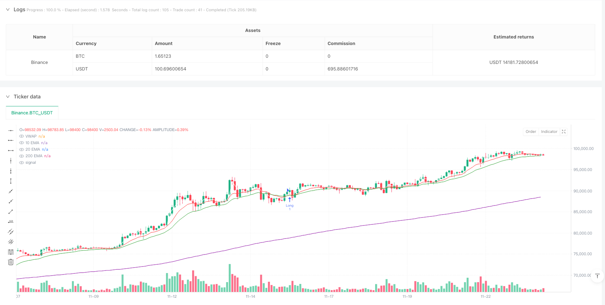
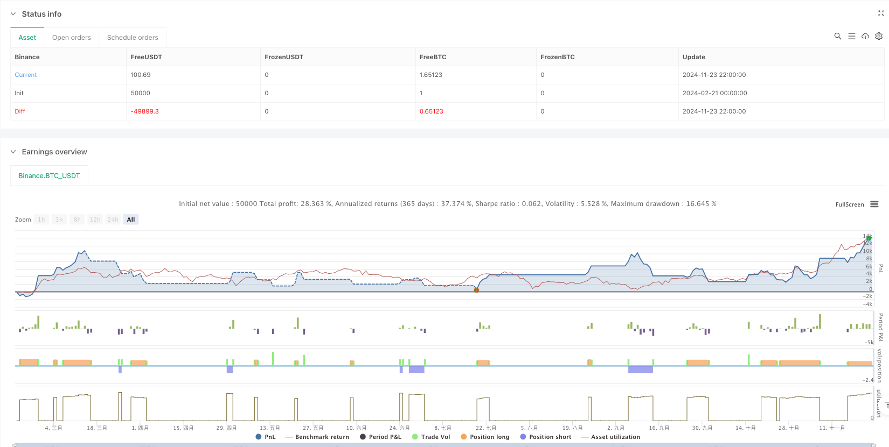

> Name

Multi-Period Volume Weighted Average Price and Moving Average Breakout Trading Strategy-Multi-Timeframe-VWAP-and-EMA-Breakout-Trading-Strategy
> Author

ianzeng123

> Strategy Description





[trans]
#### Overview
This is a trading strategy that combines the Volume Weighted Average Price (VWAP) and the multi-period exponential moving average (EMA). This strategy is mainly used for intraday trading and is particularly suitable for 15-minute time periods. The strategy determines market trends and trading opportunities by analyzing the relationship between price, VWAP and EMA of different periods, combined with trading volume information.
#### Strategy Principle
The strategy uses 10-period, 20-period and 200-period EMA, and VWAP as the core indicator. Trading signals are generated based on the following conditions:
- Bull entry conditions: the price must be higher than VWAP, 200EMA, 10EMA and 20EMA at the same time; the current K-line closing price is higher than the opening price; VWAP is above 200EMA; 10EMA is above 20EMA, and 20EMA is above VWAP.
- Short entry conditions: The opposite combination of conditions to long.
- Stop loss setting: Use the lowest point (long) or the highest point (short) of the previous 10 K lines plus or minus the ATR value.
- Profit target: Set two target levels using a risk-return ratio of 1:2 and 1:3.
#### Strategic Advantages
1. Multiple confirmation mechanism: Through the combined use of multiple technical indicators, the reliability of trading signals is improved.
2. Dynamic risk management: Dynamic stop loss setting based on ATR can adapt to changes in market volatility.
3. Clear profit target: A fixed risk-return ratio is adopted to facilitate traders to control risks.
4. Combination of trend tracking and momentum: Through the cooperation of moving averages of different periods, it is possible to capture trends without missing short-term opportunities.
#### Strategy Risk
1. Lagging risk: EMA and VWAP are both lagging indicators and may not respond in time when the market turns rapidly.
2. Risk of volatile market: During the sideways consolidation phase, too many false breakthrough signals may be generated.
3. Fund management risk: A fixed risk-return ratio may not be suitable for all market environments.
4. Impact of transaction costs: Frequent transactions may lead to higher transaction costs.
#### Strategy optimization direction
1. Introduce volatility filter: ATR percentage threshold can be added to avoid trading in low volatility environment.
2. Optimized time filtering: The best trading time period can be set according to the characteristics of different markets.
3. Dynamically adjust the risk-return ratio: Dynamically adjust the profit target according to market volatility.
4. Add volume confirmation: you can set a minimum volume threshold to improve the reliability of breakthroughs.
#### Summary
This strategy builds a complete trading system by combining multiple technical indicators. The core advantage of the strategy lies in the multiple confirmation mechanism and complete risk management system. Although there is a certain degree of hysteresis risk, the stability and profitability of the strategy can be further improved through the recommended optimization direction. The strategy is particularly suitable for day traders, but parameters need to be optimized according to specific market characteristics. ||
#### Overview
This is a trading strategy that combines Volume Weighted Average Price (VWAP) and multiple-timeframe Exponential Moving Averages (EMA). The strategy is designed for intraday trading, particularly suitable for 15-minute timeframes. It determines market trends and trading opportunities by analyzing price relationships with VWAP and different period EMAs, incorporating volume information.

#### Strategy Principles
The strategy utilizes 10-period, 20-period, and 200-period EMAs, along with VWAP as core indicators. Trading signals are generated based on the following conditions:
- Long entry conditions: Price must be above VWAP, 200EMA, 10EMA, and 20EMA; current candle closes above open; VWAP above 200EMA; 10EMA above 20EMA, and 20EMA above VWAP.
- Short entry conditions: Reverse conditions of long entries.
- Stop-loss: Uses 10-period low (for longs) or high (for shorts) plus/minus ATR value.
- Profit targets: Sets two targets using 1:2 and 1:3 risk-reward ratios.

#### Strategy Advantages
1. Multiple confirmation mechanism: Improves signal reliability through the combination of multiple technical indicators.
2. Dynamic risk management: ATR-based dynamic stop-loss adapts to market volatility changes.
3. Clear profit objectives: Fixed risk-reward ratios facilitate risk control for traders.
4. Trend following with momentum: Combines different period moving averages to capture both trends and short-term opportunities.

#### Strategy Risks
1. Lag risk: EMA and VWAP are lagging indicators, potentially slow to react to rapid market reversals.
2. Choppy market risk: May generate excessive false breakout signals during consolidation phases.
3. Money management risk: Fixed risk-reward ratios might not suit all market conditions.
4. Transaction cost impact: Frequent trading may result in high transaction costs.

#### Strategy Optimization Directions
1. Implement volatility filter: Add ATR percentage threshold to avoid trading in low volatility environments.
2. Optimize time filtering: Set optimal trading time windows based on specific market characteristics.
3. Dynamic risk-reward adjustment: Adjust profit targets based on market volatility.
4. Add volume confirmation: Set minimum volume thresholds to improve breakout reliability.

#### Summary
This strategy builds a comprehensive trading system by combining multiple technical indicators. Its core strengths lie in the multiple confirmation mechanism and robust risk management system. While there are inherent lag risks, the suggested optimization directions can further enhance strategy stability and profitability. The strategy is particularly suitable for intraday traders but requires parameter optimization based on specific market characteristics.[/trans]


> Source (PineScript)

``` pinescript
/*backtest
start: 2024-02-21 00:00:00
end: 2024-11-24 00:00:00
period: 2h
basePeriod: 2h
exchanges: [{"eid":"Binance","currency":"BTC_USDT"}]
*/

//@version=5
strategy("VWAP EMA Breakout", overlay=true)

// Define Indicators
ema10 = ta.ema(close, 10)
ema20 = ta.ema(close, 20)
ema200 = ta.ema(close, 200)
vwap = ta.vwap(close)
atr = ta.atr(14)

// Price Conditions (Long)
priceAboveVWAP200EMA = close > vwap and close > ema200 and close > ema10 and close > ema20
bullishCandle = close > open

// Additional Conditions for VWAP and EMA Relationships (Long)
vwapAbove200EMA = vwap > ema200
emaConditions = ema10 > ema20 and ema20 > vwap and vwap > ema200

// Entry Conditions (Long)
longCondition = priceAboveVWAP200EMA and bullishCandle and vwapAbove200EMA and emaConditions

// Stop-Loss & Take-Profit (Long)
swingLow = ta.lowest(low, 10)
stopLossLong = swingLow - atr
riskLong = close - stopLossLong
takeProfitLong2 = close + (riskLong * 2) // 1:2 RR
takeProfitLong3 = close + (riskLong * 3) // 1:3 RR

// Execute Long Trade
if longCondition
    strategy.entry("Long", strategy.long)
    strategy.exit("TP 1:2", from_entry="Long", limit=takeProfitLong2, stop=stopLossLong)
    strategy.exit("TP 1:3", from_entry="Long", limit=takeProfitLong3, stop=stopLossLong)

// Price Conditions (Short)
priceBelowVWAP200EMA = close < vwap and close < ema200 and close < ema10 and close < ema20
bearishCandle = close < open

// Additional Conditions for VWAP and EMA Relationships (Short)
vwapBelow200EMA = vwap < ema200
emaConditionsShort = ema10 < ema20 and ema20 < vwap and vwap < ema200

// Entry Conditions (Short)
shortCondition = priceBelowVWAP200EMA and bearishCandle and vwapBelow200EMA and emaConditionsShort

// Stop-Loss & Take-Profit (Short)
swingHigh = ta.highest(high, 10)
stopLossShort = swingHigh + atr
riskShort = stopLossShort - close
takeProfitShort2 = close - (riskShort * 2) // 1:2 RR
takeProfitShort3 = close - (riskShort * 3) // 1:3 RR

// Execute Short Trade
if shortCondition
    strategy.entry("Short", strategy.short)
    strategy.exit("TP 1:2", from_entry="Short", limit=takeProfitShort2, stop=stopLossShort)
    strategy.exit("TP 1:3", from_entry="Short", limit=takeProfitShort3, stop=stopLossShort)

// Plot Indicators
plot(ema10, color=color.red, title="10 EMA")
plot(ema20, color=color.green, title="20 EMA")
plot(ema200, color=color.purple, title="200 EMA")
plot(vwap, color=color.white, title="VWAP")

```

> Detail

https://www.fmz.com/strategy/482823

> Last Modified

2025-02-20 13:25:02
