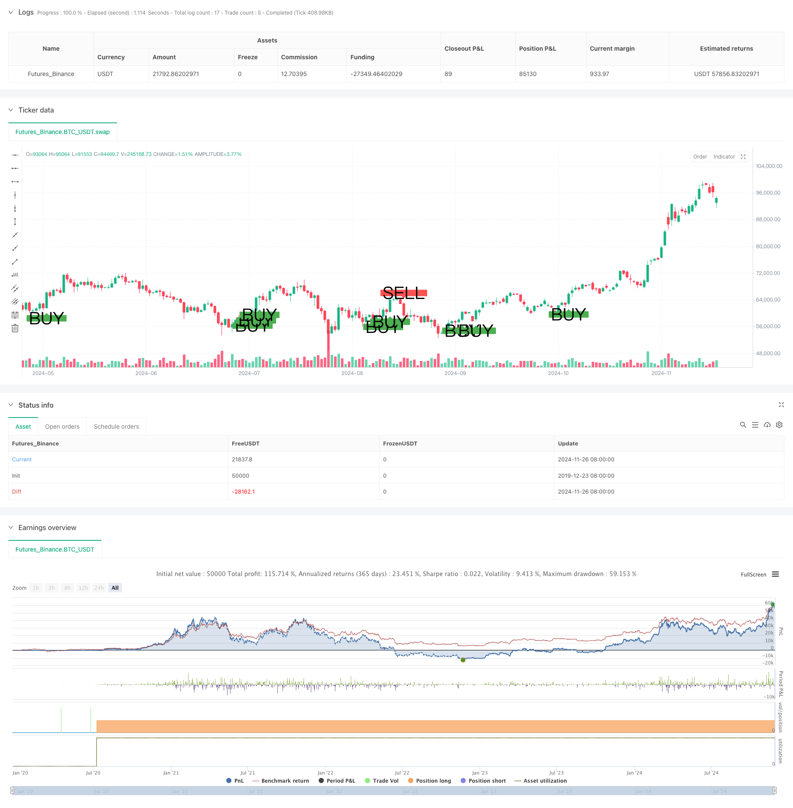

> Name

Multi-Trend-Following-and-Structure-Breakout-Strategy
> Author

ChaoZhang

> Strategy Description



[trans]
#### Overview
This is a comprehensive trading strategy that combines multiple moving averages, trend following, structural breakouts, and momentum indicators. This strategy determines trading signals by analyzing the trend direction of multiple time periods and combining price structure breakthroughs and callback buys. The strategy uses fixed stop loss and profit targets to manage risks, and uses multiple verification mechanisms to improve the accuracy of transactions.
#### Strategy Principle
The strategy uses three exponential moving averages (EMA25, EMA50, and EMA200) to determine market trends. When the price is above EMA200 and EMA200 slopes upward, it is considered to be in an uptrend; otherwise, it is considered a downtrend. After determining the trend direction, the strategy looks for price retracement opportunities against EMA25 or EMA50. At the same time, the strategy also needs to confirm the recent high or low breakthrough, as well as the position of the K-line closing price relative to the opening price to verify the direction of momentum. The RSI indicator serves as an additional filtering condition, requiring the buy signal RSI to be greater than 50 and the sell signal RSI to be less than 50.
#### Strategic Advantages
1. The multi-verification mechanism significantly improves the reliability of transactions
2. Combines trend and momentum analysis to reduce the risk of false breakthroughs
3. Clear stop loss and profit targets help with emotional management
4. The strategy logic is simple and clear, easy to understand and execute
5. Suitable for different market environments and trading varieties
#### Strategy Risk
1. Multiple conditions may lead to missing some trading opportunities
2. Fixed stop loss and profit targets may not be suitable for all market environments
3. Frequent stop losses may be triggered in violently volatile markets
4. Continuous monitoring of the market is required to ensure the suitability of strategy parameters
5. More false signals may be generated in sideways markets
#### Strategy optimization direction
1. Introduce adaptive stop loss and profit target calculation methods
2. Add transaction volume analysis as an auxiliary confirmation indicator
3. Consider adding a market volatility filtering mechanism
4. Optimize the time period selection for trend judgment
5. Increase the adaptability of strategies in different market environments
#### Summary
This is a well-designed comprehensive trading strategy that effectively balances trading opportunities and risk control through the combined use of multiple technical indicators. The core advantage of the strategy lies in its strict multi-verification mechanism, which helps improve the success rate of transactions. Although there are some areas that need optimization, overall, this is a strategy framework worth trying. ||
#### Overview
This is a comprehensive trading strategy that combines multiple moving averages, trend following, structure breakouts, and momentum indicators. The strategy determines trading signals by analyzing trends across multiple timeframes while incorporating price structure breakouts and pullback entries. It employs fixed stop-loss and take-profit targets for risk management and uses multiple validation mechanisms to enhance trading accuracy.

#### Strategy Principles
The strategy employs three exponential moving averages (EMA25, EMA50, and EMA200) to determine market trends. An uptrend is identified when price is above EMA200 and EMA200 is sloping upward; the opposite indicates a downtrend. After determining trend direction, the strategy looks for price pullbacks to EMA25 or EMA50. Additionally, the strategy requires confirmation of recent highs or lows breakouts and the position of closing prices relative to opening prices to verify momentum direction. The RSI indicator serves as an additional filter, requiring RSI above 50 for buy signals and below 50 for sell signals.

#### Strategy Advantages
1. Multiple validation mechanisms significantly improve trading reliability
2. Integration of trend and momentum analysis reduces false breakout risks
3. Clear stop-loss and take-profit targets aid in emotional management
4. Simple and clear strategy logic, easy to understand and execute
5. Applicable to various market environments and trading instruments

#### Strategy Risks
1. Multiple conditions may cause missed trading opportunities
2. Fixed stop-loss and take-profit targets may not suit all market conditions
3. May trigger frequent stops in highly volatile markets
4. Requires continuous market monitoring to ensure parameter suitability
5. May generate false signals in ranging markets

#### Strategy Optimization Directions
1. Introduce adaptive stop-loss and take-profit calculation methods
2. Add volume analysis as a confirmatory indicator
3. Consider implementing market volatility filters
4. Optimize timeframe selection for trend determination
5. Enhance strategy adaptability across different market conditions

#### Summary
This is a well-designed comprehensive trading strategy that effectively balances trading opportunities and risk control through the coordinated use of multiple technical indicators. The strategy's core strength lies in its strict multiple validation mechanism, which helps improve trading success rates. While there are areas for optimization, overall, this represents a worthwhile strategy framework to explore.[/trans]


> Source (PineScript)

``` pinescript
/*backtest
start: 2019-12-23 08:00:00
end: 2024-11-27 08:00:00
period: 1d
basePeriod: 1d
exchanges: [{"eid":"Futures_Binance","currency":"BTC_USDT"}]
*/

//@version=5
strategy("Custom Buy/Sell Strategy", overlay=true)

// Input parameters
ema25 = ta.ema(close, 25)
ema50 = ta.ema(close, 50)
ema200 = ta.ema(close, 200)
rsi = ta.rsi(close, 14)
sl_pips = 10
tp_pips = 15

// Convert pips to price units
sl_price_units = sl_pips * syminfo.pointvalue
tp_price_units = tp_pips * syminfo.pointvalue

// Define conditions for buy and sell signals
uptrend_condition = ema200 < close and ta.rising(ema200, 1)
downtrend_condition = ema200 > close and ta.falling(ema200, 1)

pullback_to_ema25 = low <= ema25
pullback_to_ema50 = low <= ema50
pullback_condition = pullback_to_ema25 or pullback_to_ema50

break_of_structure = high > ta.highest(high, 5)[1]
candle_imbalance = close > open

buy_condition = uptrend_condition and pullback_condition and rsi > 50 and break_of_structure and candle_imbalance

pullback_to_ema25_sell = high >= ema25
pullback_to_ema50_sell = high >= ema50
pullback_condition_sell = pullback_to_ema25_sell or pullback_to_ema50_sell

break_of_structure_sell = low < ta.lowest(low, 5)[1]
candle_imbalance_sell = close < open

sell_condition = downtrend_condition and pullback_condition_sell and rsi < 50 and break_of_structure_sell and candle_imbalance_sell

// Plot signals on the chart
plotshape(series=buy_condition, location=location.belowbar, color=color.green, style=shape.labelup, text="BUY", size=size.large)
plotshape(series=sell_condition, location=location.abovebar, color=color.red, style=shape.labeldown, text="SELL", size=size.large)

// Calculate stop loss and take profit levels for buy signals
var float buy_sl = na
var float buy_tp = na

if buy_condition and strategy.position_size == 0
    buy_sl := close - sl_price_units
    buy_tp := close + tp_price_units
    strategy.entry("Buy", strategy.long)
    strategy.exit("TP/SL Buy", from_entry="Buy", limit=buy_tp, stop=buy_sl)
    label.new(bar_index, high, text="Entry: " + str.tostring(close) + "\nSL: " + str.tostring(buy_sl) + "\nTP: " + str.tostring(buy_tp), style=label.style_label_up, color=color.green, textcolor=color.white, size=size.small)

// Calculate stop loss and take profit levels for sell signals
var float sell_sl = na
var float sell_tp = na

if sell_condition and strategy.position_size == 0
    sell_sl := close + sl_price_units
    sell_tp := close - tp_price_units
    strategy.entry("Sell", strategy.short)
    strategy.exit("TP/SL Sell", from_entry="Sell", limit=sell_tp, stop=sell_sl)
    label.new(bar_index, low, text="Entry: " + str.tostring(close) + "\nSL: " + str.tostring(sell_sl) + "\nTP: " + str.tostring(sell_tp), style=label.style_label_down, color=color.red, textcolor=color.white, size=size.small)

// // Plot stop loss and take profit levels for buy signals
// if not na(buy_sl)
//     line.new(x1=bar_index, y1=buy_sl, x2=bar_index + 1, y2=buy_sl, color=color.red, width=1)
// if not na(buy_tp)
//     line.new(x1=bar_index, y1=buy_tp, x2=bar_index + 1, y2=buy_tp, color=color.green, width=1)

// // Plot stop loss and take profit levels for sell signals
// if not na(sell_sl)
//     line.new(x1=bar_index, y1=sell_sl, x2=bar_index + 1, y2=sell_sl, color=color.red, width=1)
// if not na(sell_tp)
//     line.new(x1=bar_index, y1=sell_tp, x2=bar_index + 1, y2=sell_tp, color=color.green, width=1)

```

> Detail

https://www.fmz.com/strategy/473364

> Last Modified

2024-11-29 15:27:01
