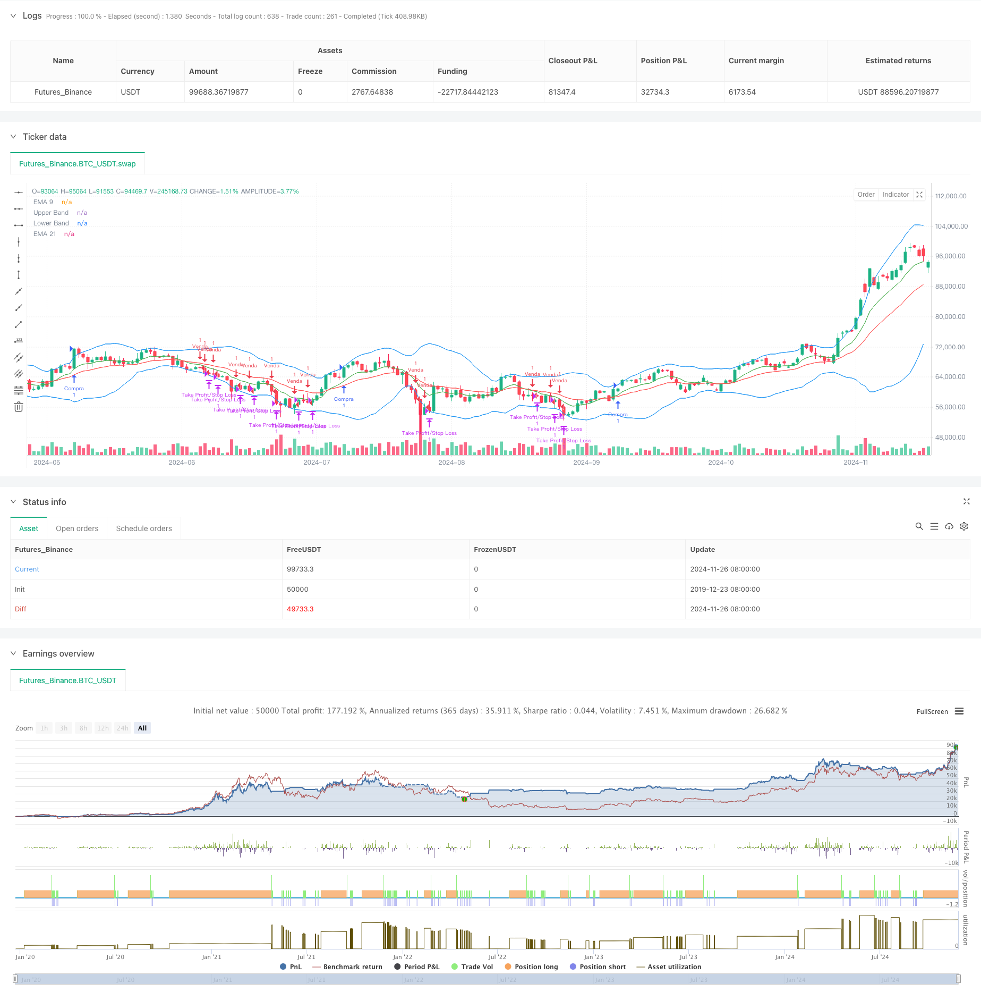

> Name

Multi-Trend-Momentum-Crossover-Strategy-with-Volatility-Optimization-System
> Author

ChaoZhang

> Strategy Description



[trans]
#### Overview
This strategy is a comprehensive trend following system that combines multiple technical indicators and momentum analysis methods. The core of the strategy uses a combination of moving average crossover, trend confirmation and momentum indicators to control risks through volatility to achieve a grasp of market trends and effective risk management. This strategy has good adaptability in market environments with obvious mid- to long-term trends.
#### Strategy Principle
The strategy adopts a multi-level signal confirmation mechanism, which mainly includes the following key elements:
1. Use the 9-day and 21-day exponential moving averages (EMA) as the main trend indicators
2. Confirm the trend momentum through the MACD indicator, which requires the MACD line and the signal line to be in the same direction.
3. Use the RSI indicator to judge overbought and oversold, and set a reasonable range.
4. Use Bollinger Bands to monitor price fluctuation ranges
5. Dynamically set stop loss and profit targets through the ATR indicator
6. Use trading volume confirmation, which requires the trading volume to be greater than the 14-day average volume
The trading conditions for comprehensive judgment of multiple signals are as follows:
Long conditions: EMA9 crosses EMA21, the MACD line is greater than the signal line and is positive, the RSI is between 40-70, and the price is above EMA9
Short selling conditions: EMA9 crosses EMA21, the MACD line is smaller than the signal line and is negative, the RSI is between 30-60, and the price is below EMA9
#### Strategic Advantages
1. The combined use of multiple technical indicators improves the reliability of signals
2. Dynamically adjust the stop loss position through ATR to adapt to market fluctuations
3. Combined with transaction volume confirmation to improve the effectiveness of transactions
4. Set a reasonable RSI range to avoid chasing the high and killing the low.
5. Use Bollinger Bands to assist in judging market fluctuations
6. The take-profit and stop-loss ratio is 2:1, which has a good risk-benefit ratio.
#### Strategy Risk
1. Multiple indicators may cause signal lag and miss opportunities in fast market conditions.
2. Frequent false signals may occur in volatile markets
3. Fixed RSI ranges may limit trading opportunities in special market environments
4. Reliance on trading volume may affect strategy performance in low liquidity environments
5. The setting of the stop loss position may be easily triggered in highly volatile market conditions.
#### Strategy optimization direction
1. Consider introducing an adaptive parameter adjustment mechanism to dynamically adjust indicator parameters according to market conditions.
2. Add market environment classification and use different parameter combinations under different market conditions.
3. You can consider adding a trend strength indicator to improve the accuracy of trend judgment.
4. Optimize the stop loss mechanism and consider using trailing stop loss or compound stop loss strategy
5. Add trading volume filter to avoid trading in low liquidity environment
6. Consider adding time filters to avoid trading during unfavorable times
#### Summary
This strategy uses a combination of multiple technical indicators to build a relatively complete trend-following trading system. The core advantage of the strategy lies in the reliability of the signal and the rationality of risk control, but there are also certain hysteresis and parameter optimization problems. Through the proposed optimization direction, the strategy is expected to achieve better performance in real market applications. It is recommended to conduct sufficient historical data testing in actual applications and adjust parameters according to specific market characteristics. ||
#### Overview
This strategy is a comprehensive trend-following system that combines multiple technical indicators and momentum analysis methods. The core of the strategy utilizes moving average crossovers, trend confirmation, and momentum indicators, combined with volatility control for risk management. The strategy shows good adaptability in markets with clear medium to long-term trends.

#### Strategy Principles
The strategy employs a multi-layered signal confirmation mechanism, including the following key elements:
1. Uses 9-day and 21-day Exponential Moving Averages (EMA) as primary trend indicators
2. Confirms trend momentum using MACD indicator, requiring alignment of MACD and signal lines
3. Incorporates RSI for overbought/oversold conditions within defined ranges
4. Monitors price volatility using Bollinger Bands
5. Sets dynamic stop-loss and take-profit levels using ATR
6. Confirms trades with volume analysis, requiring above 14-day average volume

The comprehensive trading conditions are:
Long conditions: EMA9 crosses above EMA21, MACD line above signal line and positive, RSI between 40-70, price above EMA9
Short conditions: EMA9 crosses below EMA21, MACD line below signal line and negative, RSI between 30-60, price below EMA9

#### Strategy Advantages
1. Multiple technical indicators improve signal reliability
2. Dynamic stop-loss adjustment using ATR adapts to market volatility
3. Volume confirmation enhances trade validity
4. Reasonable RSI ranges prevent chasing extremes
5. Bollinger Bands assist in volatility state assessment
6. 2:1 profit-to-loss ratio provides favorable risk-reward profile

#### Strategy Risks
1. Multiple indicators may cause signal lag, missing opportunities in fast markets
2. May generate frequent false signals in ranging markets
3. Fixed RSI ranges might limit trading opportunities in special market conditions
4. Volume dependency may affect performance in low liquidity environments
5. Stop-loss positions may be easily triggered in high volatility conditions

#### Optimization Directions
1. Consider implementing adaptive parameter adjustment based on market conditions
2. Add market state classification to use different parameter sets for different market conditions
3. Consider adding trend strength indicators to improve trend identification accuracy
4. Optimize stop-loss mechanism by implementing trailing stops or composite stop strategies
5. Add volume filters to avoid trading in low liquidity conditions
6. Consider adding time filters to avoid trading during unfavorable periods

#### Summary
This strategy constructs a relatively complete trend-following trading system through the combination of multiple technical indicators. The core advantages lie in signal reliability and rational risk control, though it faces challenges with lag and parameter optimization. Through the proposed optimization directions, the strategy has potential for improved performance in live trading. It is recommended to conduct thorough historical data testing and adjust parameters according to specific market characteristics before implementation.[/trans]


> Source (PineScript)

``` pinescript
/*backtest
start: 2019-12-23 08:00:00
end: 2024-11-27 08:00:00
period: 1d
basePeriod: 1d
exchanges: [{"eid":"Futures_Binance","currency":"BTC_USDT"}]
*/

//@version=5
strategy("Estratégia Cripto - 1D", shorttitle="Estratégia Cripto", overlay=true)

// Definição das Médias Móveis Exponenciais (EMA)
ema9 = ta.ema(close, 9)
ema21 = ta.ema(close, 21)

// Definição do MACD
[macdLine, signalLine, _] = ta.macd(close, 12, 26, 9)

// Definição do RSI
rsi = ta.rsi(close, 14)

// Volume médio
volMedio = ta.sma(volume, 14)

// Definição das Bollinger Bands
basis = ta.sma(close, 20)
dev = ta.stdev(close, 20)
upperBand = basis + 2 * dev
lowerBand = basis - 2 * dev

// Condições de Compra (Long)
longCondition = (ema9 > ema21) and (macdLine > signalLine) and (macdLine > 0) and (volume > volMedio) and (rsi > 40 and rsi < 70) and (close > ema9)
if (longCondition)
    strategy.entry("Compra", strategy.long)

// Condições de Venda (Short)
shortCondition = (ema9 < ema21) and (macdLine < signalLine) and (macdLine < 0) and (volume > volMedio) and (rsi < 60 and rsi > 30) and (close < ema9)
if (shortCondition)
    strategy.entry("Venda", strategy.short)

// Stop Loss e Take Profit
strategy.exit("Take Profit/Stop Loss", from_entry="Compra", loss=200, profit=400)
strategy.exit("Take Profit/Stop Loss", from_entry="Venda", loss=200, profit=400)

// Plotagem das Médias Móveis e Bollinger Bands
plot(ema9, color=color.green, title="EMA 9")
plot(ema21, color=color.red, title="EMA 21")
plot(upperBand, color=color.blue, title="Upper Band")
plot(lowerBand, color=color.blue, title="Lower Band")

```

> Detail

https://www.fmz.com/strategy/473382

> Last Modified

2024-11-29 16:07:17
