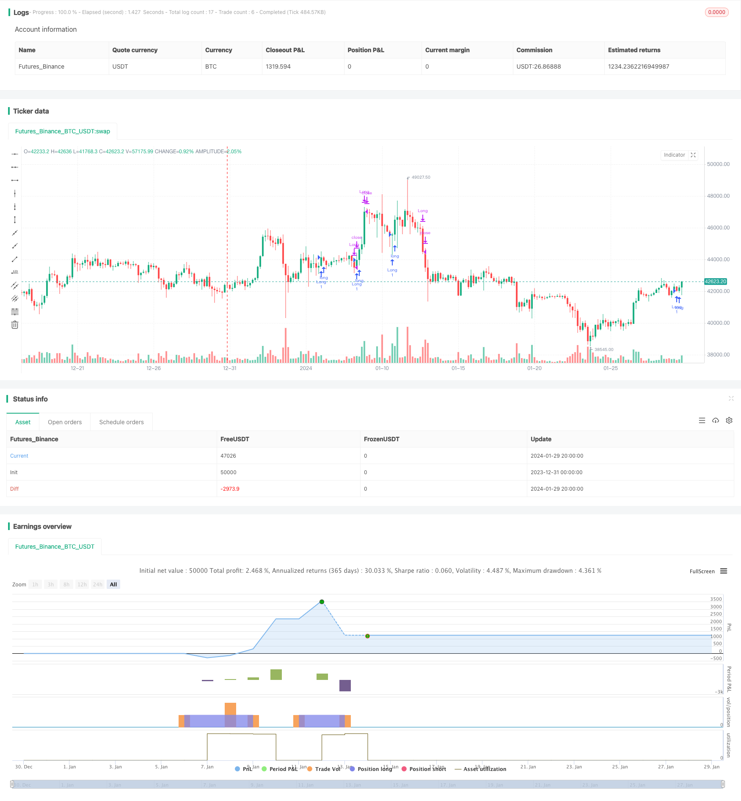

> Name

Based on multi-factor quantitative trading strategyMulti-factor-Quantitative-Trading-Strategy
> Author

ChaoZhang

> Strategy Description


 [trans]

## Overview
This strategy is a quantitative trading strategy that combines a variety of technical indicators. It integrates moving averages, MACD, Bollinger Bands, RSI and other indicators to realize automated trading driven by multi-factor models.
## Strategy Principle
The trading signals of this strategy come from the following parts:
1. The double moving averages form a golden cross.
2. MACD forms an upward crossing of the zero axis and a downward crossing of the zero axis.
3. Bollinger Bands upper and lower track reversal
4. RSI overbought and oversold zone reversal
When multiple of the above indicators send out buy or sell signals at the same time, this strategy will perform corresponding buy opening or sell closing operations.
Specifically, when the fast moving average crosses the slow moving average, MACD histograms show columnar growth, RSI rebounds from the oversold zone and rises, and the price is close to the lower Bollinger Band, it is considered that the market has reversed, thus generating a buy signal.
When the fast moving average crosses the slow moving average, the MACD histograms show reduced columnar lines, the RSI falls from the overbought zone, and the price is close to the upper Bollinger Band, it is believed that the market is about to peak, thus generating a sell signal.
By sending signals through such a combination of multiple indicators, false signals can be effectively filtered and strategy stability improved.
## Advantage Analysis
The biggest advantage of this strategy is that it uses a multi-factor model for trading, which can improve the reliability of signals and enhance the stability and profitability of the strategy.
1. Multi-factor models can mutually verify trading signals and effectively reduce the interference of false signals.
2. Different types of indicators can capture more comprehensive characteristics of market conditions and make more accurate judgments.
3. Multi-factor combination can smooth out the oscillation characteristics of a single indicator and ensure more stable returns.
4. The indicators in the portfolio and the weight of each indicator can be flexibly adjusted to personalize strategies for different markets.
## Risk Analysis
There are also some risks to be aware of with this strategy:
1. Complex multi-index combinations, parameter settings and index selection require precise calculation and testing, otherwise failure signals are likely to be generated.
2. The effect of a single variety may be unstable. It is necessary to select a suitable combination of varieties for cross-species transactions to diversify the risks of a single variety.
3. It is necessary to strictly control the position size and stop loss strategy to prevent the expansion of losses caused by extreme market conditions.
## Optimization direction
This strategy has the following optimization directions:
1. Test more combinations of indicators to find optimal parameters. Other indicators such as volatility, trading volume, etc. are introduced into the portfolio.
2. Use machine learning methods to automatically generate optimal strategy combinations and parameter configurations.
3. Test and optimize on a longer time scale, and adjust weights for different market stages.
4. Combined with risk management tools, strictly control single stop loss and overall position.
## Summarize
This strategy comprehensively uses a variety of trading indicators to form a multi-factor model, effectively utilizing the advantages of different indicators and enhancing signal judgment capabilities. At the same time, attention must be paid to risk prevention and control, and the stability and profitability of the strategy can be continuously improved through parameter optimization and updating.
||

## Overview

This is a quantitative trading strategy that incorporates multiple technical indicators. It combines moving averages, MACD, Bollinger Bands, RSI and other indicators to implement a multi-factor model driven automated trading.

## Strategy Logic

The trading signals of this strategy come from the following parts:

1. Golden cross and death cross of dual moving averages  
2. MACD zero line crossovers
3. Bollinger Bands upper and lower rail reversals
4. RSI overbought and oversold reversals

When the above indicators simultaneously issue buy or sell signals, the strategy will make corresponding long or short decisions. 

Specifically, when the fast moving average crosses over the slow one, MACD histograms start to increase, RSI bounces up from oversold zone, and price approaches the Bollinger Bands lower rail, it's considered as a trend reversal signal for long entry.

And when the fast MA crosses below the slow MA, MACD histograms begin to decline, RSI drops from overbought area, and price reaches the upper Bollinger Bands, it's regarded as a short-term top reversal for short entry.

By combining signals from multiple indicators, fake signals can be filtered out effectively and the stability of the strategy can be improved.

## Advantage Analysis 

The biggest advantage of this strategy is that it adopts a multi-factor model for trading, which enhances the reliability of signals, stability and profitability of the strategy.

1. The multi-factor model can verify trading signals with each other and reduce interference from fake signals effectively.

2. Indicators from different categories can capture more comprehensive characteristics of market movements and make more accurate judgements.  

3. The combination of multiple indicators can smooth out fluctuations of individual ones and ensure more steady returns.

4. The indicators and their weights in the combination can be flexibly adjusted to tailor the strategy for different market conditions.

## Risk Analysis

Some risks of this strategy should be concerned:

1. The complex combination of multiple indicators requires precise parameter tuning and testing, otherwise it may produce invalid signals.

2. The performance on a single product may not be stable enough. A portfolio consisting of suitable products should be constructed to diversify risks.

3. Position sizing and stop loss mechanisms should be strictly controlled to limit losses under extreme market conditions. 

## Optimization Directions

Some directions this strategy can be optimized:

1. Test combinations of more indicators to find out the optimal parameters, such as implied volatility, volume etc.

2. Utilize machine learning methods to automatically generate optimal combinations of indicators and parameter sets.

3. Do more backtests and optimization on longer time frames, adjust weights accordingly for different market stages. 

4. Incorporate risk management tools to control losses on single trades and overall positions strictly.

## Conclusion

This strategy makes full use of advantages of different technical indicators and forms a multi-factor model, which improves the accuracy of signals effectively. Meanwhile, risk control, parameters tuning and strategy updating are also vital to keep improving the stability and profitability.

[/trans]

> Strategy Arguments


|Argument|Default|Description|
|----|----|----|
|v_input_1|false|Короткие сделки|
|v_input_2|true|Длинные сделки|
|v_input_3|21|Быстрый период|
|v_input_4|26|Медленный период|
|v_input_5|9|Тенкан-сен|
|v_input_6|26|Киджун-сен|
|v_input_7|52|Сенкоу-спан B|
|v_input_8|14|ADX период|
|v_input_9|30|ADX уровень|
|v_input_10|14|RSI период|
|v_input_11|70|RSI перекупленность|
|v_input_12|30|RSI перепроданность|
|v_input_13|14|OBV период|


> Source (PineScript)

``` pinescript
/*backtest
start: 2023-12-31 00:00:00
end: 2024-01-30 00:00:00
period: 4h
basePeriod: 15m
exchanges: [{"eid":"Futures_Binance","currency":"BTC_USDT"}]
*/

//@version=5
strategy("Математическая Торговая Система с Ишимоку, TP/SL, ADX, RSI, OBV", shorttitle="МТС Ишимоку TP/SL ADX RSI OBV", overlay=true)

is_short_enable = input(0, title="Короткие сделки")
is_long_enable = input(1, title="Длинные сделки")

// Входные параметры для скользящих средних
fast_length = input(21, title="Быстрый период")
slow_length = input(26, title="Медленный период")

// Входные параметры для Ишимоку
tenkan_length = input(9, title="Тенкан-сен")
kijun_length = input(26, title="Киджун-сен")
senkou_length = input(52, title="Сенкоу-спан B")

// Входные параметры для ADX
adx_length = input(14, title="ADX период")
adx_level = input(30, title="ADX уровень")

// Входные параметры для RSI
rsi_length = input(14, title="RSI период")
rsi_overbought = input(70, title="RSI перекупленность")
rsi_oversold = input(30, title="RSI перепроданность")

// Входные параметры для OBV
obv_length = input(14, title="OBV период")

// Вычисление скользящих средних
fast_ma = ta.sma(close, fast_length)
slow_ma = ta.sma(close, slow_length)

// Вычисление Ишимоку
tenkan_sen = ta.sma(high + low, tenkan_length) / 2
kijun_sen = ta.sma(high + low, kijun_length) / 2
senkou_span_a = (tenkan_sen + kijun_sen) / 2
senkou_span_b = ta.sma(close, senkou_length)

// Вычисление ADX
[diplus, diminus, adx_value] = ta.dmi(14, adx_length)

// Вычисление RSI
rsi_value = ta.rsi(close, rsi_length)

// Вычисление OBV
f_obv() => ta.cum(math.sign(ta.change(close)) * volume)
f_obv_1() => ta.cum(math.sign(ta.change(close[1])) * volume[1])
f_obv_2() => ta.cum(math.sign(ta.change(close[2])) * volume[2])
f_obv_3() => ta.cum(math.sign(ta.change(close[3])) * volume[3])
obv_value = f_obv()

price_is_up = close[1] > close[3] 
price_crossover_fast_ma = close > fast_ma
fast_ma_is_up = ta.sma(close[1], fast_length) > ta.sma(close[3], fast_length)
rsi_is_trand_up = ta.rsi(close[1], rsi_length) > ta.rsi(close[3], rsi_length)
rsi_is_upper_50 = rsi_value > 50
obv_is_trand_up = f_obv_1() > f_obv_3() and obv_value > ta.sma(obv_value, obv_length)
is_up = price_is_up and price_crossover_fast_ma and fast_ma_is_up and rsi_is_trand_up and rsi_is_upper_50 and obv_is_trand_up

fast_ma_is_down = close < fast_ma
rsi_is_trend_down =  ta.rsi(close[1], rsi_length) < ta.rsi(close[2], rsi_length)
rsi_is_crossover_sma = rsi_value < ta.sma(rsi_value, rsi_length)
obv_is_trend_down =  f_obv_1() < f_obv_2()
obv_is_crossover_sma = obv_value < ta.sma(obv_value, obv_length)
is_down = fast_ma_is_down and rsi_is_trend_down and rsi_is_crossover_sma and obv_is_trend_down and obv_is_crossover_sma

//----------//
// MOMENTUM //
//----------//
ema8 = ta.ema(close, 8)
ema13 = ta.ema(close, 13)
ema21 = ta.ema(close, 21)
ema34 = ta.ema(close, 34)
ema55 = ta.ema(close, 55)

longEmaCondition = ema8 > ema13 and ema13 > ema21 and ema21 > ema34 and ema34 > ema55
exitLongEmaCondition = ema13 < ema55

shortEmaCondition = ema8 < ema13 and ema13 < ema21 and ema21 < ema34 and ema34 < ema55
exitShortEmaCondition = ema13 > ema55

// ----------  //
// OSCILLATORS //
// ----------- //
rsi = ta.rsi(close, 14)
longRsiCondition = rsi < 70 and rsi > 40
exitLongRsiCondition = rsi > 70

shortRsiCondition = rsi > 30 and rsi < 60
exitShortRsiCondition = rsi < 30

// Stochastic
length = 14, smoothK = 3, smoothD = 3
kFast = ta.stoch(close, high, low, 14)
dSlow = ta.sma(kFast, smoothD)

longStochasticCondition = kFast < 80
exitLongStochasticCondition = kFast > 95

shortStochasticCondition = kFast > 20
exitShortStochasticCondition = kFast < 5

// Логика входа и выхода
longCondition = longEmaCondition and longRsiCondition and longStochasticCondition and strategy.position_size == 0
exitLongCondition = (exitLongEmaCondition or exitLongRsiCondition or exitLongStochasticCondition) and strategy.position_size > 0

shortCondition = shortEmaCondition and shortRsiCondition and shortStochasticCondition and strategy.position_size == 0
exitShortCondition = (exitShortEmaCondition or exitShortRsiCondition or exitShortStochasticCondition) and strategy.position_size < 0

enter_long = (ta.crossover(close, senkou_span_a) or is_up) and longCondition
enter_short = (ta.crossunder(close, senkou_span_a) or is_down) and shortCondition

exit_long = ((ta.crossunder(fast_ma, slow_ma) or ta.crossunder(close, senkou_span_b) or enter_short) or exitLongCondition) 
exit_short = ((ta.crossover(fast_ma, slow_ma) or ta.crossover(close, senkou_span_b) or enter_long) or exitShortCondition)

// Выполнение сделок
if is_long_enable == 1
    strategy.entry("Long", strategy.long, when=enter_long)
    strategy.close("Long", when=exit_long)

if is_short_enable == 1
    strategy.entry("Short", strategy.short, when=enter_short)
    strategy.close("Short", when=exit_short)

```

> Detail

https://www.fmz.com/strategy/440526

> Last Modified

2024-01-31 13:55:37
