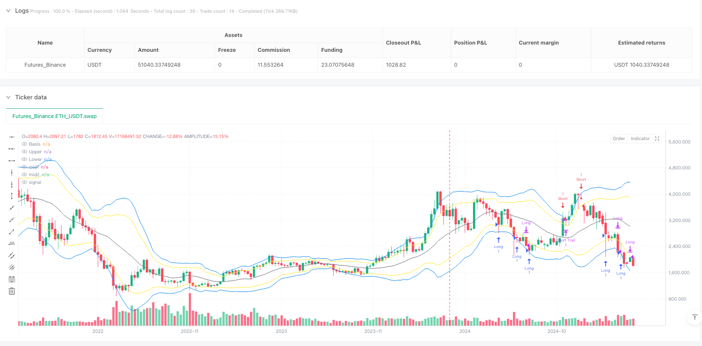
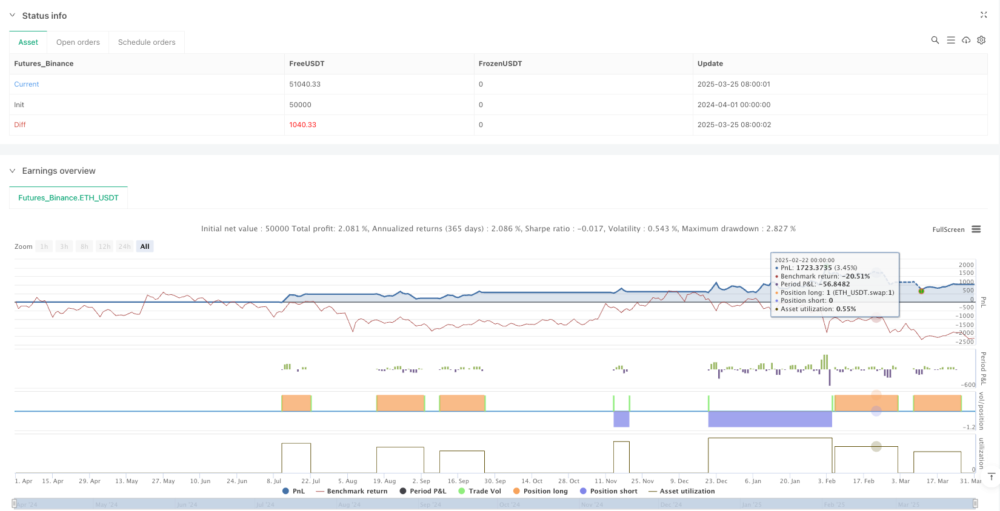

> Name

Multi-level Bollinger Bands Trend Following and Reversal Trading Strategy-Multi-level-Bollinger-Bands-Trend-Following-and-Reversal-Trading-Strategy
> Author

ianzeng123

> Strategy Description





[trans]

#### Overview
The multi-level Bollinger Bands trend following and reversal trading strategy is a comprehensive trading system based on the Bollinger Bands indicator. This strategy cleverly combines the characteristics of trend following and reversal trading, and captures market opportunities through the interaction between price and the upper and lower rails of the Bollinger Bands. The system has designed a three-layer exit mechanism, including regional judgment, moving average crossing and moving take profit, so that the strategy can effectively control risks while maximizing profits. This strategy is suitable for a variety of market environments and time cycles, and is especially suitable for volatile financial markets.
#### Strategy Principle
The core principle of this strategy is to use Bollinger Bands as a dynamic reference range for price fluctuations, combined with carefully designed multi-level entry and exit rules.
The entry logic is divided into two parts:
1. Long conditions: When the price crosses the Crossover Lower Band upwards, or the price touches below the lower band and then rebounds (that is, the lowest price is lower than the lower band but the closing price is higher than the lower band), enter the long position.
2. Short-selling conditions: When the price crosses the Bollinger Band (Crossunder Upper Band) downwards, or the price touches above the upper band and then falls back (that is, the highest price is higher than the upper band but the closing price is lower than the upper band), enter the market and go short.
The exit logic has designed three layers of protection measures:
1. The first level (regional judgment): Starting from the Xth K line after entering the market, exit when the closing price enters the specific area of Bollinger Bands. Specifically, when going long, if the price falls to the first 1/3 area between the lower track and the moving average, the position will be closed; when going short, if the price rises to the first 1/3 area between the upper track and the moving average, the position will be closed.
2. Second level (moving average crossing): Starting from the Yth K-line after entering the market, if the closing price crosses the 20-period moving average (MA20), the position will be closed.
3. The third level (moving take profit): When the price breaks through the edge of the other side of the Bollinger Band, the moving take profit mechanism is activated. Once the profit retraces Z%, it will automatically exit the market and lock in most of the profits.
Bollinger Band parameters can be flexibly adjusted, including the moving average period (default 20) and standard deviation multiple (default 2.0). Exit settings can also be adjusted according to market characteristics, including X (default 3), Y (default 10) and moving take profit retracement percentage Z (default 30%).
#### Strategic Advantages
1. Capture a variety of market opportunities: The strategy includes both trend tracking and reversal trading logic, and can find trading opportunities in different market environments. When the market is in a state of shock, you can use the rebound/retracement after the price touches the edge of the Bollinger Band; when the market starts to move in a trend, you can follow the trend through the signal that the price breaks through the edge of the Bollinger Band.
2. Multi-level risk control: By designing the exit conditions of three different mechanisms, the strategy can protect funds under different circumstances. The first level of regional judgment can quickly identify errors in the trading direction; the second level of moving average crossing is suitable for mid-term trend changes; the third level of moving stop profit protects the profits after a large profit.
3. Flexible and adjustable parameters: The strategy provides multiple adjustable parameters, allowing traders to optimize the system according to different market and time cycle characteristics. The Bollinger Band length and multiple can be adjusted to suit market volatility, and the time parameters of the exit conditions (X and Y) and the moving take-profit retracement ratio (Z) can be set according to the trader's risk preference.
4. Visualization advantages: Bollinger Bands and the newly added middle reference line are drawn directly on the chart, making it easier for traders to intuitively analyze price positions and potential support/resistance areas, and improve decision-making efficiency.
5. The code structure is clear: the strategy code is organized in an orderly manner, the variable naming is standardized, and the comments are detailed, making it easy to understand and maintain. The entry and exit logic is clearly separated to facilitate subsequent expansion and optimization.
#### Strategy Risk
1. Lack of clear stop-loss mechanism: The current strategy does not include stop-loss conditions in the traditional sense, which may lead to large losses under extreme market conditions. It is recommended that traders manually add fixed stop loss or dynamic stop loss logic based on ATR based on personal risk tolerance.
2. Over-reliance on Bollinger Bands: In high-volatility or low-liquidity markets, Bollinger Bands may be too wide or too narrow, resulting in reduced signal quality. It is recommended to test different Bollinger Band parameter settings in different market environments.
3. Parameter sensitivity: Strategy performance may be sensitive to parameter settings, such as Bollinger Band length, standard deviation multiples, and time parameters of exit conditions. Improper parameter selection can lead to overtrading or missing important opportunities.
4. Fixed trigger condition for moving take profit: In the current code, the trigger condition for moving take profit is set to a fixed 2 times risk distance, which may not be applicable to all market environments. In a market that is too volatile, the take profit may be set too far and cannot effectively protect profits.
5. Symmetric risk of long and short conditions: The strategy uses symmetrical entry and exit logic for the long and short directions, but in the actual market, the rise and fall behavior is often asymmetric (for example, the stock market usually falls faster than it rises). It is recommended to consider setting different parameters for the long and short directions.
#### Strategy optimization direction
1. Add an intelligent stop loss mechanism: you can introduce dynamic stop loss based on ATR (average true volatility), or set the stop loss distance based on the Bollinger Band width to make the stop loss more in line with the actual market fluctuations. This can be achieved by adding the stop parameter to the strategy.entry function, or using the stop_loss parameter of the strategy.exit function.
2. Optimize entry filter conditions: Consider adding trend confirmation indicators, such as Directional Movement Index (DMI) or Relative Strength Index (RSI), to filter out low-quality signals. For example, only accept trend following signals when ADX>25, or only accept reversal signals in RSI overbought/oversold areas.
3. Adaptive parameter setting: The Bollinger Band parameters and exit condition parameters are designed in an adaptive form and automatically adjusted according to market volatility. For example, you can calculate the volatility of the past N periods and dynamically adjust the standard deviation multiple of Bollinger Bands accordingly.
4. Improve the moving take-profit mechanism: make the triggering conditions and tracking distance of the moving take-profit adjustable instead of being fixed at 2 times the risk distance. Consider adjusting the retracement percentage of the moving take profit based on the fluctuation characteristics of different time periods.
5. Add time filtering: Introduce trading session filtering to avoid high volatility periods before the market opens and closes, or add the best trading time filter for specific markets.
6. Multi-period analysis: Integrate the multi-period analysis framework and require the trend direction of higher periods to be consistent with the current trading direction to improve signal quality. For example, only accept a long signal on the 4-hour chart when the daily trend is up.
7. Optimize fund management: Add volatility-based position calculation logic to increase positions in low-volatility environments and reduce positions in high-volatility environments to balance risks and returns.
#### Summary
The multi-level Bollinger Bands trend tracking and reversal trading strategy is a comprehensively designed trading system that uses the dynamic characteristics of the Bollinger Bands indicator and combined with multi-level exit rules to effectively manage risks while capturing market opportunities. The biggest advantage of this strategy lies in its flexibility and adaptability. It can find trading opportunities in different market environments and adapt to different trading varieties and time periods through parameter adjustment.
Although the strategy has some risk points, such as the lack of a clear stop loss mechanism and parameter sensitivity, the robustness and profitability of the strategy can be further improved through the optimization directions proposed in this article, such as adding smart stop loss, optimizing entry filter conditions, and adaptive parameter settings.
For traders, it is recommended to conduct sufficient backtesting before actual application and adjust parameters according to specific market characteristics. At the same time, use this strategy as part of a complete trading system, combined with other technical and fundamental analysis, to formulate comprehensive trading decisions. ||
#### Overview
The Multi-level Bollinger Bands Trend Following and Reversal Trading Strategy is a comprehensive trading system based on the Bollinger Bands indicator. This strategy cleverly combines trend following and reversal trading characteristics by capturing market opportunities through the interaction between price and the upper and lower Bollinger Bands. The system has designed a three-layer exit mechanism, including zone judgment, moving average crossover, and trailing stop profit, which maximizes profit capture while effectively controlling risk. This strategy is applicable to various market environments and time periods, particularly suitable for highly volatile financial markets.

#### Strategy Principles
The core principle of this strategy is to use Bollinger Bands as a dynamic reference range for price fluctuations, combined with carefully designed multi-level entry and exit rules.

The entry logic is divided into two parts:
1. Long entry conditions: Enter long when the price crosses above the lower Bollinger Band (Crossover Lower Band), or when the price touches below the lower band and then rebounds (i.e., the low price is below the lower band but the closing price is above the lower band).
2. Short entry conditions: Enter short when the price crosses below the upper Bollinger Band (Crossunder Upper Band), or when the price touches above the upper band and then falls back (i.e., the high price is above the upper band but the closing price is below the upper band).

The exit logic includes three protective measures:
1. First layer (zone judgment): Starting from the X-th bar after entry, exit when the closing price enters a specific area of the Bollinger Bands. Specifically, for long positions, close the position if the price falls to the first 1/3 area between the lower band and the middle band; for short positions, close the position if the price rises to the first 1/3 area between the upper band and the middle band.
2. Second layer (moving average crossover): Starting from the Y-th bar after entry, close the position if the closing price crosses the 20-period moving average (MA20).
3. Third layer (trailing stop profit): Activate the trailing stop profit mechanism when the price breaks through the opposite edge of the Bollinger Bands, and automatically exit once the profit retraces by Z%, securing most of the gains.

Bollinger Bands parameters can be flexibly adjusted, including the moving average period (default 20) and standard deviation multiplier (default 2.0). Exit settings can also be adjusted according to market characteristics, including X (default 3), Y (default 10), and trailing stop profit retreat percentage Z (default 30%).

#### Strategy Advantages
1. Captures various market opportunities: The strategy includes both trend following and reversal trading logic, allowing it to find trading opportunities in different market environments. When the market is in a consolidation state, it can capitalize on price rebounds/falls after touching the edges of Bollinger Bands; when the market begins a trend movement, it can follow the trend through signals of price breakthrough at the edges of Bollinger Bands.

2. Multi-level risk control: Through three different exit condition mechanisms, the strategy can protect capital in various situations. The first layer of zone judgment can quickly identify incorrect trading directions; the second layer of moving average crossover is suitable for medium-term trend changes; the third layer of trailing stop profit protects profits after significant gains.

3. Flexible parameters: The strategy provides multiple adjustable parameters, allowing traders to optimize the system according to different market and time period characteristics. Bollinger Bands length and multiplier can be adjusted to adapt to market volatility, and the time parameters (X and Y) of exit conditions as well as the trailing stop profit retreat ratio (Z) can be set according to the trader's risk preference.

4. Visualization advantage: Bollinger Bands and newly added middle reference lines are directly drawn on the chart, facilitating intuitive analysis of price positions and potential support/resistance areas, improving decision-making efficiency.

5. Clear code structure: The strategy code is well-organized, with standardized variable naming and detailed comments, making it easy to understand and maintain. Entry and exit logic are clearly separated, facilitating subsequent expansion and optimization.

#### Strategy Risks
1. Lack of explicit stop-loss mechanism: The current strategy does not include traditional stop-loss conditions, which may lead to significant losses under extreme market conditions. It is recommended that traders manually add fixed stop-loss or ATR-based dynamic stop-loss logic according to their risk tolerance.

2. Over-reliance on Bollinger Bands: In highly volatile or low liquidity markets, Bollinger Bands may be too wide or too narrow, leading to decreased signal quality. It is recommended to test different Bollinger Bands parameter settings in different market environments.

3. Parameter sensitivity: Strategy performance may be sensitive to parameter settings, such as Bollinger Bands length, standard deviation multiplier, and time parameters for exit conditions. Inappropriate parameter selection may lead to overtrading or missing important opportunities.

4. Fixed trailing stop profit trigger conditions: In the current code, the trigger condition for the trailing stop profit is set to a fixed 2 times risk distance, which may not be applicable to all market environments. In highly volatile markets, this may cause the stop profit to be set too far, failing to effectively protect profits.

5. Symmetry risk for long and short conditions: The strategy uses symmetrical entry and exit logic for long and short directions, but in actual markets, rising and falling behaviors are often asymmetrical (e.g., stock markets usually fall faster than they rise). It is recommended to consider setting different parameters for long and short directions.

#### Strategy Optimization Directions
1. Add intelligent stop-loss mechanism: Dynamic stop-loss based on ATR (Average True Range) can be introduced, or stop-loss distance can be set based on Bollinger Bands width, making the stop-loss more aligned with actual market volatility. This can be implemented by adding a stop parameter in the strategy.entry function or using the stop_loss parameter of the strategy.exit function.

2. Optimize entry filtering conditions: Consider adding trend confirmation indicators, such as Directional Movement Index (DMI) or Relative Strength Index (RSI), to filter low-quality signals. For example, only accept trend following signals when ADX>25, or only accept reversal signals in RSI overbought/oversold areas.

3. Adaptive parameter settings: Design Bollinger Bands parameters and exit condition parameters in an adaptive form, automatically adjusting based on market volatility. For example, calculate the volatility over the past N periods and dynamically adjust the standard deviation multiplier of Bollinger Bands accordingly.

4. Improve trailing stop profit mechanism: Make the trigger conditions and tracking distance for trailing stop profit adjustable, rather than fixed at 2 times risk distance. Consider adjusting the trailing stop profit retreat percentage based on volatility characteristics of different time periods.

5. Add time filtering: Introduce trading session filtering to avoid high volatility periods before market opening and closing, or add optimal trading time filters for specific markets.

6. Multi-timeframe analysis: Integrate multi-timeframe analysis framework, requiring the trend direction of higher timeframes to be consistent with the current trading direction to improve signal quality. For example, only accept long signals on a 4-hour chart when the daily trend is upward.

7. Optimize money management: Add position calculation logic based on volatility, increasing positions in low volatility environments and decreasing positions in high volatility environments, to balance risk and return.

#### Conclusion
The Multi-level Bollinger Bands Trend Following and Reversal Trading Strategy is a comprehensively designed trading system that effectively manages risk while capturing market opportunities through the dynamic characteristics of the Bollinger Bands indicator combined with multi-level exit rules. The greatest advantage of this strategy lies in its flexibility and adaptability, allowing it to find trading opportunities in different market environments and adapt to different trading instruments and time periods through parameter adjustments.

Although the strategy has some risk points, such as the lack of a clear stop-loss mechanism and parameter sensitivity, through the optimization directions proposed in this article, such as adding intelligent stop-loss, optimizing entry filtering conditions, adaptive parameter settings, etc., the robustness and profitability of the strategy can be further enhanced.

For traders, it is recommended to conduct thorough backtesting before actual application and adjust parameters according to specific market characteristics. At the same time, this strategy should be used as part of a complete trading system, combined with other technical and fundamental analysis, to develop comprehensive trading decisions.[/trans]


> Source (PineScript)

``` pinescript
/*backtest
start: 2024-04-01 00:00:00
end: 2025-03-31 00:00:00
period: 6d
basePeriod: 6d
exchanges: [{"eid":"Futures_Binance","currency":"ETH_USDT"}]
*/

//@version=6
strategy("Bollinger Bands Strategy", overlay=true)

// 輸入參數
length = input.int(20, "BB Length", minval=1, group="布林帶設定")
mult = input.float(2.0, "BB Multiplier", minval=0.001, maxval=50, group="布林帶設定")
X = input.int(3, "Exit Condition 1 Bars (X)", minval=1, group="出場設定")
Y = input.int(10, "Exit Condition 2 Bars (Y)", minval=1, group="出場設定")
Z = input.float(30.0, "Trail Profit Retreat Z%", minval=1.0, maxval=100.0, step=1.0, group="出場設定")

// 計算布林帶
source = close
basis = ta.sma(source, length)          // 20 期均線
dev = mult * ta.stdev(source, length)   // 標準差
upper = basis + dev                     // 上緣
lower = basis - dev                     // 下緣
mid1 = upper - (upper - basis)/3
mid2 = lower + (basis - lower)/3

// 繪製布林帶
plot(basis, "Basis", color=color.gray)
plot(upper, "Upper", color=color.blue)
plot(lower, "Lower", color=color.blue)
plot(mid1,"mid1",color = color.yellow)
plot(mid2,"mid2",color = color.yellow)
//fill(upper, lower, color=color.new(color.blue, 90), title="BB Fill")

// 進場條件
longEntry = ta.crossover(source, lower) or (low < lower and close > lower)
shortEntry = ta.crossunder(source, upper) or (high > upper and close < upper)

// 進場執行
if (longEntry)
    strategy.entry("Long", strategy.long)

if (shortEntry)
    strategy.entry("Short", strategy.short)

// 出場條件變數
var float longEntryPrice = na
var float shortEntryPrice = na
var int longBarsSinceEntry = 0
var int shortBarsSinceEntry = 0

// 更新持倉狀態
if (strategy.position_size > 0)  // 做多持倉
    if (na(longEntryPrice))      // 記錄進場價格和起始計數
        longEntryPrice := strategy.position_avg_price
        longBarsSinceEntry := 0
    longBarsSinceEntry := longBarsSinceEntry + 1

if (strategy.position_size < 0)  // 做空持倉
    if (na(shortEntryPrice))
        shortEntryPrice := strategy.position_avg_price
        shortBarsSinceEntry := 0
    shortBarsSinceEntry := shortBarsSinceEntry + 1

// 做多出場條件
if (strategy.position_size > 0)
    // 條件 1：第 X 根 K 線後，收盤價 < lower + (basis - lower) / 3
    longExitLevel1 = lower + (basis - lower) / 3
    if (longBarsSinceEntry >= X and close < longExitLevel1)
        strategy.close("Long", comment="Long Exit Condition 1")
    
    // 條件 2：第 Y 根 K 線後，收盤價 < basis
    if (longBarsSinceEntry >= Y and close < basis)
        strategy.close("Long", comment="Long Exit Condition 2")
    
    // 條件 3：移動停利（收盤價 > upper 觸發）
    distanceLong = longEntryPrice - lower
    trailPriceLong = longEntryPrice + (distanceLong * 2)  // 假設 2 倍風險距離作為觸發點，可調整
    trailOffsetLong = distanceLong * (1 - Z / 100)
    strategy.exit("Long Trail", "Long", trail_price=trailPriceLong, trail_offset=trailOffsetLong)

// 做空出場條件
if (strategy.position_size < 0)
    // 條件 1：第 X 根 K 線後，收盤價 > upper - (upper - basis) / 3
    shortExitLevel1 = upper - (upper - basis) / 3
    if (shortBarsSinceEntry >= X and close > shortExitLevel1)
        strategy.close("Short", comment="Short Exit Condition 1")
    
    // 條件 2：第 Y 根 K 線後，收盤價 > basis
    if (shortBarsSinceEntry >= Y and close > basis)
        strategy.close("Short", comment="Short Exit Condition 2")
    
    // 條件 3：移動停利（收盤價 < lower 觸發）
    distanceShort = upper - shortEntryPrice
    trailPriceShort = shortEntryPrice - (distanceShort * 2)  // 假設 2 倍風險距離作為觸發點，可調整
    trailOffsetShort = distanceShort * (1 - Z / 100)
    strategy.exit("Short Trail", "Short", trail_price=trailPriceShort, trail_offset=trailOffsetShort)

// 清除變數（當持倉結束時）
if (strategy.position_size == 0)
    longEntryPrice := na
    shortEntryPrice := na
    longBarsSinceEntry := 0
    shortBarsSinceEntry := 0
```

> Detail

https://www.fmz.com/strategy/489010

> Last Modified

2025-04-01 10:16:29
