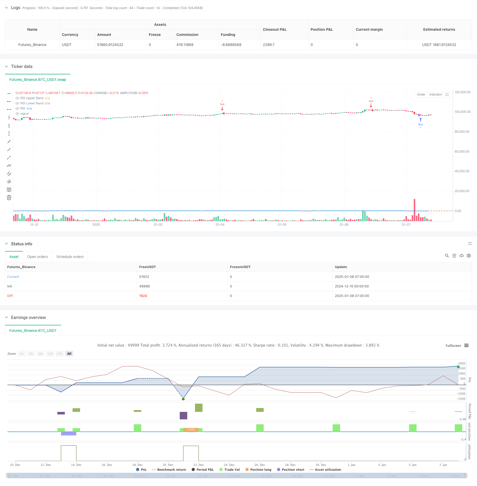

> Name

Multi-level-Indicator-Overlapping-RSI-Trading-Strategy
> Author

ChaoZhang

> Strategy Description



[trans]
#### Overview
This strategy is a multi-level indicator overlay trading system based on the relative strength index (RSI). The strategy operates within a specific trading time window, identifies trading opportunities through the overbought and oversold signals of the RSI indicator, and combines it with a dynamic position adjustment mechanism to optimize overall returns by building positions in batches when the market moves in the opposite direction. The strategy uses a target profit method based on the average entry price for take-profit management.
#### Strategy Principle
The strategy mainly operates based on the following core components:
1. The RSI indicator calculation adopts the standard 14-period period and uses the closing price as the calculation source data.
2. The trading time window is controlled between 2-4 hours and can be flexibly adjusted according to market characteristics.
3. Entry signals are based on RSI below 30 for oversold levels and above 70 for overbought levels
4. The position building mechanism includes two levels: initial position and dynamic position adjustment.
5. The position increase mechanism is triggered when the price moves in an unfavorable direction by more than 1 point.
6. The take-profit setting is 1.5 points higher than the average opening price.
#### Strategic Advantages
1. Multi-level signal filtering: combined with RSI technical indicators and time window double filtering to effectively reduce false signals
2. Dynamic position management: through the batch opening mechanism, the average cost is reduced when the market moves in the opposite direction.
3. Reasonable risk-return ratio: The profit-taking point is set based on the average opening price to ensure the expected return of the overall transaction.
4. The strategy logic is clear: each module has clear responsibilities, which facilitates subsequent optimization and adjustment.
5. Strong adaptability: key parameters can be optimized and adjusted according to different market characteristics
#### Strategy Risk
1. Trend market risk: In a strong trending market, you may face excessive capital occupation due to frequent additions of positions.
2. Time window restrictions: Restrictions on specific time windows may miss good opportunities in other periods of time
3. Parameter sensitivity: The settings of parameters such as RSI cycle and position opening interval have a greater impact on strategy performance.
4. Fund management risk: It is necessary to reasonably control the proportion of a single position to avoid excessive concentration of funds.
#### Strategy optimization direction
1. Introduce trend filters: It is recommended to add trend indicators such as moving averages to optimize entry opportunities
2. Dynamic parameter optimization: RSI threshold and position opening interval can be dynamically adjusted based on market volatility
3. Improve the stop-loss mechanism: It is recommended to add a trailing stop-loss function to better protect existing profits.
4. Optimize time window: You can find a better trading time period through backtest data analysis
5. Increase trading volume indicators: combine with trading volume analysis to improve signal reliability
#### Summary
This strategy forms a relatively complete trading system through the combination of RSI indicator and batch opening mechanism. The core advantage of the strategy lies in its multi-level signal filtering mechanism and flexible position management method, but it also requires attention to issues such as trend market risks and parameter optimization. By adding trend filters, optimizing stop-loss mechanisms and other improvements, there is still room for improvement in the overall performance of the strategy. ||
#### Overview
This strategy is a multi-level indicator overlapping trading system based on the Relative Strength Index (RSI). Operating within a specific trading window, it identifies trading opportunities through RSI's overbought and oversold signals, combined with a dynamic position adjustment mechanism that employs a scaled entry approach during adverse market movements. The strategy implements profit-taking based on average entry price targets.

#### Strategy Principle
The strategy operates based on the following core components:
1. RSI calculation uses standard 14 periods with closing price as source data
2. Trading window is controlled between 2-4 hours, adjustable based on market characteristics
3. Entry signals based on RSI below 30 (oversold) and above 70 (overbought) levels
4. Position building includes initial position and dynamic adjustment levels
5. Scaling mechanism triggers when price moves adversely by 1 point
6. Take profit is set at 1.5 points from average entry price

#### Strategy Advantages
1. Multi-level signal filtering: Combines RSI technical indicator and time window dual filtering to effectively reduce false signals
2. Dynamic position management: Reduces average cost during adverse market movements through scaled entry mechanism
3. Reasonable risk-reward ratio: Take profit levels based on average entry price ensure overall trade expectancy
4. Clear strategy logic: Well-defined module responsibilities facilitate subsequent optimization and adjustment
5. High adaptability: Key parameters can be optimized for different market characteristics

#### Strategy Risks
1. Trend market risk: May face excessive capital usage due to frequent scaling in strong trend markets
2. Time window limitation: Specific time window restrictions might miss good opportunities in other periods
3. Parameter sensitivity: Settings for RSI period, entry spacing significantly impact strategy performance
4. Capital management risk: Requires reasonable control of single entry proportion to avoid over-concentration

#### Strategy Optimization Directions
1. Introduce trend filter: Suggest adding moving averages or other trend indicators to optimize entry timing
2. Dynamic parameter optimization: RSI thresholds and entry spacing can be dynamically adjusted based on market volatility
3. Improve stop loss mechanism: Recommend adding trailing stop loss functionality to better protect existing profits
4. Optimize time window: Better trading periods can be identified through backtesting data analysis
5. Add volume indicators: Incorporate volume analysis to improve signal reliability

#### Summary
The strategy forms a relatively complete trading system through the combination of RSI indicators and scaled entry mechanisms. Its core advantages lie in its multi-level signal filtering mechanism and flexible position management approach, while attention needs to be paid to trend market risks and parameter optimization issues. The overall performance of the strategy can be further improved through enhancements such as adding trend filters and optimizing stop loss mechanisms.[/trans]


> Source (PineScript)

``` pinescript
/*backtest
start: 2024-12-10 00:00:00
end: 2025-01-08 08:00:00
period: 1h
basePeriod: 1h
exchanges: [{"eid":"Futures_Binance","currency":"BTC_USDT","balance":49999}]
*/

//@version=6
strategy("TonyM RSI", overlay=true)

// Input Settings
rsiLengthInput = input.int(14, minval=1, title="RSI Length", group="RSI Settings")
rsiSourceInput = input.source(close, "Source", group="RSI Settings")
startHour = input.int(2, "Start Hour", minval=0, maxval=23, group="Trading Window")
endHour = input.int(4, "End Hour", minval=0, maxval=23, group="Trading Window")

// RSI Calculation
change = ta.change(rsiSourceInput)
up = ta.rma(math.max(change, 0), rsiLengthInput)
down = ta.rma(-math.min(change, 0), rsiLengthInput)
rsi = down == 0 ? 100 : up == 0 ? 0 : 100 - (100 / (1 + up / down))

// Time Filter
inTradingWindow = (hour >= startHour and hour < endHour)

// Strategy Settings
buyLevel = 30
sellLevel = 70
scaleDistance = 1.0  // Distance in points to add to the position
takeProfitPoints = 1.5  // Profit target from average price
initialQty = 1  // Initial trade size
scalingQty = 1  // Additional trade size for scaling

// Trade Logic
if inTradingWindow
    // Entry Logic
    if rsi <= buyLevel and strategy.position_size == 0
        strategy.entry("Buy", strategy.long, qty=initialQty)
    if rsi >= sellLevel and strategy.position_size == 0
        strategy.entry("Sell", strategy.short, qty=initialQty)

    // Scaling Logic
    if strategy.position_size > 0 and close <= strategy.position_avg_price - scaleDistance
        strategy.entry("Scale Buy", strategy.long, qty=scalingQty)
    if strategy.position_size < 0 and close >= strategy.position_avg_price + scaleDistance
        strategy.entry("Scale Sell", strategy.short, qty=scalingQty)

    // Exit Logic (based on average price)
    if strategy.position_size > 0
        strategy.exit("Take Profit Long", "Buy", limit=strategy.position_avg_price + takeProfitPoints)
    if strategy.position_size < 0
        strategy.exit("Take Profit Short", "Sell", limit=strategy.position_avg_price - takeProfitPoints)

// Plot RSI
plot(rsi, "RSI", color=color.blue, linewidth=1)
rsiUpperBand = hline(70, "RSI Upper Band", color=color.red)
rsiLowerBand = hline(30, "RSI Lower Band", color=color.green)
fill(rsiUpperBand, rsiLowerBand, color=color.new(color.gray, 90))

```

> Detail

https://www.fmz.com/strategy/477976

> Last Modified

2025-01-10 16:31:08
