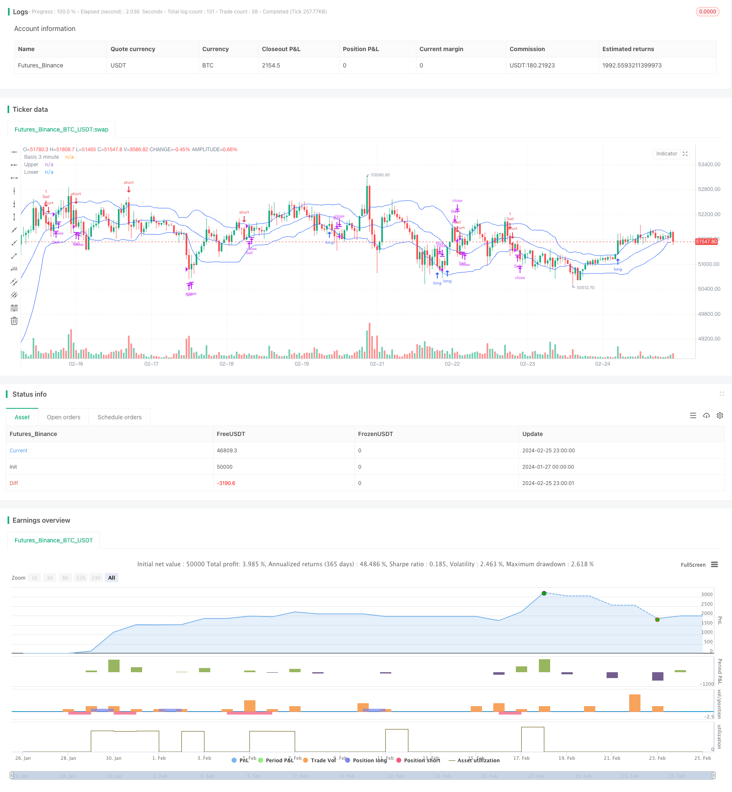

> Name

Multi-timeframe-Bollinger-Bands-Crypto-Strategy Multi-timeframe-Bollinger-Bands-Crypto-Strategy
> Author

ChaoZhang

> Strategy Description


[trans]
## Overview
This strategy uses the Bollinger Bands indicator to analyze cryptocurrency price movements on different time frames (1 minute, 3 minutes, 5 minutes, and 15 minutes) to find buying and selling opportunities. It serves as a benchmark for cryptocurrency market sentiment and focuses on Bitcoin's 5-minute price. When the price of Bitcoin breaks through the upper Bollinger Band, the sentiment is considered to be in a "bullish" state; conversely, when the price of Bitcoin falls below the lower Bollinger Band, the sentiment is considered to be "bearish". The strategy will observe the upper-band rupture or lower-band breakthrough pattern of the Bollinger Bands on different time frames of different currencies. These patterns usually indicate changes in market sentiment and trends, and are therefore signals for buying and selling operations.
## Strategy Principle
The strategy calculates Bollinger Bands on the 1-minute, 3-minute, 5-minute and 15-minute timeframes simultaneously. Bollinger Bands consist of an n-day (default 20 days) moving average and several times its standard deviation (default 1.5 times). The moving average represents the average price of the currency within a certain period of time, and the standard deviation reflects the extent of price fluctuations. When the price is close to or breaks through the upper Bollinger Band, it means that the market is at a high level and the volatility is increasing, and the price may reverse and fall; when the price is close to or falls below the lower Bollinger Band track, it means that the market is at a low level and the volatility is increasing, and the price may reverse and rise.
This strategy uses this feature of the Bollinger Bands indicator to determine the latest developments in the market at different time frames (1 minute, 3 minutes, 5 minutes and 15 minutes). When the price on the 3-minute or 5-minute time frame breaks through the Bollinger Band upper or lower rail, and when relevant signs also appear on the 1-minute and 15-minute time frames, this strategy determines that the market has issued the latest buy and sell signals. In addition, the strategy will also refer to Bitcoin's 5-minute time frame to determine the overall trend and market sentiment (long-short atmosphere) of the entire cryptocurrency market as a reference signal. Combining these factors, the strategy determines whether to buy or sell.
After opening a position, the strategy will also set stop-loss and take-profit conditions. If the position price rises or falls by 25%, a take profit is set; if the price rises or falls by more than 25% in the opposite direction, a stop loss is set.
## Strategic Advantages
1. This strategy comprehensively judges the short-term and medium-term trends of the market. The 1-minute and 5-minute time frames determine the latest market developments, and the 15-minute time frame determines the mid-term trend, which can effectively avoid being misled by short-term market fluctuations.
2. This strategy also focuses on the breakthrough of the middle, upper and lower Bollinger Bands to avoid missing buying and selling opportunities.
3. As a market benchmark and market sentiment barometer, Bitcoin can improve the accuracy of decision-making.
4. Set up stop-profit and stop-loss conditions to effectively control risks.
## Strategy Risk
1. The Bollinger Bands breakthrough pattern has a certain lag, and the best entry opportunity may be missed.
2. If systemic risks occur in the cryptocurrency market as a whole, such as passwords and other black swan events, this strategy will be difficult to effectively deal with.
3. Although stop-profit and stop-loss are set, unexpected events that exceed the stop-loss range will also cause large losses.
4. Improper setting of strategy parameters such as time length, standard deviation multiple, etc. will lead to a decrease in the quality of trading signals.
Corresponding solutions:
1. Combine with more indicators to determine the best entry time.
2. Increase the assessment of market systemic risks.
3. Appropriately reduce the position size and stop loss range of each transaction.
4. Optimize parameter settings and conduct backtest verification.
## Strategy optimization
1. Add more time frame judgments, such as 30-minute or 60-minute Bollinger Band indicators.
2. According to the characteristics of different currencies, select more appropriate Bollinger Band parameters to improve the indicator effect.
3. Increase the judgment of indicators such as transaction volume. Because trading volume can verify the reliability of price changes.
4. Combine with Stoch RSI, MACD and other indicators to improve decision-making accuracy. These indicators can significantly improve the judgment of the actual market trend.
5. Compare the price trends and correlations between different currencies and select the trading object with the most room for operation.
6. Optimize the stop-profit and stop-loss strategy and determine the optimal parameters through post-event statistical analysis.
## Summarize
This strategy is a multi-timeframe Bollinger Bands cryptocurrency trading strategy. It pays attention to the price changes in the short-term and medium-term time scale of the market, and uses the Bollinger Band indicator to judge the MULIT long and short status of the market. At the same time, it uses Bitcoin price as the market benchmark and reference signal to assist in judging the overall trend of the entire cryptocurrency market. This strategy has the advantages of diverse reference time frames, complete stop-profit and stop-loss, etc. It can effectively grasp market opportunities while controlling risks, and is worth recommending. In the future, the strategy return rate can be further improved through further optimization such as adding new indicator combinations, parameter adjustments, etc.
||

## Overview

This strategy applies Bollinger Bands indicator across 1 minute, 3 minutes, 5 minutes and 15 minutes timeframes to analyze price movements of cryptocurrencies, in order to identify buying and selling opportunities. It uses the 5-minute prices of Bitcoin as a benchmark for the overall cryptocurrency market sentiment. When Bitcoin price breaks above the upper band, the market is considered to be bullish. When the price breaks below the lower band, the market is considered to be bearish. The strategy looks for upper or lower band breakouts across different cryptos and timeframes. These breakout patterns usually signify shifts in market sentiment and trends, thus providing entry and exit signals.  

## Strategy Logic

The strategy calculates Bollinger Bands simultaneously on the 1-minute, 3-minute, 5-minute and 15-minute timeframes. The Bollinger Bands consist of an n-day (default 20-day) moving average and a number of standard deviations (default 1.5x) above and below it. The moving average represents the average price of the crypto over a period of time and the standard deviation measures the volatility. When prices approach or break above the upper band, it indicates the market is overextended and volatility is expanding, signaling a potential reversal downwards. When prices approach or break below the lower band, it signals the market is oversold with expanding volatility and a potential upwards reversal.  

Leveraging this feature of Bollinger Bands, the strategy judges the latest market developments across different time horizons - 1 minute, 3 minutes, 5 minutes and 15 minutes. When there is an upper or lower band breakout in the 3-minute or 5-minute timeframes, plus confirming signs in the 1-minute and 15-minute timeframes, the strategy determines a latest buy or sell signal is triggered. In addition, the strategy also refers to the 5-minute prices of Bitcoin to gauge the overall market trend and sentiment (bullish/bearish bias) in the entire crypto market. Based on these factors, the strategy decides whether to go long or short.

After entering trades, the strategy also sets profit taking and stop loss conditions. If the entry price rises or falls by 25%, take profit will be triggered. If the price moves more than 25% against the entry direction, stop loss will be triggered.

## Advantages

1. The strategy incorporates both short-term and mid-term market views - 1 minute and 5 minutes for latest updates, 15 minutes for mid-term trend, avoiding being misled by temporary market fluctuations.  

2. The strategy monitors breakouts of the middle band, upper band and lower band, minimizing missed opportunities.

3. Bitcoin serves as a benchmark and barometer for overall market conditions and sentiments, enhancing decision accuracy.  

4. Profit taking and stop loss mechanisms effectively control risks.

## Risks

1. Bollinger Band breakouts have some lagging attributes and may miss best entry timing.  

2. The strategy is vulnerable to market-wide systemic risks like passwords black swan events.

3. Despite profit taking and stop loss in place, losses can still exceed stop loss margin under extreme events.

4. Inappropriate parameter settings like time period, standard deviation multiplier can lead to poor signal quality.

Corresponding solutions:

1. Incorporate more indicators to determine optimal entry timing.  

2. Enhance assessment of market-level systemic risks.  

3. Reduce position sizing and stop loss margin for each trade.

4. Optimize parameter settings via backtesting.

## Enhancement Opportunities

1. Add more timeframes like 30-minute or 60-minute Bollinger Bands.  

2. Select Bollinger Bands parameters more fitting to the characteristics of each crypto.

3. Incorporate trading volume for result verification, as trading volumes validate price movement reliability.  

4. Combine other indicators like Stoch RSI, MACD to improve decision accuracy. These indicators can significantly enhance judging actual market movements.

5. Compare price movements and correlations between cryptos and pick the ones with most room to maneuver. 

6. Optimize profit taking and stop loss mechanisms by statistical analysis of historical performance to determine optimal settings.

## Conclusion

This is a multi-timeframe Bollinger Bands cryptocurrency trading strategy. It focuses on price developments across short-term and mid-term time horizons, leveraging Bollinger Bands to gauge the MULTI bullish/bearish status of the market. Meanwhile, it uses Bitcoin's price levels as benchmarks and references to help determine the overall trend in the broader cryptocurrency market. With its versatility in incorporating multiple timeframes, plus robust profit taking and stop loss mechanisms, this strategy can effectively capitalize opportunities and control risks. Going forward, its performance can be further enhanced by optimizations like integrating more indicators and fine-tuning parameters via backtesting.

[/trans]

> Strategy Arguments


|Argument|Default|Description|
|----|----|----|
|v_input_int_1|20|length|
|v_input_string_1|0|Basis MA Type: SMA|EMA|SMMA (RMA)|WMA|VWMA|
|v_input_1_close|0|Source: close|high|low|open|hl2|hlc3|hlcc4|ohlc4|
|v_input_float_1|1.5|StdDev|
|v_input_int_2|false|Offset|


> Source (PineScript)

``` pinescript
/*backtest
start: 2024-01-27 00:00:00
end: 2024-02-26 00:00:00
period: 1h
basePeriod: 15m
exchanges: [{"eid":"Futures_Binance","currency":"BTC_USDT"}]
*/

//@version=5
strategy(shorttitle="Crypto BB", title="Multi-Interval Bollinger Band Crypto Strategy", overlay=true)
length = input.int(20, minval=1)
maType = input.string("SMA", "Basis MA Type", options = ["SMA", "EMA", "SMMA (RMA)", "WMA", "VWMA"])
src = input(close, title="Source")
mult = input.float(1.5, minval=0.001, maxval=50, title="StdDev")

interval1m = request.security(syminfo.tickerid, '1', src)
interval3m = request.security(syminfo.tickerid, '3', src)
interval5m = request.security(syminfo.tickerid, '5', src)
interval15m = request.security(syminfo.tickerid, '5', src)
btcinterval5m = request.security("BTC_USDT:swap", "5", src)
bitcoinSignal = 'flat'

var entryPrice = 0.000

ma(source, length, _type) =>
    switch _type
        "SMA" => ta.sma(source, length)
        "EMA" => ta.ema(source, length)
        "SMMA (RMA)" => ta.rma(source, length)
        "WMA" => ta.wma(source, length)
        "VWMA" => ta.vwma(source, length)

bitcoinBasis = ma(btcinterval5m, length, maType)
bitcoinDev = ta.stdev(btcinterval5m, length)
bitcoinUpper = bitcoinBasis + bitcoinDev
bitcoinLower = bitcoinBasis - bitcoinDev

basis1m = ma(interval1m, length, maType)
basis3m = ma(interval3m, length, maType)
basis5m = ma(interval5m, length, maType)
basis15m = ma(interval5m, length, maType)
dev1m = mult * ta.stdev(interval1m, length)
dev3m = mult * ta.stdev(interval3m, length)
dev5m = mult * ta.stdev(interval5m, length)
upper1m = basis1m + dev1m
lower1m = basis1m - dev1m
upper3m = basis3m + dev3m
lower3m = basis3m - dev3m
upper5m = basis5m + dev5m
lower5m = basis5m - dev5m
offset = input.int(0, "Offset", minval = -500, maxval = 500)
plot(basis3m, "Basis 3 minute", color=#2962FF, offset = offset)
p3upper = plot(upper3m, "Upper", color=#2962FF, offset = offset)
p3lower = plot(lower3m, "Lower", color=#2962FF, offset = offset)

//Exit protocols
if strategy.opentrades != 0 and strategy.opentrades.entry_id(0) == 'Buy'
    entryPrice := strategy.opentrades.entry_price(0)
    if ((interval1m - entryPrice)/entryPrice) * 30 > .25
        strategy.close('Buy', comment='Take Profit on Buy')
    if ((interval1m - entryPrice)/entryPrice) * 30 < -.25
        strategy.close('Buy', comment='Stop Loss on Buy')

if strategy.opentrades != 0 and strategy.opentrades.entry_id(0) == 'Sell'
    entryPrice := strategy.opentrades.entry_price(0)
    if ((entryPrice - interval1m)/entryPrice) * 30 > .25
        strategy.close('Sell', comment='Take Profit on Sell')
    if ((entryPrice - interval1m)/entryPrice) * 30 < -.25
        strategy.close('Sell', comment='Stop Loss on Sell')

//Bitcoin Analysis
if (btcinterval5m < bitcoinUpper and btcinterval5m[1] > bitcoinUpper[1] and btcinterval5m[2] < bitcoinUpper[2] and btcinterval5m[3] < bitcoinUpper[3])
    bitcoinSignal := 'Bear'
if (btcinterval5m > bitcoinUpper and btcinterval5m[1] < bitcoinUpper[1] and btcinterval5m[2] > bitcoinUpper[2] and btcinterval5m[3] > bitcoinUpper[3])
    bitcoinSignal := 'Bull'

//Short protocols
if (interval3m < basis3m and interval3m[1] > basis3m[1] and interval3m[2] < basis3m[2] and interval3m[3] < basis3m[3]) or 
 (interval5m < basis5m and interval5m[1] > basis5m[1] and interval5m[2] < basis5m[2] and interval5m[3] < basis5m[3]) 
  and strategy.opentrades.entry_id(0) != 'Sell'
   and src < basis1m and src < basis15m
    if strategy.opentrades.entry_id(0) == 'Buy'
        strategy.close('Buy', 'Basis Band Bearish Reversal')
    //strategy.order('Sell', strategy.short, comment = 'Basis band fractal rejection', stop = (upper1m + basis1m)/2)

if (interval3m < upper3m and interval3m[1] > upper3m[1] and interval3m[2] < upper3m[2] and interval3m[3] < upper3m[3]) or 
 (interval5m < upper5m and interval5m[1] > upper5m[1] and interval5m[2] < upper5m[2] and interval5m[3] < upper5m[3]) 
  and strategy.opentrades.entry_id(0) != 'Sell' and bitcoinSignal == 'Bear' and src < upper1m  and src < basis15m
    if strategy.opentrades.entry_id(0) == 'Buy'
        strategy.close('Buy', 'Bearish Trend Reversal')
    strategy.order('Sell', strategy.short, comment = 'Upper band fractal rejection', stop = (upper1m + basis1m)/2)

if (interval3m > basis3m and interval3m[1] < basis3m[1] and interval3m[2] > basis3m[2] and interval3m[3] > basis3m[3]) or 
 (interval5m > basis5m and interval5m[1] < basis5m[1] and interval5m[2] > basis5m[2] and interval5m[3] > basis5m[3]) and strategy.opentrades.entry_id(0) != 'Buy' 
  and src > basis1m  and src > basis15m
    if strategy.opentrades.entry_id(0) == 'Sell'
        strategy.close('Sell', 'Basis Band Bullish Reversal')
    //strategy.order('Buy', strategy.long, comment = 'Basis band fractal rejection', stop = (lower1m + basis1m)/2)

if (interval3m > lower3m and interval3m[1] < lower3m[1] and interval3m[2] > lower3m[2] and interval3m[3] > lower3m[3]) or 
 (interval5m > lower5m and interval5m[1] < lower5m[1] and interval5m[2] > lower5m[2] and interval5m[3] > basis5m[3]) and strategy.opentrades.entry_id(0) != 'Buy' 
  and src > lower1m  and src > basis15m and bitcoinSignal == 'Bull' 
    if strategy.opentrades.entry_id(0) == 'Sell'
        strategy.close('Sell', 'Bullish Trend Reversal')
    strategy.order('Buy', strategy.long, comment = 'Lower band fractal rejection', stop = (lower1m + basis1m)/2)
```

> Detail

https://www.fmz.com/strategy/442925

> Last Modified

2024-02-27 14:13:39
