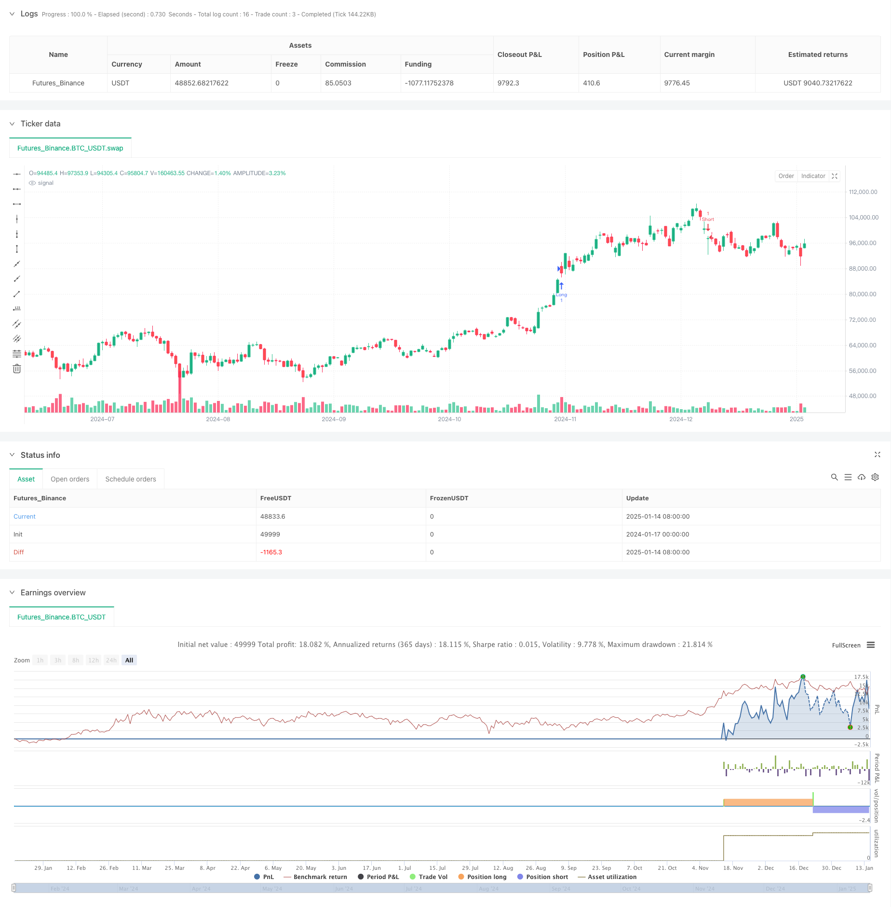

> Name

Multi-timeframe-Fair-Value-Gap-Breakout-Strategy-with-Historical-Backtest
> Author

ChaoZhang

> Strategy Description



[trans]
#### Strategy Overview
This strategy is a comprehensive trading system that combines multiple time period analysis, Fair Value Gap (FVG) and Breakout of Structure (BOS). It identifies potential trade entries by identifying breakouts in price structure on higher timeframes while looking for opportunities for fair value gap formation on lower timeframes. The strategy also integrates a risk management system, including automatic setting of stop loss and profit targets.
#### Strategy Principle
The core logic of the strategy is built on three main pillars: First, utilizing higher timeframes (default 1 hour or above) to identify breakouts of price structure (BOS), which provide the basic framework for trading direction. Secondly, look for the fair value gap (FVG) on the lower timeframe. The formation of the FVG indicates that the market has a potential supply and demand imbalance in this area. Finally, combine these two conditions with the current price position to trigger a trading signal when the price is in a favorable position. The system manages the risk of each trade through risk-to-benefit ratios and stop-loss factors.
#### Strategic Advantages
1. Multi-dimensional analysis: By combining the analysis of multiple time periods, the reliability of trading signals is improved.
2. Perfect risk management: The built-in risk-return ratio setting and stop-loss control mechanism ensure that each transaction has clear risk control.
3. Visual feedback: The strategy provides clear visual feedback, including the display of the FVG box and marking of potential trading opportunities.
4. Strong adaptability: Through parameter adjustment, the strategy can adapt to different market conditions and trading styles.
#### Strategy Risk
1. Risk of false breakthrough: The market may have a false breakthrough, resulting in false trading signals. The solution is to add a signal confirmation mechanism.
2. Signal delay: Due to the use of higher time period data, there may be signal lag. It is recommended to confirm with other technical indicators.
3. Market fluctuation risk: During periods of high volatility, the formation of FVG may not be stable enough. It can be adapted by adjusting the observation length of FVG.
#### Strategy optimization direction
1. Signal filtering: A volume confirmation mechanism can be added to confirm the signal only when the volume supports it.
2. Dynamic parameters: The risk-return ratio and stop-loss factor can be dynamically adjusted according to market volatility.
3. Trend filtering: Add trend judgment indicators and only open positions in the direction of the trend.
4. Time filtering: Add trading time period filtering to avoid trading during unfavorable market periods.
#### Summary
This strategy builds a complete trading system by comprehensively using multi-time period analysis, price structure breakthroughs and fair value gaps. Its advantage lies in multi-dimensional analysis methods and complete risk management mechanisms, but traders still need to carry out appropriate parameter optimization and risk control based on actual market conditions. Subsequent optimization can start from aspects such as signal confirmation, dynamic parameter adjustment and market environment filtering to further improve the stability and reliability of the strategy. ||
#### Strategy Overview
This strategy is a comprehensive trading system that combines multi-timeframe analysis, Fair Value Gap (FVG), and Break of Structure (BOS). It identifies potential trading entries by detecting structure breakouts on higher timeframes while looking for fair value gap opportunities on lower timeframes. The strategy also incorporates a risk management system with automated stop-loss and take-profit settings.

#### Strategy Principles
The core logic is built on three main pillars: First, it uses a higher timeframe (default 1 hour or above) to identify Break of Structure (BOS), which provides the foundational framework for trading direction. Second, it looks for Fair Value Gaps (FVG) on lower timeframes, indicating potential supply-demand imbalances in those areas. Finally, it combines these conditions with current price position to trigger trading signals when price is in favorable locations. The system manages risk through risk-reward ratios and stop-loss factors.

#### Strategy Advantages
1. Multi-dimensional Analysis: Combines multiple timeframe analysis to enhance signal reliability.
2. Comprehensive Risk Management: Built-in risk-reward settings and stop-loss control mechanisms ensure clear risk management for each trade.
3. Visual Feedback: Strategy provides clear visual feedback including FVG box display and potential trade opportunity markers.
4. High Adaptability: Through parameter adjustment, the strategy can adapt to different market conditions and trading styles.

#### Strategy Risks
1. False Breakout Risk: Markets may exhibit false breakouts leading to incorrect trading signals. Solution is to add signal confirmation mechanisms.
2. Signal Delay: Due to the use of higher timeframe data, there may be signal lag. Recommended to combine with other technical indicators for confirmation.
3. Market Volatility Risk: During high volatility periods, FVG formation may not be stable. Can be addressed by adjusting the FVG observation length.

#### Strategy Optimization Directions
1. Signal Filtering: Add volume confirmation mechanism to confirm signals only when supported by volume.
2. Dynamic Parameters: Dynamically adjust risk-reward ratio and stop-loss factor based on market volatility.
3. Trend Filtering: Add trend identification indicators to only take positions in trend direction.
4. Time Filtering: Add trading session filters to avoid trading during unfavorable market periods.

#### Summary
This strategy constructs a complete trading system through the comprehensive use of multi-timeframe analysis, price structure breakouts, and fair value gaps. Its strengths lie in its multi-dimensional analysis approach and comprehensive risk management mechanisms, but traders still need to optimize parameters and control risks according to actual market conditions. Further optimization can focus on signal confirmation, dynamic parameter adjustment, and market environment filtering to further improve strategy stability and reliability.[/trans]


> Source (PineScript)

``` pinescript
/*backtest
start: 2024-01-17 00:00:00
end: 2025-01-15 08:00:00
period: 1d
basePeriod: 1d
exchanges: [{"eid":"Futures_Binance","currency":"BTC_USDT","balance":49999}]
*/

//@version=5
strategy("ICT Strategy with Historical Backtest", overlay=true)

// === Настройки ===
tf = input.timeframe("60", title="Higher Timeframe (1H or above)")  // Таймфрейм для анализа BOS
fvg_length = input(3, title="FVG Lookback Length")                   // Длина для поиска FVG
risk_reward = input(2, title="Risk-Reward Ratio")                    // Риск-вознаграждение
show_fvg_boxes = input(true, title="Show FVG Boxes")                 // Показывать FVG
stop_loss_factor = input.float(1.0, title="Stop Loss Factor")         // Множитель для стоп-лосса

// === Переменные для анализа ===
var float bos_high = na
var float bos_low = na

// Получаем данные с более старшего таймфрейма
htf_high = request.security(syminfo.tickerid, tf, high)
htf_low = request.security(syminfo.tickerid, tf, low)
htf_close = request.security(syminfo.tickerid, tf, close)

// Определение BOS (Break of Structure) на старшем таймфрейме
bos_up = ta.highest(htf_high, fvg_length) > ta.highest(htf_high[1], fvg_length)
bos_down = ta.lowest(htf_low, fvg_length) < ta.lowest(htf_low[1], fvg_length)

// Обновляем уровни BOS
if (bos_up)
    bos_high := ta.highest(htf_high, fvg_length)
if (bos_down)
    bos_low := ta.lowest(htf_low, fvg_length)

// === Определение FVG (Fair Value Gap) ===
fvg_up = low > high[1] and low[1] > high[2]
fvg_down = high < low[1] and high[1] < low[2]

// Визуализация FVG (Fair Value Gap)
// if (show_fvg_boxes)
//     if (fvg_up)
//         box.new(left=bar_index[1], top=high[1], right=bar_index, bottom=low, bgcolor=color.new(color.green, 90), border_color=color.green)
//     if (fvg_down)
//         box.new(left=bar_index[1], top=high, right=bar_index, bottom=low[1], bgcolor=color.new(color.red, 90), border_color=color.red)

// === Логика сделок ===
// Условия для входа в Лонг
long_condition = bos_up and fvg_up and close < bos_high
if (long_condition)
    strategy.entry("Long", strategy.long, stop=low * stop_loss_factor, limit=low + (high - low) * risk_reward)

// Условия для входа в Шорт
short_condition = bos_down and fvg_down and close > bos_low
if (short_condition)
    strategy.entry("Short", strategy.short, stop=high * stop_loss_factor, limit=high - (high - low) * risk_reward)

// === Надписи для прогнозируемых сделок ===
if (long_condition)
    label.new(bar_index, low, text="Potential Long", color=color.green, style=label.style_label_up, textcolor=color.white, size=size.small)

if (short_condition)
    label.new(bar_index, high, text="Potential Short", color=color.red, style=label.style_label_down, textcolor=color.white, size=size.small)

```

> Detail

https://www.fmz.com/strategy/478698

> Last Modified

2025-01-17 14:45:10
