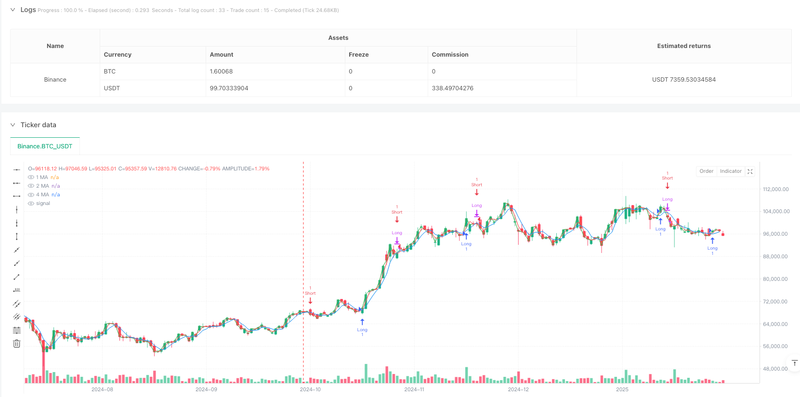
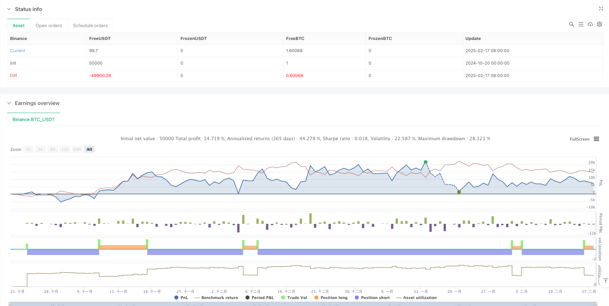

> Name

Multiple Moving Average Crossover Trend Capture Strategy-Multiple-Moving-Average-Crossover-Trend-Capture-Strategy
> Author

ianzeng123

> Strategy Description





[trans]
#### Overview
This strategy is a trading system based on 1/2/4 period simple moving average (SMA) crossover signals. By observing the short-period and medium-period moving averages crossing the long-period moving average in the same direction, we can capture the turning point of the market trend and achieve trend tracking and timely stop loss. The strategy design is simple and efficient, easy to understand and implement.
#### Strategy Principle
The core of the strategy is to use three simple moving averages of different periods (1/2/4) to determine the buy signal by judging whether the short-period (1 period) and medium-period (2 period) moving averages cross upward at the same time the long-period (4 period) moving average; conversely, when the short-period and medium-period moving averages simultaneously cross downward on the long-period moving average, a sell signal is generated. This multiple confirmation mechanism can effectively reduce false signals and improve the accuracy of transactions. In terms of specific implementation, the ta.crossover() and ta.crossunder() functions are used to detect moving average crossovers. When the buying conditions are met, a long position is opened. When the selling conditions are met, the position is closed and a short position is opened.
#### Strategic Advantages
1. The signal confirmation mechanism is perfect: two moving averages are required to cross at the same time, which greatly reduces false signals.
2. The calculation logic is simple: only simple moving averages are used, with small calculation volume and high execution efficiency.
3. Flexible parameter setting: the moving average period can be adjusted according to different market characteristics
4. Two-way trading: supports both long and short selling, allowing you to fully seize market opportunities.
5. The stop loss mechanism is clear: stop loss when the reverse signal appears, and the risk control effect is clear
#### Strategy Risk
1. Volatile market risk: False breakthrough signals may frequently occur in sideways and volatile markets.
2. Lagging risk: The moving average itself has a lagging nature and may miss the best entry opportunity.
3. Price gap risk: When the price gap occurs, the execution effect of the stop loss point may not be ideal.
4. Parameter sensitivity: The effects of different period parameter combinations are quite different and need to be fully tested.
#### Strategy optimization direction
1. Introduce trading volume indicators: verify the effectiveness of breakthroughs based on changes in trading volume
2. Add trend filtering: design a trend judgment module to trade in the main trend direction
3. Optimize the stop loss mechanism: Consider introducing trailing stop loss or dynamic stop loss based on volatility
4. Increase position management: dynamically adjust position size based on signal strength and market volatility
5. Design signal confirmation: add price patterns, technical indicators and other auxiliary confirmation mechanisms
#### Summary
This strategy captures market trends through the intersection of multiple moving averages. The design concept is clear and the implementation method is simple and effective. Although there is a certain degree of hysteresis and false signal risks, a relatively complete trading system can be constructed through reasonable parameter optimization and the supplement of additional indicators. The strategy has strong scalability and is suitable for further optimization and improvement as a basic framework. ||
#### Overview
This strategy is a trading system based on the crossing signals of 1/2/4-period Simple Moving Averages (SMA). It captures market trend reversal points by observing the simultaneous crossing of short-period and medium-period moving averages over the long-period moving average, achieving trend following and timely stop-loss. The strategy design is concise, efficient, and easy to understand and implement.

#### Strategy Principle
The core of the strategy utilizes three SMAs of different periods (1/2/4), determining buy signals when both short-period (1-period) and medium-period (2-period) moving averages simultaneously cross above the long-period (4-period) moving average. Conversely, sell signals are generated when both shorter moving averages cross below the longer one. This multiple confirmation mechanism effectively reduces false signals and improves trading accuracy. In implementation, ta.crossover() and ta.crossunder() functions are used to detect crossovers, initiating long positions when buy conditions are met and short positions when sell conditions are satisfied.

#### Strategy Advantages
1. Robust signal confirmation mechanism: requiring simultaneous crossing of two moving averages significantly reduces false signals
2. Simple calculation logic: uses only simple moving averages, minimal computational load, high execution efficiency
3. Flexible parameter settings: moving average periods can be adjusted according to different market characteristics
4. Bi-directional trading: supports both long and short positions, fully capturing market opportunities
5. Clear stop-loss mechanism: exits positions on reverse signals, providing explicit risk control

#### Strategy Risks
1. Choppy market risk: may generate frequent false breakout signals in sideways markets
2. Lag risk: moving averages have inherent lag, potentially missing optimal entry points
3. Gap risk: price gaps may lead to suboptimal stop-loss execution
4. Parameter sensitivity: different period combinations can yield significantly different results, requiring thorough testing

#### Strategy Optimization Directions
1. Incorporate volume indicators: validate breakout effectiveness using volume changes
2. Add trend filters: design trend identification modules to trade in the primary trend direction
3. Optimize stop-loss mechanism: consider implementing trailing stops or volatility-based dynamic stops
4. Enhance position management: dynamically adjust position sizes based on signal strength and market volatility
5. Design signal confirmation: add price patterns and technical indicators as auxiliary confirmation mechanisms

#### Summary
This strategy captures market trends through multiple moving average crossovers, with clear design concepts and simple yet effective implementation. While it has certain lag and false signal risks, reasonable parameter optimization and supplementary indicators can build a more comprehensive trading system. The strategy offers strong extensibility and serves as an excellent foundation for further optimization and refinement.[/trans]


> Source (PineScript)

``` pinescript
/*backtest
start: 2024-10-20 00:00:00
end: 2025-02-18 08:00:00
period: 1d
basePeriod: 1d
exchanges: [{"eid":"Binance","currency":"BTC_USDT"}]
*/

//@version=6
strategy("1/2/4 Moving Average STR 1.0.0", overlay=true)


o_length = input(1, title="1 Closed")
t_length = input(2, title="2 Closed")
f_length = input(4, title="4 Closed")

// Calculate the simple moving averages.
ma_o = ta.sma(close, o_length)
ma_t = ta.sma(close, t_length)
ma_f = ta.sma(close, f_length)

// Plot the moving averages on the chart.
plot(ma_o, color=color.green, title="1 MA")
plot(ma_t, color=color.red, title="2 MA")
plot(ma_f, color=color.blue, title="4 MA")

// Assign the crossover and crossunder results to global variables.
crossover_o = ta.crossover(ma_o, ma_f)
crossover_t = ta.crossover(ma_t, ma_f)
crossunder_o = ta.crossunder(ma_o, ma_f)
crossunder_t = ta.crossunder(ma_t, ma_f)

// Generate signals based on the global crossover variables.
// Buy signal: both 1 and 2 SMAs cross over the 4 SMA on the same bar.
buy_signal = crossover_o and crossover_t
// Sell signal: both 1 and 2 SMAs cross under the 4 SMA on the same bar.
sell_signal = crossunder_o and crossunder_t

// Enter trades based on the signals.
// For a long position, enter on a buy signal and exit when a sell signal occurs.
if buy_signal
    strategy.entry("Long", strategy.long)
if sell_signal
    strategy.close("Long")

// For a short position, enter on a sell signal and exit when a buy signal occurs.
if sell_signal
    strategy.entry("Short", strategy.short)
if buy_signal
    strategy.close("Short")

```

> Detail

https://www.fmz.com/strategy/482800

> Last Modified

2025-02-20 11:31:18
