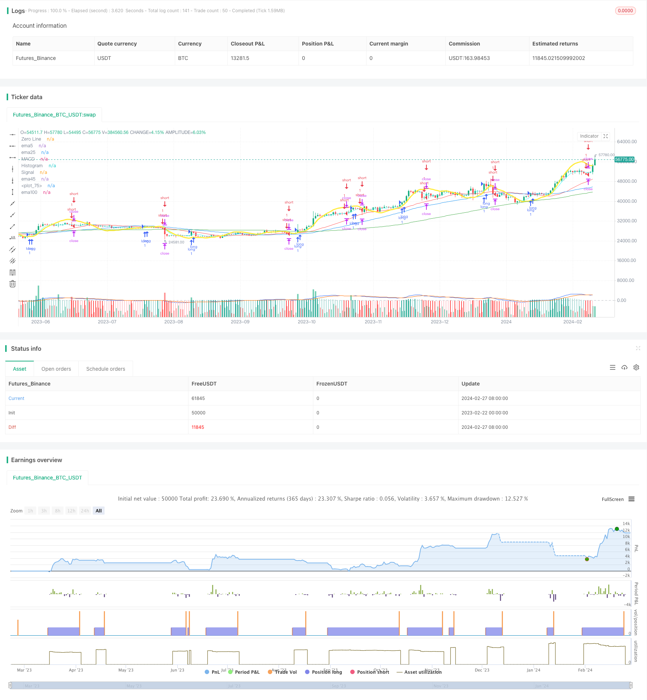

> Name

Based on Multiple-Moving-Average-Trading-Strategy
> Author

ChaoZhang

> Strategy Description


[trans]

## Overview
The name of this strategy is "Multiple Moving Average Trading Strategy". This strategy uses the intersection of the MACD indicator and the multiple moving averages as a trading signal, combines the ZLSMA indicator to assist in judging the trend, and sets the stop-profit and stop-loss Exiting logic to achieve automated trading.
## Strategy Principle
1. Calculate the fast line, slow line and MACD column of the MACD indicator. Set the golden cross to go long and the dead cross to go short.
2. Calculate the four moving averages: the 5-day moving average, the 25-day moving average, the 45-day moving average, and the 100-day moving average. The longer the moving average, the stronger the trend is.
3. Calculate the distance between the two sets of moving averages. If the distance exceeds a certain threshold, it means that the moving averages diverge and can be set as a trading signal.
4. Calculate the ZLSMA indicator, which indicates the medium and long-term trend direction of the price. When the ZLSSMA forms an inflection point, the trend turning point can be judged.
5. Combine the MACD indicator crossover, moving average divergence signal and ZLSMA trend judgment to set a long and short trading strategy.
6. Set take-profit and stop-loss points to implement automated exiting logic.
## Advantage Analysis
1. Multiple filtering signals improve strategy efficiency. The MACD indicator and moving average divergence signals can verify each other to avoid false breakthroughs.
2. The ZLSMA indicator assists in determining the mid- to long-term trend direction and avoids counter-trend trading.
3. Automatically set exit and stop loss points to reduce the frequency of human intervention.
## Risk Analysis
1. Improper parameter settings may lead to over-trading or missing orders. Parameters need to be optimized to achieve the best results.
2. Fixed take-profit and stop-loss points will limit profit margins or expand losses. Dynamic stop loss can be set in conjunction with the ATR indicator.
3. The moving average strategy has poor effect on the volatile market, so other indicators or manual intervention can be considered.
## Optimization direction
1. Optimize the combination of moving average parameters and test the effects of moving averages of different lengths.
2. Test and add other indicators, such as KDJ, BOLL, etc. to determine buying and selling points.
3. Try a dynamic stop-loss strategy and set stop-loss positions based on volatility.
4. Add a machine learning model to automatically find optimal parameters.
## Summarize
This strategy integrates MACD indicators, multiple moving averages and ZLSMA trend judgment to achieve automated trading. Improving strategy stability through multiple signal filtering and setting exiting logic to reduce risks have certain practical value. Subsequently, the strategy performance can be further improved through parameter optimization, indicator expansion, and dynamic stop loss.
||

## Overview

The strategy is named "Multiple Moving Average Trading Strategy". It utilizes the crossover of the MACD indicator and multiple moving averages as trading signals, with the assistance of the ZLSMA indicator to determine the trend, and sets the profit-taking and stop-loss exiting logic to realize automated trading.

## Strategy Principle   

1. Calculate the fast line, slow line and MACD histogram of the MACD indicator. Set long when seeing golden cross and short when seeing death cross.  

2. Calculate the 5-day, 25-day, 45-day and 100-day moving averages. The longer the moving average, the stronger the trend sustainability it represents.

3. Calculate the distance between the two groups of moving averages. If the distance exceeds a certain threshold, it means the divergence of the moving averages, which can be set as trading signals.  

4. Calculate the ZLSMA indicator, representing the mid-to-long term trend direction of the price. Trend reversals can be determined when ZLSMA forms turning points.

5. Combine the MACD crossover, moving average divergence signals and ZLSMA trend judgment to set long and short trading strategies.  

6. Set take profit and stop loss points to realize automated exiting logic.

## Advantage Analysis 

1. Multi-filter signals improve strategy efficiency. MACD and moving average divergence signals can verify each other to avoid false breakouts. 

2. ZLSMA assists in determining the medium and long term trend direction to avoid trading against the trend.

3. Automated exiting by setting profit-taking and stop-loss points reduces human intervention frequency.

## Risk Analysis   

1. Improper parameter settings may lead to over-trading or missing orders. Parameters need to be optimized for best results.

2. Fixed profit-taking and stop-loss points limit profit potential or increase losses. Dynamic stops based on ATR can be considered.

3. Moving average strategies work poorly in range-bound markets. Other indicators or manual intervention may be needed.

## Optimization Directions

1. Optimize combinations of moving average parameters by testing different length moving averages.  

2. Test adding other indicators such as KDJ and BOLL to determine entry and exit points.

3. Try dynamic stop loss strategies based on volatility measures.  

4. Add machine learning models to find optimal parameters automatically.

## Conclusion  

This strategy integrates MACD, multiple moving averages and ZLSMA trend determination to achieve automated trading. By filtering with multiple signals, strategy stability is improved; by setting exiting logic, risks are reduced. There is certain practical value for real trading. Subsequent parameter optimization, indicator expansion, dynamic stops etc. can further improve strategy performance.

[/trans]

> Strategy Arguments


|Argument|Default|Description|
|----|----|----|
|v_input_1|12|Fast Length|
|v_input_2|26|Slow Length|
|v_input_3_close|0|Source: close|high|low|open|hl2|hlc3|hlcc4|ohlc4|
|v_input_int_1|9|Signal Smoothing|
|v_input_string_1|0|Oscillator MA Type: EMA|SMA|
|v_input_string_2|0|Signal Line MA Type: EMA|SMA|
|v_input_4|5|maperiod 5|
|v_input_5|25|ma period 25|
|v_input_6|45|45 during ma period|
|v_input_7|100|100 during ma period|
|v_input_8|0.03|EMA Tongshi’s deviation value|
|v_input_int_2|32|Length|
|v_input_int_3|false|offset|
|v_input_9_close|0|Source: close|high|low|open|hl2|hlc3|hlcc4|ohlc4|
|v_input_10|0.06|ロングpips|
|v_input_11|-0.06|ショートpips|
|v_input_12|-0.06|ロングloss cut pips|
|v_input_13|0.06|ショート damage cut pips|

> Source (PineScript)

``` pinescript
/*backtest
start: 2023-02-22 00:00:00
end: 2024-02-28 00:00:00
period: 1d
basePeriod: 1h
exchanges: [{"eid":"Futures_Binance","currency":"BTC_USDT"}]
*/

//@version=5
strategy("MACD ZLSMA_izumi⑤（4つの条件、MCDがクロスしてたら）", overlay=true)

fast_length = input(title = "Fast Length", defval = 12)
slow_length = input(title = "Slow Length", defval = 26)
src = input(title = "Source", defval = close)
signal_length = input.int(title = "Signal Smoothing",  minval = 1, maxval = 50, defval = 9)
sma_source = input.string(title = "Oscillator MA Type",  defval = "EMA", options = ["SMA", "EMA"])
sma_signal = input.string(title = "Signal Line MA Type", defval = "EMA", options = ["SMA", "EMA"])
// Calculating
fast_ma = sma_source == "SMA" ? ta.sma(src, fast_length) : ta.ema(src, fast_length)
slow_ma = sma_source == "SMA" ? ta.sma(src, slow_length) : ta.ema(src, slow_length)
macd = fast_ma - slow_ma
signal = sma_signal == "SMA" ? ta.sma(macd, signal_length) : ta.ema(macd, signal_length)
hist = macd - signal

alertcondition(hist[1] >= 0 and hist < 0, title = 'Rising to falling', message = 'The MACD histogram switched from a rising to falling state')
alertcondition(hist[1] <= 0 and hist > 0, title = 'Falling to rising', message = 'The MACD histogram switched from a falling to rising state')

hline(0, "Zero Line", color = color.new(#787B86, 50))
plot(hist, title = "Histogram", style = plot.style_columns, color = (hist >= 0 ? (hist[1] < hist ? #26A69A : #B2DFDB) : (hist[1] < hist ? #FFCDD2 : #FF5252)))
plot(macd,   title = "MACD",   color = #2962FF)
plot(signal, title = "Signal", color = #FF6D00)

//MACDクロス設定
enterLong = ta.crossover(macd, signal)
enterShort = ta.crossunder(macd, signal)

//移動平均線の期間を設定
ema5 = input(5, title="ma期間5")
ema25 = input(25, title="ma期間25")
ema45 = input(45, title="ma期間45")
ema100 = input(100, title="ma期間100")

//移動平均線を計算
//sma関数で「ema25」バー分のcloseを移動平均線として「Kema」に設定
Kema5 = ta.sma(close,ema5)
Kema25 = ta.sma(close,ema25)
Kema45 = ta.sma(close,ema45)
Kema100 = ta.sma(close,ema100)


//移動平均線をプロット
plot(Kema5, color=color.rgb(82, 249, 255),title="ema5")
plot(Kema25, color=color.red,title="ema25")
plot(Kema45, color=color.blue,title="ema45")
plot(Kema100, color=color.green,title="ema100")

//ema同士の距離が30以上の時に「distancOK」にTureを返す
//distance1 = math.abs(Kema5-Kema25)
distance2 = math.abs(Kema25-Kema45)
distanceValue1 = input(0.030, title ="ema同士の乖離値") 
//distanceOk1 = distance1 > distanceValue1
distanceOk2 = distance2 > distanceValue1

//2区間のema同士の距離が30以上の時に「distanceOKK」にTrueを返す
//distanceOkK1 = distanceOk1 and distanceOk2
distanceOkK1 = distanceOk2

//5EMAとロウソクの乖離判定
//DistanceValue5ema = input(0.03, title ="5emaとロウソクの乖離率")
//emaDistance = math.abs(Kema5 - close)
//emaDistance5ema = emaDistance < DistanceValue5ema

//ZLSMA追加のコード
length = input.int(32, title="Length")
offset = input.int(0, title="offset")
src2 = input(close, title="Source")
lsma = ta.linreg(src2, length, offset)
lsma2 = ta.linreg(lsma, length, offset)
eq= lsma-lsma2
zlsma = lsma+eq
//ZLSMAのプロット
plot(zlsma, color=color.yellow, linewidth=3)

//ZLSMAの前回高値を検索
//var float zlsmaHigh = na
//var float zlsmaHighValue = na
//if ta.highest(zlsma,35) == zlsma[3]
//    zlsmaHighValue := zlsmaHigh
//    zlsmaHigh := zlsma[3]

//if (na(zlsmaHighValue))
 //   zlsmaHighValue := zlsmaHigh

//ZLSMAの前回安値を検索
//var float zlsmaLow = na
//var float zlsmaLowValue = na
//if ta.lowest(zlsma,35) == zlsma[3]
//    zlsmaLowValue := zlsmaLow
//    zlsmaLow := zlsma[3]

///if (na(zlsmaLowValue))
//    zlsmaLowValue := zlsmaLow

//利確・損切りポイントの初期化（変数の初期化）
var longProfit = 0.0
var longStop = 0.0
var shortProfit = 0.0
var shortStop = 0.0

//inputで設定画面の選択項目を設定
longProfitValue = input(0.06, title ="ロング利確pips")
shortProfitValue = input(-0.06, title ="ショート利確pips")
longStopValue = input(-0.06, title ="ロング損切pips")
shortStopValue = input(0.06, title ="ショート損切pips")

// クロスの強さを推定 
//angleThreshold = input(0.001, title = "クロスの強さ調節" )

// クロスの強さの閾値、この値を調整してクロスの強さの基準を変える 
//macdDiff = macdLine - signalLine 
//strongCross = math.abs(macdDiff) > angleThreshold 

// エントリー条件 (MACDラインとシグナルラインがクロス)
//ta.crossover(macdLine, signalLine)　and strongCross 


//ロングエントリー条件
if  distanceOkK1 and enterLong
	strategy.entry("long", strategy.long, comment="long")
    longProfit := close + longProfitValue
    longStop := close + longStopValue

//    if na(strategy.position_avg_price) and close>strategy.position_avg_price + 0.05 * syminfo.mintick 
 //       longStop := strategy.position_avg_price + 10 * syminfo.mintick
  //  strategy.exit("exit", "long",stop = longStop)

strategy.exit("exit", "long", limit = longProfit,stop = longStop)


if  distanceOkK1 and enterShort
	strategy.entry("short", strategy.short, comment="short")
    shortProfit := close + shortProfitValue
    shortStop := close + shortStopValue

 //   if na(strategy.position_avg_price) and close>strategy.position_avg_price - 0.05 * syminfo.mintick 
  //      shortStop := strategy.position_avg_price - 0.1 * syminfo.mintick
  //  strategy.exit("exit", "long",stop = longStop)


strategy.exit("exit", "short", limit = shortProfit,stop = shortStop)
//plot(strategy.equity, title="equity", color=color.red, linewidth=2, style=plot.style_areabr)
```

> Detail

https://www.fmz.com/strategy/443133

> Last Modified

2024-02-29 14:32:29
