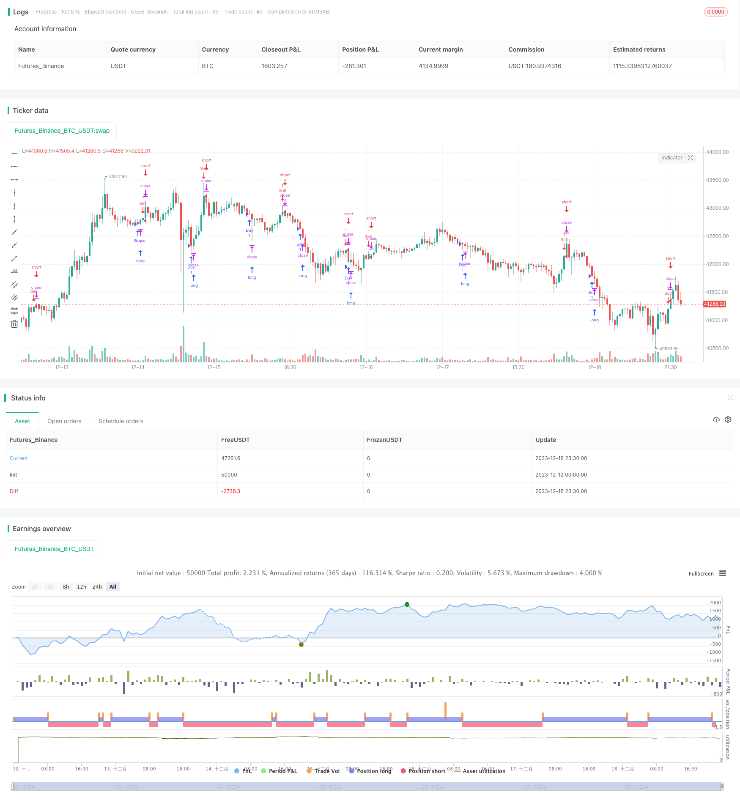

> Name

Multiple-Weighted-Moving-Averages-Trend-Strategy
> Author

ChaoZhang

> Strategy Description



[trans]

## Overview
The Multiple Weighted Moving Average trend strategy is a short-term trading strategy based on the Multiple Weighted Moving Average (WMA) indicator. It determines market trends by calculating WMAs of different periods and monitoring the intersections between them, and enters the market in time when the trend reverses. This strategy operates the 3-minute K-line of the EUR/CHF currency pair.
## Strategy Principle
This strategy uses 5 WMA indicators with different length periods at the same time, including 1-day line, 2-day line, 3-day line, 5-day line and 29-day line. Determine the current trend direction based on the long and short arrangement relationship between these moving averages. When the longer-period moving average (such as the 29-day line) is above the shorter-period moving average (such as the 1-day line), it indicates that the current trend is bullish; conversely, when the longer-period moving average is below the shorter period line, it indicates that the current trend is short.
In a specific trading strategy, if all the moving averages are arranged from top to bottom, that is, the 29-day line is above, the 5-day line is below the 29-day line, the 3-day line is below the 5-day line, the 2-day line is below the 3-day line, and the 1-day line is below the 2-day line, then this indicates that there is currently a short trend and should be considered Consider shorting; on the contrary, if all the moving averages are arranged from bottom to top, that is, the 1-day line is above, the 2-day line is below the 1-day line, the 3-day line is below the 2-day line, the 5-day line is below the 3-day line, and the 29-day line is below the 5-day line, then this indicates that it is currently in a bullish trend and you should consider going long. Trade by taking advantage of short-term trend reversals.
## Strategic Advantages
The biggest advantage of this multiple WMA trend strategy is its ability to accurately determine short-term trend turning points. Compared with a single moving average, the multiple WMA strategy combines multiple periods to determine the trend, which can effectively filter out false breakthroughs and avoid erroneous transactions such as exiting rng when the market is only a short-term adjustment. At the same time, the intersection of different period lines can also form a strong trend signal. Compared with other complex indicators, the WMA indicator is simple to calculate, does not require high computers, and has better results in practical applications.
## Strategy Risk
This strategy mainly faces two risks: The first is the risk of incorrect trend judgment. In some cases, the crossing of the moving average in the short term does not necessarily represent a real trend turning point, but may be just a short-term adjustment, which can easily lead to mistakes in trading decisions. The second risk is that the stop loss position is set unreasonably. The moving average strategy often requires setting a larger stop loss. If the stop loss is too small, it will be easy to be stopped out of the market and unable to capture the trend for a long time. In order to control these two risks, we can appropriately adjust the moving average cycle, optimize the stop loss position, and combine it with other indicators for confirmation.
## Strategy optimization
This strategy can be optimized from the following aspects: first, optimize the moving average cycle parameters, and adjust the cycle parameters to adapt to a wider range of market conditions; second, add other indicators for combination, and use them in combination with indicators such as MACD and RSI to improve signal quality; third, optimize the stop loss strategy to maximize profits through trailing stop loss, average stop loss, etc.; fourth, conduct parameter combination testing to find the optimal parameters to improve performance. Through comprehensive optimization in multiple aspects, the stability of the strategy can be comprehensively improved.
## Summarize
This strategy uses multiple weighted moving average indicators to determine short-term trend transitions and seize reversal opportunities for trading. It is accurate in judgment, simple to use and suitable for short-term operations. By optimizing parameters, stop losses, and signals, we can effectively control trading risks and improve strategy effects. In general, this strategy has good practical application value.
||

## Overview

The multiple weighted moving averages trend strategy is a short-term trading strategy based on multiple weighted moving average (WMA) indicators. It judges market trends by calculating WMAs of different periods and monitoring crossovers between them, entering positions when trend reversals occur. The strategy trades the EUR/CHF currency pair on 3-minute charts.  

## Strategy Logic

The strategy uses 5 WMAs of different period lengths simultaneously, including 1-day, 2-day, 3-day, 5-day and 29-day WMAs. It determines current trend direction according to the long/short arrangement relationships between these moving averages. When longer period moving averages (such as 29-day MA) are above shorter period ones (such as 1-day MA), it indicates an upward trend; conversely, when longer period MAs are below shorter ones, it signals a downward trend.

In actual trading, if all MAs are arranged from top to bottom - 29-day MA at the top, 5-day MA below 29-day MA, 3-day MA below 5-day MA, 2-day MA below 3-day MA, and 1-day MA at the bottom, it means a downward trend and short positions should be considered. On the contrary, if MAs are arranged from bottom to top - 1-day MA at the top and 29-day MA at the bottom, it suggests an upward trend and long positions are warranted. Trades are executed by capturing trend reversal timing in the short run.  

## Advantage Analysis  

The biggest advantage of this multi-WMA trend strategy lies in its accuracy of capturing short-term trend turning points. Compared to single MA strategies, the multi-WMA approach combines multiple periods to determine trends, which can effectively filter false breakouts and avoid premature exits due to short-term market corrections. In addition, crosses between different period MAs can form rather strong trend signals. As opposed to other complex indicators, the WMA is simple to calculate and less demanding on computing power, yet very effective in practical use.

## Risk Analysis

The strategy faces two main risks: first, the risk of trend misjudgment. In some cases, MA crosses in the short run may not represent real trend reversals but merely temporary corrections, which can lead to wrong trading decisions. Second, unreasonable stop-loss setting. Moving average strategies often require relatively wide stop-loss ranges. If stops are too tight, positions may get frequently stopped out, unable to sustain the trend. To control the risks, we can optimize MA periods, stop-loss levels, and combine other indicators for confirmation.  

## Optimization

Several aspects of the strategy can be optimized: first, optimize MA period parameters to adapt to more market conditions; second, combine with other indicators like MACD and RSI to improve signal quality; third, adopt better stop-loss techniques like trailing stop and average stop to maximize profit protection; fourth, test parameter combinations to find optimal settings and improve performance. Comprehensive optimization across different dimensions can greatly improve strategy robustness.  

## Conclusion  

The strategy identifies short-term trend turning points using multiple weighted moving averages and trades the reversals. With accurate judgments, ease of use, and suitability for short-term trading, by optimizing parameters, stops, and signals, we can effectively control trading risks and improve strategy efficacy. Overall, the strategy has great practical value for live trading.

[/trans]


> Source (PineScript)

``` pinescript
/*backtest
start: 2023-12-12 00:00:00
end: 2023-12-19 00:00:00
period: 30m
basePeriod: 15m
exchanges: [{"eid":"Futures_Binance","currency":"BTC_USDT"}]
*/

// This Pine Script™ code is subject to the terms of the Mozilla Public License 2.0 at https://mozilla.org/MPL/2.0/
// © kingseif

//@version=5
strategy(title="EURCHF Scalp 3 minutes", overlay=true)

// Moving Averages
len1 = 29
len2 = 5
len3 = 3
len4 = 2
len5 = 1
src = close

wma1 = ta.wma(src, len1)
wma2 = ta.wma(src, len2)
wma3 = ta.wma(src, len3)
wma4 = ta.wma(src, len4)
wma5 = ta.wma(src, len5)

// Strategy
wma_signal = wma1 > wma2 and wma2 > wma3 and wma3 > wma4 and wma4 > wma5
wma_sell_signal = wma1 < wma2 and wma2 < wma3 and wma3 < wma4 and wma4 < wma5

// Position Management
risk = 1.00
stop_loss = 0
take_profit = 0

// Long Position
if wma_signal
    strategy.entry("Buy", strategy.long)
    
    if stop_loss > 0
        strategy.exit("Sell", from_entry="Buy", loss=stop_loss)
    
    if take_profit > 0
        strategy.exit("Sell", from_entry="Buy", profit=take_profit)

// Short Position
if wma_sell_signal
    strategy.entry("Sell", strategy.short)
    
    if stop_loss > 0
        strategy.exit("Cover", from_entry="Sell", loss=stop_loss)
    
    if take_profit > 0
        strategy.exit("Cover", from_entry="Sell", profit=take_profit)

```

> Detail

https://www.fmz.com/strategy/435986

> Last Modified

2023-12-20 15:59:56
