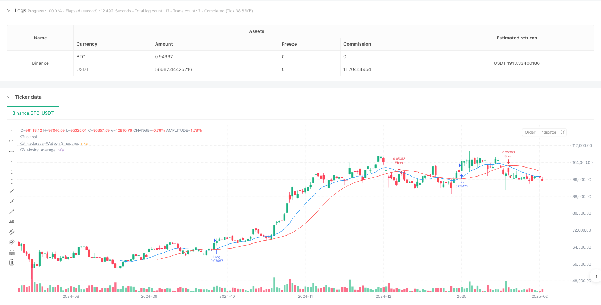
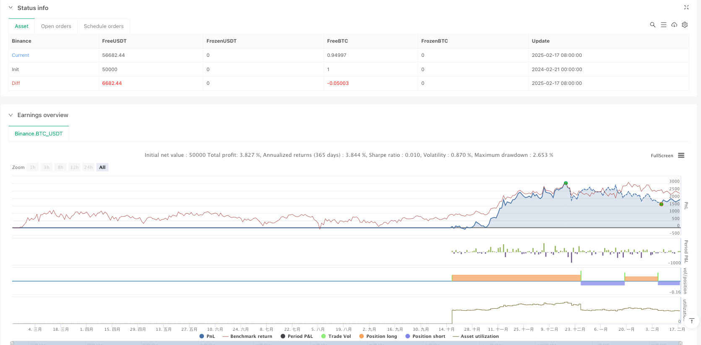

> Name

Intelligent-Trend-Following-Strategy-System-Based-on-Nadaraya-Watson-Kernel-Estimation-and-Moving-Average-Crossover
> Author

ianzeng123

> Strategy Description





[trans]
#### Overview
This strategy is a trend following trading system based on the Nadaraya-Watson kernel estimation method and moving average crossover. This strategy uses the Gaussian kernel function to smooth price data, and combines the cross signals of moving averages to capture market trends and achieve intelligent trend following transactions. The strategy adopts percentage position management, and by default uses 10% of the account equity for each transaction.
#### Strategy Principle
The core of the strategy is the Nadaraya-Watson kernel estimation method, which uses a Gaussian kernel function to non-parametrically smooth price data. The specific implementation includes the following steps:
1. Use the Gaussian kernel function to calculate the weight, and set the bandwidth parameter h to 8.0
2. Weighted smoothing of the past 500 price data points
3. Calculate the simple moving average (SMA) of the smoothed data, with a lookback period of 15 periods
4. When the smooth curve crosses the moving average, a long signal is generated
5. When the smooth curve crosses the moving average, a short signal is generated
6. Use position status variables to track current positions and avoid repeated openings.
#### Strategic Advantages
1. Use non-parametric estimation methods without assuming data distribution and better adapt to market changes
2. Gaussian kernel function smoothing can effectively reduce the impact of noise and improve signal quality.
3. Combined with moving average cross-validation to reduce false signals
4. Use a position management system to control risk exposure
5. The code is simple and efficient, easy to maintain and optimize
6. The strategy logic is clear and suitable for transactions in various time periods
#### Strategy Risk
1. Parameter sensitivity risk: The choice of bandwidth h and moving average period will significantly affect the strategy performance
2. Hysteresis risk: Both nuclear estimation and moving average have a certain degree of lag, and may miss sharp market trends.
3. Risk of market shock: False signals are easily generated in a volatile market.
4. Computational overhead: A large amount of historical data needs to be processed, which may affect real-time performance
5. Overfitting risk: Parameter optimization may lead to overfitting historical data
#### Strategy optimization direction
1. Introduce adaptive bandwidth: dynamically adjust bandwidth parameters according to market volatility
2. Add market environment filtering: add trend strength indicator and only open positions in strong trending markets
3. Optimize the stop loss mechanism: design a dynamic stop loss based on volatility
4. Improve position management: adjust position size based on signal strength and market volatility
5. Introduce multi-time period analysis: combined with longer period trend judgment
#### Summary
This strategy innovatively combines Nadaraya-Watson kernel estimation with traditional technical analysis to build a robust trend tracking system. Through Gaussian kernel smoothing and moving average crossover, it can effectively capture market trends while controlling risks. The strategy has good scalability and optimization space, and is suitable for further development and practical application. It is recommended that traders conduct sufficient parameter optimization and backtest verification before using it in real trading. ||
#### Overview
This strategy is a trend following trading system based on Nadaraya-Watson kernel estimation method and moving average crossover. The strategy uses a Gaussian kernel function to smooth price data and combines moving average crossover signals to capture market trends, achieving intelligent trend following trading. The strategy adopts percentage position management, using 10% of account equity by default for each trade.

#### Strategy Principles
The core of the strategy is the Nadaraya-Watson kernel estimation method, which uses a Gaussian kernel function for non-parametric smoothing of price data. The specific implementation includes the following steps:
1. Calculate weights using Gaussian kernel function with bandwidth parameter h set to 8.0
2. Perform weighted smoothing on past 500 price data points
3. Calculate Simple Moving Average (SMA) of smoothed data with 15-period lookback
4. Generate long signal when smoothed curve crosses above moving average
5. Generate short signal when smoothed curve crosses below moving average
6. Use position state variable to track current holdings and avoid duplicate entries

#### Strategy Advantages
1. Uses non-parametric estimation method, no assumption of data distribution needed
2. Gaussian kernel smoothing effectively reduces noise impact and improves signal quality
3. Moving average crossover validation reduces false signals
4. Position management system controls risk exposure
5. Code implementation is concise and efficient, easy to maintain and optimize
6. Clear strategy logic suitable for trading across various timeframes

#### Strategy Risks
1. Parameter sensitivity risk: choice of bandwidth h and moving average period significantly affects strategy performance
2. Lag risk: both kernel estimation and moving average have inherent lag, may miss sharp market moves
3. Choppy market risk: prone to false signals in sideways markets
4. Computational overhead: processing large historical data may affect real-time performance
5. Overfitting risk: parameter optimization may lead to overfitting historical data

#### Strategy Optimization Directions
1. Introduce adaptive bandwidth: dynamically adjust bandwidth parameter based on market volatility
2. Add market environment filtering: incorporate trend strength indicators, only enter positions in strong trend markets
3. Optimize stop-loss mechanism: design volatility-based dynamic stop-loss
4. Improve position management: adjust position size based on signal strength and market volatility
5. Introduce multi-timeframe analysis: combine trend judgment from longer timeframes

#### Summary
This strategy innovatively combines Nadaraya-Watson kernel estimation with traditional technical analysis to build a robust trend following system. Through Gaussian kernel smoothing and moving average crossover, it effectively captures market trends while controlling risk. The strategy has good scalability and optimization potential, suitable for further development and practical application. Traders are advised to conduct thorough parameter optimization and backtesting before live trading.[/trans]


> Source (PineScript)

``` pinescript
/*backtest
start: 2024-02-21 00:00:00
end: 2025-02-18 08:00:00
period: 1d
basePeriod: 1d
exchanges: [{"eid":"Binance","currency":"BTC_USDT"}]
*/

// This Pine Script™ code is subject to the terms of the Mozilla Public License 2.0 at https://mozilla.org/MPL/2.0/
// © UniCapInvest

//@version=5
strategy("Nadaraya-Watson Strategy with Moving Average Crossover", overlay=true, default_qty_type=strategy.percent_of_equity, default_qty_value=10, max_bars_back=500)

// Girdiler
h = input.float(8.,'Bandwidth', minval = 0)
src = input(close,'Source')
lookback = input.int(15, "Moving Average Lookback", minval=1)

// Gaussian fonksiyonu
gauss(x, h) => math.exp(-(math.pow(x, 2)/(h * h * 2)))

// Nadaraya-Watson smoothed değerini hesaplama
var float smoothed = na
sum_w = 0.0
sum_xw = 0.0

for i = 0 to 499
    w = gauss(i, h)
    sum_w += w
    sum_xw += src[i] * w

smoothed := sum_w != 0 ? sum_xw / sum_w : na

// Hareketli ortalama hesaplama
ma = ta.sma(smoothed, lookback)

// Alım ve satım koşulları (kesişimlere göre)
longCondition = ta.crossover(smoothed, ma)
shortCondition = ta.crossunder(smoothed, ma)

// Pozisyon durumu
var bool inPosition = false

// Strateji giriş ve çıkış koşulları
if (longCondition and not inPosition)
    strategy.entry("Long", strategy.long)
    inPosition := true

if (shortCondition and inPosition)
    strategy.entry("Short", strategy.short)
    inPosition := false

// Plotting
plot(smoothed, color=color.blue, title="Nadaraya-Watson Smoothed")
plot(ma, color=color.red, title="Moving Average")
```

> Detail

https://www.fmz.com/strategy/482809

> Last Modified

2025-02-20 14:54:41
