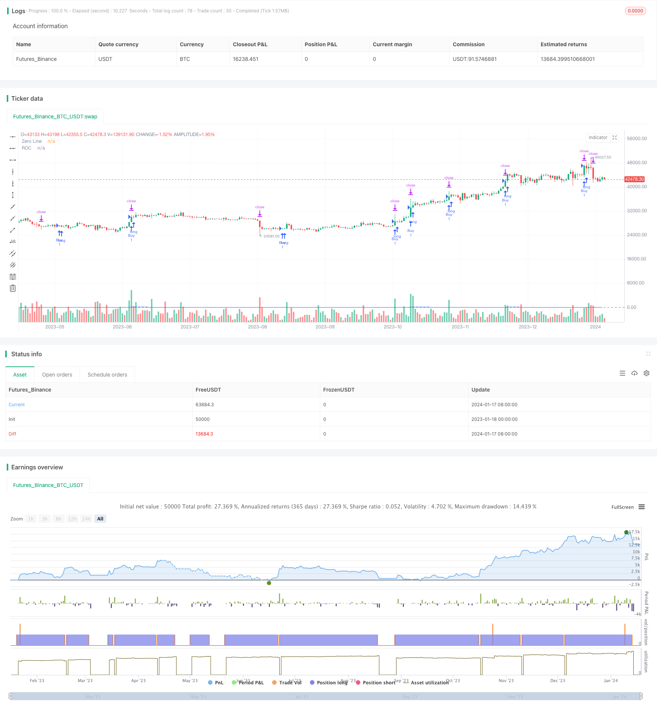

> Name

Trend-Following-Strategy-Based-on-Nadaraya-Watson-Envelopes-and-ROC-Indicator
> Author

ChaoZhang

> Strategy Description


 [trans]
#### Overview
The name of this strategy is "Double Envelope Trend Following Strategy". This strategy uses the Nadaraya-Watson (NW) envelope line and the ROC indicator to identify the trend direction and achieve trend tracking. Go long when the NW envelope line expands and the ROC is positive; go short when the NW envelope line contracts and the ROC is negative. This strategy sets both stop-loss and take-profit conditions to control risk.
#### Strategy Principle
The double-envelope trend following strategy is mainly based on the NW envelope line and ROC indicator to determine the timing of entry. The NW envelope line is a non-parametric smoothing technique that can be used to depict high and low price ranges. The ROC indicator identifies the speed and intensity of price changes.
Specifically, the strategy first calculates the NW upper and lower limits. When the price breaks through the NW upper limit line and ROC>0, it means that the market is in an upward trend, then go long; when the price falls below the NW lower limit line, and ROC<0, it means that the market is in a downward trend, then go short.
After going long or short, this strategy will set stop loss and take profit conditions. The stop loss point is a fixed number of points below the entry price, and the take profit point is a certain multiple of the stop loss points above the entry price. This can effectively control the risk of a single transaction.
In general, the double envelope trend following strategy combines the NW envelope line and the ROC indicator to determine the trend direction, as well as stop loss and take profit to control risks and realize trend following transactions.
#### Advantage Analysis
The two-envelope trend following strategy has several advantages:
1. Using the NW envelope line to determine the trend direction can effectively identify price trends and reduce false signals.
2. Combine the ROC indicator to determine the strength of the trend and avoid making wrong trades in a volatile market.
3. Set stop loss and take profit to control risks, and stop loss before exiting the trade before the loss expands. At the same time, some profits are ensured.
4. This strategy has fewer parameters, is simple to implement, and is easy to understand and optimize.
5. Can be applied to any product, including foreign exchange, digital currency and stock markets.
#### Risk Analysis
The two-envelope trend following strategy also carries the following risks:
1. Trend-chasing strategies are prone to serious losses when the trend reverses. Appropriate adjustment of parameters or manual intervention is required to exit.
2. If the stop loss point is too loose, the loss will increase. The number of stop loss points can be appropriately reduced.
3. In highly volatile markets, stop loss may be breached, resulting in uncontrollable losses. Consider real-time stop loss or dynamic stop loss.
4. The strategy does not consider transaction costs and slippage. This can compound losses in high-frequency trading.
Generally speaking, these risks can be reduced through parameter tuning, optimization of stop loss strategies, and appropriate manual intervention.
#### Strategy optimization direction
This strategy can be optimized from the following aspects:
1. Optimize NW parameters, such as window period, bandwidth size, etc., and find the best parameter combination.
2. Optimize ROC parameters such as window size to reduce false signals.
3. Try other indicators such as KDJ, MACD, etc. to determine the trend and enter the market.
4. Combined with machine learning algorithms to dynamically optimize stop-loss and take-profit strategies.
5. Add trend reversal signals and actively exit when the trend reverses.
6. Consider details such as slippage, handling fees, stop loss failure probability and other details in the actual offer to make the strategy closer to the actual offer.
Through parameter optimization, indicator and algorithm introduction, the stability and profitability of the strategy can be further improved.
#### Summarize
The name of this strategy is "Double Envelope Trend Following Strategy". This strategy uses the NW envelope line and ROC indicator to determine the trend direction for entry, and at the same time sets stop loss and take profit to achieve trend following trading. The strategy is simple and effective. The advantage is that it can follow the trend, control risks, and is suitable for a variety of markets. The disadvantage is that it is easy to lose money in trend reversal and it is difficult to seize the reversal opportunity. Through parameter optimization, algorithm introduction and manual intervention, the stability of the strategy can be further enhanced. Overall, the double envelope trend following strategy is a recommended trend following trading strategy.
||

#### Overview

This strategy is named "Dual Envelope Trend Following Strategy". It utilizes Nadaraya-Watson (NW) envelopes and ROC indicator to identify trend direction for trend following. It goes long when NW envelope expands and ROC is positive; goes short when NW envelope contracts and ROC is negative. Stop loss and take profit conditions are also configured to control risks.

#### Strategy Logic

The dual envelope trend following strategy mainly uses NW envelopes and ROC indicator to determine entry signals. NW envelope is a nonparametric smoothing technique that depicts price high-low range. ROC indicator identifies price change speed and strength.  

Specifically, this strategy first calculates upper and lower limit of NW envelopes. When price breaks through NW upper limit and ROC>0, it indicates an uptrend, so goes long. When price breaks through NW lower limit and ROC<0, it indicates a downtrend, so goes short.

After entering long or short, stop loss and take profit points are set. Stop loss is fixed pips below entry price. Take profit is certain multiplier of stop loss pips above entry price. This effectively controls risks for each trade.

In summary, the dual envelope trend following strategy combines NW envelopes and ROC indicator to judge trend direction, and uses stop loss and take profit to control risks, realizing trend following trading.

#### Advantage Analysis

The dual envelope trend following strategy has the following advantages:

1. Using NW envelopes to determine trend direction can effectively identify price trend and reduce false signals.  

2. Combining with ROC indicator to judge trend strength avoids wrong trades in ranging markets.

3. Setting stop loss and take profit controls risks, allowing to stop out before loss expands. Also locks in some profits.

4. The strategy has few parameters and is simple to understand and optimize.  

5. It can be applied to any market including forex, crypto and stocks.

#### Risk Analysis 

The dual envelope trend following strategy also has the following risks:

1. Trend following strategies are vulnerable to severe losses during trend reversal. Parameters should be adjusted or intervene manually.

2. A too wide stop loss may expand losses. Can properly tighten stop loss pips.  

3. In high volatility markets, stop loss may be penetrated, failing to control losses. Consider real-time or dynamic stop loss. 

4. Transaction costs and slippage are not considered which can add to losses in high frequency trading.

In general the risks can be reduced through parameter optimization, stop loss strategy improvement and proper manual intervention.

#### Optimization Directions

The strategy can be optimized in the following aspects:

1. Optimize NW parameters like window period and bandwidth to find best combination.

2. Optimize ROC window size to reduce false signals.  

3. Try other indicators like KDJ and MACD for trend and entry judgment.

4. Incorporate machine learning models to dynamically optimize stop loss and take profit.

5. Add trend reversal signals to actively exit when trend reverses. 

6. Consider practical details like slippage, fees, stop loss failure probabilities to make strategy closer to live trading.

Parameter optimization, indicator and algorithm introduction can further improve strategy stability and profitability.   

#### Summary

In summary, this strategy is named "Dual Envelope Trend Following Strategy". It uses NW envelopes and ROC indicator to determine trend direction and entries, and sets stop loss and take profit for trend following trading. The strategy is simple and effective, good at following trends and controlling risks, and can be applied to various markets. Shortcomings are severe losses during trend reversals and difficulty in capturing reversals. Further enhancements can be made through parameter optimization, algorithm incorporation and manual intervention to improve stability. Overall it is a recommended trend following trading strategy.
[/trans]

> Strategy Arguments


|Argument|Default|Description|
|----|----|----|
|v_input_float_1|500|NW Window Size|
|v_input_float_2|8|NW Bandwidth|
|v_input_float_3|3|NW Multiplier|
|v_input_1_close|0|NW Source: close|high|low|open|hl2|hlc3|hlcc4|ohlc4|
|v_input_color_1|#39ff14|NW Upper Color|
|v_input_color_2|#ff1100|NW Lower Color|
|v_input_2|false|NW Hide Disclaimer|
|v_input_int_1|9|ROC Window Size|
|v_input_3_close|0|ROC Source: close|high|low|open|hl2|hlc3|hlcc4|ohlc4|
|v_input_4|0.0001|PIP Multiplier|


> Source (PineScript)

``` pinescript
/*backtest
start: 2023-01-18 00:00:00
end: 2024-01-18 00:00:00
period: 1d
basePeriod: 1h
exchanges: [{"eid":"Futures_Binance","currency":"BTC_USDT"}]
*/

//@version=5
strategy("Combined Strategy", overlay=true)

// --- Nadaraya-Watson Envelope [LUX] ---
length_NW = input.float(500, title='NW Window Size', maxval=500, minval=0)
h_NW = input.float(8.0, title='NW Bandwidth')
mult_NW = input.float(3.0, title='NW Multiplier')
src_NW = input(close, title='NW Source')
up_col_NW = input.color(#39ff14, title='NW Upper Color', inline='col')
dn_col_NW = input.color(#ff1100, title='NW Lower Color', inline='col')
disclaimer_NW = input(false, title='NW Hide Disclaimer')

// --- Rate Of Change (ROC) ---
length_ROC = input.int(9, title='ROC Window Size', minval=1)
source_ROC = input(close, title='ROC Source')

roc = 100 * (source_ROC - source_ROC[length_ROC]) / source_ROC[length_ROC]

// --- Calcola Stop Loss e Take Profit in Pips ---
pip_multiplier = input(0.0001, title="PIP Multiplier")  // Moltiplicatore per convertire da pips a valore numerico

stop_loss_pips = 4
take_profit_multiplier = 2.1

stop_loss_value = close - stop_loss_pips * pip_multiplier
take_profit_value = close + stop_loss_pips * take_profit_multiplier * pip_multiplier

// --- Conditions for Entry ---
entry_condition_long = src_NW + mult_NW * mult_NW > 0 and roc > 0 and close > close[1]
entry_condition_short = src_NW - mult_NW * mult_NW < 0 and roc < 0 and close < close[1]

// --- Strategy Logic ---
if (entry_condition_long)
    strategy.entry("Buy", strategy.long)

if (entry_condition_short)
    strategy.entry("Sell", strategy.short)

if (strategy.position_size > 0)
    strategy.exit("Stop Loss/Profit", from_entry="Buy", loss=stop_loss_value, profit=take_profit_value)

if (strategy.position_size < 0)
    strategy.exit("Stop Loss/Profit", from_entry="Sell", loss=stop_loss_value, profit=take_profit_value)

// --- Plotting ---
plot(roc, color=#2962FF, title="ROC")
hline(0, color=#787B86, title="Zero Line")


```

> Detail

https://www.fmz.com/strategy/439361

> Last Modified

2024-01-19 15:14:23
