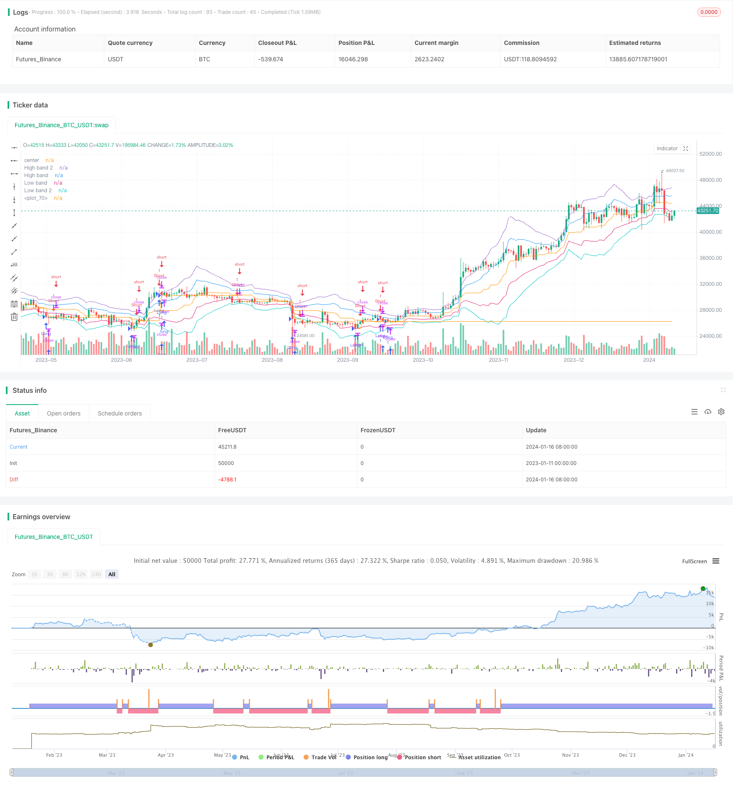

> Name

Momentum Position NoroBands Band Strategy NoroBands-Momentum-Position-Strategy
> Author

ChaoZhang

> Strategy Description


 [trans]

## Overview
This strategy is a momentum breakout strategy based on Noro's band theory and quantitative technology. It forms buying and selling signals and implements band breakout trading by calculating various indicators such as moving average, RSI, band, and bull and bear colors.
## Strategy Principle
1. Calculate the upper and lower rails of the band by averaging the true amplitude. A price breakout of the upper band is a bullish signal, and a price breakout of the lower band is a bearish signal.
2. Determine overbought and oversold areas through the RSI indicator. RSI below 30 is bullish, and above 70 is bearish.
3. Determine the momentum direction of the price through the breakthrough of the highest price and the lowest price.
4. Determine the long and short markets through bull and bear colors. Green is a long market, which is bullish; red is a short market, which is bearish.
5. Use the moving average to judge deviations to send trading signals.
## Advantage Analysis
1. Multiple indicator combinations to improve accuracy.
2. The combination of band theory and quantitative technology makes the strategy more effective.
3. Combine momentum breakthroughs with reversal trading to enhance profit margins.
4. Strong scalability, parameters can be adjusted according to the market.
## Risk Analysis
1. Parameter settings require continuous optimization and testing.
2. Failure to respond in time when switching between long and short positions may result in losses.
3. The number of transactions is high and it is susceptible to transaction fees and slippage.
4. Band parameters need to be adjusted in a timely manner to suit different cycles.
## Optimization direction
1. Multi-time period verification to find the best parameter combination.
2. Add a stop-loss strategy to reduce single losses.
3. Strengthen position management and improve profit efficiency.
4. Combined with deep learning for automatic parameter optimization.
## Summary
This strategy comprehensively uses a variety of typical quantitative technical indicators to achieve efficient profits through the combination of momentum indicators and reversal indicators. At the same time, use the average true volatility theory to find reasonable entry points. It can be described as a model of combining technical indicators and theory. Through continuous improvement of parameter optimization and risk control, it will surely become an efficient and stable quantitative strategy.
||

## Overview
This strategy combines Noro's bands theory with quantitative techniques to form a momentum breakout strategy. It generates trading signals by calculating moving averages, RSI, bands, color bars and other indicators to implement band breakout trading.

## Strategy Logic  
1. Calculate upper and lower bands using average true range. Price breaking through upper band indicates long signal while breaking lower band gives short signal.
2. Use RSI indicator to determine overbought and oversold zones. RSI below 30 suggests long while above 70 suggests short.
3. Breaking max and min prices shows price momentum direction.  
4. Color bars indicate bullish or bearish markets. Green means bull market for long while red means bear market for short.
5. Combine moving average to identify divergence for trade signals.

## Advantages
1. Multiple indicators combination improves accuracy. 
2. Combining bands theory and quantitative techniques makes the strategy more effective.
3. Blending momentum breakout and mean reversion trading expands profit room.  
4. High extensibility to adjust parameters according to markets.

## Risks
1. Parameters need constant optimization and testing.
2. Fails to respond timely to long-short switches, causing losses probably.
3. High trading frequency, affected easily by fees and slippage.  
4. Parameters should be adjusted timely to suit different cycles.  

## Optimization
1. Multi-timeframe validation to find best parameter combination.
2. Add stop loss to reduce single loss.
3. Larger position management to improve profit efficiency. 
4. Combine deep learning for auto parameter optimization.  

## Summary 
This strategy combines typical quantitative indicators to achieve effective profit through momentum and mean reversion indicators. It also uses average true range theory to locate reasonable entry points. A good example of combining theory and techniques. With parameters optimization and risk control improvement, it will become a efficient and stable quantitative strategy.

[/trans]

> Strategy Arguments


|Argument|Default|Description|
|----|----|----|
|v_input_1|true|Long|
|v_input_2|true|Short|
|v_input_3|20|Period|
|v_input_4|true|Use ColorBar|
|v_input_5|true|Use CryptoBottom|
|v_input_6|true|Use RSI|
|v_input_7|true|Use min/max|
|v_input_8|true|Use pyramiding|
|v_input_9|false|Show Bands|
|v_input_10|false|Show Background|
|v_input_11|false|Show Locomotive|
|v_input_12|false|Show Avg.price line|


> Source (PineScript)

``` pinescript
/*backtest
start: 2023-01-11 00:00:00
end: 2024-01-17 00:00:00
period: 1d
basePeriod: 1h
exchanges: [{"eid":"Futures_Binance","currency":"BTC_USDT"}]
*/


//@version=2
strategy("Noro's Bands Strategy v1.5", shorttitle = "NoroBands str 1.5", overlay=true)

//Settings
needlong = input(true, defval = true, title = "Long")
needshort = input(true, defval = true, title = "Short")
len = input(20, defval = 20, minval = 2, maxval = 200, title = "Period")
color = input(true, defval = true, title = "Use ColorBar")
usecb = input(true, defval = true, title = "Use CryptoBottom")
usersi = input(true, defval = true, title = "Use RSI")
usemm = input(true, defval = true, title = "Use min/max")
usepyr = input(true, defval = true, title = "Use pyramiding")
needbb = input(false, defval = false, title = "Show Bands")
needbg = input(false, defval = false, title = "Show Background")
needlo = input(false, defval = false, title = "Show Locomotive")
needpy = input(false, defval = false, title = "Show Avg.price line")
src = close

//Fast RSI
fastup = rma(max(change(src), 0), 2)
fastdown = rma(-min(change(src), 0), 2)
fastrsi = fastdown == 0 ? 100 : fastup == 0 ? 0 : 100 - (100 / (1 + fastup / fastdown))

//CryptoBottom
mac = sma(close, 10)
lencb = abs(close - mac)
sma = sma(lencb, 100)
max = max(open, close)
min = min(open, close)

//PriceChannel
lasthigh = highest(src, len)
lastlow = lowest(src, len)
center = (lasthigh + lastlow) / 2

//dist
dist = abs(src - center)
distsma = sma(dist, len)
hd = center + distsma
ld = center - distsma
hd2 = center + distsma * 2
ld2 = center - distsma * 2

//Trend
trend = close < ld and high < hd ? -1 : close > hd and low > ld ? 1 : trend[1]

//Lines
colo = needbb == false ? na : black
plot(hd2, color = colo, linewidth = 1, transp = 0, title = "High band 2")
plot(hd, color = colo, linewidth = 1, transp = 0, title = "High band")
plot(center, color = colo, linewidth = 1, transp = 0, title = "center")
plot(ld, color = colo, linewidth = 1, transp = 0, title = "Low band")
plot(ld2, color = colo, linewidth = 1, transp = 0, title = "Low band 2")

//Background
col = needbg == false ? na : trend == 1 ? lime : red
bgcolor(col, transp = 80)

//Signals
up = trend == 1 and ((close < open or color == false) or close < hd) and (min < min[1] or usemm == false) and (close < strategy.position_avg_price or usepyr == false or strategy.position_size <= 0) ? 1 : 0
dn = trend == -1 and ((close > open or color == false) or close > ld) and (max > max[1] or usemm == false) and (close > strategy.position_avg_price or usepyr == false or strategy.position_size >= 0) ? 1 : 0 
up2 = close < open and lencb > sma * 3 and min < min[1] and fastrsi < 10 and (close < strategy.position_avg_price or usepyr == false or strategy.position_size <= 0) ? 1 : 0 //CryptoBottom
//dn2 = close > open and len > sma * 3 and max > max[1] and fastrsi > 90 ? 1 : 0 //CryptoBottom
up3 = fastrsi < 5 and usersi == true and (close < strategy.position_avg_price or usepyr == false or strategy.position_size <= 0) ? 1 : 0
//dn3 = fastrsi > 95 and usersi = true ? 1 : 0

//Avg Price
colpy = needpy == false ? na : black
plot(strategy.position_avg_price, color = colpy)

up4 = close < strategy.position_avg_price and usepyr == true and strategy.position_size >= 0 ? 1 : 0 
dn4 = close > strategy.position_avg_price and usepyr == true and strategy.position_size <= 0 ? 1 : 0 

//Locomotive
uploco = trend == 1 and close < open and min < min[1] and close < center ? 1 : 0
plotarrow(needlo == true and uploco == 1 ? 1 : 0, colorup = black, colordown = black, transp = 0)

longCondition = up == 1 or (up2 == 1 and usecb == true) or (up3 == 1 and usersi == true) or up4 == 1
if (longCondition)
    strategy.entry("Long", strategy.long, needlong == false ? 0 : na)

shortCondition = dn == 1 or dn4 == 1
if (shortCondition)
    strategy.entry("Short", strategy.short, needshort == false ? 0 : na)
```

> Detail

https://www.fmz.com/strategy/439181

> Last Modified

2024-01-18 10:58:48
