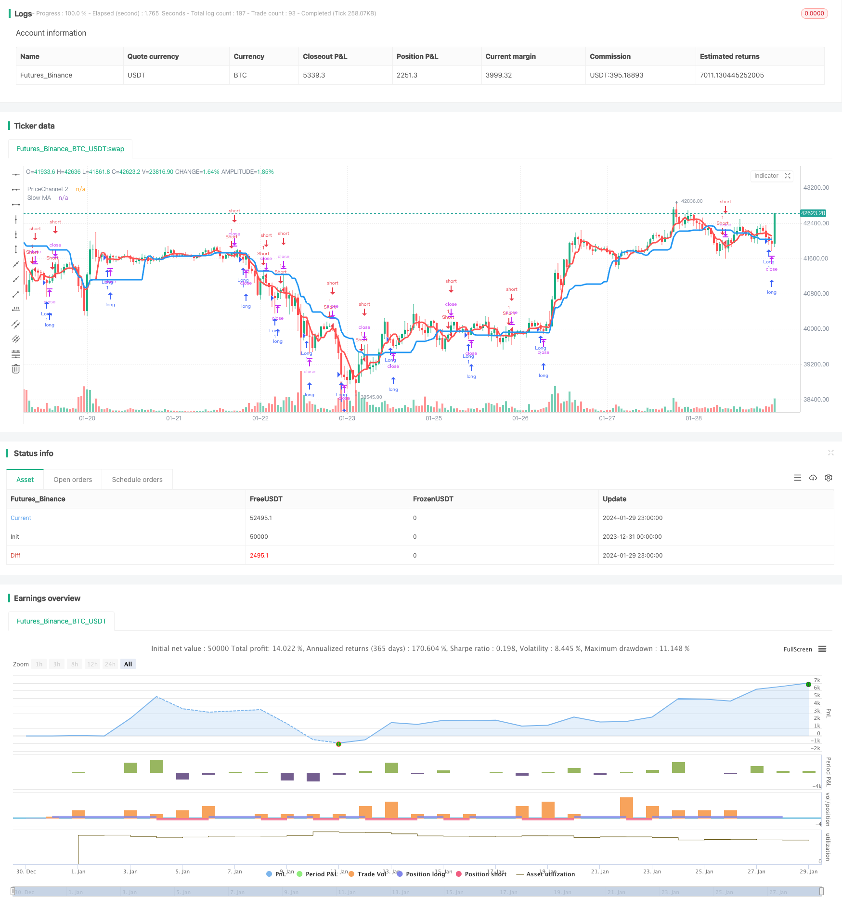

> Name

Extreme-version-of-Noros-Trend-Moving-Averages-Strategy
> Author

ChaoZhang

> Strategy Description


 [trans]
## Overview
This strategy uses two moving average indicators to identify trend direction and long and short opportunities. Among them, the slow moving average (blue line) is used to determine the overall trend direction, and the fast moving average (red line) is combined with the price channel to find long and short opportunities.
## Strategy Principle
1. Calculate two moving averages, fast and slow. The slow moving average period is 21, which is used to determine the overall trend; the fast moving average period is 5, which is combined with the price channel and is used to find trading opportunities.
2. Calculate whether the current price breaks through the price channel of the previous period. If the price breaks out of the channel, we consider it a trading opportunity.
3. Calculate the direction and number of K lines. If the last N K lines are all negative lines, it may be an opportunity to go long; if the last N K lines are all positive lines, it may be an opportunity to go short. The number of N is set through the Bars parameter.
4. Based on the above factors, a long and short signal is issued. If the market trend is consistent with the direction of the slow moving average, and the fast moving average or price channel sends a signal, and the K line also meets the conditions, a trading signal will be issued.
## Strategic Advantages
1. Using the dual moving average system can effectively track the trend direction.
2. The combination of fast moving averages and price channels can detect breakthrough points early and seize trading opportunities.
3. When sending signals, also consider the direction and quantity of the K line to avoid being trapped by the reversing market.
4. The moving average parameters can be adjusted freely, suitable for different varieties and periods.
## Strategic risks and solutions
1. Double moving averages can easily send out wrong signals in sideways trading. The price difference indicator or ATR indicator can be used to assist judgment to avoid trading in volatile market conditions.
2. You may be trapped under abnormal market conditions. You can set appropriate stop loss points to reduce single losses.
3. It is impossible to perfectly avoid being trapped by reversals. We will continue to optimize the mechanism and parameters to make the strategy more stable.
## Strategy optimization direction
1. Add auxiliary indicator judgments, such as ADX, MACD, etc., to avoid wrong transactions in volatile market conditions.
2. Dynamically adjust stop loss points. Risk expectations can be calculated based on ATR and a reasonable stop loss ratio can be set.
3. Optimize parameter adaptability. Machine learning methods can be used to allow the system to automatically optimize parameters.
4. Fine-tune the parameters according to the characteristics of the variety. Cryptocurrencies, for example, fit the parameters of shorter cycles.
## Summarize
This strategy is generally very suitable for tracking trending markets. At the same time, it also increases certain breakthrough trading opportunities. Through reasonable optimization, the strategy can run stably in more markets. We will continue to improve and strive to build it into a commercial-grade high-quality quantitative strategy.
|| 

## Overview

This strategy uses two moving average indicators to identify trend direction and long/short opportunities. The slower moving average (blue line) is used to determine the overall trend direction, while the faster moving average (red line) combined with the price channel is used to discover trading opportunities.  

## Strategy Logic

1. Calculate two moving averages - a slower MA with period 21 to determine the overall trend, and a faster MA with period 5 that combines with price channel to find trading opportunities.

2. Check if the current price breaks through the price channel formed in the previous period. A breakout signals a potential trading opportunity.  

3. Count the number and direction of recent candlesticks. For example, several consecutive bearish candlesticks may signal a long opportunity, while consecutive bullish candlesticks may signal a short opportunity. The number of candlesticks is configurable via the Bars parameter.

4. Combine all the above factors to generate long/short signals. A signal is triggered when price move aligns with slower MA trend direction, fast MA or price channel produces signal, and candlestick move matches condition.

## Advantages

1. The dual moving average system effectively tracks trend direction.  

2. Faster MA and price channel combined detects early breakout points to catch trading opportunities.

3. Also considers candlestick direction and counts to avoid being trapped by market reversals.  

4. Customizable MA parameters work for different products and timeframes.

## Risks and Mitigations 

1. Dual MAs can produce false signals during sideways markets. Can add oscillators or ATR to avoid trading choppy markets.

2. Still risks getting trapped in exceptional market moves. Can set proper stop loss to limit downside.

3. Impossible to fully avoid reversals. Will keep improving logic and parameters to make strategy more robust.

## Enhancement Opportunities

1. Add supporting indicators like ADX, MACD to avoid wrong trades in choppy markets.  

2. Dynamic stop loss calculation, e.g. based on ATR and risk preference.

3. Parameter optimization via machine learning for adaptive capability.  

4. Fine tune parameters based on instrument characteristics, e.g. shorter periods for crypto.

## Conclusion

Overall this strategy works very well in tracking trending markets, with additional breakout opportunities. With proper enhancements it can be made into a commercially viable high quality quant strategy. We will continue improving it to trade more markets stably.
[/trans]

> Strategy Arguments


|Argument|Default|Description|
|----|----|----|
|v_input_1|true|long|
|v_input_2|true|short|
|v_input_3|false|stops|
|v_input_4|5|Stop, %|
|v_input_5|false|Use OHLC4|
|v_input_6|true|Use fast MA Filter|
|v_input_7|5|fast MA Period|
|v_input_8|21|slow MA Period|
|v_input_9|2|Bars Q|
|v_input_10|false|Need trend Background?|
|v_input_11|false|Need entry arrows?|
|v_input_12|true|Need extreme? (crypto/fiat only!!!)|


> Source (PineScript)

``` pinescript
/*backtest
start: 2023-12-31 00:00:00
end: 2024-01-30 00:00:00
period: 1h
basePeriod: 15m
exchanges: [{"eid":"Futures_Binance","currency":"BTC_USDT"}]
*/

//@version=2
strategy(title = "Noro's Trend MAs Strategy v1.9 Extreme", shorttitle = "Trend MAs str 1.9 extreme", overlay=true, default_qty_type = strategy.percent_of_equity, default_qty_value=100.0, pyramiding=0)

//Settings
needlong = input(true, "long")
needshort = input(true, "short")
needstops = input(false, "stops")
stoppercent = input(5, defval = 5, minval = 1, maxval = 50, title = "Stop, %")
useohlc4 = input(false, defval = false, title = "Use OHLC4")
usefastsma = input(true, "Use fast MA Filter")
fastlen = input(5, defval = 5, minval = 1, maxval = 50, title = "fast MA Period")
slowlen = input(21, defval = 20, minval = 2, maxval = 200, title = "slow MA Period")
bars = input(2, defval = 2, minval = 0, maxval = 3, title = "Bars Q")
needbg = input(false, defval = false, title = "Need trend Background?")
needarr = input(false, defval = false, title = "Need entry arrows?")
needex = input(true, defval = true, title = "Need extreme? (crypto/fiat only!!!)")

src = useohlc4 == true ? ohlc4 : close

//PriceChannel 1
lasthigh = highest(src, slowlen)
lastlow = lowest(src, slowlen)
center = (lasthigh + lastlow) / 2

//PriceChannel 2
lasthigh2 = highest(src, fastlen)
lastlow2 = lowest(src, fastlen)
center2 = (lasthigh2 + lastlow2) / 2

//Trend
trend = low > center and low[1] > center[1] ? 1 : high < center and high[1] < center[1] ? -1 : trend[1]

//Bars
bar = close > open ? 1 : close < open ? -1 : 0
redbars = bars == 0 ? 1 : bars == 1 and bar == -1 ? 1 : bars == 2 and bar == -1 and bar[1] == -1 ? 1 : bars == 3 and bar == -1 and bar[1] == -1 and bar[2] == -1 ? 1 : 0
greenbars = bars == 0 ? 1 : bars == 1 and bar == 1 ? 1 : bars == 2 and bar == 1 and bar[1] == 1 ? 1 : bars == 3 and bar == 1 and bar[1] == 1 and bar[2] == 1 ? 1 : 0

//Signals
up = trend == 1 and (low < center2 or usefastsma == false) and (redbars == 1) ? 1 : 0
dn = trend == -1 and (high > center2 or usefastsma == false) and (greenbars == 1) ? 1 : 0

up2 = high < center and high < center2 and bar == -1 ? 1 : 0
dn2 = low > center and low > center2 and bar == 1 ? 0 : 0

//Lines
plot(center, color = blue, linewidth = 3, transp = 0, title = "Slow MA")
plot(center2, color = red, linewidth = 3, transp = 0, title = "PriceChannel 2")

//Arrows
plotarrow(up == 1 and needarr == true ? 1 : 0, colorup = black, colordown = black, transp = 0)
plotarrow(dn == 1 and needarr == true ? -1 : 0, colorup = black, colordown = black, transp = 0)

//Background
col = needbg == false ? na : trend == 1 ? lime : red
bgcolor(col, transp = 90)

//Alerts
alertcondition(up == 1, title='buy', message='Uptrend')
alertcondition(dn == 1, title='sell', message='Downtrend')

//Trading
stoplong = up == 1 and needstops == true ? close - (close / 100 * stoppercent) : stoplong[1]
stopshort = dn == 1 and needstops == true ? close + (close / 100 * stoppercent) : stopshort[1]

longCondition = up == 1 or (up2 == 1 and needex == true)
if (longCondition)
    strategy.entry("Long", strategy.long, needlong == false ? 0 : na)
    strategy.exit("Stop Long", "Long", stop = stoplong)

shortCondition = dn == 1
if (shortCondition)
    strategy.entry("Short", strategy.short, needshort == false ? 0 : na)
    strategy.exit("Stop Short", "Short", stop = stopshort)
```

> Detail

https://www.fmz.com/strategy/440559

> Last Modified

2024-01-31 17:00:53
