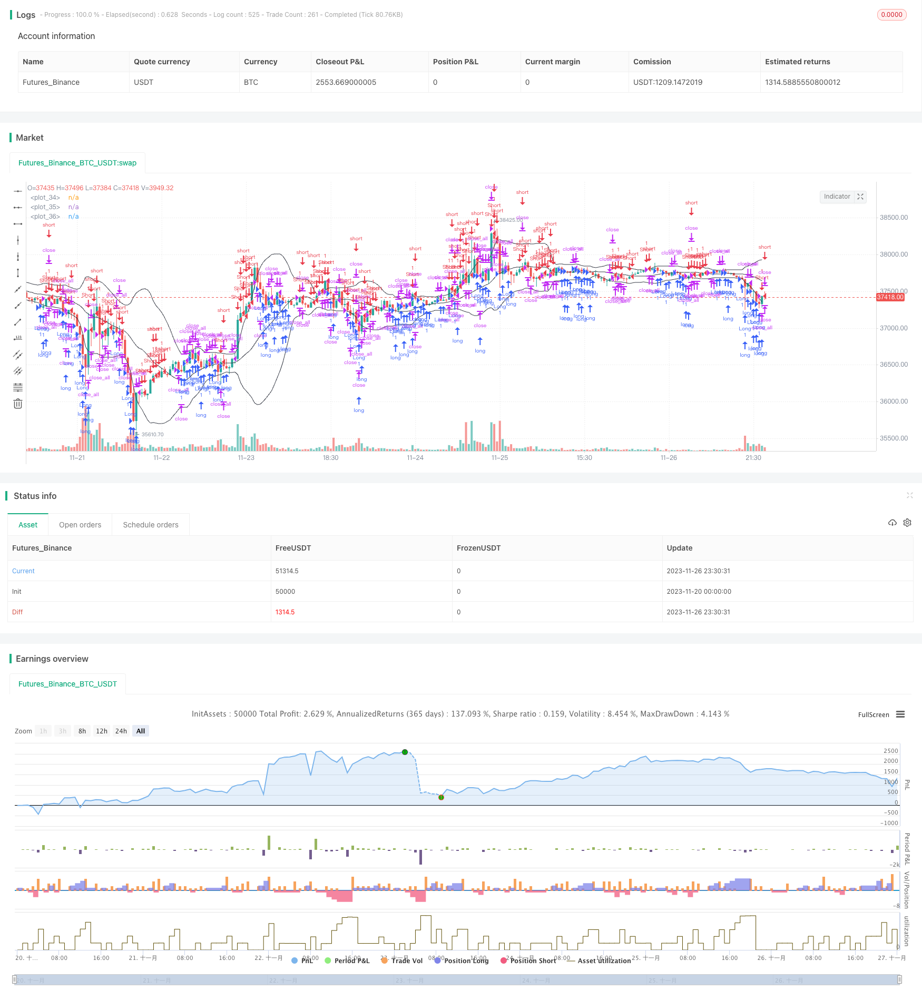

> Name

Noros-Bollinger-Tracking-Strategy
> Author

ChaoZhang

> Strategy Description



[trans]

## Overview
This strategy is a momentum swing tracking strategy based on Bollinger Bands. It combines Bollinger Band indicators to determine market trends and reversal points, and tracks market fluctuations by setting up long and short positions.
## Strategy Principle
The core indicator of this strategy is Bollinger Bands. Bollinger Bands consists of the middle track, upper track and lower track. The middle rail is the n-day moving average, and the upper and lower rails are the offsets of the middle rail plus or minus the standard deviation respectively. When the price is close to the upper and lower bands, it is considered an overbought or oversold signal. The strategy adds trend deviation as the basis for opening a position, that is, opening a position when the price reverses and breaks through the middle track. In order to prevent false breakthroughs from causing losses, the strategy requires opening a position with a breakthrough amplitude greater than the average. The condition for closing the position is that the price will turn back again after breaking through the middle track.
This strategy also adds trend position building and reversal position building, which correspond to different trading opportunities. Trend-oriented position building requires the middle track to be used as a reference for support and resistance, forming a breakthrough and deviation effect. A reversal position is formed by reversing directly near the upper and lower rails of the Bollinger Bands. By combining these two insights, strategies are able to take into account both trend following and reversal operations.
## Advantage Analysis
This strategy combines the overbought and oversold characteristics of Bollinger Bands and adds reversal point judgment. This makes it suitable for both trending and oscillating markets, capturing different types of trading opportunities. The strategy's Stop Loss Exit setting prevents losses from widening. The characteristics of long and short two-way trading also enhance the applicability of the strategy.
Compared with the simple Bollinger Bands strategy, the trend logic judgment added to this strategy makes the position building more stable, and it also seizes the reversal opportunity. This improves the signal-to-noise ratio. Secondly, long-short two-way trading also makes full use of trading opportunities in different markets.
## Risk Analysis
This strategy relies primarily on the overbought and oversold characteristics of Bollinger Bands. Therefore, when prices fluctuate violently, the Bollinger Bands range will continue to increase, which can easily lead to multiple positions with losses. This is a potential risk point. In addition, there is still a certain degree of uncertainty and error in reversal judgment, which will lead to failed position opening and stop loss.
In response to the failure of Bollinger Bands, the n-day parameter can be shortened to make Bollinger Bands more sensitive. Or reduce its amplitude range and reduce the possibility of losses. For reversal curve judgment, errors can be reduced by optimizing breakthrough parameters.
## Optimization direction
The main directions in which this strategy can be optimized are as follows:
1. The parameters of Bollinger Bands can be adjusted according to different markets to find the best parameter combination.
2. The magnitude of the trend deviation and the way the mean is calculated allow testing of other options.
3. Add more filters to judge the position signal to reduce the probability of misjudgment.
4. Stop loss methods can be tested, such as trail stop loss and other modes.
5. Parameters can be tuned for specific varieties and cycles.

## Summary
This strategy effectively expands and optimizes the Bollinger Bands standard strategy. The added trend deviation judgment improves stability and makes good use of reversal opportunities. Long-short two-way trading and stop-loss settings also make the strategy more robust. The effect can be further improved by optimizing parameters and adding more filters.
||


## Overview
This is a momentum tracking strategy based on Bollinger Bands. It combines Bollinger Bands to judge market trends and reversal points, and sets long and short positions to track market fluctuations.

## Principles
The core indicator of this strategy is Bollinger Bands, which consists of middle band, upper band and lower band. The middle band is the moving average of n days, and the upper and lower bands are the offsets of the middle band plus/minus standard deviation. When the price approaches the upper/lower band, it is considered a signal of overbought/oversold. The strategy incorporates trend deviation as the basis for opening positions, i.e. opening positions when the price breaks through the middle band in the opposite direction. To prevent losses caused by false breakouts, the strategy requires that the width of breakout is greater than the mean. The closing condition is that the price turns back after breaking through the middle band.

This strategy also incorporates both trend-following entries and mean-reversion entries, corresponding to different trading opportunities. Trend-following entries require the middle band to be the support/resistance reference and form deviation breakouts. Mean-reversion entries directly reverse near the upper/lower Bollinger bands. The strategy combines these two types of signals and can take both trend tracking and reversal operations.

## Advantage Analysis 
This strategy combines the overbought/oversold characteristics of Bollinger Bands with reversal point judgment. This enables it to apply to both trending and ranging markets, capturing different types of trading opportunities. The stop loss exit setting prevents the loss from expanding. Also, the ability to trade both long and short enhances the applicability of the strategy.

Compared with simple Bollinger strategies, the additional trend logic makes entries of this strategy more stable, and it also captures reversal opportunities. This improves the signal-to-noise ratio. In addition, trading both directions utilizes trading opportunities more fully across different market situations.

## Risk Analysis
This strategy mainly relies on the overbought/oversold characteristics of Bollinger Bands. So when there is extreme price fluctuation, the width of Bollinger Bands keeps expanding, which can easily lead to multiple losing trades. This is a potential risk point. In addition, there are still some uncertainties and errors in reversal judgments, causing failed entries and stops.

Against the failure of Bollinger Bands, we can shorten the parameter n to make the bands more sensitive, or reduce the band width to lower the chance of losses. As for reversal curve judgments, optimizing the parameters of breakouts can reduce errors.

## Optimization Directions
The main directions to optimize this strategy include:
1. The parameters of Bollinger Bands can be adjusted according to different markets to find the optimal combination.
2. The magnitude of deviation and the calculation of mean values can be tested with other options.  
3. Add more filters to judge entry signals and reduce false positives.
4. Test other stop loss methods like trail stop loss.
5. Parameters can be optimized towards specific products and timeframes.

## Conclusion
This strategy makes effective expansions and optimizations to standard Bollinger strategies. The added trend deviation improves stability and utilizes reversal opportunities well. The ability to trade both directions and stop losses also makes the strategy more robust. Further improvements can be achieved through parameter optimization and adding more filters.

[/trans]

> Strategy Arguments


|Argument|Default|Description|
|----|----|----|
|v_input_1|true|Long|
|v_input_2|true|Short|
|v_input_3|20|Bollinger Length|
|v_input_4|2|Bollinger Mult|
|v_input_5_ohlc4|0|Bollinger Source: ohlc4|high|low|open|hl2|hlc3|hlcc4|close|
|v_input_6|true|Use trend entry|
|v_input_7|true|Use counter-trend entry|
|v_input_8|2018|From Year|
|v_input_9|2100|To Year|
|v_input_10|true|From Month|
|v_input_11|12|To Month|
|v_input_12|true|From day|
|v_input_13|31|To day|
|v_input_14|true|Show Bollinger Bands|


> Source (PineScript)

``` pinescript
/*backtest
start: 2023-11-20 00:00:00
end: 2023-11-27 00:00:00
period: 30m
basePeriod: 15m
exchanges: [{"eid":"Futures_Binance","currency":"BTC_USDT"}]
*/

//Noro
//2018

//@version=3
strategy("Noro's Bollinger Strategy v1.3", shorttitle = "Bollinger str 1.3", overlay = true, default_qty_type = strategy.percent_of_equity, default_qty_value = 100.0, pyramiding = 5)

//Settings
needlong = input(true, defval = true, title = "Long")
needshort = input(true, defval = true, title = "Short")

length = input(20, defval = 20, minval = 1, maxval = 1000, title = "Bollinger Length")
mult = input(2.0, defval = 2.0, minval = 0.001, maxval = 50, title = "Bollinger Mult")
source = input(ohlc4, defval = ohlc4, title = "Bollinger Source")

uset = input(true, defval = true, title = "Use trend entry")
usect = input(true, defval = true, title = "Use counter-trend entry")

fromyear = input(2018, defval = 2018, minval = 1900, maxval = 2100, title = "From Year")
toyear = input(2100, defval = 2100, minval = 1900, maxval = 2100, title = "To Year")
frommonth = input(01, defval = 01, minval = 01, maxval = 12, title = "From Month")
tomonth = input(12, defval = 12, minval = 01, maxval = 12, title = "To Month")
fromday = input(01, defval = 01, minval = 01, maxval = 31, title = "From day")
today = input(31, defval = 31, minval = 01, maxval = 31, title = "To day")
showbands = input(true, defval = true, title = "Show Bollinger Bands")

//Bollinger Bands
basis = sma(source, length)
dev = mult * stdev(source, length)
upper = basis + dev
lower = basis - dev

//Lines
col = showbands ? black : na 
plot(upper, linewidth = 1, color = col)
plot(basis, linewidth = 1, color = col)
plot(lower, linewidth = 1, color = col)

//Body
body = abs(close - open)
abody = ema(body, 30)

//Signals
bar = close > open ? 1 : close < open ? -1 : 0 
up1 = bar == -1 and ohlc4 >= basis and ohlc4 < upper and (close < strategy.position_avg_price or strategy.position_size == 0) and uset
dn1 = bar == 1 and ohlc4 <= basis and ohlc4 > lower and (close > strategy.position_avg_price or strategy.position_size == 0) and uset
up2 = close <= lower and usect
dn2 = close >= upper and usect
exit = ((strategy.position_size > 0 and close > open) or (strategy.position_size < 0 and close < open)) and body > abody / 2

//Trading
if up1 or up2
    strategy.entry("Long", strategy.long, needlong == false ? 0 : na, when=(time > timestamp(fromyear, frommonth, fromday, 00, 00) and time < timestamp(toyear, tomonth, today, 23, 59)))

if dn1 or dn2
    strategy.entry("Short", strategy.short, needshort == false ? 0 : na, when=(time > timestamp(fromyear, frommonth, fromday, 00, 00) and time < timestamp(toyear, tomonth, today, 23, 59)))
    
if time > timestamp(toyear, tomonth, today, 23, 59) or exit
    strategy.close_all()
```

> Detail

https://www.fmz.com/strategy/433588

> Last Modified

2023-11-28 16:57:28
