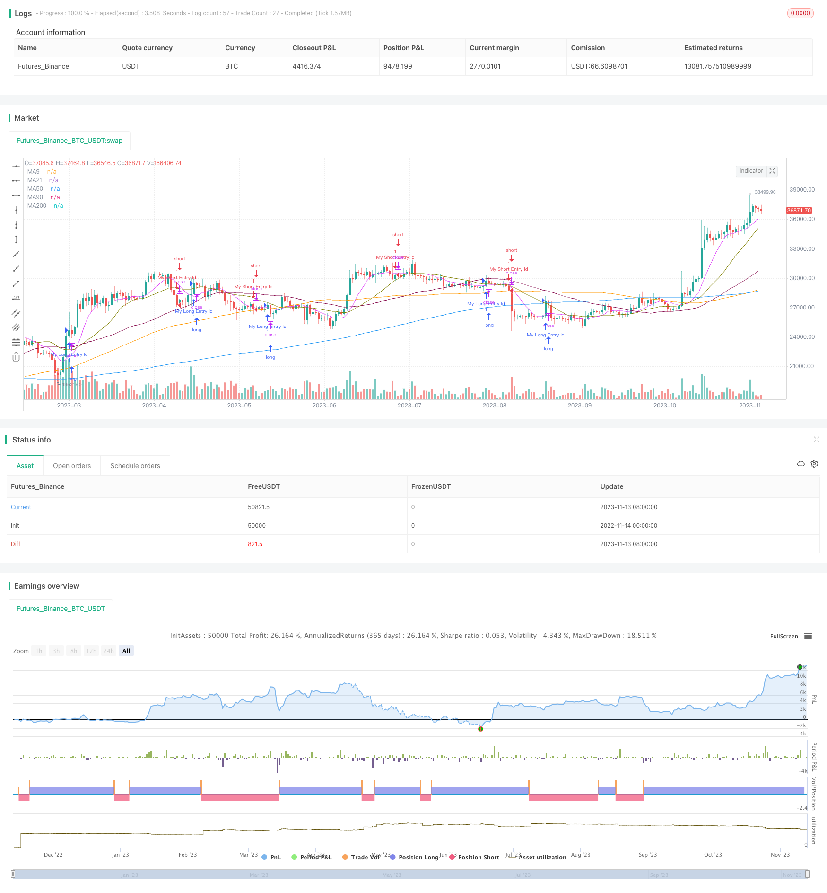

> Name

Altered-OBV-and-MACD-Quantitative-Trading-Strategy based on altered OBV and MACD
> Author

ChaoZhang

> Strategy Description



[trans]

## Overview
This strategy is based on the modified energy tide indicator (OBV) and MACD to judge trading signals, and is a volume-price comprehensive strategy. It combines the stock price index MACD and changes in OBV as a comprehensive signal of volume and price, aiming to find trading opportunities for stock volume and price breakthroughs.
## Strategy Principle
1. Calculate the simple moving average SMA to determine the market trend.
2. Calculate the change OBV. It changes the calculation method of OBV based on the relationship between the closing price and the previous day's closing price, making OBV more sensitive.
3. Calculate MACD on changing OBV. MACD is composed of fast line, slow line and MACD column, which can detect the trend of volume and energy changes.
4. When MACD is golden cross and upward, it is judged as a buy signal.
5. When MACD crosses downwards, it is judged as a sell signal.
6. Combine with the market SMA judgment to avoid unnecessary transactions.
## Advantage Analysis
1. Changing the OBV is more sensitive and can capture energy changes in advance.
2. MACD can clearly judge the trend and key points of volume energy changes.
3. Integrate volume and price signals to improve signal accuracy.
4. SMA determines the market trend and helps filter out false signals.
5. The strategy ideas are clear and easy to understand, and there is plenty of room for parameter optimization.
## Risk Analysis
1. Changing OBV can easily produce false signals and needs to be filtered with other indicators.
2. Improper setting of MACD parameters may miss trading opportunities or generate false signals.
3. It is necessary to pay attention to the information of the stock itself to avoid losses caused by individual stock problems.
4. Pay attention to the market environment and is not suitable for special market scenarios.
5. There are risks in backtest data fitting, and the effect of real trading may be reduced.
## Optimization direction
1. Test different SMA cycle combinations to optimize market trend judgment.
2. Test MACD parameter settings and optimize the amount of energy changes to judge.
3. Add other indicators to filter out false signals, such as KDJ, RSI, etc.
4. Add a stop loss strategy to control single losses.
5. Optimize fund management strategies and improve overall profitability.
6. Test the differences in parameters of different stock strategies.
## Summarize
This strategy integrates and changes the OBV and MACD indicators to achieve the combination of volume and price, and can capture changes in the stock's volume and energy situation in advance, thereby generating trading signals. Compared with using OBV or MACD alone, this strategy can provide more reliable buying and selling opportunities. However, this strategy also has a certain risk of false signals, and it is necessary to further optimize the indicator combination and parameter settings, and supplement it with fund management methods, in order to obtain stable returns in the real market. Overall, this strategy has a clear idea and deserves further testing and optimization to explore its potential.
|| 

## Overview

This strategy uses altered On Balance Volume (OBV) and MACD to generate trading signals. It combines price index MACD and altered OBV as a comprehensive indicator for volume and price, aiming to capture trading opportunities when price and volume strengths breakout.

## Strategy Logic

1. Calculate Simple Moving Average (SMA) to determine market trend. 

2. Calculate altered OBV. It modifies the OBV calculation based on close price and previous close price relationship to make OBV more sensitive.

3. Calculate MACD on altered OBV. MACD consists of fast line, slow line and histogram to identify volume momentum change.

4. When MACD golden cross and goes up, a buy signal is generated. 

5. When MACD dead cross and goes down, a sell signal is triggered.

6. Check SMAs to avoid unnecessary trades during trendless market.

## Advantage Analysis 

1. Altered OBV is more sensitive to capture early volume changes.

2. MACD clearly indicates volume momentum change and key levels.

3. Volume and price combined signal improves accuracy. 

4. SMA filters false signal by determining market trend.

5. Clear strategy logic and big optimization space.

## Risk Analysis

1. Altered OBV may generate false signals, needs filter by other indicators.

2. Improper MACD parameters setting may miss trades or cause false signals.

3. Pay attention to stock specifics to avoid losses.

4. Monitor market condition as strategy may not work for special scenarios. 

5. Backtest overfit risk may lead to worse performance in live trading.

## Optimization Directions

1. Test different SMA period combinations to optimize market trend determination.

2. Test MACD parameters to better identify volume momentum change.

3. Add other indicators as filter, like KDJ, RSI etc.

4. Add stop loss to limit loss per trade.

5. Optimize money management to improve overall profitability. 

6. Test parameter differences among stocks.

## Conclusion

The strategy combines altered OBV and MACD to achieve volume and price synthesis. It can capture volume momentum change early and generate trading signals. Compared to using OBV or MACD alone, this strategy provides more reliable trading opportunities. However, false signals risk exists and further optimizations on indicators and parameters, plus money management are needed to obtain steady profits in live trading. Overall, the strategy has clear logic and is worth testing and optimizing to explore its potential.

[/trans]

> Strategy Arguments


|Argument|Default|Description|
|----|----|----|
|v_input_int_1|false|Offset|
|v_input_1|12|Fast Length|
|v_input_2|26|Slow Length|
|v_input_int_2|9|Signal Smoothing|
|v_input_string_1|0|Oscillator MA Type: EMA|SMA|
|v_input_string_2|0|Signal Line MA Type: EMA|SMA|


> Source (PineScript)

``` pinescript
/*backtest
start: 2022-11-14 00:00:00
end: 2023-11-14 00:00:00
period: 1d
basePeriod: 1h
exchanges: [{"eid":"Futures_Binance","currency":"BTC_USDT"}]
*/

// This source code is subject to the terms of the Mozilla Public License 2.0 at https://mozilla.org/MPL/2.0/
// © stocktechbot

//@version=5
strategy("Altered OBV On MACD", overlay=true, margin_long=100, margin_short=100)

// This source code is subject to the terms of the Mozilla Public License 2.0 at https://mozilla.org/MPL/2.0/
// © stocktechbot
//@version=5
//SMA Tredline
out = ta.sma(close, 200)
outf = ta.sma(close, 50)
outn = ta.sma(close, 90)
outt = ta.sma(close, 21)
outthree = ta.sma(close, 9)
//sma plot
offset = input.int(title="Offset", defval=0, minval=-500, maxval=500)
plot(out, color=color.blue, title="MA200", offset=offset)
plot(outf, color=color.maroon, title="MA50", offset=offset)
plot(outn, color=color.orange, title="MA90", offset=offset)
plot(outt, color=color.olive, title="MA21", offset=offset)
plot(outthree, color=color.fuchsia, title="MA9", offset=offset)

fast_length = input(title="Fast Length", defval=12)
slow_length = input(title="Slow Length", defval=26)
chng = 0
obv = ta.cum(math.sign(ta.change(close)) * volume)
if close < close[1] and (open < close)
    chng := 1
else if close > close[1]
    chng := 1
else
    chng := -1
obvalt = ta.cum(math.sign(chng) * volume)
//src = input(title="Source", defval=close)
src = obvalt
signal_length = input.int(title="Signal Smoothing",  minval = 1, maxval = 50, defval = 9)
sma_source = input.string(title="Oscillator MA Type",  defval="EMA", options=["SMA", "EMA"])
sma_signal = input.string(title="Signal Line MA Type", defval="EMA", options=["SMA", "EMA"])

// Calculating
fast_ma = sma_source == "SMA" ? ta.sma(src, fast_length) : ta.ema(src, fast_length)
slow_ma = sma_source == "SMA" ? ta.sma(src, slow_length) : ta.ema(src, slow_length)
macd = fast_ma - slow_ma
signal = sma_signal == "SMA" ? ta.sma(macd, signal_length) : ta.ema(macd, signal_length)
hist = macd - signal
//hline(0, "Zero Line", color=color.new(#787B86, 50))
//plot(hist, title="Histogram", style=plot.style_columns, color=(hist>=0 ? (hist[1] < hist ? col_grow_above : col_fall_above) : (hist[1] < hist ? col_grow_below : col_fall_below)))
//plot(macd, title="MACD", color=col_macd)
//plot(signal, title="Signal", color=col_signal)
[macdLine, signalLine, histLine] = ta.macd(close, 12, 26, 9)
//BUY Signal
mafentry =ta.sma(close, 50) > ta.sma(close, 90)
//matentry = ta.sma(close, 21) > ta.sma(close, 50)
matwohun = close > ta.sma(close, 200)
twohunraise = ta.rising(out, 2)
twentyrise = ta.rising(outt, 2)
macdrise = ta.rising(macd,2)
macdlong = ta.crossover(macd, signal)
longCondition=false
if macdlong and macdrise
    longCondition := true

if (longCondition)
    strategy.entry("My Long Entry Id", strategy.long)
//Sell Signal
mafexit =ta.sma(close, 50) < ta.sma(close, 90)
matexit = ta.sma(close, 21) < ta.sma(close, 50)
matwohund = close < ta.sma(close, 200)
twohunfall = ta.falling(out, 3)
twentyfall = ta.falling(outt, 2)
shortmafall = ta.falling(outthree, 1)
macdfall = ta.falling(macd,1)
macdsell = macd < signal
shortCondition = false
if macdfall and macdsell and (macdLine < signalLine) and ta.falling(low,2)
    shortCondition := true


if (shortCondition)
    strategy.entry("My Short Entry Id", strategy.short)

```

> Detail

https://www.fmz.com/strategy/432241

> Last Modified

2023-11-15 17:58:42
