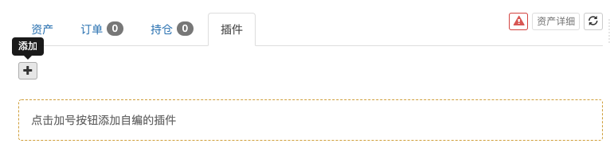
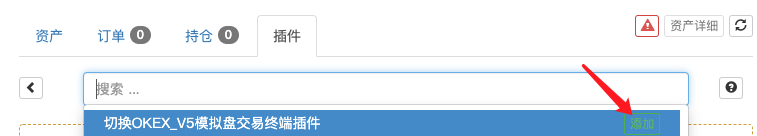
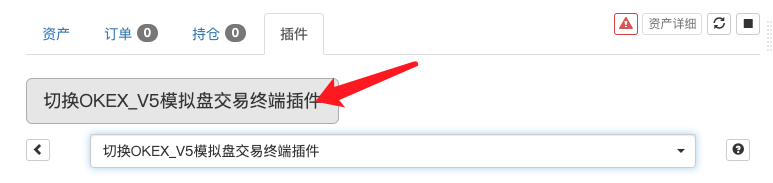
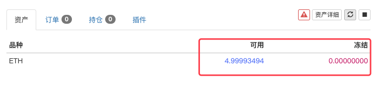

> Name

Switch to OKEX_V5 simulated trading terminal plug-in
> Author

Inventor Quantification-Little Dream
> Strategy Description

## Trading terminal OKEX_V5 simulation disk switching plug-in
When the OKEX V5 exchange object is configured (using OKEX V5's simulated disk API KEY configuration), because the simulated disk environment is not switched, the following error will be reported:
```
{"msg":"Broker id of APIKey does not match current environment.","code":"50101"}
```

You can use this plug-in to switch, as shown in the figure:
- #### Click the Add button:
   

- #### Select plugin:
   

- #### Execute plugin
   

- #### Execute immediately
    

- #### The simulated disk assets are read out
   

If you want to switch back to the real disk environment, just uncheck the option and execute it again.


> Source (javascript)

``` javascript
function main() {    
    exchange.IO("simulate", true)
    return "已经切换为OKEX V5模拟盘"
}
```

> Detail

https://www.fmz.com/strategy/288769

> Last Modified

2021-06-08 15:08:47
