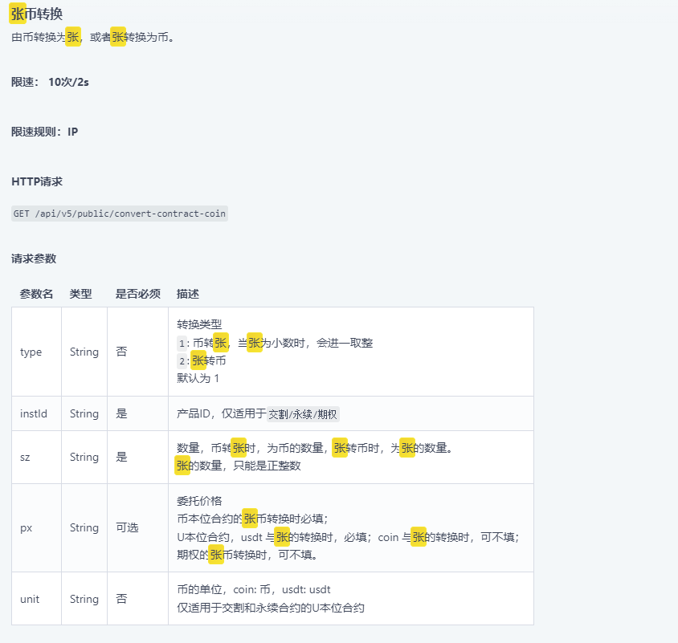
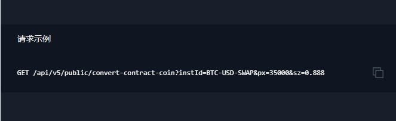
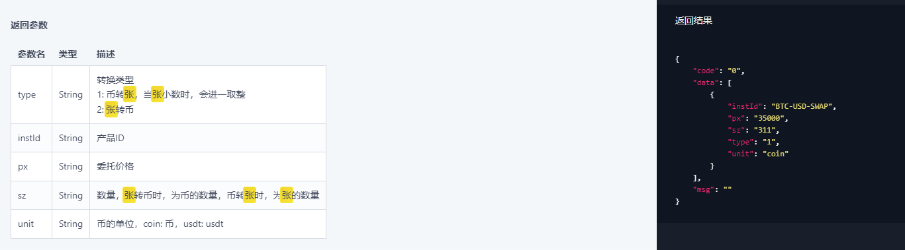
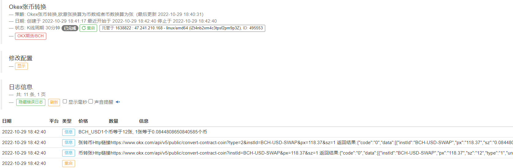

> Name

Okex Zhang Coin Conversion European and Italian Zhangs are converted into coins or coins are converted into Zhangs
> Author

Exodus[strategy ghostwriting]
> Strategy Description

As in the title:





By the way, I will undertake the ghostwriting of strategies.


> Source (javascript)

``` javascript
//测试模块
//链接可由任意交易所发起，传入对应币对名称，价格，数量等即可
function main() {
    
    let currency=_C(exchange.GetCurrency);//币对名称
    
    let curPrice=_C(exchange.GetTicker).Last;//当前价格
    
    let atz=AmountToZhang(currency,curPrice,1);//一个币等于多少张？
    
    let zta=ZhangToAmount(currency,curPrice,1);//一张等于几个币？
    
    
    Log(currency+"1个币等于"+atz+"张,","1张等于"+zta+"个币");
    
}

//币转张
//currency表示币对名称，px表示转换时的价格，sz表示币的数量，通过币数量计算出张数(未计算杠杆)
function AmountToZhang(currency,px,sz){
    
    //ok交易所请求时交易对格式为ETH-USDT-SWAP,而不是ETH_USDT,所以要注意instId的下划线必须要转换成-，也就是减号
    let instId=currency.replace("_","-")+"-SWAP";
    
    
    let str="https://www.okx.com/api/v5/public/convert-contract-coin?"+"instId="+instId+"&px="+px+"&sz="+sz;
    let ret=JSON.parse(HttpQuery(str));
    
    Log("币转张Http链接"+str,"返回结果:"+JSON.stringify(ret));
    
    
    return ret.data[0].sz;//返回一个币对应多少张
    
}

//张转币，表示一张对应几个币
//currency表示币对名称 ,px表示转换时的价格，sz表示张数,传入张数获得对应币数（未计算杠杆）
function ZhangToAmount(currency,px,sz){
    //ok交易所请求时交易对格式为ETH-USDT-SWAP,而不是ETH_USDT,所以要注意instId的下划线必须要转换成-，也就是减号
    let instId=currency.replace("_","-")+"-SWAP";
    
    let str="https://www.okx.com/api/v5/public/convert-contract-coin?"+"type=2&instId="+instId+"&px="+px+"&sz="+sz;
    let ret=JSON.parse(HttpQuery(str));
    
    Log("张转币Http链接"+str,"返回结果:"+JSON.stringify(ret));
    
    
    return ret.data[0].sz;//注意结果未计算杠杆，如ok一张BCH,对应币数为10，想要在其他交易所下单等量保证金的币就要计算杠杆，也就是下10/20(杠杆)，0.5个币.
    
}
```

> Detail

https://www.fmz.com/strategy/387901

> Last Modified

2022-10-29 18:47:50
