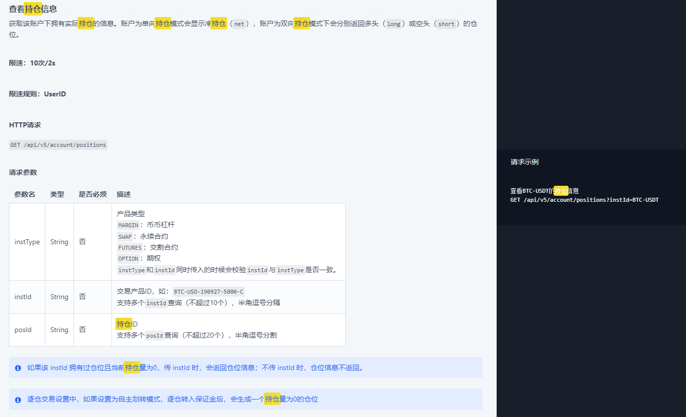
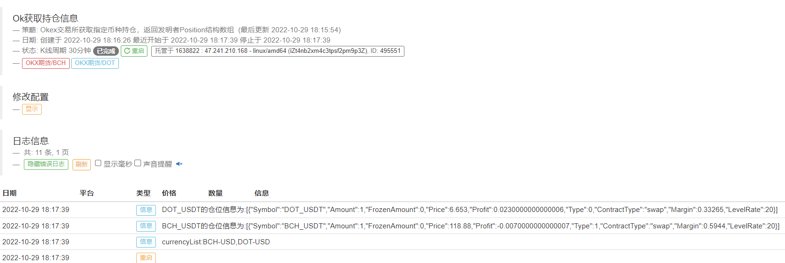

> Name

Okex exchange obtains the specified currency position and returns the inventor's Position structure array
> Author

Exodus[strategy ghostwriting]
> Strategy Description

Use OK request to obtain the position information of the specified currency.
 
 
 
  
By the way, I will undertake the ghostwriting of strategies.


> Source (javascript)

``` javascript

//测试模块
//由Okex交易所发起请求
function main() {
    //Log(exchange.GetAccount());
    exchange.SetContractType("swap");
    
    //多币种构造查询列表:
    let currencyList="";
    for(let i=0;i<exchanges.length;i++){//遍历已添加的所有交易所
        currencyList=currencyList+ exchanges[i].GetCurrency().replace("_","-")+",";//格式转化，okx请求需要由ETH_USDT转换为ETH-USDT格式
    }
    currencyList=currencyList.substring(0,currencyList.length-1);//删除最后一个都好
    Log("查询列表currencyList:"+currencyList);
   
    let positions=GetAllPositionInOk(exchange,currencyList);//获得结果
    
    for(let i=0;i<positions.length;i++){//打印每个交易所获得的仓位信息
        Log(positions[i][0].Symbol+"的仓位信息为:"+JSON.stringify(positions[i]));
      
    }
    
}


// 从持仓列表中获取特定币种的持仓
function GetPositionBySymbol(positions, symbol) {
    var index = -1;

    if (positions && positions.length > 0) {
        for (var i = 0; i < positions.length; i++) {
            if (positions[i][0].Symbol == symbol) {
                index = i;
                break;
            }
        }
    }

    return index == -1 ? null : positions[index];
}

// 获取OK所有持仓列表,传入ok交易所和要查询的币种列表,currencyList格式为:"BTC-USDT,ETH-USDT,LTC-USDT",
//中间由逗号隔开，最多支持10个币种
//currencyList传入空字符串就是获得所有持仓列表！
function GetAllPositionInOk(tExchange,currencyList) {
    let exchange=tExchange;
    if(exchange==null)
        exchange=exchanges[0];
    var ret = exchange.IO("api", "GET", "/api/v5/account/positions?instId"+currencyList);
    var positions = [];
    var i = 0;

    //Log("Ok仓位返回信息"+JSON.stringify(ret));
    if (!ret || !ret.data) {
        return null;
    }
    // 获取所有持仓
    for (i = 0; i < ret.data.length; i++) {
        if (ret.data[i].pos != 0 && ret.data[i].instId.endsWith("USDT-SWAP")) {
            let dir=PD_LONG;
            if(ret.data[i].posSide=="long")
                dir=PD_LONG;
            if(ret.data[i].posSide=="short")
                dir=PD_SHORT;
            if(ret.data[i].posSide=="net"){
                dir=ret.data[i].pos>0?PD_LONG:PD_SHORT;
            }
            
            positions.push([{
                Symbol: ret.data[i].instId.substring(0, ret.data[i].instId.lastIndexOf("USDT")-1) + "_USDT",
                Amount: Number(Math.abs(ret.data[i].pos)),
                FrozenAmount: 0,
                Price: Number(ret.data[i].avgPx),
                Profit: Number(ret.data[i].upl),
                Type: dir,
                ContractType: "swap",
                Margin: Number(ret.data[i].margin),
                LevelRate: Number(ret.data[i].lever)
                
            }]);
        }
    }
    // 合并相同币种的持仓(同一币种，多空双向持仓)
    if (positions.length >= 2) {
        for (i = 0; i < positions.length; i++) {
            for (var j = i + 1; j < positions.length; j++) {
                if (positions[i][0].Symbol == positions[j][0].Symbol) {
                    positions[i].push(JSON.parse(JSON.stringify(positions[j][0])));
                    positions.splice(j, 1);                     // 删除相同币种
                    break;
                }
            }
        }
    }

    return positions;
}
```

> Detail

https://www.fmz.com/strategy/388189

> Last Modified

2022-11-07 22:51:51
