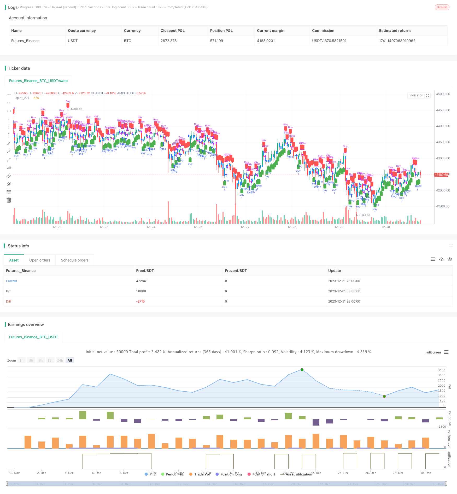

> Name

Origix-Ashi-Strategy-Based-on-Smoothed-Moving-Average Based on Smoothed Moving Average
> Author

ChaoZhang

> Strategy Description


 [trans]

## Overview
The main idea of ​​this strategy is to use the smoothed moving average to calculate the smoothed Qiming moving average to discover the price trend, and go long when the price crosses the smoothed Qiming moving average, and go short when the price crosses the smoothed Qiming moving average.
## Strategy Principle
The strategy first defines a function smoothedMovingAvg that calculates the smoothed moving average. This function uses the moving average value of the previous period and the latest price, and calculates the smoothed moving average of the current period according to a certain weight.
Then a function getHAClose is defined, which is used to calculate the closing price of Qiming Moving Average based on the opening price, highest price, lowest price and closing price.
In the main strategy logic, first obtain the original prices of different periods, then use the smoothedMovingAvg function to calculate the smoothed moving average, and then use the getHAClose function to calculate the smoothed Qiming closing price.
Finally, go long when the price crosses above the smooth Qiming closing price and close the position when it falls below; go short when the price crosses below the smooth Qiming closing price and close the position when it crosses above.
## Advantage Analysis
The biggest advantage of this strategy is that it uses the smoothed moving average to calculate the smoothed Qiming moving average, which can more accurately judge the price trend, filter out some noise, and avoid generating false signals during shocks. In addition, Qiming moving average itself has the advantage of highlighting the trend, and when used in conjunction with price, it can further improve the accuracy of judgment.
## Risk Analysis
This strategy mainly faces the following risks:
1. Improper setting of smoothing parameters may cause the strategy to miss price reversal opportunities or generate false signals. It is necessary to find the best parameters through repeated backtesting and optimization.
2. When prices fluctuate violently, the smoothing moving average may delay following price changes, resulting in stop loss or missed reversal opportunities. At this time, it is necessary to reduce the position to avoid risks.
In response to the above risks, we can reduce risks and improve strategy stability by adjusting smoothing parameters, introducing stop-loss mechanisms, and reducing single transaction positions.
## Optimization direction
This strategy can also be optimized from the following aspects:
1. Add adaptive smoothing parameters to automatically adjust parameters when market fluctuations intensify.
2. Combine with other indicators as filters to avoid sending false signals when prices fluctuate. For example, MACD, KD, etc. 
3. Add a stop-loss mechanism to control single losses. You can set a percentage stop loss or an oscillation stop loss.
4. Optimize trading varieties, time periods, etc., and focus on the most advantageous varieties and trading periods.
Through the optimization of the above points, the curve fitting risk of the strategy can be further reduced and the adaptability and stability of the strategy can be improved.
## Summarize
The overall idea of ​​this strategy is clear and easy to understand. It judges the price trend by calculating the smoothed Qiming moving average, and makes long and short moves accordingly. The biggest advantage is that it can filter some noise and improve the accuracy of signal judgment. However, there is also a certain difficulty in parameter optimization and the risk of missing a rapid reversal. It can be further optimized by introducing adaptive mechanisms and broadening indicator combinations, which is worthy of in-depth study.
||

## Overview

The main idea of this strategy is to use the smoothed moving average to calculate the smoothed Heiken Ashi to identify price trends, and go long when the price has a golden cross with the smoothed Heiken Ashi, and go short when there is a death cross.

## Strategy Logic

The strategy first defines a function smoothedMovingAvg to calculate the smoothed moving average, which uses the previous period's moving average value and the latest price to calculate the current period's smoothed moving average based on certain weights.

Then it defines a function getHAClose to calculate the Heiken Ashi closing price based on the open, high, low and close prices.

In the main strategy logic, it first gets the original prices of different periods, then uses the smoothedMovingAvg function to calculate the smoothed moving average, and then calculates the smoothed Heiken Ashi closing price through the getHAClose function.

Finally, it goes long when the price crosses above the smoothed Heiken Ashi closing price, and closes the position when the price crosses below it. It goes short when the price crosses below the smoothed Heiken Ashi closing price, and closes the position when the price crosses above it.

## Advantage Analysis  

The biggest advantage of this strategy is that by using the smoothed moving average to calculate the smoothed Heiken Ashi, it can more accurately determine price trends and filter out some noise to avoid generating wrong signals during choppy periods. In addition, the Heiken Ashi itself has the advantage of highlighting trends, which can further improve the accuracy of judgment when combined with prices.

## Risk Analysis

The main risks this strategy faces are:

1. Improper parameter settings of the smoothing may cause the strategy to miss price reversal opportunities or generate wrong signals. The optimal parameters need to be found through repeated backtesting and optimization.

2. When prices fluctuate sharply, the smoothed moving average may lag behind price changes, resulting in stop loss triggering or missing reversal opportunities. At this time, reducing position size to mitigate risks is necessary.

To address the above risks, methods such as adjusting smoothing parameters, introducing stop loss mechanisms, reducing per trade position sizes can be used to reduce risks and improve strategy stability.  

## Optimization Directions

The strategy can also be optimized in the following aspects:

1. Introduce adaptive smoothing parameters to automatically adjust parameters when market volatility increases.

2. Combine with other indicators as filters to avoid issuing wrong signals during price consolidations. Examples are MACD, KD etc.   

3. Add stop loss mechanisms to control per trade loss. Percentage stop loss or volatility stop loss can be set.  

4. Optimize trading products, trading sessions etc. to focus on products and sessions with the most advantages.

Through the above optimizations, the curve fitting risks of the strategy can be further reduced and the adaptability and stability of the strategy can be improved.  

## Conclusion  

The overall logic of this strategy is clear and easy to understand. By calculating the smoothed Heiken Ashi to determine price trends and making long and short positions accordingly. Its biggest advantage is being able to filter out some noise and improve the accuracy of signal judgment. But there are also certain difficulties in parameter optimization and risks of missing swift reversals. Further optimizations can be done through introducing adaptive mechanisms, expanding indicator combinations etc. to make it worth in-depth research.

[/trans]

> Strategy Arguments


|Argument|Default|Description|
|----|----|----|
|v_input_timeframe_1||(?Display & Timeframe Settings)Timeframe for HA candle calculation|
|v_input_int_1|10|(?Smoothed HA Settings)HA Price Input Smoothing Length|


> Source (PineScript)

``` pinescript
/*backtest
start: 2023-12-01 00:00:00
end: 2023-12-31 23:59:59
period: 1h
basePeriod: 15m
exchanges: [{"eid":"Futures_Binance","currency":"BTC_USDT"}]
*/

 //@version=5
strategy("Smoothed Heiken Ashi Strategy", overlay=true)

// Inputs
g_TimeframeSettings = 'Display & Timeframe Settings'
time_frame = input.timeframe(title='Timeframe for HA candle calculation', defval='', group=g_TimeframeSettings)

g_SmoothedHASettings = 'Smoothed HA Settings'
smoothedHALength = input.int(title='HA Price Input Smoothing Length', minval=1, maxval=500, step=1, defval=10, group=g_SmoothedHASettings)

// Define a function for calculating the smoothed moving average
smoothedMovingAvg(src, len) => 
    smma = 0.0
    smma := na(smma[1]) ? ta.sma(src, len) : (smma[1] * (len - 1) + src) / len 
    smma

// Function to get Heiken Ashi close
getHAClose(o, h, l, c) =>
    ((o + h + l + c) / 4)

// Calculate smoothed HA candles
smoothedHAOpen = request.security(syminfo.tickerid, time_frame, open)
smoothedMA1close = smoothedMovingAvg(request.security(syminfo.tickerid, time_frame, close), smoothedHALength)
smoothedHAClose = getHAClose(smoothedHAOpen, smoothedHAOpen, smoothedHAOpen, smoothedMA1close)

// Plot Smoothed Heiken Ashi candles
plotcandle(open=smoothedHAOpen, high=smoothedHAOpen, low=smoothedHAOpen, close=smoothedHAClose, color=color.new(color.blue, 0), wickcolor=color.new(color.blue, 0))

// Strategy logic
longCondition = close > smoothedHAClose
shortCondition = close < smoothedHAClose

strategy.entry("Buy", strategy.long, when=longCondition)
strategy.close("Buy", when=shortCondition)

plotshape(series=longCondition, title="Buy Signal", color=color.green, style=shape.labelup, location=location.belowbar)
plotshape(series=shortCondition, title="Sell Signal", color=color.red, style=shape.labeldown, location=location.abovebar)
```

> Detail

https://www.fmz.com/strategy/439985

> Last Modified

2024-01-25 15:26:25
