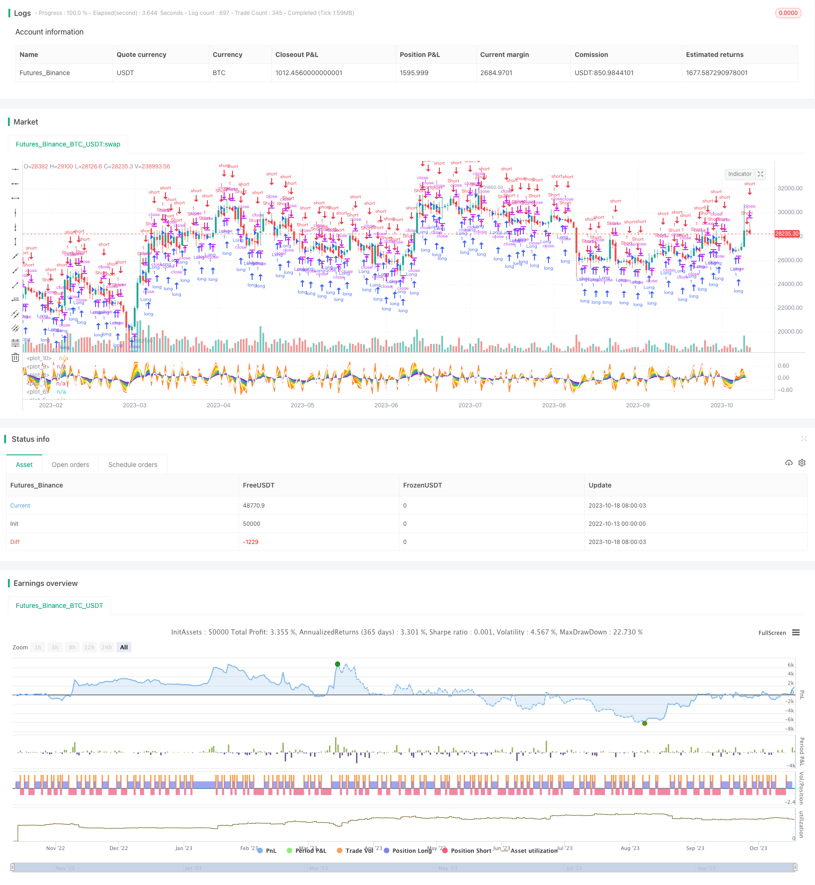

> Name

Oscillation-Balance-Strategy Oscillation-Balance-Strategy
> Author

ChaoZhang

> Strategy Description



[trans]


## Overview
The Oscillatory Balance strategy is a simple strategy that uses a weighted moving average and a basic lookback period to predict the price trend at the next moment. It calculates the position ratio of the current closing price relative to the opening price, then calculates exponential moving averages of different periods, and finally determines the approximate price trend based on historical data.
## Principle analysis
This strategy first calculates the position ratio of the closing price relative to the opening price: `BoP = (close - open) / (high - low)`, and then calculates the exponential moving averages of 3, 6, 9, 12, and 18 periods respectively.
By drawing moving averages of different colors, you can see that short-period lines change direction first, and long-period lines provide support and resistance. Filling the area between different moving averages allows you to more intuitively see the price oscillations between different moving averages.
Then calculate the arithmetic mean of these moving averages to obtain a comprehensive moving average. Then look at the changes in this comprehensive moving average in the past two cycles and predict its trend in the next cycle. If the comprehensive moving average rises, you can go long; if it falls, you can go short.
In this way, historical data is used to calculate a rough prediction of future trends. Although very simple, combined with the visual moving average and fill, you can intuitively see the price oscillations.
## Advantage Analysis
This strategy has the following advantages:
1. The principle is simple, easy to understand and implement.
2. Aggregate complex price history into a simple comprehensive moving average, and determine buying and selling points based on the direction of the moving average.
3. Multiple period moving average combinations provide a more comprehensive reference. The short-period line determines the specific buying and selling opportunities, and the long-period line determines the general trend.
4. By filling the area between the moving averages, an intuitive visual effect is formed, and the price oscillations can be clearly seen.
5. There is no need to set stop loss and take profit to avoid too many unnecessary transactions.
## Risk Analysis
This strategy also has the following risks:
1. Forecasts are only based on past data and cannot be certain that they will happen in the future. It needs to be verified based on trends and key price points.
2. If unexpected events cause rapid price changes, the forecast results will be inaccurate. Risk control needs to be done.
3. Multiple moving averages may produce confusing signals, and the weights need to be optimized.
4. The transaction frequency may be too high, and the interval needs to be controlled to reduce unnecessary transactions.
5. The strategy signal lags behind, which may lead to late entry and early stop loss.
## Optimization direction
This strategy can be optimized from the following aspects:
1. Optimize the weight of the moving average to make the signal clearer. For example, increase the weight of medium and long-term period moving averages.
2. Add confirmation of trend indicators to avoid trading against the trend. For example, use ADX to determine the strength of a trend.
3. Add filter conditions in key support and resistance areas to reduce false signals.
4. Optimize buying and selling conditions to avoid unnecessary opening of positions. You can set trend filtering or add volume confirmation.
5. Optimize the stop loss method, such as using curve stop loss or ATR stop loss.
6. Add sentiment indicators to avoid chasing highs and selling lows. For example, look at long and short indicators, capital flow, etc.
7. Control interval and reduce transaction frequency. Or optimize the number of transactions to avoid excessive transactions.
## Summarize
The oscillatory balance strategy forms a simple and intuitive method of judging buying and selling points by calculating price oscillators and combining them with the visual effects of multi-period moving averages. Although there is a risk of prediction lag and misjudgment, it can be optimized by adding filter conditions, stop loss methods, etc. to provide auxiliary REFERENCE during trend trading. This strategy is suitable for short-term frequent traders and visual pattern analysts.
||


## Overview

The Oscillation Balance strategy is a simple strategy that uses weighted moving averages and basic lookback periods to predict price movement in the next tick. It calculates the current close position relative to the open based on high and low, then computes exponential moving averages of different periods, and finally judges the general price trend based on historical data.

## Principle Analysis 

The strategy first calculates the close position relative to open: `BoP = (close - open) / (high - low)`. Then it calculates the EMAs of periods 3, 6, 9, 12, and 18.

Drawing EMAs in different colors shows that shorter period lines change direction first, while longer period lines provide support and resistance. Filling the areas between EMAs makes it more intuitive to see the price oscillation between the lines.

It further takes the arithmetic mean of these EMAs to get a comprehensive line. Looking at the change of this line in the past two periods, it predicts the trend in the next period. If the comprehensive line rises, go long. If it falls, go short.

This way, it estimates a general future trend based on historical data. Although very simple, the visual EMAs and fillings clearly show the price oscillation.

## Advantage Analysis

The advantages of this strategy include:

1. The principle is simple and easy to understand and implement.

2. It aggregates complex price history into a simple comprehensive line for judging entry and exit points by direction.

3. The combination of multiple period EMAs provides more comprehensive references. Short period lines determine specific entry while long period ones decide general trend.

4. Filling between EMAs forms an intuitive visual effect for seeing clear price oscillation. 

5. No need to set stop loss or take profit, avoiding unnecessary trades.

## Risk Analysis 

The risks of this strategy include:

1. The prediction is solely based on past data, not ensuring future occurrence. It needs confirmation with trends and key levels.

2. Sudden price changes from events may render inaccurate predictions. Proper risk control is required.

3. Multiple EMAs can generate confused signals. Weights need to be optimized. 

4. High trading frequency may happen and interval control is needed to reduce unnecessary trading.

5. The strategy signals lag, possibly causing late entry and premature stop loss.

## Optimization Directions

The strategy can be optimized in the following aspects:

1. Optimize the EMA weights for clearer signals. For example, increase weights for medium and long term EMAs.

2. Add trend indicator confirmation to avoid counter trend trades. Such as using ADX to determine trend strength.

3. Add filters at key support and resistance levels to reduce false signals. 

4. Optimize entry rules to avoid unnecessary opening positions. Trend filter or volume confirmation can be added.

5. Optimize stop loss methods like curve stop loss or ATR stop loss. 

6. Add sentiment indicators to avoid chasing tops and bottoms. For example, long/short ratio and fund flow.

7. Control interval to lower trading frequency. Or optimize number of trades to avoid overtrading.

## Summary

The Oscillation Balance strategy judges entry and exit points simply and intuitively by calculating price oscillation and visualizing EMAs of multiple periods. Although risks like prediction lag and wrong signals exist, it can be optimized by adding filters, stop loss methods etc. It provides useful references when trend trading. This strategy suits frequent short-term traders and visual pattern analyzers.

[/trans]


> Source (PineScript)

``` pinescript
/*backtest
start: 2022-10-13 00:00:00
end: 2023-10-19 00:00:00
period: 1d
basePeriod: 1h
exchanges: [{"eid":"Futures_Binance","currency":"BTC_USDT"}]
*/

//@version=4
strategy(title="Balance of Power", format=format.price, precision=2)

BoP = (close - open) / (high - low)
p1 = plot(ema(BoP,18),color=color.purple)
p2 = plot(ema(BoP,12),color=color.blue)
p3 = plot(ema(BoP,9),color=color.green)
p4 = plot(ema(BoP,6),color=color.yellow)
p5 = plot(ema(BoP,3),color=color.orange)
p6 = plot(BoP, color=color.red)


sumEMA = (avg(BoP,ema(BoP,3),ema(BoP,6),ema(BoP,9),ema(BoP,12),ema(BoP,18)))
plot(sumEMA,color=color.gray)

fill(p1,p2,color.purple)
fill(p2,p3,color.blue)
fill(p3,p4,color.green)
fill(p4,p5,color.yellow)
fill(p5,p6,color.orange)


projected = sumEMA + (sumEMA - sumEMA[2])
p7 = plot(projected, linewidth=2, color=color.white)
fill(p6,p7,color.red)

//strategy.exit("exitx","Exit",when=cross(projected,0))

strategy.entry("Long",true,1,when=crossover(projected,0))
strategy.entry("Short",false,0,when=crossunder(projected,0))


```

> Detail

https://www.fmz.com/strategy/429780

> Last Modified

2023-10-20 17:03:08
