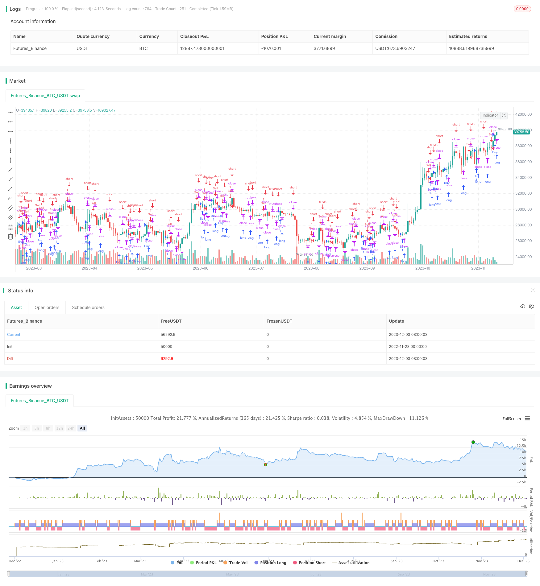

> Name

Oscillation-Breakthrough-Market-Structure-Shift-Strategy Oscillation-Breakthrough-Market-Structure-Shift-Strategy
> Author

ChaoZhang

> Strategy Description


[trans]

## Overview
Oscillation Breakthrough - Market Structure Shift Strategy is a trend following strategy that uses the relationship between different time periods to identify changes in market structure. This strategy uses the relationship between different time periods as signals for changes in market structure to capture new trend directions.
## Strategy Principle
The core logic of this strategy is to use the downward and upward engulfing patterns of short-cycle periods as signals for changes in the mid- to long-term market structure. Specifically, the strategy will simultaneously monitor the K-lines of medium and long periods (such as the 60-minute line) and short-period periods (such as the 15-minute line). When a red K-line that engulfs downward appears in the short cycle, and at the same time it is a green K-line in the medium and long term, it is considered that the market structure has changed, so go long; when a green K-line that engulfs upward appears in the short cycle, and at the same time it is a red K-line in the medium and long term, it is considered that the market structure has changed, so go short.
After entering the direction, the strategy will use the highest price or lowest price of the short period as the stop loss level to control risks. When the closing price of the mid- to long-term K-line triggers the take-profit level, the strategy will close the position and take profit.
## Strategic advantage analysis
This strategy has the following advantages:
1. Reliable signals of market structure changes. Use the relationship between different cycles to judge the market structure and avoid being misled by the noise of a single cycle.
2. Automatically determine the new trend direction. Automatically go long and short when market structure change signals occur, without manual judgment.
3. Risk control is in place. Using the highest and lowest prices in short periods for risk control can help control single losses.
4. Retracement control is relatively good. Using short-period extreme values ​​to open positions and stop losses can control retracement to a certain extent.
## Strategy risk analysis
The main risk points of this strategy are as follows:
1. The risk of misjudgment of market structure. When the short-cycle noise is too large, the market structure change signal may be invalid, and cycle parameters need to be adjusted.
2. Risk of trend reversal. When the market experiences a V-shaped reversal, it is difficult for this strategy to control the retracement. The stop loss algorithm can be adjusted appropriately.
3. Risk of parameter mismatch. When the medium, long and short period parameters are set improperly, the signal effect may be poor, requiring repeated optimization and testing.
## Strategy optimization direction
This strategy can also be further optimized from the following directions:
1. Add accumulation indicators or trend judgment to avoid false signals in trend reversal.
2. Optimize the parameter matching between medium and long periods to improve signal quality.
3. Use machine learning and other technologies to optimize the stop-profit and stop-loss algorithm.
4. Add additional conditions to filter out misleading signals, such as large-level trend judgment, etc.
5. Enrich strategy types, develop derivative strategies, and form strategy combinations.
## Summarize
The shock breakthrough-market structure change strategy is generally a more reliable tracking strategy. It can use changes in market structure to automatically determine new trend directions, and it also does better risk control. In the next step, the strategy can be further optimized from aspects such as improving signal quality, optimizing stop-profit and stop-loss, and preventing reversal, making it a commercial-grade strategy product.
||

The Oscillation Breakthrough - Market Structure Shift Strategy (ICT_MSS) is a trend following strategy that identifies market structure shifts using the relationships between different timeframes. The strategy uses timeframe relationships as a signal for market structure shifts in order to capture new trend directions.  

## Strategy Logic  

The core logic of this strategy is to use short timeframe downward and upward engulfing patterns as signals for longer timeframe market structure shifts. Specifically, the strategy concurrently monitors a longer timeframe (e.g. 60m bars) and a shorter timeframe (e.g. 15m bars). When a downward engulfing red bar appears on the shorter timeframe while the longer timeframe bar is green, it is determined that a market structure shift has occurred and a long position is taken. When an upward engulfing green bar appears on the shorter timeframe while the longer timeframe bar is red, it is determined that a market structure shift has occurred and a short position is taken.  

After entering a directional position, the strategy utilizes the short timeframe high/low to set a stop loss in order to control risk. When the longer timeframe bar close price hits the take profit level, the strategy will close out the position for profit.

## Advantage Analysis   

The advantages of this strategy are:  

1. Reliable market structure shift signals. Using timeframe relationships avoids being misled by noise from a single timeframe.  

2. Automatically determines new trend direction. Market structure shifts automatically trigger long/short entries without needing manual judgment.   

3. Effective risk control. Short timeframe high/low used for risk control helps limit single trade loss.  

4. Relatively better drawdown control. Using short timeframe extremes for entry and stop loss can help control drawdowns to some extent.   

## Risk Analysis  

The main risks of this strategy are:   

1. Risk of incorrect market structure assessment. Signals may fail when short timeframe noise is high. Timeframe parameters need to be adjusted.   

2. Risk of trend reversal. Strategy struggles to control drawdown during V-shaped reversals. Stop loss algorithm needs to be tweaked.   

3. Parameter mismatch risk. Incorrect long/short timeframe combo leads to poor signal quality and needs optimization testing.  

## Optimization Directions  

Further optimization directions for the strategy include:

1. Add trend filters to avoid incorrect signals during trend reversal.  

2. Optimize timeframe parameter matching to improve signal quality.  

3. Utilize machine learning for optimal take profit/stop loss.   

4. Add supplementary filters like larger timeframe trend.   

5. Expand strategy variants to form strategy ensemble.

## Conclusion  

The ICT_MSS strategy is an overall reliable trend following strategy. It automatically determines new trend direction based on market structure shifts and also has good risk control built in. Next steps are further enhancements around improving signal quality, optimizing exits, and preventing reversals to make it a commercial grade strategy.

[/trans]

> Strategy Arguments


|Argument|Default|Description|
|----|----|----|
|v_input_timeframe_1|60|Focused Time Frame|
|v_input_timeframe_2|15|Focused Time Frame(LTF)|


> Source (PineScript)

``` pinescript
/*backtest
start: 2022-11-28 00:00:00
end: 2023-12-04 00:00:00
period: 1d
basePeriod: 1h
exchanges: [{"eid":"Futures_Binance","currency":"BTC_USDT"}]
*/

// This source code is subject to the terms of the Mozilla Public License 2.0 at https://mozilla.org/MPL/2.0/
// © jl01794

//@version=5
strategy(title="ICT_MSS[PROTOTYPE]", overlay=true, initial_capital=10000, currency="USD", margin_long=15, margin_short=15, max_lines_count=500)


// INPUTS
Time_Frame  = input.timeframe("60", title="Focused Time Frame")
FTF_LTF = input.timeframe("15", title="Focused Time Frame(LTF)")
//

// SECURITY DATA [FOR ONE TIMEFRAME REFERENCE]

FTF_Close = request.security(syminfo.tickerid, Time_Frame, close)
FTF_Open = request.security(syminfo.tickerid, Time_Frame, open)
FTFLTF_High = request.security(syminfo.tickerid, FTF_LTF, ta.highest(2)) 
FTFLTF_Low = request.security(syminfo.tickerid, FTF_LTF, ta.lowest(2)) 
FTFLTF_Close = request.security(syminfo.tickerid, FTF_LTF, close)
FTFLTF_Open = request.security(syminfo.tickerid, FTF_LTF, open)

// TIME BASED CLOSE AND OPEN
_close = FTF_Close
_open = FTF_Open
_LTFclose = FTFLTF_Close
_LTFopen = FTFLTF_Open

// CANDLE STATE
greenCandle = close > open
redCandle = close < open
LTFgreenCandle = FTFLTF_Close > FTFLTF_Open
LTFredCandle = FTFLTF_Close < FTFLTF_Open

// ENGULFING TIMEFRAME REFERENCE
FTF_greenCandle = request.security(syminfo.tickerid, Time_Frame, greenCandle)
FTF_redCandle = request.security(syminfo.tickerid, Time_Frame, redCandle)
FTFLTF_greenCandle = request.security(syminfo.tickerid, FTF_LTF, LTFgreenCandle)
FTFLTF_redCandle = request.security(syminfo.tickerid, FTF_LTF, LTFredCandle)

//--------------------------------------------------------------------------------------------------------------

//ENGULFING_FTF_LTF
B_EnP_mss = FTFLTF_redCandle[1] and        // 1E PIVOT BUY
     FTFLTF_greenCandle
//


B_EnPs_mss = FTFLTF_greenCandle[1] and        // 1E PIVOT SELL
     FTFLTF_redCandle
//  

//--------------------------------------------------------------------------------------------------------------

display_LTF = timeframe.isintraday and timeframe.multiplier <= 15

//--------------------------------------------------------------------------------------------------------------

// STORED DATAS
var float EH_MSS1 = na
var float EL_MSS1 = na
var bool can_draw = false
var line l1_mss = na
var line l1s_mss = na

//--------------------------------------------------------------------------------------------------------------

// MSS BUY
if (B_EnPs_mss) and (display_LTF)                                                 
    EH_MSS1 := FTFLTF_High 
    can_draw := true                                                            
    l1_mss := line.new(bar_index, EH_MSS1, bar_index -3, EH_MSS1, color=color.purple)     
else
    if (can_draw)
        if (FTFLTF_High > EH_MSS1)                                                    
            can_draw := false                                                  
        else
            line.set_x2(l1_mss, bar_index) 
//

// MSS SELL
if (B_EnP_mss) and (display_LTF)                                                 
    EL_MSS1 := FTFLTF_Low 
    can_draw := true                                                            
    l1s_mss := line.new(bar_index, EL_MSS1, bar_index -3, EL_MSS1, color=color.purple)     
else
    if (can_draw)
        if (FTFLTF_Low < EL_MSS1)                                                    
            can_draw := false                                                  
        else
            line.set_x2(l1s_mss, bar_index) 
          

//--------------------------------------------------------------------------------------------------------------

// ORDER

// BUY
longCondition_mssB = B_EnPs_mss and FTFLTF_High and close and high[1]
openOr = FTFLTF_High 

//SELL
shortCondition_mssS = B_EnP_mss and FTFLTF_Low and close and low[1]
openOrs = FTFLTF_Low 


if (longCondition_mssB) 
    strategy.entry("Buy", strategy.long, 1, stop = openOr, when = longCondition_mssB)
//

if (shortCondition_mssS) 
    strategy.entry("Sell", strategy.short, 1, stop = openOrs, when = shortCondition_mssS)
//

// EXIT 
long_tp = open < FTFLTF_Close[1]
short_tp = open > FTFLTF_Close[1]

//if (long_tp)
    //strategy.close("Buy", qty_percent = 100, when = long_tp)
//

//if (short_tp)
    //strategy.close("Sell", qty_percent = 100, when = short_tp)
//
```

> Detail

https://www.fmz.com/strategy/434333

> Last Modified

2023-12-05 15:17:01
