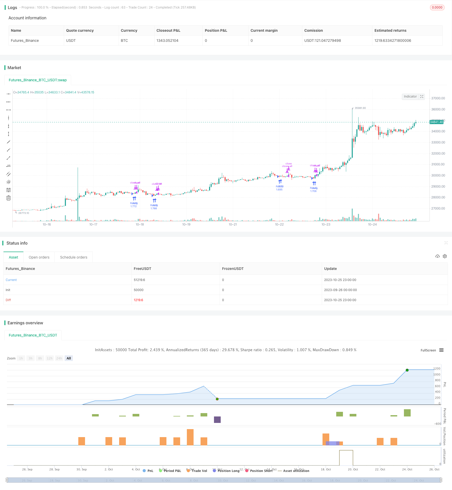

> Name

Based on Larry Connors’ classic Oscillation-Breakthrough-Strategy
> Author

ChaoZhang

> Strategy Description



[trans]


## Overview
This strategy is based on the classic strategic thinking of Larry Connors, using the dual moving average system to capture the short-term and medium-term shocks of the market, and realize the operation strategy of taking advantage of the overbought and oversold areas.
## Strategy Principle
1. Use the 2-period RSI indicator to determine whether the stock price is in the oversold area.
2. Use the long-term moving average (200 periods) to determine the direction of the general trend. Only consider opening a position when the price is above the long-term moving average.
3. When the price is above the long-term moving average and the RSI indicator is below the oversold line, open a long position with a market order.
4. When the price rises and breaks through the short-period moving average (5 periods), the market price order will be used to close the long order and take profit.
Additionally, policies provide the following configurable options:
- RSI parameters: cycle length, overbought and oversold line positions.
- Moving average parameters: long and short moving average periods.
- RSI moving average filter: Add RSI moving average judgment to avoid excessive fluctuations in the RSI indicator.
- Stop loss setting: You can choose whether to add stop loss.
## Advantage Analysis
1. Using the dual moving average system can effectively track the medium and long-term trends.
2. The RSI indicator avoids missing the best entry opportunity during violent fluctuations.
3. Flexible configuration, suitable for optimization of different parameters.
4. Rundown breakthrough strategy, it is not easy to miss orders.
## Risk Analysis
1. The dual moving average strategy is sensitive to parameters and needs to be optimized to achieve the best results.
2. Without stop loss setting, there is a risk of loss expansion. Careful fund management is required to control the size of a single position.
3. False breakthroughs in volatile markets may involve the risk of losses. Consider optimizing the moving average period or adding other conditions as filters.
4. Backtest data fitting risks. The robustness of the strategy needs to be verified in multiple markets and time periods.
## Optimization direction
1. Test and optimize the parameter combination of RSI and moving average to find the best parameters.
2. Test different entry filter conditions, such as sudden increase in trading volume, to reduce false signals.
3. Add a trailing stop to control single losses. The impact of stop loss placement on overall profitability needs to be evaluated.
4. Evaluate the impact of different holding times on profits and find the best holding period.
5. Test the robustness of the strategy over a longer time period (such as the daily level).
## Summarize
This strategy integrates double moving average trend tracking and the overbought and oversold characteristics of the RSI indicator, and is a typical breakthrough system. Through parameter optimization, strict fund management and robustness verification, this strategy can become a powerful tool for quantitative trading. However, traders need to be wary of backtesting over-fitting issues and continue to adjust and improve strategies in real trading to adapt to the changing market environment.
||


## Overview

This strategy is based on the classic idea of Larry Connors, using double moving average system to capture the medium-term oscillation of the market and take profit when it is overbought or oversold.

## Strategy Logic

1. Use 2-period RSI to determine if the price is in oversold region.  

2. Use long period moving average (200 periods) to determine the major trend direction. Only consider opening position when price is above the long MA.

3. When price is above long MA and RSI is below oversold line, open long position at market price.  

4. When price breaks through short period MA (5 periods) upwards, close long position at market price to take profit.

In addition, the strategy provides the following configurable options:

- RSI parameters: period length, overbought/oversold levels.

- MA parameters: long and short period.

- RSI MA filter: add RSI MA to avoid RSI fluctuation. 

- Stop loss: configurable to add stop loss or not.

## Advantage Analysis

1. The double MA system can effectively track medium-long term trends.

2. RSI avoids missing the best entry timing during violent fluctuation. 

3. Flexible configuration suitable for parameter optimization.

4. Breakthrough strategy, not likely to miss signals.

## Risk Analysis

1. Double MA strategy is sensitive to parameters, requiring optimization to achieve best performance.

2. No stop loss brings risk of expanding losses. Cautious position sizing is needed. 

3. False breakout risks losses in oscillating market. Consider optimizing MA periods or adding other filters.

4. Backtest overfitting risk. Requires validation across markets and time periods.

## Optimization Directions

1. Test and optimize combinations of RSI and MA parameters to find optimum.

2. Test additional entry filters like volume spike to reduce false signals.

3. Add trailing stop loss to control single trade loss. Assess impact on overall profitability.

4. Evaluate impact of different holding periods to find optimal.

5. Test robustness in longer timeframes like daily.

## Summary

This strategy combines double MA trend tracking and RSI overbought/oversold to form a typical breakout system. With parameter optimization, strict risk management and robustness validation, it can become a powerful quantitative trading tool. But traders should beware of backtest overfitting and keep improving the strategy to adapt to changing market conditions.

[/trans]


> Strategy Arguments


|Argument|Default|Description|
|----|----|----|
|v_input_1|2|RSI Lenght|
|v_input_2|10|OverBought Level for RSI|
|v_input_3|5|Short MA Length|
|v_input_4|200|Long MA Length|
|v_input_5|true|RSI Moving Average Filter|
|v_input_6|4|RSI Moving Average Length|
|v_input_7|30|OverBought Level for the Moving Average of the RSI|
|v_input_8|false|Apply Stop Loss|
|v_input_9|10|% Stop Loss|
|v_input_10|2009|Backtest Start Year|
|v_input_11|true|Backtest Start Month|
|v_input_12|2|Backtest Start Day|
|v_input_13|2020|Backtest Stop Year|
|v_input_14|12|Backtest Stop Month|
|v_input_15|30|Backtest Stop Day|


> Source (PineScript)

``` pinescript
/*backtest
start: 2023-09-26 00:00:00
end: 2023-10-26 00:00:00
period: 1h
basePeriod: 15m
exchanges: [{"eid":"Futures_Binance","currency":"BTC_USDT"}]
*/

//@version=3
strategy("RSI Strategy", overlay=true, default_qty_type = strategy.percent_of_equity, default_qty_value = 100)

//Starter Parameters

length = input(title="RSI Lenght", defval=2)
overBoughtRSI = input(title="OverBought Level for RSI",  defval=10)
shortLength = input(title="Short MA Length",  defval=5)
longLength = input(title="Long MA Length",  defval=200)

RuleMRSI=input(title="RSI Moving Average Filter", defval= true)
lengthmrsi=input(title="RSI Moving Average Length",  defval=4)
overBoughtMRSI=input(title="OverBought Level for the Moving Average of the RSI",  defval=30)

Rulestop=input(title="Apply Stop Loss", defval=false)
stop_percentual=input(title="% Stop Loss",  defval=10)

//RSI

vrsi = rsi(close, length)

//Moving Averages

longma = sma(close,longLength)
shortma = sma(close,shortLength)
mrsi=sma(vrsi,lengthmrsi)

//Stop Loss

stop_level = strategy.position_avg_price*((100-stop_percentual)/100)

//Backtest Period
testStartYear = input(2009, "Backtest Start Year")
testStartMonth = input(1, "Backtest Start Month")
testStartDay = input(2, "Backtest Start Day")
testPeriodStart = timestamp(testStartYear,testStartMonth,testStartDay,0,0)

testStopYear = input(2020, "Backtest Stop Year")
testStopMonth = input(12, "Backtest Stop Month")
testStopDay = input(30, "Backtest Stop Day")
testPeriodStop = timestamp(testStopYear,testStopMonth,testStopDay,0,0)

testPeriod() => true
    
//Strategy

if testPeriod() and (not na(vrsi))
    if  (RuleMRSI==false) and (Rulestop==false)
        if (vrsi<overBoughtRSI) and (close>longma)
            strategy.entry("RsiLE", strategy.long , comment="Open")
        if (close>shortma)
            strategy.close_all()

    if (RuleMRSI==true) and (Rulestop==false)
        if (vrsi<overBoughtRSI) and (close>longma) and (mrsi<overBoughtMRSI)
            strategy.entry("RsiLE", strategy.long , comment="Open")
        if (close>shortma)
            strategy.close_all()

    if (RuleMRSI==false) and (Rulestop==true)
        if (vrsi<overBoughtRSI) and (close>longma)
            strategy.entry("RsiLE", strategy.long , comment="Open")
            strategy.exit("RsiLE", stop = stop_level)
        if (close>shortma)
            strategy.close_all()

    if (RuleMRSI==true) and (Rulestop==true)
        if (vrsi<overBoughtRSI) and (close>longma) and (mrsi<overBoughtMRSI)
            strategy.entry("RsiLE", strategy.long , comment="Open")
            strategy.exit("RsiLE", stop = stop_level)
        if (close>shortma)
            strategy.close_all()
```

> Detail

https://www.fmz.com/strategy/430374

> Last Modified

2023-10-27 16:32:19
