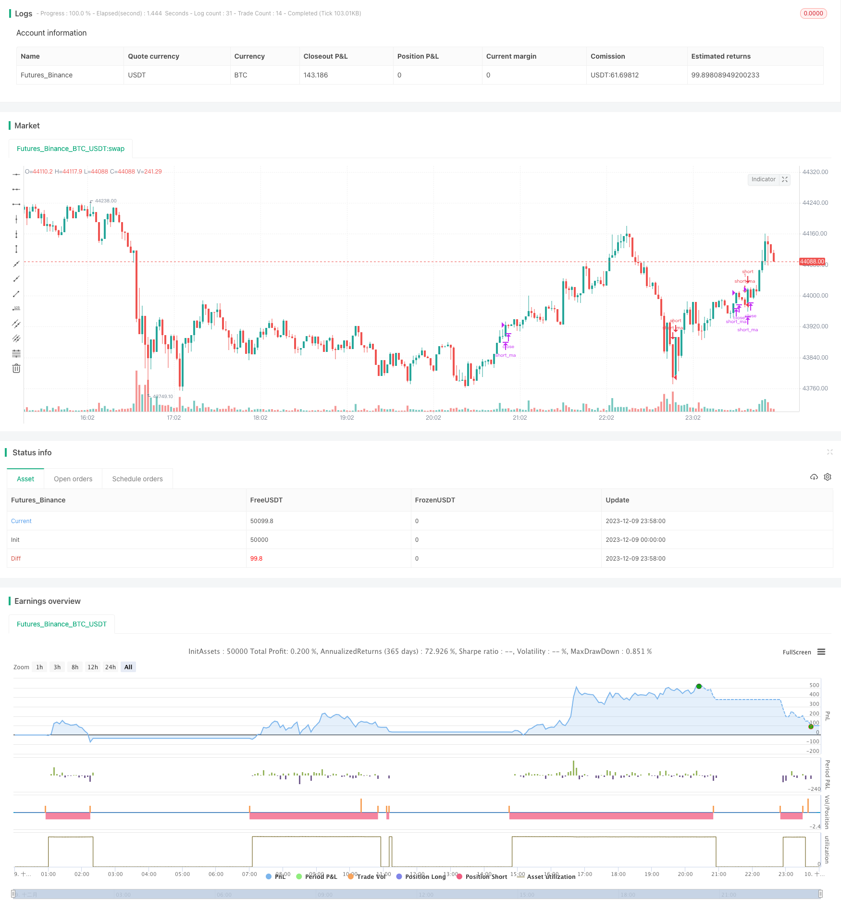

> Name

Oscillation-Trading-Strategy-Between-Moving-Averages
> Author

ChaoZhang

> Strategy Description


[trans]

## Overview
This strategy combines the moving average indicator and the Bollinger Band indicator to implement a bilateral trading strategy between the moving averages. Go long when the price breaks above the lower rail, go short when the price breaks below the upper rail, and make profits by taking advantage of the price's oscillation between the moving averages.
## Strategy Principle
1. Calculate the fast moving average ma_short and the slow moving average ma_long
2. When ma_short crosses ma_long above, go long; when ma_short crosses ma_long below, go short
3. Calculate the upper track, lower track and middle track of Bollinger Bands
4. When the price goes above and below the upper rail, the long signal is confirmed; when the price goes below the upper rail, the short signal is confirmed.
5. Combine the signals of the moving average indicator and the Bollinger Bands indicator, open a position when they send signals in the same direction, and close a position when they send signals in different directions.
## Advantage Analysis
1. Combined with dual indicators, it is relatively stable and can filter out certain false signals.
2. Conduct oscillatory trading between the moving average and Bollinger Bands to avoid chasing highs and selling lows.
3. Bilateral transactions are allowed and you can make full use of price fluctuations to make profits.
## Risk Analysis
1. Bollinger Bands parameter settings will affect trading frequency and profitability
2. Large losses are likely to occur in large trending markets
3. The moving average system itself is prone to causing more liquidation losses.
Risk resolution:
1. Optimize Bollinger Band parameters and adjust to appropriate trading frequency
2. Set up a stop-loss strategy to control single losses
3. Combined with trend judgment, use this strategy when the trend is not obvious
## Optimization direction
1. Test parameter combinations of different moving average systems
2. Evaluate whether to add volume indicators to filter signals
3. Test whether to combine RSI and other indicators to determine the overbought and oversold areas
The above optimization can further improve profitability, reduce unnecessary transactions, and reduce transaction frequency and loss risk.
## Summarize
This strategy combines the moving average system and the Bollinger Bands indicator to implement an oscillating trading strategy between price moving averages. The combination of dual indicators can improve signal quality and allow bilateral trading to gain more opportunities. By further optimizing parameters and adding other auxiliary indicators for judgment, unnecessary transactions can be reduced and profitability increased, which is worthy of real-time testing and optimization.
||

## Overview

This strategy combines the moving average indicator and Bollinger Bands to implement a strategy that oscillates between moving averages for two-way trading. Go long when the price breaks above the lower rail, go short when the price breaks below the upper rail, and profit from the oscillation between the moving averages.

## Strategy Principle  

1. Calculate the fast moving average ma_short and slow moving average ma_long
2. When ma_short crosses above ma_long, go long; when ma_short crosses below ma_long, go short
3. Calculate the upper rail, lower rail and middle rail of Bollinger Bands  
4. When price breaks above lower rail, confirm long signal; when price breaks below upper rail, confirm short signal
5. Open positions when the moving average indicator and Bollinger Bands give signals in the same direction, close positions when they give signals in opposite directions

## Advantage Analysis

1. The combination of dual indicators makes it relatively stable and can filter out some false signals
2. Oscillating between moving averages and Bollinger Bands avoids chasing highs and selling lows
3. Allowing two-way trading can take full advantage of price fluctuations for profit

## Risk Analysis   

1. The parameter settings of Bollinger Bands will affect the trading frequency and profitability
2. It is easy to generate large losses in strong trending markets
3. The moving average system itself tends to generate more losing trades on exits

Risk Management:

1. Optimize Bollinger Bands parameters to adjust to suitable trading frequency
2. Set stop loss strategy to control single trade loss 
3. Use this strategy when the trend is not obvious  

## Optimization Directions

1. Test different parameter combinations of moving average systems
2. Evaluate whether to add volume indicators to filter signals
3. Test whether to combine RSI and other indicators to determine overbought and oversold zones

The above optimizations can further improve profitability, reduce unnecessary trades, lower trading frequency and loss risks.

## Summary   

This strategy combines moving average systems and Bollinger Bands to implement oscillation trading between price moving averages. The combination of dual indicators can improve signal quality, and allowing two-way trading provides more opportunities. Further optimizing parameters and adding other auxiliary indicators can reduce unnecessary trades and improve profitability, which is worth live testing and optimization.

[/trans]]

> Strategy Arguments


|Argument|Default|Description|
|----|----|----|
|v_input_1|24|Bollinger Period Length|


> Source (PineScript)

``` pinescript
/*backtest
start: 2023-12-09 00:00:00
end: 2023-12-10 00:00:00
period: 2m
basePeriod: 1m
exchanges: [{"eid":"Futures_Binance","currency":"BTC_USDT"}]
*/

//@version=2
strategy("MA-Zorrillo",overlay=true)

ma_short= sma(close,8)
ma_long= sma(close,89)

entry_ma = crossover (ma_short,ma_long)
exit_ma = crossunder (ma_short,ma_long) 


BBlength = input(24, minval=1,title="Bollinger Period Length")
BBmult = 2 // input(2.0, minval=0.001, maxval=50,title="Bollinger Bands Standard Deviation")
BBbasis = sma(close, BBlength)
BBdev = BBmult * stdev(close, BBlength)
BBupper = BBbasis + BBdev
BBlower = BBbasis - BBdev

source = close
entry_bb = crossover(source, BBlower)
exit_bb = crossunder(source, BBupper)


vs_entry = false
vs_exit = false
for i = 0 to 63
    if (entry_bb[i])
        vs_entry :=  true
    if (exit_bb[i])
        vs_exit :=  true
        

entry = entry_ma and vs_entry
exit =  exit_ma and vs_exit

strategy.entry(id="long_ma",long=true,when=entry)
strategy.close(id="long_ma", when=exit)

strategy.entry(id="short_ma",long=false,when=exit)
strategy.close(id="short_ma",when=entry)

```

> Detail

https://www.fmz.com/strategy/434978

> Last Modified

2023-12-11 14:38:48
