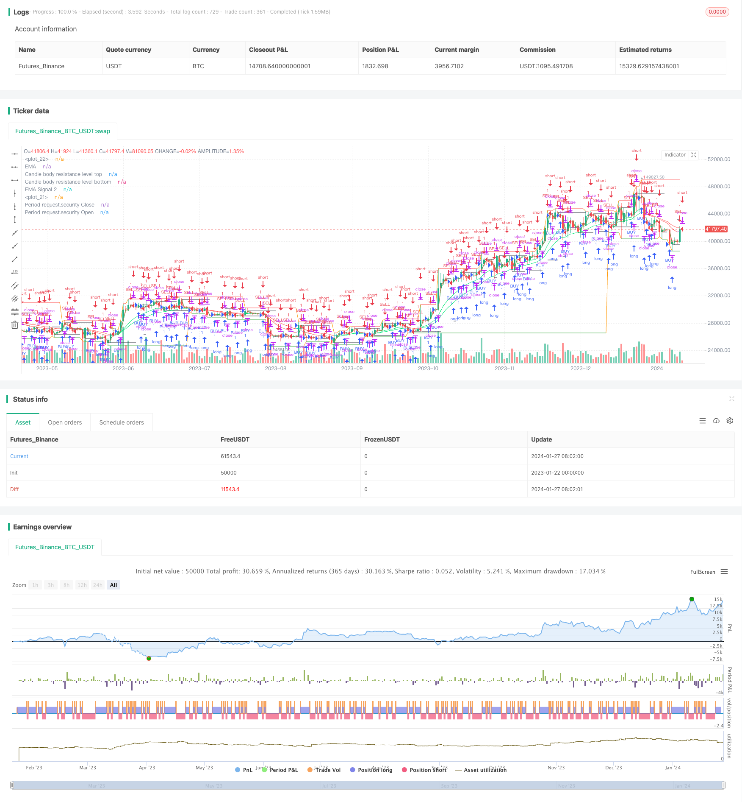

> Name

Out-of-the-box-Machine-Learning-Trading-Strategy
> Author

ChaoZhang

> Strategy Description


[trans]
## Overview
This strategy uses machine learning methods to implement an out-of-the-box automated trading strategy. It integrates multiple indicators and models, can automatically generate trading signals, and perform buying and selling operations based on the signals.
## Strategy Principle
This strategy is mainly based on the following points:
1. Use hull moving average to determine the market trend direction
2. Use EMA to determine short-term and medium-term trends
3. Use the K-line physical channel to determine the key SUPPORT/RESISTANCE position
4. Use the intersection of multi-period SECURITY opening price and closing price to make decisions
Specifically, the strategy will draw the hull moving average, the 13-period EMA and the 21-period EMA. Determine the short-term and medium-term trend direction through the long and short status of EMA. Then combine it with the hull moving average to determine the longer-term trend. This provides general direction guidance for subsequent trading signals.
Before adjusting positions, the strategy will refer to the support and resistance levels corresponding to the highest and lowest prices in the physical channel. This avoids generating trading signals in key price areas.
Finally, the strategy will call the 60-period opening and closing prices, and generate a buy signal when the closing price crosses above the opening price, and a sell signal when it crosses below. This completes the entire transaction logic.
## Strategic advantage analysis
The biggest advantage of this strategy is that it combines machine learning and technical analysis indicators to achieve an automated trading plan with clear logic, adjustable parameters, and easy operation.
1. Multi-indicator combination to improve signal accuracy
The strategy does not rely solely on one or two indicators, but comprehensively considers multiple factors such as trends, support and resistance, and price breakthroughs, which greatly improves the reliability and accuracy of signals.
2. Flexible parameter settings
The length of the hull moving average, the number of EMA periods, and the number of opening and closing cross periods can all be adjusted through parameters, allowing the strategy to flexibly adapt to different market environments.
3. Automated trading signals
Trading signals based on the intersection of indicators and prices can automatically trigger buying and selling without manual judgment, reducing the difficulty of operation.
4. Visual display
The charts in the strategy can clearly display the market structure, trend status and key prices, and intuitively display the basis for strategic judgment.
## Risk Analysis
Although this strategy has been optimized in many aspects, there are still some possible risks:
1. Large market trends cannot be tracked
In markets with violent price fluctuations, indicators may become invalid or delayed, causing the strategy to be unable to track price changes in a timely manner. Parameters need to be optimized to adapt to this market situation.
2. Signal error rate exists
Trading signals based on indicators and models will have some false positives or omissions. This requires improving signal quality by combining more auxiliary signals.
3. Long and short MIX risks
The strategy is to go long and short at the same time. If the judgment is wrong, you will face the risk of losses in both directions. This needs to be controlled by strictly cutting off losses or reducing positions.
4. Risk of over-optimization
If the parameter settings are too complex, there will be a risk of over-optimization. This requires simplifying the system and controlling the number of parameter combinations.
## Strategy optimization direction
This strategy still has some room for optimization, which can be mainly carried out from the following aspects:
1. Add more indicator signals  
In addition to the existing indicators, more auxiliary indicators can be introduced, such as BOLL channels, KD indicators, etc., to enrich the basis for system judgment.
2. Apply deep learning models
Use simple indicators as features to train deep learning models such as LSTM to improve signal quality.
3. Combined with fundamental data
Add macroeconomic data, policy information and other fundamental factors to optimize large-cycle decision-making.
4. Risk and position management
Introduce a stop-loss strategy, dynamically adjust the position size according to the strategy's return volatility, and strictly control risks.
## Summarize
This strategy integrates multiple indicators such as trend, support, resistance, and breakthroughs, and uses machine learning methods to implement automated out-of-the-box quantitative trading solutions. It has the advantages of diverse indicator combinations, adjustable parameters, and signal automation. It also faces certain problems such as tracking deviation, signal error, and long and short MIX. In the future, there will be further optimization by introducing more auxiliary indicators and models, combining fundamental factors, and dynamically adjusting positions, so as to achieve more stable, accurate, and intelligent quantitative trading effects.
||

## Overview

This strategy utilizes machine learning methods to implement an out-of-the-box automated trading strategy. It integrates multiple indicators and models to automatically generate trading signals and make buy and sell decisions accordingly.  

## Strategy Principle 

This strategy is mainly based on the following key points:

1. Use Hull Moving Average to determine market trend direction
2. Use EMA to judge short-term and medium-term trends  
3. Use candle body channel to locate key SUPPORT/RESISTANCE levels
4. Make decisions based on crossover between open and close prices from multi-timeframe SECURITY

Specifically, the strategy will plot the Hull MA, 13-period EMA, and 21-period EMA. Judging short-term and medium-term trend directions based on the long and short status of EMAs. Combined with Hull MA to determine longer cycle trends. This provides guidance on the general direction for subsequent trading signals.

Before adjusting positions, the strategy will refer to the highest and lowest prices in the entity channel corresponding to support and resistance levels. This avoids generating trading signals in key price areas.

Finally, the strategy invokes the 60-period open and close prices. When the close price crosses above the open price, a buy signal is generated. When it crosses below, a sell signal is generated. This completes the entire trading logic.

## Advantage Analysis 

The biggest advantage of this strategy is that it combines machine learning and technical analysis indicators to achieve a logical, adjustable and easy-to-use automated trading solution.

1. Multi-indicator combo improves signal accuracy

   The strategy does not rely solely on one or two indicators, but takes into account multiple factors such as trends, support/resistance, and price breakthroughs. This greatly improves the reliability and accuracy of the signals. 

2. Flexible parameter settings 

   The lengths of Hull MA, EMA periods, open/close crossover periods can be adjusted through parameters, making the strategy adaptable to different market environments.

3. Automated trading signals

   The trading signals based on indicators and crossovers can automatically trigger buys and sells without manual judgment, reducing difficulty.  

4. Visualized display

   The charts in the strategy can clearly show market structure, trend status and key prices, intuitively displaying the basis for strategy judgment.

## Risk Analysis   

Although this strategy has been optimized in multiple aspects, there are still some potential risks:

1. Failure to track drastic price movements

   In volatile markets, indicators may become ineffective or delayed, causing the strategy to fail to track price changes in time. Parameters need to be optimized to adapt to such markets.

2. Existence of signal error rate

   Trading signals based on indicators and models, more or less, will have some false signals or missing signals. This needs to be improved by combining more auxiliary signals.   

3. Long/Short mix risk

   The strategy making both long and short positions simultaneously has the risk of losses on both sides if judgments went wrong. Strict stop loss or lower position sizing is required to control for this.

4. Overfit risk 

   Overly complex parameter settings run the risk of overfitting. The system needs to be simplified with constrained number of parameter combinations.

## Optimization Directions   

There is still some room for optimizing this strategy, mainly in the following aspects:

1. Add more indicator signals

   In addition to existing indicators, more auxiliary indicators can be introduced, such as BOLL channels, KD indicators, etc, to enrich system reference.  

2. Apply deep learning models 

   Use simple indicators as features to train LSTM and other deep learning models to improve signal quality.

3. Incorporate fundamental data

   Add macroeconomic data, policy information and other fundamental factors to optimize long-cycle decisions.  

4. Risk & position sizing

   Introduce stop loss strategies, dynamically adjust position sizing based on strategy return volatility to strictly control risks.   

## Conclusion

This strategy integrates trends, support/resistance levels, breakouts and multiple other indicators, utilizing machine learning methods to achieve automated, ready-to-use quantitative trading solutions. It has the advantages of diverse indicator combos, tunable parameters and automated signals, while also facing tracking deviations, signal errors, long/short mix risks to some extent. There are still directions for further optimizations by incorporating more auxiliary indicators and models, combining fundamental factors, dynamically adjusting positions and so on, in order to achieve more stable, accurate and intelligent quantitative trading performance.  

[/trans]

> Strategy Arguments


|Argument|Default|Description|
|----|----|----|
|v_input_1_close|0|Candle body resistance channel: close|high|low|open|hl2|hlc3|hlcc4|ohlc4|
|v_input_2|false|Bar Channel On/Off|
|v_input_3|10|Support / Resistance length:|
|v_input_4|13|EMA 1|
|v_input_5|21|EMA 2|
|v_input_6|false|Display Hull MA Set:|
|v_input_7_close|0|Hull MA's Source:: close|high|low|open|hl2|hlc3|hlcc4|ohlc4|
|v_input_8|8|Hull MA's Base Length:|
|v_input_9|5|Hull MA's Length Scalar:|
|v_input_10|60|Period|


> Source (PineScript)

``` pinescript
/*backtest
start: 2023-01-22 00:00:00
end: 2024-01-28 00:00:00
period: 1d
basePeriod: 1h
exchanges: [{"eid":"Futures_Binance","currency":"BTC_USDT"}]
*/

//@version=4
strategy(title='Ali Jitu Abus', shorttitle='Ali_Jitu_Abis_Strategy', overlay=true, pyramiding=0, initial_capital=1000, currency=currency.USD)

//Candle body resistance Channel-----------------------------//
len = 34
src = input(close, title="Candle body resistance channel")
out = sma(src, len)
last8h = highest(close, 13)
lastl8 = lowest(close, 13)
bearish = cross(close,out) == 1 and falling(close, 1)
bullish = cross(close,out) == 1 and rising(close, 1)
channel2=input(false, title="Bar Channel On/Off")
ul2=plot(channel2?last8h:last8h==nz(last8h[1])?last8h:na, color=black, linewidth=1, style=linebr, title="Candle body resistance level top", offset=0)
ll2=plot(channel2?lastl8:lastl8==nz(lastl8[1])?lastl8:na, color=black, linewidth=1, style=linebr, title="Candle body resistance level bottom", offset=0)
//fill(ul2, ll2, color=black, transp=95, title="Candle body resistance Channel")

//-----------------Support and Resistance 
RST = input(title='Support / Resistance length:',  defval=10) 
RSTT = valuewhen(high >= highest(high, RST), high, 0)
RSTB = valuewhen(low <= lowest(low, RST), low, 0)
RT2 = plot(RSTT, color=RSTT != RSTT[1] ? na : red, linewidth=1, offset=+0)
RB2 = plot(RSTB, color=RSTB != RSTB[1] ? na : green, linewidth=1, offset=0)

//--------------------Trend colour ema------------------------------------------------// 
src0 = close, len0 = input(13, minval=1, title="EMA 1")
ema0 = ema(src0, len0)
direction = rising(ema0, 2) ? +1 : falling(ema0, 2) ? -1 : 0
plot_color = direction > 0  ? lime: direction < 0 ? red : na
plot(ema0, title="EMA", style=line, linewidth=1, color = plot_color)

//-------------------- ema 2------------------------------------------------//
src02 = close, len02 = input(21, minval=1, title="EMA 2")
ema02 = ema(src02, len02)
direction2 = rising(ema02, 2) ? +1 : falling(ema02, 2) ? -1 : 0
plot_color2 = direction2 > 0  ? lime: direction2 < 0 ? red : na
plot(ema02, title="EMA Signal 2", style=line, linewidth=1, color = plot_color2)

//=============Hull MA//
show_hma = input(false, title="Display Hull MA Set:")
hma_src = input(close, title="Hull MA's Source:")
hma_base_length = input(8, minval=1, title="Hull MA's Base Length:")
hma_length_scalar = input(5, minval=0, title="Hull MA's Length Scalar:")
hullma(src, length)=>wma(2*wma(src, length/2)-wma(src, length), round(sqrt(length)))
plot(not show_hma ? na : hullma(hma_src, hma_base_length+hma_length_scalar*6), color=black, linewidth=2, title="Hull MA")

//============ signal Generator ==================================//
Period=input('60')
ch1 = request.security(syminfo.tickerid, Period, open)
ch2 = request.security(syminfo.tickerid, Period, close)
longCondition = crossover(request.security(syminfo.tickerid, Period, close),request.security(syminfo.tickerid, Period, open))
if (longCondition)
    strategy.entry("BUY", strategy.long)
shortCondition = crossunder(request.security(syminfo.tickerid, Period, close),request.security(syminfo.tickerid, Period, open))
if (shortCondition)
    strategy.entry("SELL", strategy.short)

plot(request.security(syminfo.tickerid, Period, close), color=red, title="Period request.security Close")
plot(request.security(syminfo.tickerid, Period, open), color=green, title="Period request.security Open")

///////////////////////////////////////////////////////////////////////////////////////////
```

> Detail

https://www.fmz.com/strategy/440311

> Last Modified

2024-01-29 11:20:42
