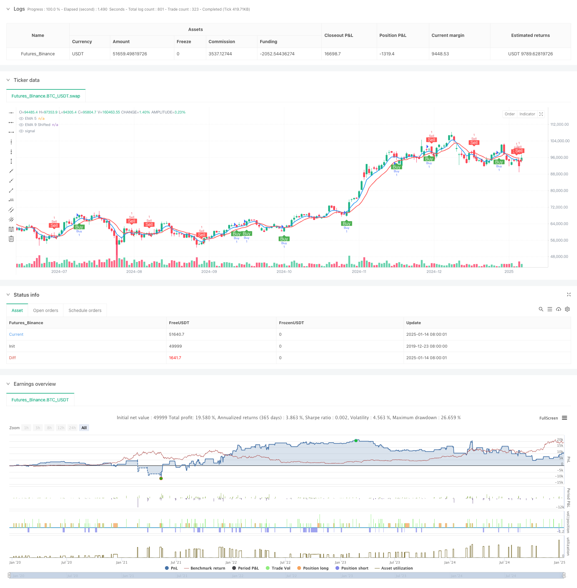

> Name

Dual-Trend-Confirmation-Trading-Strategy-Based-on-Moving-Averages-and-Outside-Bar-Pattern
> Author

ChaoZhang

> Strategy Description



[trans]
#### Overview
This strategy is a trend following system that combines moving averages and Outside Bar patterns. It uses the 5- and 9-period exponential moving averages (EMA) as the main trend indicators, combined with the Outside Bar pattern as signal confirmation. The strategy also includes dynamic stop-loss and take-profit settings based on the height of the Outside Bar, as well as a position reversal mechanism after the stop-loss is triggered.
#### Strategy Principle
The core logic of the strategy is based on the following key elements:
1. Use the crossover of the 5-period and 9-period EMA to determine the basic trend direction
2. Confirm market volatility through the Outside Bar pattern (the highest price of the current K line is higher than the highest price of the previous K line, and the lowest price is lower than the lowest price of the previous K line)
3. Enter the trade when the EMA cross signal and Outside Bar pattern appear at the same time
4. Use the height of the Outside Bar to dynamically set the stop loss and take profit levels. The take profit is set to 50% of the height of the Outside Bar and the stop loss is set to 100%.
5. Automatically execute reverse position establishment when stop loss is triggered to capture possible trend reversal
#### Strategic Advantages
1. The double confirmation mechanism improves the accuracy of transactions and avoids false signals that may be caused by a single indicator.
2. Dynamic stop-loss and take-profit settings better adapt to market volatility and maintain reasonable risk management in different market environments.
3. The position reversal mechanism can quickly adapt to changes in market trends and improve capital utilization efficiency.
4. The strategy has clear entry and exit rules and is easy to execute and backtest.
#### Strategy Risk
1. The Outside Bar pattern may appear less frequently in less volatile markets, affecting trading frequency.
2. In a rapidly volatile market, the stop loss position may be too wide, increasing the risk of a single transaction.
3. The position reversal mechanism may lead to continuous stop losses in volatile markets.
4. Fixed EMA parameters may perform inconsistently in different market environments.
#### Strategy optimization direction
1. The volatility indicator can be introduced to dynamically adjust the stop-loss and take-profit ratios to make risk management more flexible.
2. Consider adding a trend strength filter to avoid trading in weak trend environments
3. Optimize the triggering conditions for position reversal, which can be combined with market volatility indicators to decide whether to execute the reversal.
4. Study EMA parameter optimization schemes for different time periods to improve system adaptability
#### Summary
This is a strategy system that combines the classic theory of technical analysis with modern quantitative trading concepts. Through the combined use of moving averages and Outside Bar, it not only ensures the timeliness of trend tracking, but also improves the reliability of signals. The design of dynamic stop-loss, take-profit and position reversal mechanisms reflects the emphasis on risk management, making the strategy highly practical. Although there is still room for optimization, the overall framework already has the basic conditions for real-time operations. ||
#### Overview
This strategy is a trend following system that combines moving averages with Outside Bar pattern recognition. It utilizes 5-period and 9-period Exponential Moving Averages (EMA) as primary trend indicators, along with Outside Bar pattern for signal confirmation. The strategy includes dynamic stop-loss and take-profit settings based on Outside Bar height, as well as a position reversal mechanism triggered by stop-loss hits.

#### Strategy Principles
The core logic is based on the following key elements:
1. Using 5-period and 9-period EMA crossovers to determine basic trend direction
2. Confirming market volatility through Outside Bar pattern (current bar's high above previous bar's high and low below previous bar's low)
3. Entering trades when EMA crossover signals coincide with Outside Bar patterns
4. Using Outside Bar height to dynamically set stop-loss and take-profit levels, with take-profit at 50% and stop-loss at 100% of the bar height
5. Automatically executing reverse positions when stop-loss is triggered to capture potential trend reversals

#### Strategy Advantages
1. Dual confirmation mechanism improves trading accuracy by avoiding false signals from single indicators
2. Dynamic stop-loss and take-profit settings better adapt to market volatility, maintaining reasonable risk management across different market conditions
3. Position reversal mechanism quickly adapts to market trend changes, improving capital efficiency
4. Strategy has clear entry and exit rules, making it easy to implement and backtest

#### Strategy Risks
1. Outside Bar patterns may occur less frequently in low-volatility markets, affecting trading frequency
2. Stop-loss positions may be too wide in rapidly volatile markets, increasing per-trade risk
3. Position reversal mechanism may lead to consecutive losses in ranging markets
4. Fixed EMA parameters may perform inconsistently across different market conditions

#### Optimization Directions
1. Introduce volatility indicators to dynamically adjust stop-loss and take-profit ratios for more flexible risk management
2. Consider adding trend strength filters to avoid trading in weak trend environments
3. Optimize position reversal trigger conditions by incorporating market volatility indicators
4. Research EMA parameter optimization across different timeframes to improve system adaptability

#### Summary
This is a strategy system that combines classical technical analysis with modern quantitative trading concepts. The combination of moving averages and Outside Bar patterns ensures both timely trend following and reliable signal generation. The design of dynamic stop-loss/take-profit and position reversal mechanisms demonstrates a strong focus on risk management, making the strategy practically viable. While there is room for optimization, the overall framework already meets basic conditions for live trading.[/trans]


> Source (PineScript)

``` pinescript
/*backtest
start: 2019-12-23 08:00:00
end: 2025-01-15 08:00:00
period: 1d
basePeriod: 1d
exchanges: [{"eid":"Futures_Binance","currency":"BTC_USDT","balance":49999}]
*/

//@version=5
strategy(title="Outside Bar EMA Crossover Strategy with EMA Shift", shorttitle="Outside Bar EMA Cross", overlay=true)

// Input for EMA lengths
lenEMA1 = input.int(5, title="EMA 5 Length")
lenEMA2 = input.int(9, title="EMA 9 Length")

// Input for EMA 9 shift
emaShift = input.int(1, title="EMA 9 Shift", minval=0)

// Calculate EMAs
ema1 = ta.ema(close, lenEMA1)
ema2 = ta.ema(close, lenEMA2)

// Apply shift to EMA 9
ema2Shifted = na(ema2[emaShift]) ? na : ema2[emaShift]  // Dịch chuyển EMA 9 bằng cách sử dụng offset

// Plot EMAs
plot(ema1, title="EMA 5", color=color.blue, linewidth=2)
plot(ema2Shifted, title="EMA 9 Shifted", color=color.red, linewidth=2)

// Outside Bar condition
outsideBar() => high > high[1] and low < low[1]

// Cross above EMA 5 and EMA 9 (shifted)
crossAboveEMA = close > ema1 and close > ema2Shifted

// Cross below EMA 5 and EMA 9 (shifted)
crossBelowEMA = close < ema1 and close < ema2Shifted

// Outside Bar cross above EMA 5 and EMA 9 (shifted)
outsideBarCrossAbove = outsideBar() and crossAboveEMA

// Outside Bar cross below EMA 5 and EMA 9 (shifted)
outsideBarCrossBelow = outsideBar() and crossBelowEMA

// Plot shapes for visual signals
plotshape(series=outsideBarCrossAbove, title="Outside Bar Cross Above", location=location.belowbar, color=color.green, style=shape.labelup, text="Buy", textcolor=color.white)
plotshape(series=outsideBarCrossBelow, title="Outside Bar Cross Below", location=location.abovebar, color=color.red, style=shape.labeldown, text="Sell", textcolor=color.white)

// Calculate Outside Bar height
outsideBarHeight = high - low  // Chiều cao của nến Outside Bar

// Calculate TP and SL levels
tpRatio = 0.5  // TP = 50% chiều cao nến Outside Bar
slRatio = 1.0  // SL = 100% chiều cao nến Outside Bar

tpLevelLong = close + outsideBarHeight * tpRatio  // TP cho lệnh mua
slLevelLong = close - outsideBarHeight * slRatio  // SL cho lệnh mua

tpLevelShort = close - outsideBarHeight * tpRatio  // TP cho lệnh bán
slLevelShort = close + outsideBarHeight * slRatio  // SL cho lệnh bán

// Strategy logic
if (outsideBarCrossAbove)
    strategy.entry("Buy", strategy.long)
    strategy.exit("Take Profit/Stop Loss", "Buy", stop=slLevelLong, limit=tpLevelLong)  // Thêm TP và SL

if (outsideBarCrossBelow)
    strategy.entry("Sell", strategy.short)
    strategy.exit("Take Profit/Stop Loss", "Sell", stop=slLevelShort, limit=tpLevelShort)  // Thêm TP và SL

// Logic: Nếu lệnh Buy bị Stop Loss => Vào lệnh Sell
if (strategy.position_size > 0 and close <= slLevelLong)
    strategy.close("Buy")
    strategy.entry("Sell After Buy SL", strategy.short)

// Logic: Nếu lệnh Sell bị Stop Loss => Vào lệnh Buy
if (strategy.position_size < 0 and close >= slLevelShort)
    strategy.close("Sell")
    strategy.entry("Buy After Sell SL", strategy.long)

// Cảnh báo khi label Buy xuất hiện
alertcondition(condition=outsideBarCrossAbove, title="Label Buy Xuất Hiện", message="Label Buy xuất hiện tại giá: {{close}}")

// Cảnh báo khi label Sell xuất hiện
alertcondition(condition=outsideBarCrossBelow, title="Label Sell Xuất Hiện", message="Label Sell xuất hiện tại giá: {{close}}")
```

> Detail

https://www.fmz.com/strategy/478695

> Last Modified

2025-01-17 14:39:19
