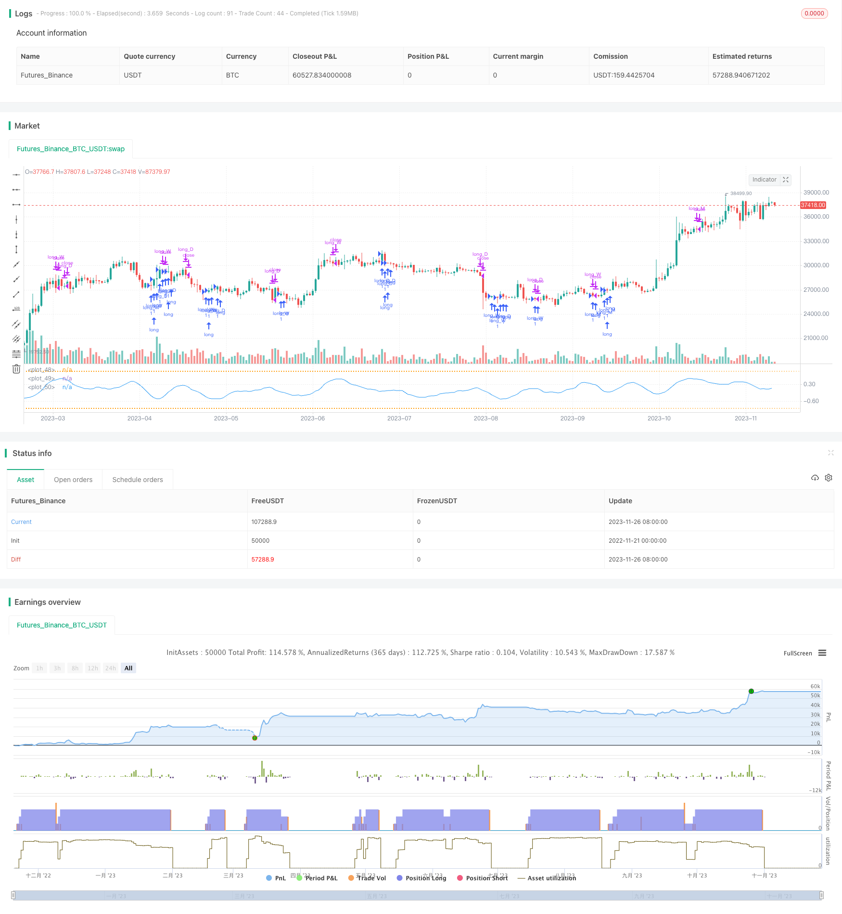

> Name

P-Signal Multi-Timeframe Trading StrategyP-Signal-Multi-Timeframe-Trading-Strategy
> Author

ChaoZhang

> Strategy Description



[trans]

### Overview
P-Signal multi-time frame trading strategy is a digital currency algorithmic trading strategy based on statistical principles and combined with multi-time frame analysis. This strategy uses the Gaussian error function and the P-Signal indicator to perform model fit on Bitcoin's daily, weekly and monthly lines, and implements volatility trading by doing long and dead crosses based on the indicators.
### Strategy Principles
The core indicator of the P-Signal strategy is P-Signal, which combines statistical standard deviation and simple moving average, and is mapped to the -1 to 1 interval through the Gaussian error function to detect whether the market conforms to the normal distribution. The specific calculation formula is as follows:
```
fErf(x) = 1.0 - 1.0/(1.0 + 0.5*abs(x)) * exp(-x*x - 1.26551223 + ...)  # 高斯误差函数

fPSignal(ser, n) = fErf((stdev(ser, n) > 0 ? sma(ser, n)/stdev(ser, n)/sqrt(2) : 1)) # P-Signal指标
```

This strategy calculates the P-Signal indicator in the daily, weekly and monthly time frames respectively. When the indicator crosses the 0 axis, go long, and when the indicator crosses the 0 axis, close the position. At the same time, set the indicator value valve to control repeated opening of positions.
### Advantage Analysis
The biggest advantage of the P-Signal strategy is the use of multiple time frames to improve the stability of the strategy. The daily line captures short-term market fluctuations, and the weekly and monthly lines filter out false breakthroughs. At the same time, the P-Signal indicator itself also has certain predictive capabilities and can amplify the fluctuations of trend market conditions.
Compared with a single time frame, multiple time frames can use daily stop loss during retracements, and use advanced time frames to reduce trading frequency in volatile markets. Overall, this combination can minimize absolute and relative drawdowns while ensuring profitability.
### Risk Analysis
The biggest risk of the P-Signal strategy is that the indicator itself is a black box for quantitative traders. It is difficult for us to determine the suitability of this indicator for a specific market, nor to determine the optimal range of its parameters. This can lead to poor performance of the strategy in real trading.
In addition, the strategy itself also has certain limitations. For example, it cannot handle violent market conditions, and the indicator difference may lag behind as a trading signal. These problems may become hidden dangers during the real offer.
To solve these problems, we can adjust indicator parameters, optimize stop loss methods, introduce more auxiliary indicators, etc. But the premise is that the stability of the strategy must be verified in a sufficiently large backtest interval.
### Optimization direction
The P-Signal strategy has several directions that can be optimized:
1. Replace the parameters of the P-Signal indicator: nIntr_D, nIntr_W and nIntr_M, and find the optimal parameter combination
2. Add stop loss methods: trailing stop loss, time stop loss, ATR stop loss, etc. to find the optimal stop loss method
3. Introduce auxiliary indicators: enhance the strategy’s ability to judge specific market conditions, such as introducing MACD to judge trends.
4. Optimize position management: set up dynamic positions and optimize capital usage efficiency
5. Machine learning optimization parameters: Use neural networks, genetic algorithms, etc. to find global optimal parameters
### Summarize
The P-Signal multi-time frame trading strategy is overall a very promising strategy idea. It combines statistical principles with technical indicators and uses multi-time frame analysis to improve stability. If we can solve some of the limitations through a lot of backtesting and optimization, it is entirely possible to turn it into a real and usable digital currency algorithmic trading strategy.
||
### Overview

The P-Signal multi timeframe trading strategy is a cryptocurrency algorithmic trading strategy based on statistical principles and multi timeframe analysis. The strategy uses the Gaussian error function and P-Signal indicator to model fit Bitcoin's daily, weekly and monthly charts, and goes long on indicator crosses above 0 and exits on crosses below 0, in order to trade volatility.

### Strategy Logic

The core indicator of the P-Signal strategy is the P-Signal itself, which combines statistical standard deviation and simple moving average, and maps it to the -1 to 1 range using the Gaussian error function, to detect whether the market conforms to the normal distribution. The specific calculation formula is as follows:

```
fErf(x) = 1.0 - 1.0/(1.0 + 0.5*abs(x)) * exp(-x*x - 1.26551223 + ...) # Gaussian error function 

fPSignal(ser, n) = fErf((stdev(ser, n) > 0 ? sma(ser, n)/stdev(ser, n)/sqrt(2) : 1)) # P-Signal indicator
```

The strategy calculates the P-Signal indicator on the daily, weekly and monthly timeframes for Bitcoin, goes long when the indicator crosses above 0, and exits when it crosses back below 0. Indicator value valves are also set to control repeated entries.


### Advantage Analysis

The biggest advantage of the P-Signal strategy is the use of multiple timeframes to improve strategy stability. The daily chart captures short-term market fluctuations, while the weekly and monthly charts filter false breakouts. At the same time, the P-Signal indicator itself also has some predictive capability to amplify the fluctuations of trending moves.

Compared to a single timeframe, multiple timeframes allow the use of daily stops to control drawdown during volatile times, while reducing transaction frequency using the higher timeframes during ranging markets. Overall, this combination allows maximizing profits while minimizing both absolute and relative drawdowns.


### Risk Analysis

The biggest risk of the P-Signal strategy is that the indicator itself is a black box to quant traders. We have no way of determining the adaptability of this indicator to specific markets, nor can we determine the optimal range of its parameters. This may lead to poor performance of the strategy in live trading.

In addition, the strategy itself has some limitations. For example, inability to handle violent moves, lagging signal from indicator crossover etc. All these can become hidden troubles during live trading.

To solve these issues, we can adjust indicator parameters, optimize stop loss, introduce more auxiliary indicators etc. But the premise is to test stability across large enough backtesting periods.


### Optimization Directions

There are several directions to optimize the P-Signal strategy:

1. Change P-Signal indicator parameters: nIntr_D, nIntr_W and nIntr_M, find optimal parameter combinations

2. Add stop loss methods: trailing stop loss, time stop loss, ATR stop loss etc, find optimal stop loss  

3. Introduce auxiliary indicators: improve judgment of specific market conditions, e.g. use MACD to determine trends

4. Optimize position sizing: set dynamic position sizing based on account usage efficiency

5. Machine learning optimization: use neural networks, genetic algorithms to find globally optimal parameters

### Conclusion

The P-Signal multi timeframe trading strategy is overall a very promising strategy idea. It combines statistical principles and technical indicators, and uses multi timeframe analysis to improve stability. If we can solve some limitations through extensive backtesting and optimization, it is entirely possible to transform it into a real, usable cryptocurrency algorithmic trading strategy.

[/trans]

> Strategy Arguments


|Argument|Default|Description|
|----|----|----|
|v_input_1|9|(?Parameters of observation.)Number of D Bars|
|v_input_2|4|Number of W Bars|
|v_input_3|6|Number of M Bars|


> Source (PineScript)

``` pinescript
/*backtest
start: 2022-11-21 00:00:00
end: 2023-11-27 00:00:00
period: 1d
basePeriod: 1h
exchanges: [{"eid":"Futures_Binance","currency":"BTC_USDT"}]
*/

// **********************************************************************************************************
// This source code is subject to the terms of the Mozilla Public License 2.0 at https://mozilla.org/MPL/2.0/
// P-Signal Strategy © Kharevsky
// A good strategy should be able to handle backtesting.
// @version=4
// **********************************************************************************************************
strategy("P-Signal Strategy:", precision = 3, pyramiding = 3)
//
// Parameters and const of P-Signal.
//
nPoints_D = input(title = "Number of D Bars", type = input.integer, defval = 9, minval = 4, maxval = 100, group = "Parameters of observation.")
nPoints_W = input(title = "Number of W Bars", type = input.integer, defval = 4, minval = 4, maxval = 100, group = "Parameters of observation.")
nPoints_M = input(title = "Number of M Bars", type = input.integer, defval = 6, minval = 4, maxval = 100, group = "Parameters of observation.")
int nIntr_D = nPoints_D - 1
int nIntr_W = nPoints_W - 1
int nIntr_M = nPoints_M - 1
bool bDValveOpen = true
bool bWValveOpen = true
bool bMValveOpen = true
// 
// Horner's method for the error (Gauss) & P-Signal functions.
//
fErf(x) =>
    nT = 1.0/(1.0 + 0.5*abs(x))
    nAns = 1.0 - nT*exp(-x*x - 1.26551223 + 
     nT*( 1.00002368 + nT*( 0.37409196 + nT*( 0.09678418 + 
     nT*(-0.18628806 + nT*( 0.27886807 + nT*(-1.13520398 + 
     nT*( 1.48851587 + nT*(-0.82215223 + nT*( 0.17087277 ))))))))))
    x >= 0 ? nAns : -nAns
fPSignal(ser, int) => 
    nStDev = stdev(ser, int)
    nSma = sma(ser, int)
    fErf(nStDev > 0 ? nSma/nStDev/sqrt(2) : 1.0)
//
// Signals for the strategy.
//
float nPSignal_D = sma(fPSignal(change(ohlc4), nIntr_D), nIntr_D)
float ndPSignal_D = sign(nPSignal_D[0] - nPSignal_D[1])
//
float nPSignal_W = sma(security(syminfo.tickerid, "W",fPSignal(change(ohlc4), nIntr_W)), nIntr_W)
float ndPSignal_W = sign(nPSignal_W[0] - nPSignal_W[1])
//
float nPSignal_M = sma(security(syminfo.tickerid, "M",fPSignal(change(ohlc4), nIntr_M)), nIntr_M)
float ndPSignal_M = sign(nPSignal_M[0] - nPSignal_M[1])
//
// P-Signal plotting. 
//
hline(+1.0, color = color.new(color.orange,70), linestyle = hline.style_dotted)
hline(-1.0, color = color.new(color.orange,70), linestyle = hline.style_dotted)
plot(nPSignal_D, color = color.blue, style = plot.style_line)
//
// Multi Frame Strategy 
// ... Day
if(nPSignal_D < 0 and ndPSignal_D > 0 and bDValveOpen)
    strategy.entry("long_D", strategy.long, 1) 
    bDValveOpen := false
if(nPSignal_D > 0 and ndPSignal_D < 0)
    strategy.close("long_D")
    bDValveOpen := true
// ... Week
if(nPSignal_W < 0 and ndPSignal_W > 0 and bWValveOpen)
    strategy.entry("long_W", strategy.long, 1) 
    bWValveOpen := false
if(nPSignal_W > 0 and ndPSignal_W < 0)
    strategy.close("long_W")
    bWValveOpen := true
// ... Month
if(nPSignal_M < 0 and ndPSignal_M > 0 and bMValveOpen)
    strategy.entry("long_M", strategy.long, 1) 
    bMValveOpen := false
if(nPSignal_M > 0 and ndPSignal_M < 0)
    strategy.close("long_M")
    bMValveOpen := true
// The end.
```

> Detail

https://www.fmz.com/strategy/433581

> Last Modified

2023-11-28 16:32:36
