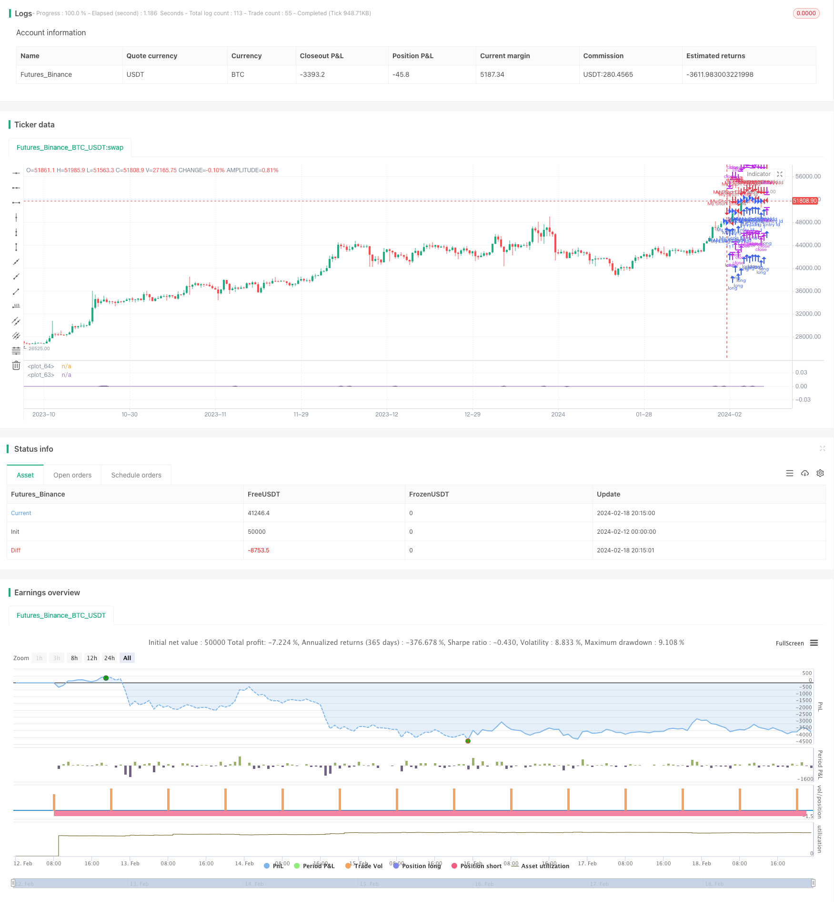

> Name

Parabola-Oscillator-Seeking-Highs-and-Lows-Strategy
> Author

ChaoZhang

> Strategy Description


[trans]

### Overview
This strategy determines the trend and volatility of prices by calculating the moving average and variance of different periods, and enables the identification of high points and low points.
### Strategy Principles
The core logic of this strategy is to calculate the moving average and variance of different periods in the near future. Specifically, calculate the moving average (ma, mb, mc) and variance (da, db, dc) of the last 5 days, 4 days and 3 days respectively. Then compare the sizes and select the period with the largest variance to represent the current trend. Finally, the moving average representing the trend period is multiplied by the square of its variance to form the final output curve wg.
In this way, when the price breaks upward or downward, the period and variance representing the trend will change greatly. As a result, the final output wg also changes greatly, enabling the identification of high points and low points.
### Advantage Analysis
This idea of ​​judging trend changes based on different cycles is effective and can clearly identify the turning point of price. Compared with single-cycle judgment, this method of combining multiple cycles can improve the accuracy and timeliness of judgment.
Calculating the moving average and variance is also very simple and effective, with a small amount of code, and is very sensitive to sudden price changes, so breakthroughs can be quickly discovered.
### Risk Analysis
The period used in this strategy is short, and the judgment may not be accurate and comprehensive enough for the medium and long term. Short-term price shocks may lead to misjudgments.
In addition, the weight setting of the moving average and variance will also affect the judgment effect. If the weight setting is improper, the signal may be biased.
### Optimization direction
You can try to add more calculations of different periods to form a period combination to make the judgment more comprehensive. For example, adding mid- to long-term cycle judgments such as the 10th and 20th.
You can also experiment with different weight setting schemes to improve the flexibility of weight setting. Parameter optimization is added so that the weights can be automatically adjusted according to the market environment and reduce the probability of misjudgment.
In addition, other indicators can also be combined, such as abnormal trading volume, etc., to avoid being misled by arbitrage trading.
### Summarize
The overall idea of ​​this strategy is clear and easy to understand. It uses moving averages and variances to determine price trends and volatility, and then combines them to output a curve that can clearly identify high points and low points. This method based on multi-period combination judgment can effectively obtain the long-term and short-term characteristics of the market and improve the accuracy of judgment on turning points. There is also a lot of room for optimization, and adjustments can be made from multiple aspects such as cycles, weights, indicators, etc. to make the strategy more stable and comprehensive.
||

### Overview  

This strategy identifies price highs and lows by calculating moving averages and variances over different time periods to determine trend and volatility.  

### Strategy Logic

The core logic of this strategy is to compute moving averages and variances over recent different time periods. Specifically, it calculates 5-day, 4-day and 3-day moving averages (ma, mb, mc) and variances (da, db, dc). It then compares the sizes and selects the period with the highest variance to represent the current trend. Finally, it multiplies the squared variance of the representative period by its moving average to output the final curve wg.  

Thus, when price breaks out upward or downward, the representative period and its variance will change significantly, causing wg to change markedly as well, achieving identification of highs and lows.  

### Advantage Analysis

This idea of judging trend changes based on different periods is effective and can clearly identify price inflection points. Compared to single period judgment, combining multiple periods can improve accuracy and timeliness.

Calculating moving average and variance is also simple and efficient. With small code size, it is highly sensitive to sudden price changes and can detect breakouts quickly.

### Risk Analysis  

The periods used in this strategy are short. For mid- to long-term purposes, the judgment may not be accurate and comprehensive enough. Short-term price fluctuations may cause misjudgments.   

Also, the weighting of moving averages and variances affects the judgment results. If set improperly, the signals could be biased.

### Optimization Directions 

More time periods of different lengths could be added to form a combination to make the judgment more comprehensive, e.g. 10-day, 20-day for mid- to long-term purposes.

Different schemes of weights could also be tested to make the weighting setting more flexible. Parameter optimization could be introduced to auto-adjust the weights based on market conditions to reduce misjudgment probability.

In addition, other indicators could be incorporated, like abnormal trading volume, to avoid being misled by arbitrage trading.   

### Conclusion

The overall logic of this strategy is clear and easy to understand, using moving averages and variances to judge price trend and volatility, and then combining them to output a curve that can clearly identify highs and lows. Such multi-period combined judgment can effectively capture both short- and long-term market characteristics, improving the accuracy of inflection point detection. There is also large room for optimization, from aspects like periods, weights and indicators etc, to make the strategy more robust and comprehensive.

[/trans]


> Source (PineScript)

``` pinescript
/*backtest
start: 2024-02-12 00:00:00
end: 2024-02-19 00:00:00
period: 12h
basePeriod: 15m
exchanges: [{"eid":"Futures_Binance","currency":"BTC_USDT"}]
*/

//@version=3
strategy("x²", overlay=false)


a1=(close[2]-close[3])/1
a2=(close[1]-close[3])/4
a3=(close[0]-close[3])/9

b1=(close[3]-close[4])/1
b2=(close[2]-close[4])/4
b3=(close[1]-close[4])/9
b4=(close[0]-close[4])/16

c1=(close[4]-close[5])/1
c2=(close[3]-close[5])/4
c3=(close[2]-close[5])/9
c4=(close[1]-close[5])/16
c5=(close[0]-close[5])/25

ma=(a1+a2+a3)/3
da=(a1-ma)*(a1-ma)
da:=da+(a2-ma)*(a2-ma)
da:=da+(a3-ma)*(a3-ma)
da:=sqrt(da)
da:=min(2, da)
da:=1-da/2
da:=max(0.001, da)


mb=(b1+b2+b3+b4)/4
db=(b1-mb)*(b1-mb)
db:=db+(b2-mb)*(b2-mb)
db:=db+(b3-mb)*(b3-mb)
db:=db+(b4-mb)*(b4-mb)
db:=sqrt(db)
db:=min(2, db)
db:=1-db/2
db:=max(0.001, db)

mc=(c1+c2+c3+c4+c5)/5
dc=(c1-mc)*(c1-mc)
dc:=dc+(c2-mc)*(c2-mc)
dc:=dc+(c3-mc)*(c3-mc)
dc:=dc+(c4-mc)*(c4-mc)
dc:=dc+(c5-mc)*(c5-mc)
dc:=sqrt(dc)
dc:=min(2, dc)
dc:=1-dc/2
dc:=max(0.001, dc)


g=close
if(da>db and da>dc)
    g:=da*da*ma
else
    if(db > da and db > dc)
        g:=db*db*mb
    else
        g:=dc*dc*mc

wg=wma(g, 2)
plot(wg)
plot(0, color=black)


longCondition = true //crossover(sma(close, 14), sma(close, 28))
if (longCondition)
    strategy.entry("My Long Entry Id", strategy.long)

shortCondition = true //crossunder(sma(close, 14), sma(close, 28))
if (shortCondition)
    strategy.entry("My Short Entry Id", strategy.short)
```

> Detail

https://www.fmz.com/strategy/442261

> Last Modified

2024-02-20 16:01:12
