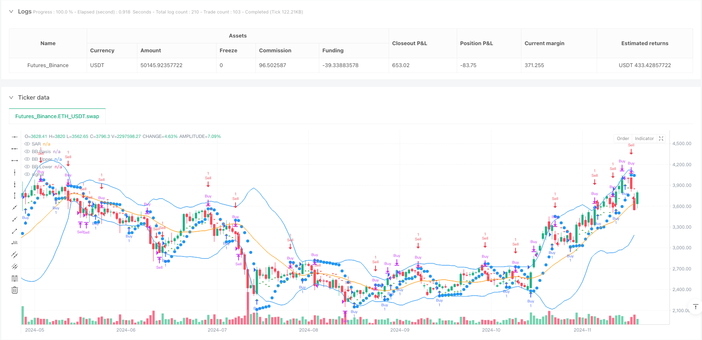
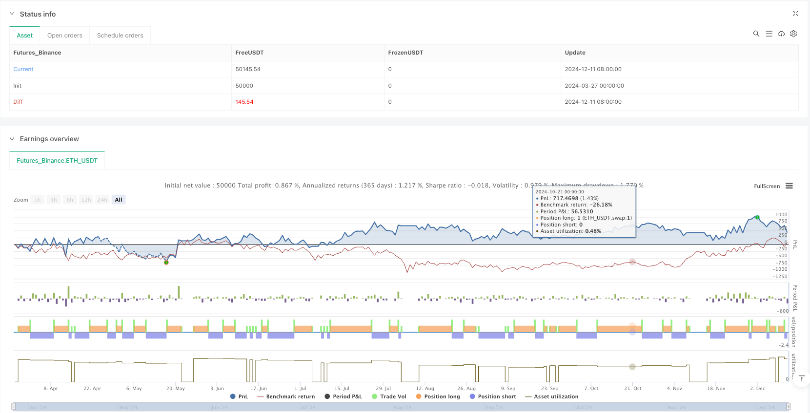

> Name

Parabolic Stop Loss Reversal and Bollinger Bands Trend Identification Quantitative Trading Strategy-Parabolic-SAR-and-Bollinger-Bands-Trend-Identification-Quantitative-Trading-Strategy
> Author

ianzeng123

> Strategy Description





[trans]

## Overview
The Parabolic Stop Loss Reversal and Bollinger Band Trend Identification Quantitative Trading Strategy is a quantitative trading strategy that combines the Parabolic SAR indicator and the Bollinger Band indicator. This strategy identifies the market trend direction through parabolic SAR, uses Bollinger Bands to determine the price fluctuation range, and performs buying or selling operations when the price meets specific conditions. The core idea of ​​the strategy is to avoid entering the market at extreme price positions when the trend is confirmed, thereby reducing risks and improving the success rate of transactions.
## Strategy Principle
The strategy is based on the synergy of two core technical indicators:
1. **Parabolic SAR (Stop and Reversal)**: This is a trend following indicator that appears as points on a price chart and is often used to identify potential price reversal points and place stop losses. When the price is above the SAR point, it indicates that the market is in an uptrend; when the price is below the SAR point, it indicates that the market is in a downtrend.
2. **Bollinger Bands**: This is a measure of price volatility, consisting of three lines: the middle track (usually a 20-period moving average), the upper track (the middle track plus two standard deviations), and the lower track (the middle track minus two standard deviations). Bollinger Bands help identify whether the price is in overbought or oversold territory.
The trading logic of the strategy is as follows:
- **Buy Conditions**: The system generates a buy signal when the closing price is above the SAR point (indicating an uptrend) and below the upper Bollinger Band (avoid buying in the overbought area).
- **Sell Condition**: The system generates a sell signal when the closing price is below the SAR point (indicating a downtrend) and above the lower Bollinger Band (to avoid selling in the oversold area).
- **Closing Conditions**:
  - Long position closing: when the closing price is below the SAR point (trend reversal) or when the closing price is above or equal to the upper Bollinger Band (reaching the overbought zone).
  - Short position closing: when the closing price is above the SAR point (trend reversal) or when the closing price is below or equal to the lower Bollinger Band (reaching the oversold zone).
This combination takes advantage of the dual advantages of trend confirmation and fluctuation range judgment, effectively avoiding false signals that a single indicator may bring.
## Strategic Advantages
1. **Trend confirmation combined with volatility protection**: Use Parabolic SAR to confirm the trend direction, while using Bollinger Bands to avoid entering the market at extreme price positions. This double filtering mechanism can effectively reduce false signals and improve transaction quality.
2. **Strong adaptability**: The step size and maximum value parameters of the Parabolic SAR indicator can be adjusted, allowing the strategy to adapt to different market environments; the period and multiple of the Bollinger Bands can also be customized according to market fluctuation characteristics.
3. **Visual clarity**: The strategy provides clear visual signals. By drawing indicator lines and trading signal graphics on the chart, traders can intuitively understand the trading logic and entry points.
4. **Built-in risk management**: The strategy's closing rules have a built-in risk management mechanism, which automatically closes positions when the trend reverses or the price reaches an extreme position, which helps control the loss range of a single transaction.
5. **Applicable to a variety of time periods and markets**: The design principle of this strategy allows it to be applied to different time periods and market types, and is especially suitable for markets with obvious trend characteristics.
## Strategy Risk
1. **Poor performance in volatile markets**: In a market environment where prices fluctuate sideways and there is no obvious trend, this strategy may produce frequent and wrong signals, resulting in multiple small losses. The solution is to add a trend strength filter, such as the ADX indicator, and only activate the strategy when the trend strength is sufficient.
2. **Parameter sensitivity**: Strategy performance is highly sensitive to parameters such as SAR step size, SAR maximum value, Bollinger Band period and multiple. Improper parameter settings may result in early entry or late exit. It is recommended to find the optimal parameter combination for a specific market through historical backtesting.
3. **Lagging problem**: Since SAR and Bollinger Bands are indicators calculated based on historical data, they may show a certain lag in a rapidly changing market, missing the best entry point or delaying exit. You can consider reducing the indicator period to reduce lag, but this may also increase false signals.
4. **Lack of trading volume confirmation**: Existing strategies do not consider trading volume factors, and trading volume is often an important indicator for confirming the reliability of price trends. It is recommended to add trading volume filter conditions, such as requiring an increase in trading volume when the trend changes.
5. **Insufficient stop loss setting**: Although the strategy has built-in closing conditions, it does not set a fixed stop loss position, which may lead to larger losses under extreme market conditions. It is recommended to add a hard stop loss setting based on percentage or ATR.
## Strategy optimization direction
1. **Add Trend Filter**: Introduce ADX (Average Directional Index) or similar indicators and only execute trades when ADX is above a certain threshold (such as 25) to avoid false signals in trendless markets. Such optimization can significantly reduce losing trades in volatile markets.
2. **Optimize entry timing**: Consider adding auxiliary confirmations such as RSI or stochastic indicators based on the current entry conditions. For example, only buy when RSI rebounds from the oversold area in an upward trend to obtain a better entry price.
3. **Add trading volume confirmation**: If the entry signal is required to be accompanied by an increase in trading volume, you can use the volume weighted moving average (VWMA) instead of the simple moving average (SMA) to calculate the Bollinger Bands, or separately check whether the trading volume is higher than its moving average.
4. **Dynamic Stop Loss Strategy**: Implement the trailing stop loss function, such as gradually moving the stop loss point to the SAR point position in profitable transactions to protect the earned profits while allowing the trend to continue to develop.
5. **Consider time filtering**: Some markets have better volatility and liquidity during specific time periods. Strategies can add time filters to only execute trading signals during the most favorable trading periods.
6. **Increase position management**: Dynamically adjust position size based on market volatility (such as ATR) or account risk percentage, increasing positions during low volatility periods and reducing positions during high volatility periods to achieve a more balanced risk-return ratio.
7. **Add multi-period confirmation**: Using multi-time period analysis requires the signals of larger time periods and smaller time periods to be in the same direction, which can reduce false breakthrough signals.
## Summarize
The parabolic stop-loss reversal and Bollinger Bands trend identification quantitative trading strategy cleverly combines the two trading concepts of trend tracking and fluctuation range judgment. It identifies the market trend direction through parabolic SAR and Bollinger Bands control the entry area, effectively avoiding the risk of entering the market in the opposite direction of the trend or at extreme price positions. This strategy has the advantages of visual intuition, adjustable parameters, and built-in risk management, but it may perform poorly in volatile markets and is more sensitive to parameter settings.
By introducing optimization measures such as trend strength filtering, trading volume confirmation, dynamic stop loss and multi-period analysis, the stability and profitability of the strategy are expected to be further improved. In particular, adding trend strength indicators such as ADX and optimizing position management may significantly improve strategy performance.
This strategy is suitable for quantitative traders with certain trading experience. They can adjust parameters and add personalized optimization measures according to the specific market characteristics of their transactions, thereby building a more robust trading system. Ultimately, as with all trading strategies, strict money management and emotional control are key factors in successfully applying this strategy. ||
## Overview

The Parabolic SAR and Bollinger Bands Trend Identification Quantitative Trading Strategy is a quantitative trading approach that combines the Parabolic SAR indicator with Bollinger Bands. This strategy identifies market trend direction using Parabolic SAR while utilizing Bollinger Bands to determine price volatility ranges. When prices meet specific conditions, buy or sell signals are generated. The core concept is to confirm trends before entering positions while avoiding extreme price levels, thereby reducing risk and improving trade success rates.

## Strategy Principles

This strategy is based on the synergistic effect of two core technical indicators:

1. **Parabolic SAR (Stop and Reverse)**: This trend-following indicator appears as dots on a price chart, typically used to identify potential price reversal points and set stop-loss positions. When the price is above the SAR dots, it indicates an uptrend; when price is below the SAR dots, it indicates a downtrend.

2. **Bollinger Bands**: This volatility indicator consists of three lines: the middle band (typically a 20-period moving average), the upper band (middle band plus two standard deviations), and the lower band (middle band minus two standard deviations). Bollinger Bands help identify whether prices are in overbought or oversold territories.

The trading logic works as follows:

- **Buy Condition**: When the closing price is above the SAR point (indicating an uptrend) AND below the upper Bollinger Band (avoiding buying in overbought areas), the system generates a buy signal.
- **Sell Condition**: When the closing price is below the SAR point (indicating a downtrend) AND above the lower Bollinger Band (avoiding selling in oversold areas), the system generates a sell signal.
- **Exit Conditions**: 
  - Long exit: When the closing price falls below the SAR point (trend reversal) or reaches/exceeds the upper Bollinger Band (reaching overbought territory).
  - Short exit: When the closing price rises above the SAR point (trend reversal) or reaches/falls below the lower Bollinger Band (reaching oversold territory).

This combination leverages the dual advantages of trend confirmation and volatility range assessment, effectively avoiding false signals that might arise from using a single indicator.

## Strategy Advantages

1. **Combination of Trend Confirmation and Volatility Protection**: By confirming trends with Parabolic SAR while using Bollinger Bands to avoid entering at extreme price levels, this dual-filtering mechanism effectively reduces false signals and improves trade quality.

2. **Strong Adaptability**: The Parabolic SAR's step and maximum parameters can be adjusted to adapt to different market environments; similarly, the Bollinger Bands' period and multiplier can be customized based on market volatility characteristics.

3. **Visual Clarity**: The strategy provides clear visual signals by plotting indicator lines and trade signal shapes on the chart, allowing traders to intuitively understand trading logic and entry points.

4. **Built-in Risk Management**: The strategy's exit rules incorporate risk management mechanisms, automatically closing positions when trends reverse or prices reach extreme levels, helping to control the range of losses in individual trades.

5. **Applicable to Multiple Timeframes and Markets**: The design principles of this strategy make it applicable to different timeframes and market types, particularly suitable for markets with distinct trend characteristics.

## Strategy Risks

1. **Poor Performance in Ranging Markets**: In sideways or choppy markets with no clear trends, this strategy may generate frequent and incorrect signals, resulting in multiple small losses. A solution is to add a trend strength filter, such as the ADX indicator, activating the strategy only when trend strength is sufficient.

2. **Parameter Sensitivity**: Strategy performance is highly sensitive to parameters such as SAR step, SAR maximum, Bollinger Band period, and multiplier. Improper parameter settings may lead to premature entries or delayed exits. It is recommended to find optimal parameter combinations for specific markets through historical backtesting.

3. **Lag Issues**: Since both SAR and Bollinger Bands are indicators calculated based on historical data, they may exhibit certain lag in rapidly changing markets, missing optimal entry points or delaying exits. Consider reducing indicator periods to decrease lag, though this may increase false signals.

4. **Lack of Volume Confirmation**: The current strategy does not consider volume factors, which are often important indicators for confirming price trend reliability. Adding volume filter conditions is recommended, such as requiring increased volume when trends change.

5. **Insufficient Stop Loss Settings**: Although the strategy has built-in exit conditions, it lacks fixed stop-loss positions, which may lead to significant losses under extreme market conditions. Consider adding hard stop-loss settings based on percentages or ATR.

## Strategy Optimization Directions

1. **Add Trend Filters**: Introduce ADX (Average Directional Index) or similar indicators, executing trades only when ADX is above a specific threshold (e.g., 25) to avoid false signals in trendless markets. This optimization can significantly reduce losing trades in ranging markets.

2. **Optimize Entry Timing**: Consider adding RSI or stochastic indicators as auxiliary confirmation on top of current entry conditions, for example, buying only when RSI rebounds from oversold territory in uptrends, to get better entry prices.

3. **Add Volume Confirmation**: Require entry signals to be accompanied by increased volume; consider using Volume Weighted Moving Average (VWMA) instead of Simple Moving Average (SMA) to calculate Bollinger Bands, or separately check if volume is above its moving average.

4. **Dynamic Stop Loss Strategy**: Implement trailing stop functionality, for example, gradually moving stop loss points to SAR positions in profitable trades to protect profits while allowing trends to continue developing.

5. **Consider Time Filters**: Some markets have better volatility and liquidity during specific time periods; the strategy could add time filters to execute trading signals only during the most favorable trading sessions.

6. **Enhance Position Sizing**: Dynamically adjust position sizes based on market volatility (such as ATR) or account risk percentage, increasing positions during low volatility periods and reducing them during high volatility periods to achieve a more balanced risk-reward ratio.

7. **Add Multi-Timeframe Confirmation**: Use multi-timeframe analysis, requiring signal directions to be consistent across larger and smaller timeframes, which can reduce false breakout signals.

## Summary

The Parabolic SAR and Bollinger Bands Trend Identification Quantitative Trading Strategy cleverly combines trend following and volatility range assessment trading concepts. It identifies market trend direction through Parabolic SAR and controls entry zones with Bollinger Bands, effectively avoiding the risks of entering against trends or at extreme price levels. This strategy has advantages including visual intuitiveness, adjustable parameters, and built-in risk management, but it may not perform well in ranging markets and is sensitive to parameter settings.

By introducing trend strength filtering, volume confirmation, dynamic stop losses, and multi-timeframe analysis, the strategy's stability and profitability can be further enhanced. In particular, adding trend strength indicators like ADX and optimizing position management may significantly improve strategy performance.

This strategy is suitable for quantitative traders with some trading experience who can adjust parameters and add personalized optimization measures based on the specific characteristics of the markets they trade, thereby building a more robust trading system. Ultimately, as with all trading strategies, strict money management and emotional control are key factors in successfully applying this strategy.[/trans]


> Source (PineScript)

``` pinescript
/*backtest
start: 2024-03-27 00:00:00
end: 2024-12-12 00:00:00
period: 1d
basePeriod: 1d
exchanges: [{"eid":"Futures_Binance","currency":"ETH_USDT"}]
*/

//@version=5
strategy("Parabolic SAR + Bollinger Bands Strategy", overlay=true)

// ———— Inputs ———— //
// Parabolic SAR Inputs
sar_step = input.float(0.02, "SAR Step", minval=0.001, maxval=0.1)
sar_max = input.float(0.2, "SAR Max", minval=0.1, maxval=0.5)

// Bollinger Bands Inputs
bb_length = input.int(20, "BB Length")
bb_mult = input.float(2.0, "BB Multiplier")

// ———— Calculate Indicators ———— //
// Parabolic SAR
sar = ta.sar(sar_step, sar_max, sar_max)
plot(sar, "SAR", color=color.blue, style=plot.style_circles)

// Bollinger Bands
bb_basis = ta.sma(close, bb_length)
bb_dev = bb_mult * ta.stdev(close, bb_length)
bb_upper = bb_basis + bb_dev
bb_lower = bb_basis - bb_dev

// Plot Bollinger Bands
plot(bb_basis, "BB Basis", color=color.orange)
plot(bb_upper, "BB Upper", color=color.blue)
plot(bb_lower, "BB Lower", color=color.blue)

// ———— Strategy Logic ———— //
// Long Condition: Price closes above SAR (uptrend) AND below Upper BB
longCondition = close > sar and close < bb_upper

// Short Condition: Price closes below SAR (downtrend) AND above Lower BB
shortCondition = close < sar and close > bb_lower

// Exit Conditions
exitLong = close < sar or close >= bb_upper
exitShort = close > sar or close <= bb_lower

// ———— Execute Orders ———— //
if (longCondition)
    strategy.entry("Buy", strategy.long)
if (exitLong)
    strategy.close("Buy")

if (shortCondition)
    strategy.entry("Sell", strategy.short)
if (exitShort)
    strategy.close("Sell")

// ———— Visual Alerts ———— //
plotshape(longCondition, style=shape.triangleup, location=location.belowbar, color=color.green, size=size.small)
plotshape(shortCondition, style=shape.triangledown, location=location.abovebar, color=color.red, size=size.small)
```

> Detail

https://www.fmz.com/strategy/488417

> Last Modified

2025-03-27 14:20:59
